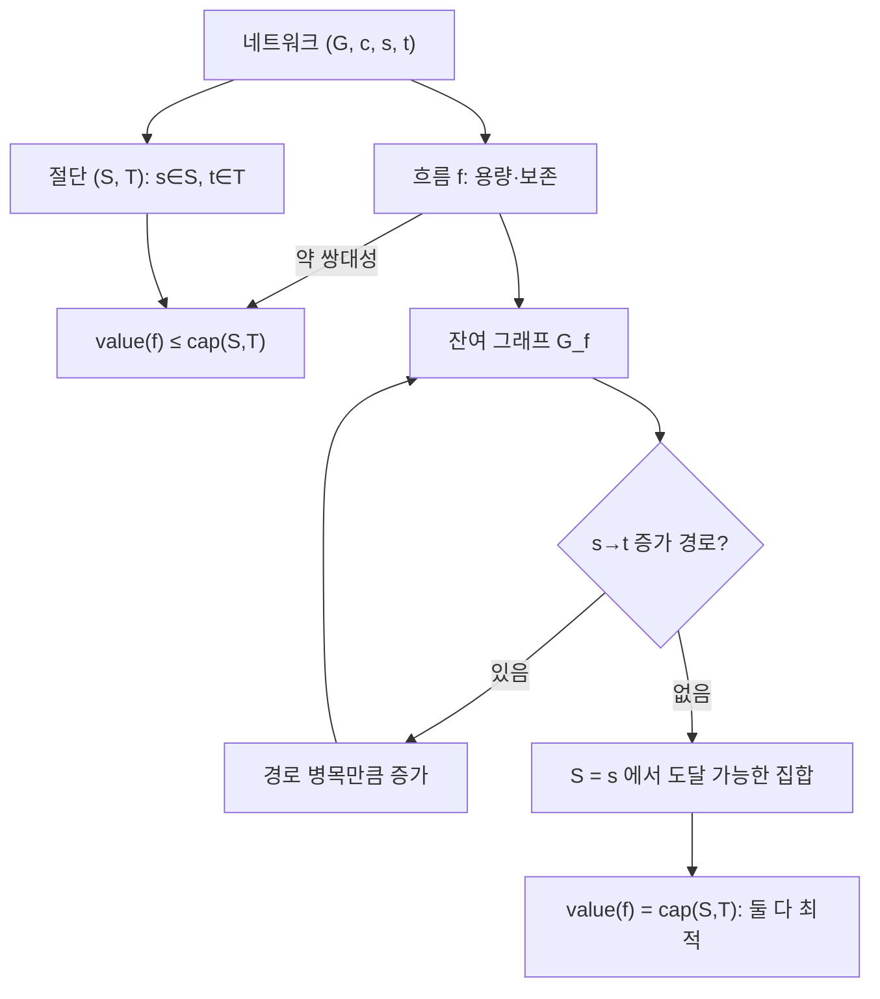

# 네트워크 흐름과 최대유량 최소절단 정리

# 개요

네트워크 흐름은 용량 제한이 있는 유향 [그래프](graphs.md)에서 출발점 $s$ 로부터 도착점 $t$ 로 최대한 많은 양을 흘려보내는 문제다. 파이프 망의 물, 통신망의 대역폭, 도로망의 차량이 원형이지만, 실제 위력은 겉보기에 흐름과 무관한 조합론 문제들이 이 틀로 환원된다는 데 있다.

핵심 결과는 **최대유량 최소절단 정리**다. 최대로 흘릴 수 있는 양은 $s$ 와 $t$ 를 갈라놓는 가장 싼 절단의 용량과 정확히 같다. 한쪽은 최대화 문제, 다른 쪽은 최소화 문제이고 두 최적값이 일치한다는 min-max 정리이며, [선형계획법](linear-programming.md) 쌍대성의 가장 깨끗한 조합론적 사례다.

이 문서는 흐름과 절단을 정의하고, 약 쌍대성에서 출발해 Ford–Fulkerson의 잔여 그래프 논증으로 정리를 증명한다. 이어 Edmonds–Karp의 복잡도, LP로서의 정식화, 그리고 이분 매칭과 Menger 정리로의 환원을 다룬다.

# 직관

흐름 문제를 처음 보면 "가장 굵은 경로를 찾아 그만큼 흘리고, 남은 용량으로 반복하면 되겠다"고 생각하게 된다. 이 탐욕은 틀린다. 앞서 잘못 흘린 양을 되돌릴 방법이 없기 때문이다.

Ford–Fulkerson의 아이디어는 "되돌리기를 그래프에 미리 넣어두는 것"이다. 간선 $u \to v$ 에 $f$ 만큼 흐르고 있으면, 잔여 그래프에 남은 용량 $c - f$ 짜리 전방 간선과 함께 $f$ 만큼의 **역방향** 간선 $v \to u$ 를 넣는다. 역방향 간선을 타는 것은 "이전 결정을 그만큼 취소한다"는 뜻이다. 이렇게 하면 탐욕이 저지른 실수를 나중에 정정할 수 있고, 더 이상 $s$ 에서 $t$ 로 가는 길이 없을 때가 진짜 끝이다.

그 순간이 왜 최적인가? $s$ 에서 잔여 그래프로 도달 가능한 정점 집합을 $S$ 라 하자. $S$ 에서 밖으로 나가는 원래 간선은 전부 포화(꽉 참)이고, 밖에서 $S$ 로 들어오는 간선은 전부 0이어야 한다(아니면 역방향으로 더 갈 수 있다). 그러므로 지금 흐르는 양이 곧 $S$ 를 가르는 절단의 용량이다. 모든 흐름은 모든 절단 이하이므로(약 쌍대성), 이 흐름은 최대이고 이 절단은 최소다.

이 논증의 구조 — 개선 방향이 없으면 최적성 증명서가 자동으로 나온다 — 는 [매칭과 Hall 정리](matchings.md)의 Berge 정리, [선형계획법](linear-programming.md)의 상보 여유 조건과 같은 모양이다.



# 정의

## 네트워크와 흐름

**네트워크**는 유향 그래프 $G = (V, E)$ 와 용량 함수 $c : E \to \mathbb{R}_{\ge 0}$ 과 서로 다른 두 정점 source $s$ 와 sink $t$ 의 조합이다.

**흐름**은 함수 $f : E \to \mathbb{R}$ 로서 다음 두 조건을 만족하는 것이다.

$$
0 \le f(e) \le c(e) \quad (\forall e \in E)
$$

$$
\sum_{e \in \delta^{-}(v)} f(e) \thickspace=\thickspace \sum_{e \in \delta^{+}(v)} f(e) \quad (\forall v \in V \setminus \lbrace s, t\rbrace)
$$

여기서 $\delta^-(v)$ 와 $\delta^+(v)$ 는 각각 $v$ 로 들어오는 간선 집합과 나가는 간선 집합이다. 첫 조건이 **용량 제약**, 둘째가 **흐름 보존**이다.

흐름의 **값**은

$$
|f| \thickspace=\thickspace \sum_{e \in \delta^{+}(s)} f(e) \thickspace-\thickspace \sum_{e \in \delta^{-}(s)} f(e)
$$

이다. 최대유량 문제는 $\lvert f \rvert$ 를 최대화하는 것이다.

## 절단

$s \in S$ 이고 $t \in T = V \setminus S$ 인 분할 $(S, T)$ 를 **$s\text{-}t$ 절단**이라 하고, 그 용량을

$$
\mathrm{cap}(S, T) \thickspace=\thickspace \sum_{\substack{e = (u,v) \in E \cr u \in S,\ v \in T}} c(e)
$$

로 정의한다. 역방향 간선은 세지 않는다는 점이 중요하다.

## 잔여 그래프

흐름 $f$ 에 대한 **잔여 용량**을 다음과 같이 정의한다. 간선 $e = (u, v) \in E$ 에 대해 전방 잔여 용량은 $c(e) - f(e)$ 이고, 역방향 $(v, u)$ 의 잔여 용량은 $f(e)$ 다. 잔여 용량이 양수인 간선만 모은 유향 그래프를 **잔여 그래프** $G_f$ 라 한다.

$G_f$ 에서 $s$ 로부터 $t$ 로 가는 경로를 **증가 경로**(augmenting path)라 하고, 그 경로의 최소 잔여 용량을 **병목**이라 한다.

# 성질

## 약 쌍대성

**보조정리.** 임의의 흐름 $f$ 와 임의의 $s\text{-}t$ 절단 $(S, T)$ 에 대해

$$
|f| \thickspace=\thickspace \sum_{\substack{(u,v) \in E \cr u \in S, v \in T}} f(u,v) \thickspace-\thickspace \sum_{\substack{(u,v) \in E \cr u \in T, v \in S}} f(u,v) \thickspace\le\thickspace \mathrm{cap}(S, T)
$$

**증명.** 흐름 보존식을 $S$ 의 모든 정점에 대해 더한다. $s$ 를 제외한 $S$ 의 정점에서는 좌우가 상쇄되어 0이고, $s$ 에서는 $\lvert f \rvert$ 가 남는다. $S$ 내부를 오가는 간선은 한 번은 유입, 한 번은 유출로 두 번 세어져 사라지므로, 결국 $S$ 에서 $T$ 로 나가는 흐름의 합에서 $T$ 에서 $S$ 로 들어오는 흐름의 합을 뺀 값이 $\lvert f \rvert$ 다. 앞항은 $\mathrm{cap}(S, T)$ 이하이고 뒷항은 0 이상이므로 부등식이 성립한다. ∎

따름정리로 $\max \lvert f \rvert \le \min \mathrm{cap}(S, T)$ 를 얻는다. 여기까지는 계산이지 정리가 아니다. 어떤 흐름과 어떤 절단에서 등호가 성립하면 둘 다 최적임이 즉시 따라오므로, 등호를 달성하는 쌍을 만드는 것이 문제다.

## Ford–Fulkerson과 최대유량 최소절단 정리

**알고리즘 (Ford–Fulkerson, 1956[^1]).** $f = 0$ 에서 시작한다. 잔여 그래프 $G_f$ 에서 $s \to t$ 경로를 하나 찾는다. 없으면 종료한다. 있으면 그 병목 $b$ 만큼 경로 위의 전방 간선에는 $f$ 를 더하고 역방향 간선에는 $f$ 를 빼서 흐름을 갱신한다. 반복한다.

갱신 후에도 용량 제약과 흐름 보존이 유지되고 값이 정확히 $b$ 만큼 증가함은 직접 확인된다.

**정리 (최대유량 최소절단).** 최대 흐름의 값과 최소 절단의 용량은 같다.

$$
\max_{f} |f| \thickspace=\thickspace \min_{(S,T)} \mathrm{cap}(S, T)
$$

**증명.** 다음 세 명제가 동치임을 보인다. (1) $f$ 는 최대 흐름이다. (2) $G_f$ 에 증가 경로가 없다. (3) 어떤 절단 $(S, T)$ 에 대해 $\lvert f \rvert = \mathrm{cap}(S, T)$ 가 성립한다.

(1) ⇒ (2): 증가 경로가 있으면 값을 늘릴 수 있으므로 최대가 아니다.

(2) ⇒ (3): $S$ 를 $G_f$ 에서 $s$ 로부터 도달 가능한 정점 집합으로, $T = V \setminus S$ 로 둔다. 가정에 의해 $t \notin S$ 이므로 이는 $s\text{-}t$ 절단이다. $u \in S$ 이고 $v \in T$ 이고 $(u,v) \in E$ 라면 잔여 용량이 0이어야 하므로 $f(u,v) = c(u,v)$ 다. $u \in T$ 이고 $v \in S$ 이고 $(u,v) \in E$ 라면 역방향 잔여 용량이 0이어야 하므로 $f(u,v) = 0$ 이다. 약 쌍대성 보조정리의 등식에 대입하면 $\lvert f \rvert = \mathrm{cap}(S, T)$ 를 얻는다.

(3) ⇒ (1): 약 쌍대성에 의해 모든 흐름이 $\mathrm{cap}(S, T)$ 이하인데 $f$ 가 그 값을 달성하므로 최대다. ∎

**정수성 따름정리.** 모든 용량이 정수면, 각 증가 단계가 값을 최소 1 늘리므로 알고리즘은 유한 번에 끝나고 정수 최대 흐름이 나온다. 무리수 용량에서는 수렴하지 않는 예가 존재하므로, 증가 경로 선택 규칙이 필요하다.

## Edmonds–Karp와 복잡도

**정리 (Edmonds–Karp, 1972[^2]).** 증가 경로로 항상 잔여 그래프에서의 **최단 경로**(간선 수 기준, 즉 BFS)를 고르면 증가 횟수는 $O(VE)$ 이하이고 전체 시간은 $O(VE^2)$ 다. 이 경계는 용량 값과 무관하다.

**증명 스케치.** $d_f(v)$ 를 $G_f$ 에서 $s$ 로부터 $v$ 까지의 최단 거리라 하자. 두 보조정리를 보인다. 첫째, 증가를 거듭해도 각 $d_f(v)$ 는 절대 감소하지 않는다(역간선이 새로 생기더라도 최단 거리를 줄일 수 없음을 최단 경로의 정의로 확인한다). 둘째, 어떤 간선이 병목이 되어 잔여 그래프에서 사라진 뒤 다시 나타나려면 그 사이에 양 끝점 거리 차가 2 이상 늘어야 한다. 거리는 $V$ 이하이므로 각 간선은 $O(V)$ 번만 병목이 될 수 있고, 간선이 $E$ 개이므로 증가 횟수는 $O(VE)$ 다. 각 증가는 BFS 한 번이므로 $O(E)$ 가 든다. ∎

이후 개선 계보는 Dinic 의 $O(V^2 E)$ 와 단위 용량에서의 $O(E\sqrt{E})$ 를 거쳐 push–relabel 의 $O(V^3)$ 으로, 그리고 최근의 거의 선형 시간 알고리즘으로 이어진다.

## LP로서의 흐름과 쌍대성

최대유량은 선형계획 문제다.

$$
\max \ |f| \quad \text{s.t.} \quad 0 \le f(e) \le c(e), \quad \text{보존식}
$$

경로 기반으로 쓰면 더 투명하다. $P$ 를 모든 $s\text{-}t$ 경로의 집합이라 하고 $x_p \ge 0$ 을 경로 $p$ 에 흘리는 양이라 하면

$$
\max \sum_{p \in P} x_p \quad \text{s.t.} \quad \sum_{p \ni e} x_p \le c(e) \ (\forall e), \quad x \ge 0
$$

이다. 이 LP의 쌍대는 간선마다 변수 $y_e \ge 0$ 을 두고

$$
\min \sum_{e \in E} c(e)\thinspace y_e \quad \text{s.t.} \quad \sum_{e \in p} y_e \ge 1 \ (\forall p \in P), \quad y \ge 0
$$

가 된다. 즉 "모든 $s\text{-}t$ 경로를 길이 1 이상으로 만드는 최소 비용의 간선 길이 배정"이다. 이것이 **분수 절단** 문제이며, 최대유량 최소절단 정리는 이 LP의 최적해가 항상 $0/1$ 값으로 잡힐 수 있다는 정수성 주장으로 읽힌다. 실제로 흐름 문제의 제약 행렬(접합 행렬)은 완전 유니모듈러이므로 정수 꼭짓점이 보장된다. LP 쌍대성 일반론은 [선형계획법](linear-programming.md)과 [Lagrange 쌍대성과 KKT 조건](lagrange-duality.md)에 있고, 여기서는 강 쌍대성이 조합론적으로 구성된다는 점이 특별하다.

상보 여유 조건은 앞서 본 등호 조건과 정확히 일치한다. 절단을 건너는 간선은 포화, 반대 방향 간선은 0.

## Menger 정리

**정리 (Menger, 1927).** 유향 그래프에서 $s$ 와 $t$ 를 잇는 간선-서로소 경로의 최대 개수는, 제거하면 $s\text{-}t$ 경로가 모두 끊기는 간선 집합의 최소 크기와 같다. 정점 버전도 동치로 성립한다.

**증명.** 모든 간선 용량을 1로 두면 정수 최대 흐름은 간선-서로소 경로들의 모임으로 분해되고, 최소 절단은 끊는 간선 집합이다. 최대유량 최소절단 정리를 그대로 적용한다. 정점 버전은 각 정점 $v$ 를 $v_{\text{in}} \to v_{\text{out}}$ 용량 1의 간선으로 쪼개는 표준 변환을 먼저 한다. ∎

Menger 정리는 그래프의 연결도(connectivity)를 국소적 경로 개수로 특징짓는 정리이며, [그래프](graphs.md)의 $k$ 연결성 이론의 기반이다.

# 활용

## 이분 매칭으로의 환원

이분 그래프 $G = (X \cup Y, E)$ 에 새 정점 $s$ 와 $t$ 를 추가한다. 모든 $x \in X$ 에 대해 $s \to x$ 를, 모든 $y \in Y$ 에 대해 $y \to t$ 를 용량 1로 두고, 원래 간선 $x \to y$ 를 용량 1(또는 무한대)로 둔다. 그러면 정수 흐름과 매칭이 일대일 대응하고, 최대유량이 최대 매칭 크기다. 최소 절단은 최소 정점 덮개에 대응하므로 **König 정리가 최대유량 최소절단 정리의 따름정리**로 나온다([매칭과 Hall 정리](matchings.md)).

단위 용량 네트워크에서 Dinic은 $O(E\sqrt{V})$ 로 돌고, 이는 Hopcroft–Karp와 같은 복잡도다. 같은 알고리즘이다.

## 코드

Edmonds–Karp 구현과, 종료 시 잔여 그래프에서 최소 절단을 읽어내는 부분을 함께 둔다.

```python
from collections import deque, defaultdict

class MaxFlow:
    def __init__(self):
        self.cap = defaultdict(lambda: defaultdict(int))  # cap[u][v]
        self.adj = defaultdict(set)

    def add_edge(self, u, v, c):
        self.cap[u][v] += c
        self.adj[u].add(v)
        self.adj[v].add(u)            # 역방향 잔여 간선을 위한 인접성

    def _bfs(self, s, t):
        """잔여 그래프에서 최단 증가 경로를 찾는다 (Edmonds–Karp)."""
        parent = {s: None}
        q = deque([s])
        while q:
            u = q.popleft()
            for v in self.adj[u]:
                if v not in parent and self.cap[u][v] > 0:
                    parent[v] = u
                    if v == t:
                        return parent
                    q.append(v)
        return parent                  # t 가 없으면 증가 경로 없음

    def max_flow(self, s, t):
        total = 0
        while True:
            parent = self._bfs(s, t)
            if t not in parent:
                self.reachable = set(parent)   # 최소 절단의 S 쪽
                return total
            # 병목 계산
            b, v = float('inf'), t
            while parent[v] is not None:
                u = parent[v]
                b = min(b, self.cap[u][v])
                v = u
            # 전방은 감소, 역방향은 증가
            v = t
            while parent[v] is not None:
                u = parent[v]
                self.cap[u][v] -= b
                self.cap[v][u] += b
                v = u
            total += b

    def min_cut_edges(self, original):
        S = self.reachable
        return [(u, v, c) for (u, v, c) in original if u in S and v not in S]

edges = [('s', 'a', 3), ('s', 'b', 2), ('a', 'b', 1),
         ('a', 't', 2), ('b', 't', 3)]
net = MaxFlow()
for u, v, c in edges:
    net.add_edge(u, v, c)
print(net.max_flow('s', 't'))          # 5
print(net.min_cut_edges(edges))        # 용량 합이 5 인 절단
```

이분 매칭으로의 환원도 같은 클래스를 그대로 쓴다.

```python
def bipartite_max_matching(left_adj):
    net = MaxFlow()
    right = {y for ys in left_adj.values() for y in ys}
    for x, ys in left_adj.items():
        net.add_edge('S', ('L', x), 1)
        for y in ys:
            net.add_edge(('L', x), ('R', y), 1)
    for y in right:                     # 오른쪽 정점마다 단 한 번 (용량 1)
        net.add_edge(('R', y), 'T', 1)
    return net.max_flow('S', 'T')

print(bipartite_max_matching({'a': '12', 'b': '1', 'c': '23', 'd': '3'}))  # 3
```

## 확장과 응용

- **최소 비용 최대 흐름**: 간선마다 단위 비용을 두고 같은 값의 흐름 중 비용이 최소인 것을 찾는다. 음수 사이클이 없는 잔여 그래프에서 최단 경로로 증가하면 된다(연속 최단 경로법). Hungarian 방법은 이 특수한 경우다.
- **다중 소스·싱크, 정점 용량, 하한**: 모두 표준 변환으로 기본 문제에 환원된다. 하한이 있는 흐름의 실현 가능성은 Hoffman의 순환 정리로 판정한다.
- **프로젝트 선택과 최소 절단**: "이득이 있는 작업을 고르되 선행 작업을 반드시 포함해야 한다"는 폐포 문제(closure problem)는 최소 절단으로 정확히 풀린다. 영상 분할, 이미지 세그멘테이션의 graph cut, 안정 집합 기반 추론이 같은 틀이다.
- **신뢰성과 연결도**: Menger 정리로부터 간선/정점 연결도를 최대유량 여러 번으로 계산하고, 전역 최소 절단은 Stoer–Wagner로 더 빠르게 얻는다.
- **조합론 정리의 통일**: Hall 정리, König 정리, Dilworth 정리([부분순서](partial-orders.md)의 사슬 분해), Menger 정리가 모두 최대유량 최소절단 정리 또는 그 LP 쌍대성의 사례다. 이 통일성이 흐름 이론을 [셈의 기본 원리](counting-principles.md) 수준의 기본 도구로 만든다.

## 계산적 주의점

실수 용량으로 Ford–Fulkerson을 그냥 돌리면 종료가 보장되지 않는다. 정수/유리수로 다루거나 BFS(Edmonds–Karp), 용량 스케일링, Dinic을 쓴다. 규모가 커지면 흐름 분해를 명시적으로 유지하지 말고 간선별 흐름값만 관리하는 편이 낫다. 최적성 증명이 필요하면 최소 절단을 함께 출력한다. 잔여 그래프에서 $s$ 의 도달 가능 집합을 한 번 BFS 하면 되므로 비용이 사실상 없고, [최소 신장트리](minimum-spanning-tree.md)의 절단 성질처럼 검증 가능한 증명서가 된다.

[^1]: L. R. Ford, D. R. Fulkerson, "Maximal Flow Through a Network", Canadian Journal of Mathematics 8 (1956), https://doi.org/10.4153/CJM-1956-045-5
[^2]: J. Edmonds, R. M. Karp, "Theoretical Improvements in Algorithmic Efficiency for Network Flow Problems", Journal of the ACM 19 (1972), https://doi.org/10.1145/321694.321699

# 연관 문서

## 선수지식

- [그래프](graphs.md)
- [선형계획법](linear-programming.md)

## 더 알아보기

아직 연결한 문서가 없다.

#graph_theory #algorithms
