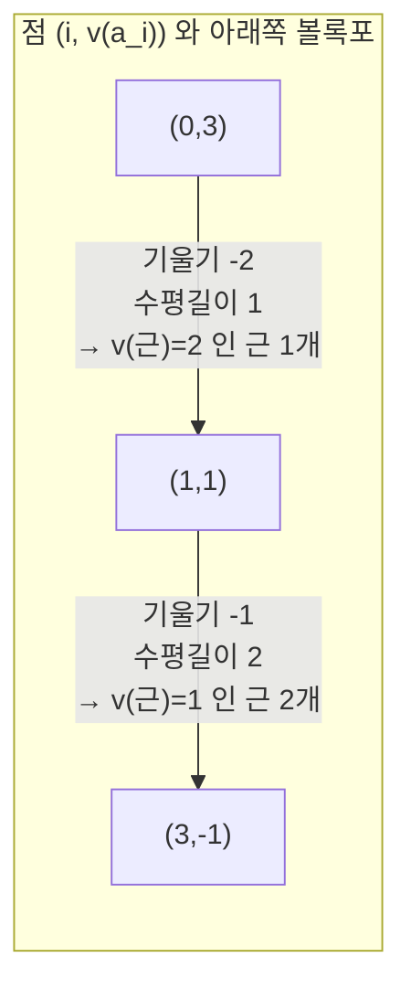

# Newton 다각형

# 개요

[`p` 진수](p-adic-numbers.md)에서 방정식을 푸는 첫 도구는 Hensel 보조정리였다. 하지만 Hensel 은 까다로운 가설을 요구한다. 근사해 `a` 가 있고 `f'(a)` 가 단위여야 한다. $f'(a)\equiv0$ 이면 침묵한다. 그리고 Hensel 이 답하는 질문은 "$\mathbb Z_p$ 안에 근이 있는가" 하나뿐이다.

Newton 다각형은 더 거친 질문에 더 싼 값으로 답한다. **근을 하나도 구하지 않고, 계수의 부치만 보고, 모든 근의 부치를 정확히 알아낸다.** 대수적 폐포까지 올라간 근 전부에 대해서다.

$$
f(x)=\sum_{i=0}^na_ix^i\ \longmapsto\ \big\{(i,\,v(a_i))\big\}\ \text{의 아래쪽 볼록포}
$$

이 볼록포의 변 하나가 기울기 $-\lambda$ 이고 수평길이가 `m` 이면, `f` 는 부치가 정확히 $\lambda$ 인 근을 중복도까지 세어 `m` 개 갖는다. 계수를 들여다보는 것만으로 근의 크기 분포가 전부 나온다.

왜 이런 일이 가능한가. 초거리 부등식 때문이다. 실수에서는 여러 항이 서로 상쇄하며 크기를 예측할 수 없지만, `p` 진 절댓값에서는 **최솟값이 한 번만 달성되면 상쇄가 일어날 수 없다.** `f(x)=0` 이려면 최소 부치가 적어도 두 번 달성되어야 하고, 그 "두 번 달성" 조건이 곧 볼록포의 변이다. 볼록기하가 대수를 대신한다.

쓰임이 넓다. 체 확대의 분기지수를 읽고(Eisenstein 이 변 하나짜리 다각형의 특수한 경우다), `p` 진 멱급수의 영점을 세고, [Dwork 의 이론](dwork-rationality.md)에서 Frobenius 고윳값의 `p` 진 부치를 읽는다. 타원곡선이 보통이냐 초특이냐 하는 구분도 다각형 하나로 정리된다.

# 직관

## 최소는 한 번만 달성되면 안 된다

부치 `v` 가 붙은 체에서 초거리 부등식은 $v(x+y)\ge\min(v(x),v(y))$ 이고, **부등호가 등호가 아닐 수 있는 유일한 경우는 `v(x)=v(y)` 일 때다.** 달리 말해 최솟값이 딱 한 항에서만 달성되면 합의 부치는 그 최솟값이고, 합은 절대로 `0` 이 아니다.

이제 $f(\rho)=\sum a_i\rho^i=0$ 이라 하자. $\lambda=v(\rho)$ 라 두면 각 항의 부치는

$$
v(a_i\rho^i)=v(a_i)+i\lambda
$$

다. 합이 `0` 이 되려면 최솟값 $\min_i\{v(a_i)+i\lambda\}$ 가 **적어도 두 개의 `i` 에서** 달성되어야 한다.

여기서 기하가 나온다. 점 `(i,v(a_i))` 를 평면에 찍고 기울기 $-\lambda$ 인 직선을 아래에서 밀어 올린다. $v(a_i)+i\lambda$ 는 그 직선까지의 높이이고, 최솟값이 두 번 달성된다는 것은 **직선이 두 점에 동시에 닿는다**는 뜻이다. 그런 $\lambda$ 는 아래쪽 볼록포의 변의 기울기들뿐이다.

## 그림

`f(x)=p^3+px+x^2+p^{-1}x^3` 을 예로 보자. 점은 `(0,3),(1,1),(2,0),(3,-1)` 이다.



`(2,0)` 은 선분 `(1,1)`–`(3,-1)` 위에 정확히 놓이므로 꼭짓점이 아니다. 다각형은 두 변이고, 근은 부치 `2` 짜리 하나와 부치 `1` 짜리 둘, 모두 세 개다. 차수와 맞는다.

## 다각형이 인수분해를 본다

변마다 근이 갈라진다는 것은 다항식이 갈라진다는 뜻이기도 하다. 기울기가 서로 다른 두 변에 속한 근들은 절대로 한 기약인수 안에 함께 있을 수 없다. Galois 작용이 부치를 보존하기 때문이다. 그래서 다각형의 변 개수가 인수분해의 하한을 준다.

변이 **하나뿐**이고 그 기울기가 `-1/n` 이며 $n=\deg f$ 이면, 모든 근의 부치가 `1/n` 이다. 부치군이 $\frac1n\mathbb Z$ 를 포함해야 하므로 $[K(\rho):K]\ge n$, 곧 `f` 가 기약이다. 이것이 **Eisenstein 판정**의 정체다. `a_0` 이 `p` 로 나뉘되 `p^2` 로는 안 나뉘고 중간 계수가 전부 `p` 로 나뉜다는 조건은, 정확히 "점 `(0,1)` 과 `(n,0)` 을 잇는 선분 위쪽에 나머지 점이 다 있다" 는 말이다.

## Hensel 은 특수한 경우다

기울기 `0` 인 변의 수평길이가 `1` 이라 하자. 그러면 부치 `0` 인 근이 정확히 하나다. 유일한 단순 단위근이므로 그것이 바로 Hensel 이 올려 주는 근이다. Newton 다각형은 Hensel 을 포함하면서, $f'(a)\equiv0$ 인 경우까지 다룬다. 다만 주는 정보가 다르다. Hensel 은 근을 **구성**하고 다각형은 근의 **크기만** 말한다. 둘은 경쟁하지 않고 층을 이룬다.

# 정의

## Newton 다각형

`K` 를 부치 $v:K^\times\to\mathbb Q$ 가 붙은 체라 하고 $f(x)=\sum_{i=0}^na_ix^i\in K[x]$, $a_0a_n\ne0$ 이라 하자.

> `f` 의 **Newton 다각형**은 점집합 $\{(i,v(a_i)):a_i\ne0\}$ 의 아래쪽 볼록포다. 즉 `(0,v(a_0))` 에서 `(n,v(a_n))` 까지 이어지는, 모든 점을 위쪽 또는 위에 두는 아래로 볼록한 절선이다.

변 `S` 의 기울기가 $-\lambda$ 이고 수평길이가 `m` 일 때 $\lambda$ 를 `S` 의 **부치**, `m` 을 그 **중복도**라 한다. 부호 관례가 문헌마다 다르니 주의한다. 이 문서는 "기울기의 음수가 근의 부치" 로 잡는다.

## 멱급수의 경우

$f(x)=\sum_{i\ge0}a_ix^i$ 가 멱급수여도 같은 정의를 쓴다. 다만 볼록포가 무한히 이어질 수 있다. 이때 유한한 수평길이를 갖는 변들이 수렴영역 안의 영점을 지배하고, 기울기의 극한이 **수렴반경**을 준다.

# 성질

## 주정리

> **정리.** `K` 가 완비이고 `v` 가 $\overline K$ 로 유일하게 확장된다고 하자. `f` 의 Newton 다각형에 기울기 $-\lambda$, 수평길이 `m` 인 변이 있으면, `f` 는 $\overline K$ 에서 $v(\rho)=\lambda$ 인 근을 중복도까지 세어 정확히 `m` 개 갖는다.

수평길이의 총합이 `n` 이므로 근의 개수가 정확히 맞아떨어진다. 증명은 위 직관의 "최소가 두 번" 논증을 근과 계수의 관계(기본대칭식)에 적용하는 것이다.

따름정리를 모아 둔다.

- **부치의 분모가 분기를 준다.** 기울기가 `-a/e` (기약분수) 인 변이 있으면 그 근을 붙인 확대의 분기지수가 `e` 의 배수다.
- **Eisenstein.** 변 하나, 기울기 `-1/n` 이면 `f` 는 기약이고 $K(\rho)/K$ 는 완전분기다.
- **불분기 부분.** 기울기 `0` 인 변의 수평길이는 `f` 의 근 가운데 단위인 것의 개수다. 그 부분이 잉여체의 다항식으로 환원되고 Hensel 로 다뤄진다.
- **인수분해.** $f=\prod_S f_S$ 로 변마다 인수가 갈라지고, `f_S` 의 Newton 다각형은 변 `S` 하나로 이루어진다. 이 분해는 `K` 위에서 일어난다.

## Weierstrass 예비정리와의 관계

`p` 진 멱급수 $f(x)=\sum a_ix^i$ 가 $|x|_p\le r$ 에서 수렴하고 그 영역에서 유계라 하자. Newton 다각형에서 기울기가 $\ge-v(r)$ 인 변들의 수평길이 총합을 `d` 라 하면 `f` 는 그 원판에서 정확히 `d` 개의 영점을 갖고,

$$
f(x)=P(x)\,u(x),\qquad \deg P=d,\ u\ \text{는 원판에서 단위}
$$

로 분해된다. 무한차원이 유한차원으로 잘리는 이 현상이 [Dwork 이론](dwork-rationality.md)에서 Fredholm 행렬식을 다룰 수 있게 만드는 것이다. 완전연속 작용소의 특성급수가 정함수이고, 그 Newton 다각형이 고윳값의 부치를 층층이 준다.

## `p` 진 exp 의 수렴반경

가장 자주 쓰는 계산이다. $\exp(x)=\sum x^n/n!$ 의 계수 부치는 `-v_p(n!)` 이고 Legendre 공식이

$$
v_p(n!)=\frac{n-s_p(n)}{p-1}
$$

를 준다(`s_p(n)` 은 `p` 진 자릿수의 합). 그러므로 $v(x^n/n!)=nv(x)-\frac{n-s_p(n)}{p-1}$ 이 $\infty$ 로 가려면

$$
v(x)>\frac1{p-1}
\qquad\Longleftrightarrow\qquad
|x|_p<p^{-1/(p-1)}<1
$$

이어야 한다. 다각형의 기울기가 점근적으로 `-1/(p-1)` 이라는 말과 같다. 이 경계가 [Dwork 의 분해함수](dwork-rationality.md)가 넘어야 했던 벽이다. $\pi^{p-1}=-p$ 이면 $v(\pi)=\frac1{p-1}$ 이라 $\exp(\pi x)$ 는 열린 단위원판에서 겨우 수렴하고, `x^p` 항을 빼 준 $\exp(\pi(x-x^p))$ 가 반경을 `1` 너머로 밀어낸다.

## Frobenius 고윳값

유한체 위 다양체의 zeta 함수 분자 $P(T)=\prod(1-\alpha_jT)$ 에서 근은 $\alpha_j^{-1}$ 이므로 다각형의 **기울기가 곧 $\mathrm{ord}\,\alpha_j$** 다. 타원곡선의 `P(T)=1-a_pT+pT^2` 에서 점은 `(0,0),(1,v(a_p)),(2,1)` 이고 두 경우로 갈린다.

| 조건 | 다각형 | $\mathrm{ord}_p\alpha,\ \mathrm{ord}_p\beta$ | 이름 |
|---|---|---|---|
| $p\nmid a_p$ | 꺾인 두 변 | `0,\ 1` | 보통(ordinary) |
| $p\mid a_p$ | 곧은 한 변 | $\tfrac12,\ \tfrac12$ | 초특이(supersingular) |

부치 `0` 인 고윳값을 **단위근**이라 하고, 그 존재 여부가 형식군의 높이, `p` 진 `L` 함수의 보간, 곡선의 `p` 진 성질 전반을 가른다. Weil 추측의 Riemann 가설이 아르키메데스 절댓값 $|\alpha|=\sqrt p$ 를 말하는 동안, Newton 다각형은 같은 수의 `p` 진 크기를 말한다. 두 정보가 독립이고 둘 다 필요하다.

# 활용

## 다각형이 근의 부치를 되읽는지 확인한다

근을 미리 정해서 다항식을 만들고, 계수만 넘겨 다각형을 계산한 뒤, 예측한 부치가 실제 근의 부치와 맞는지 본다. 답을 코드에 알려 주지 않는다.

```python
from fractions import Fraction as F

def vp(x, p):                               # 유리수의 p 진 부치. 0 은 None(=+∞)
    if x == 0: return None
    x, k = F(x), 0
    while x.numerator % p == 0: x, k = x / p, k + 1
    while x.denominator % p == 0: x, k = x * p, k - 1
    return F(k)

def newton_polygon(coeffs, p):
    """coeffs = [a_0,...,a_n].  아래쪽 볼록포의 꼭짓점을 (i, v(a_i)) 로 돌려준다."""
    pts = [(i, vp(a, p)) for i, a in enumerate(coeffs)]
    pts = [(i, v) for i, v in pts if v is not None]
    hull = []
    for q in pts:                           # Andrew monotone chain 의 아래쪽
        while len(hull) >= 2:
            (x1, y1), (x2, y2) = hull[-2], hull[-1]
            # (x2,y2) 가 (x1,y1)-(q) 선분 위 또는 위쪽이면 버린다
            if (y2 - y1) * (q[0] - x1) >= (q[1] - y1) * (x2 - x1): hull.pop()
            else: break
        hull.append(q)
    return hull

def slopes(coeffs, p):
    """각 변에서 (근의 부치 λ = -기울기, 그 부치를 갖는 근의 개수) 를 읽는다."""
    h, out = newton_polygon(coeffs, p), []
    for (x1, y1), (x2, y2) in zip(h, h[1:]):
        out += [-(y2 - y1) / (x2 - x1)] * (x2 - x1)
    return sorted(out)

def poly_from_roots(roots):
    c = [F(1)]
    for r in roots:
        c = [F(0)] + c
        for i in range(len(c) - 1): c[i] -= F(r) * c[i + 1]
    return c

for p, roots in [(3, [1, 3, 9, F(1, 3), 2]),
                 (5, [5, 25, F(1, 25), 1, 7, 10]),
                 (2, [2, 4, 8, 16, 1]),
                 (7, [F(1, 7), F(1, 7), 7, 49])]:
    f = poly_from_roots(roots)
    want = sorted(vp(r, p) for r in roots)
    got = slopes(f, p)
    print(f"  p={p}  근 {[str(F(r)) for r in roots]}")
    print(f"     실제 부치 {[str(v) for v in want]}")
    print(f"     다각형    {[str(v) for v in got]}   일치={want == got}")

#   p=3  근 ['1', '3', '9', '1/3', '2']
#      실제 부치 ['-1', '0', '0', '1', '2']
#      다각형    ['-1', '0', '0', '1', '2']   일치=True
#   p=5  근 ['5', '25', '1/25', '1', '7', '10']
#      실제 부치 ['-2', '0', '0', '1', '1', '2']
#      다각형    ['-2', '0', '0', '1', '1', '2']   일치=True
#   p=2  근 ['2', '4', '8', '16', '1']
#      실제 부치 ['0', '1', '2', '3', '4']
#      다각형    ['0', '1', '2', '3', '4']   일치=True
#   p=7  근 ['1/7', '1/7', '7', '49']
#      실제 부치 ['-1', '-1', '1', '2']
#      다각형    ['-1', '-1', '1', '2']   일치=True
```

중복근(`p=7` 의 `1/7` 이 둘)도 음수 부치도 정확히 나온다. 다각형은 근을 전혀 보지 않고 계수만 보았다.

## Eisenstein 은 변이 하나인 다각형이다

```python
for p, f, name in [(3, [3, 3, 3, 1], "x^3+3x^2+3x+3"),
                   (5, [10, 5, 0, 1], "x^3+5x+10"),
                   (2, [2, 0, 0, 0, 1], "x^4+2")]:
    h, s, n = newton_polygon(f, p), slopes(f, p), len(f) - 1
    print(f"  p={p}  {name:16s}  꼭짓점 {[(i, str(v)) for i, v in h]}"
          f"   부치 {[str(v) for v in s]}")
    print(f"     변 하나 : {len(h) == 2}   모든 근의 부치가 1/{n} : "
          f"{all(v == F(1, n) for v in s)}   →  분기지수 {n}")

#   p=3  x^3+3x^2+3x+3     꼭짓점 [(0, '1'), (3, '0')]   부치 ['1/3', '1/3', '1/3']
#      변 하나 : True   모든 근의 부치가 1/3 : True   →  분기지수 3
#   p=5  x^3+5x+10         꼭짓점 [(0, '1'), (3, '0')]   부치 ['1/3', '1/3', '1/3']
#      변 하나 : True   모든 근의 부치가 1/3 : True   →  분기지수 3
#   p=2  x^4+2             꼭짓점 [(0, '1'), (4, '0')]   부치 ['1/4', '1/4', '1/4', '1/4']
#      변 하나 : True   모든 근의 부치가 1/4 : True   →  분기지수 4
```

`(0,1)` 과 `(n,0)` 을 잇는 선분 하나. 부치가 `1/n` 이므로 분기지수가 `n` 이고 확대가 완전분기다. 기약성이 볼록포의 모양에서 읽힌다.

## 보통과 초특이를 가른다

[Dwork 문서](dwork-rationality.md)의 `count` 함수로 $a_p=p+1-\#E(\mathbb F_p)$ 를 구해 넣었다. 곡선은 같은 `E:y^2=x^3+x+1` 이다.

```python
print("   P 의 근은 1/α, 1/β 이므로  v(근) = -ord(α).  ord(α) = 기울기.")
for p, ap in [(5, -3), (7, 3), (11, -2), (13, -4), (17, 0), (19, -1), (23, -4)]:
    f = [1, -ap, p]                          # 계수는 T^0, T^1, T^2 순서
    s = slopes(f, p)
    ords = sorted(-v for v in s)             # Frobenius 고윳값의 부치
    kind = "보통(ordinary)" if F(0) in ords else "초특이(supersingular)"
    print(f"  p={p:3d}  a_p={ap:3d}   v(근) {str([str(v) for v in s]):22s}"
          f"  ord(α),ord(β) = {[str(v) for v in ords]}   {kind}")

#    P 의 근은 1/α, 1/β 이므로  v(근) = -ord(α).  ord(α) = 기울기.
#   p=  5  a_p= -3   v(근) ['-1', '0']             ord(α),ord(β) = ['0', '1']   보통(ordinary)
#   p=  7  a_p=  3   v(근) ['-1', '0']             ord(α),ord(β) = ['0', '1']   보통(ordinary)
#   p= 11  a_p= -2   v(근) ['-1', '0']             ord(α),ord(β) = ['0', '1']   보통(ordinary)
#   p= 13  a_p= -4   v(근) ['-1', '0']             ord(α),ord(β) = ['0', '1']   보통(ordinary)
#   p= 17  a_p=  0   v(근) ['-1/2', '-1/2']        ord(α),ord(β) = ['1/2', '1/2']   초특이(supersingular)
#   p= 19  a_p= -1   v(근) ['-1', '0']             ord(α),ord(β) = ['0', '1']   보통(ordinary)
#   p= 23  a_p= -4   v(근) ['-1', '0']             ord(α),ord(β) = ['0', '1']   보통(ordinary)
```

`p=17` 에서만 `a_p=0` 이라 다각형이 꺾이지 않고 곧은 한 변이 되며 부치가 $\frac12$ 로 쪼개진다. 이 곡선은 `p=17` 에서 초특이다. 나머지 소수에서는 단위근이 하나 있고, 그 단위근이 형식군의 높이 `1` 을 보증한다.

## `p` 진 exp 의 벽을 본다

```python
def v_fact(n, p):
    s, q = 0, p
    while q <= n: s, q = s + n // q, q * p
    return s

for p in [2, 3, 5, 7]:
    N = 2000
    print(f"  p={p}  v_p(N!)/N  (N={N}) = {F(v_fact(N,p), N)}"
          f" ≈ {v_fact(N,p)/N:.6f}   1/(p-1) = {1/(p-1):.6f}")

#   p=2  v_p(N!)/N  (N=2000) = 997/1000 ≈ 0.997000   1/(p-1) = 1.000000
#   p=3  v_p(N!)/N  (N=2000) = 249/500 ≈ 0.498000   1/(p-1) = 0.500000
#   p=5  v_p(N!)/N  (N=2000) = 499/2000 ≈ 0.249500   1/(p-1) = 0.250000
#   p=7  v_p(N!)/N  (N=2000) = 33/200 ≈ 0.165000   1/(p-1) = 0.166667
```

다각형의 평균 기울기가 `-1/(p-1)` 로 수렴한다. $\exp$ 의 수렴반경이 `p^{-1/(p-1)}` 이라는 사실의 계산판이고, Dwork 가 `x^p` 항을 더해 넘어야 했던 벽의 높이다.

## 어디에 쓰이는가

- **분기 계산.** 수체나 국소체의 확대에서 소수가 어떻게 분기하는지를 정의다항식의 계수만으로 읽는다. [Dedekind 정역](dedekind-domains.md)의 분해 이론을 실제로 계산할 때 첫 단계다.
- **다항식 인수분해.** $\mathbb Q_p$ 위의 인수분해 알고리즘(Montes, Ore)이 다각형으로 근을 층층이 나눈 뒤 각 층에서 재귀한다.
- **`p` 진 해석.** 멱급수의 영점 개수, Weierstrass 예비정리, Iwasawa 이론의 $\mu$, $\lambda$ 불변량이 전부 다각형의 언어로 진술된다.
- **산술기하.** [Dwork 이론](dwork-rationality.md)과 결정 코호몰로지에서 Frobenius 고윳값의 부치 분포가 다각형이고, Newton 다각형이 Hodge 다각형 위에 놓인다는 Mazur 의 정리가 이 두 세계를 잇는다. 여러 변수 지수합에서 Adolphson–Sperber 의 Newton 다면체 한계가 같은 줄기다.
- **트로피컬 기하.** "최솟값이 두 번 달성" 이라는 조건은 부치를 트로피컬 반환으로 보는 관점에서 트로피컬 근의 정의 그 자체다. Newton 다각형은 1 차원 트로피컬 기하다.

[^1]: 표준 서술은 J. Neukirch, *Algebraic Number Theory* (1999) II장 §6, 또는 F. Gouvêa, *p-adic Numbers: An Introduction* (3판, 2020) 6장. Weierstrass 예비정리와 멱급수의 다각형은 A. Robert, *A Course in p-adic Analysis* (2000) 6장. Newton 다각형과 Hodge 다각형의 부등식은 B. Mazur, *Frobenius and the Hodge filtration*, Bull. AMS **78** (1972), 653–667. 본문의 수치 계산은 직접 한 것이다.

# 연관 문서

## 선수지식

- [p 진수와 부치](p-adic-numbers.md)

## 더 알아보기

- [Dwork 의 유리성 정리와 지수합](dwork-rationality.md)

#number_theory #analysis #field_theory #computation
