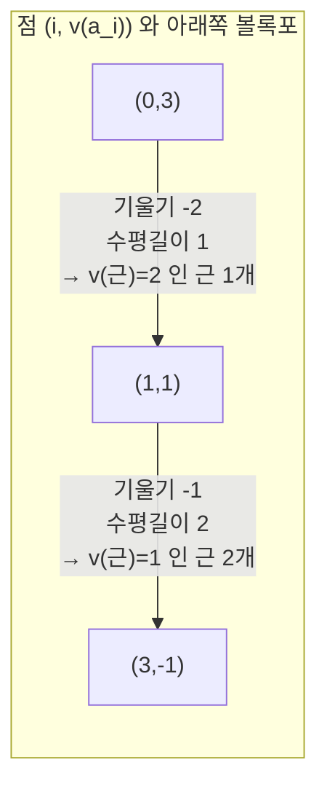

# Newton 다각형

# 개요

[$p$ 진수](p-adic-numbers.md)에서 Hensel 보조정리는 근사해 $a$ 와 $f'(a)$ 가 단위라는 가설을 요구하고, $\mathbb Z_p$ 안에 근이 있는지만 답한다.

Newton 다각형은 근을 하나도 구하지 않고 계수의 부치만으로 대수적 폐포 위 모든 근의 부치를 준다.

$$
f(x)=\sum_{i=0}^na_ix^i\ \longmapsto\ \big\lbrace(i,\thinspace v(a_i))\big\rbrace\ \text{의 아래쪽 볼록포}
$$

이 볼록포의 변 하나가 기울기 $-\lambda$ 이고 수평길이가 $m$ 이면 $f$ 는 부치가 정확히 $\lambda$ 인 근을 중복도까지 세어 $m$ 개 갖는다.

근거는 초거리 부등식이다. $p$ 진 절댓값에서는 최솟값이 한 번만 달성되면 상쇄가 일어나지 않는다. $f(x)=0$ 이려면 최소 부치가 적어도 두 번 달성되어야 하고, 그 조건이 볼록포의 변이다.

쓰임이 넓다. 체 확대의 분기지수를 읽고(Eisenstein 이 변 하나짜리 다각형이다), $p$ 진 멱급수의 영점을 세고, [Dwork 의 이론](dwork-rationality.md)에서 Frobenius 고윳값의 $p$ 진 부치를 읽으며, 타원곡선의 보통과 초특이 구분도 다각형으로 정리된다.

# 직관

## 최소가 두 번 달성되는 조건

부치 $v$ 가 붙은 체에서 초거리 부등식은 $v(x+y)\ge\min(v(x),v(y))$ 이고 등호가 아닐 수 있는 경우는 $v(x)=v(y)$ 일 때뿐이다. 최솟값이 한 항에서만 달성되면 합의 부치가 그 최솟값이고 합은 $0$ 이 아니다.

$f(\rho)=\sum a_i\rho^i=0$ 에서 $\lambda=v(\rho)$ 라 두면 각 항의 부치는 다음이다.

$$
v(a_i\rho^i)=v(a_i)+i\lambda
$$

합이 $0$ 이 되려면 최솟값 $\min_i\lbrace v(a_i)+i\lambda\rbrace$ 가 적어도 두 개의 $i$ 에서 달성되어야 한다.

점 $(i,v(a_i))$ 를 평면에 찍고 기울기 $-\lambda$ 인 직선을 아래에서 밀어 올리면 $v(a_i)+i\lambda$ 가 그 직선까지의 높이다. 최솟값이 두 번 달성된다는 것은 직선이 두 점에 동시에 닿는다는 뜻이고, 그런 $\lambda$ 는 아래쪽 볼록포의 변의 기울기들뿐이다.

## 3차 다항식의 다각형

$f(x)=p^3+px+x^2+p^{-1}x^3$ 에서 점은 $(0,3),(1,1),(2,0),(3,-1)$ 이다.

$(2,0)$ 은 $(1,1)$ 과 $(3,-1)$ 을 잇는 선분 위에 놓이므로 꼭짓점이 아니다. 다각형은 두 변이고 근은 부치 $2$ 짜리 하나와 부치 $1$ 짜리 둘로 모두 셋이며 차수와 맞는다.

## 다각형과 인수분해

기울기가 서로 다른 두 변에 속한 근들은 Galois 작용이 부치를 보존하므로 한 기약인수 안에 함께 있을 수 없다. 다각형의 변 개수가 인수분해의 하한을 준다.

변이 하나뿐이고 그 기울기가 $-1/n$ 이며 $n=\deg f$ 이면 모든 근의 부치가 $1/n$ 이다. 부치군이 $\frac1n\mathbb Z$ 를 포함해야 하므로 $[K(\rho):K]\ge n$ 이고 $f$ 가 기약이다. **Eisenstein 판정**이 이 경우다. $a_0$ 이 $p$ 로 나뉘되 $p^2$ 로는 안 나뉘고 중간 계수가 전부 $p$ 로 나뉜다는 조건은 점 $(0,1)$ 과 $(n,0)$ 을 잇는 선분 위쪽에 나머지 점이 다 있다는 말이다.

## Hensel 과의 관계

기울기 $0$ 인 변의 수평길이가 $1$ 이면 부치 $0$ 인 근이 정확히 하나이고, 그것이 Hensel 이 올려 주는 근이다. Newton 다각형은 $f'(a)\equiv0$ 인 경우까지 다루지만 근을 구성하지 않고 크기만 말한다. 두 도구는 층을 이룬다.

# 정의

## Newton 다각형

$K$ 를 부치 $v:K^\times\to\mathbb Q$ 가 붙은 체라 하고 $f(x)=\sum_{i=0}^na_ix^i\in K[x]$ 가 $a_0a_n\ne0$ 을 만족한다고 하자.

> $f$ 의 **Newton 다각형**은 점집합 $\lbrace(i,v(a_i)):a_i\ne0\rbrace$ 의 아래쪽 볼록포다. 곧 $(0,v(a_0))$ 에서 $(n,v(a_n))$ 까지 이어지며 모든 점을 위쪽 또는 위에 두는 아래로 볼록한 절선이다.

변 $S$ 의 기울기가 $-\lambda$ 이고 수평길이가 $m$ 일 때 $\lambda$ 가 $S$ 의 **부치**, $m$ 이 그 **중복도**다. 부호 관례가 문헌마다 다르며 이 문서는 기울기의 음수를 근의 부치로 잡는다.

## 멱급수의 경우

$f(x)=\sum_{i\ge0}a_ix^i$ 가 멱급수여도 같은 정의를 쓰고 볼록포가 무한히 이어질 수 있다. 유한한 수평길이를 갖는 변들이 수렴영역 안의 영점을 지배하고 기울기의 극한이 **수렴반경**을 준다.

# 성질

## 주정리

> **정리.** $K$ 가 완비이고 $v$ 가 $\overline K$ 로 유일하게 확장된다고 하자. $f$ 의 Newton 다각형에 기울기 $-\lambda$ 이고 수평길이 $m$ 인 변이 있으면 $f$ 는 $\overline K$ 에서 $v(\rho)=\lambda$ 인 근을 중복도까지 세어 정확히 $m$ 개 갖는다.

수평길이의 총합이 $n$ 이므로 근의 개수가 맞아떨어진다. 증명은 최소가 두 번 달성된다는 논증을 근과 계수의 관계에 적용하는 것이다.

- 부치의 분모가 분기를 준다. 기울기가 $-a/e$ (기약분수) 인 변이 있으면 그 근을 붙인 확대의 분기지수가 $e$ 의 배수다.
- **Eisenstein.** 변 하나, 기울기 $-1/n$ 이면 $f$ 는 기약이고 $K(\rho)/K$ 는 완전분기다.
- **불분기 부분.** 기울기 $0$ 인 변의 수평길이는 $f$ 의 근 가운데 단위인 것의 개수다. 그 부분이 잉여체의 다항식으로 환원되어 Hensel 로 다뤄진다.
- **인수분해.** $f=\prod_S f_S$ 로 변마다 인수가 갈라지고 $f_S$ 의 Newton 다각형은 변 $S$ 하나다. 이 분해는 $K$ 위에서 일어난다.

## Weierstrass 예비정리와의 관계

$p$ 진 멱급수 $f(x)=\sum a_ix^i$ 가 $|x|\_p\le r$ 에서 수렴하고 유계라 하자. Newton 다각형에서 기울기가 $\ge-v(r)$ 인 변들의 수평길이 총합을 $d$ 라 하면 $f$ 는 그 원판에서 정확히 $d$ 개의 영점을 갖고 다음으로 분해된다.

$$
f(x)=P(x)\thinspace u(x),\qquad \deg P=d,\ u\ \text{는 원판에서 단위}
$$

무한차원이 유한차원으로 잘리므로 [Dwork 이론](dwork-rationality.md)에서 Fredholm 행렬식을 다룰 수 있다. 완전연속 작용소의 특성급수가 정함수이고 그 Newton 다각형이 고윳값의 부치를 층층이 준다.

## $p$ 진 exp 의 수렴반경

$\exp(x)=\sum x^n/n!$ 의 계수 부치는 $-v_p(n!)$ 이고 Legendre 공식이 다음을 준다($s_p(n)$ 은 $p$ 진 자릿수의 합).

$$
v_p(n!)=\frac{n-s_p(n)}{p-1}
$$

$v(x^n/n!)=nv(x)-\frac{n-s_p(n)}{p-1}$ 이 $\infty$ 로 가려면 다음이 필요하다.

$$
v(x)\gt\frac1{p-1}
\qquad\Longleftrightarrow\qquad
|x|\_p\lt p^{-1/(p-1)}\lt 1
$$

다각형의 기울기가 점근적으로 $-1/(p-1)$ 이라는 말과 같다. $\pi^{p-1}=-p$ 이면 $v(\pi)=\frac1{p-1}$ 이라 $\exp(\pi x)$ 는 열린 단위원판에서 겨우 수렴하고, $x^p$ 항을 뺀 $\exp(\pi(x-x^p))$ 가 반경을 $1$ 너머로 민다. 이 경계가 [Dwork 의 분해함수](dwork-rationality.md)가 넘은 벽이다.

## Frobenius 고윳값

유한체 위 다양체의 zeta 함수 분자 $P(T)=\prod(1-\alpha_jT)$ 에서 근은 $\alpha_j^{-1}$ 이므로 다각형의 기울기가 $\mathrm{ord}\thinspace\alpha_j$ 와 같다. 타원곡선의 $P(T)=1-a_pT+pT^2$ 에서 점은 $(0,0),(1,v(a_p)),(2,1)$ 이고 두 경우로 갈린다.

| 조건 | 다각형 | $\mathrm{ord}\_p\alpha,\ \mathrm{ord}\_p\beta$ | 이름 |
|---|---|---|---|
| $p\nmid a_p$ | 꺾인 두 변 | $0,\ 1$ | 보통(ordinary) |
| $p\mid a_p$ | 곧은 한 변 | $\tfrac12,\ \tfrac12$ | 초특이(supersingular) |

부치 $0$ 인 고윳값이 **단위근**이고, 그 존재 여부가 형식군의 높이, $p$ 진 $L$ 함수의 보간, 곡선의 $p$ 진 성질을 가른다. Weil 추측의 Riemann 가설이 아르키메데스 절댓값 $|\alpha|=\sqrt p$ 를 말하는 동안 Newton 다각형은 같은 수의 $p$ 진 크기를 말한다.

# 활용

## Eisenstein 다항식의 다각형

Eisenstein 다항식 $x^n+pa_{n-1}x^{n-1}+\dots+pa_0$ ( $p\nmid a_0$ ) 의 다각형은 $(0,1)$ 과 $(n,0)$ 을 잇는 선분 하나이고 부치가 $1/n$ 이므로 분기지수가 $n$ 이며 확대가 완전분기다. 기약성이 볼록포의 모양에서 읽힌다.

## 보통과 초특이의 판정

곡선 $y^2=x^3+x+1$ 과 $p\le71$ 에서는 $p=17$ 에서만 $a_p=0$ 이라 다각형이 꺾이지 않고 부치가 $\frac12$ 로 쪼개지며 곡선이 초특이다. 나머지 소수에서는 단위근이 하나 있고 형식군의 높이가 $1$ 이다.

## 도구로서의 쓰임

- **분기 계산.** 수체나 국소체의 확대에서 소수의 분기를 정의다항식의 계수만으로 읽는다. [Dedekind 정역](dedekind-domains.md)의 분해 이론을 계산할 때 첫 단계다.
- **다항식 인수분해.** $\mathbb Q_p$ 위의 인수분해 알고리즘(Montes, Ore)이 다각형으로 근을 층층이 나눈 뒤 각 층에서 재귀한다.
- **$p$ 진 해석.** 멱급수의 영점 개수, Weierstrass 예비정리, Iwasawa 이론의 $\mu$ 와 $\lambda$ 불변량이 다각형의 언어로 진술된다.
- **산술기하.** [Dwork 이론](dwork-rationality.md)과 결정 코호몰로지에서 Frobenius 고윳값의 부치 분포가 다각형이고, Newton 다각형이 Hodge 다각형 위에 놓인다는 Mazur 의 정리가 두 세계를 잇는다. 여러 변수 지수합의 Adolphson–Sperber 한계가 같은 줄기다.
- **트로피컬 기하.** 최솟값이 두 번 달성된다는 조건은 부치를 트로피컬 반환으로 보는 관점에서 트로피컬 근의 정의다. Newton 다각형은 1 차원 트로피컬 기하다.

# 연관 문서

## 선수지식

- [p 진수](p-adic-numbers.md)

## 더 알아보기

- [Dwork 의 유리성 정리와 지수합](dwork-rationality.md)

#number_theory #analysis #field_theory #computation
