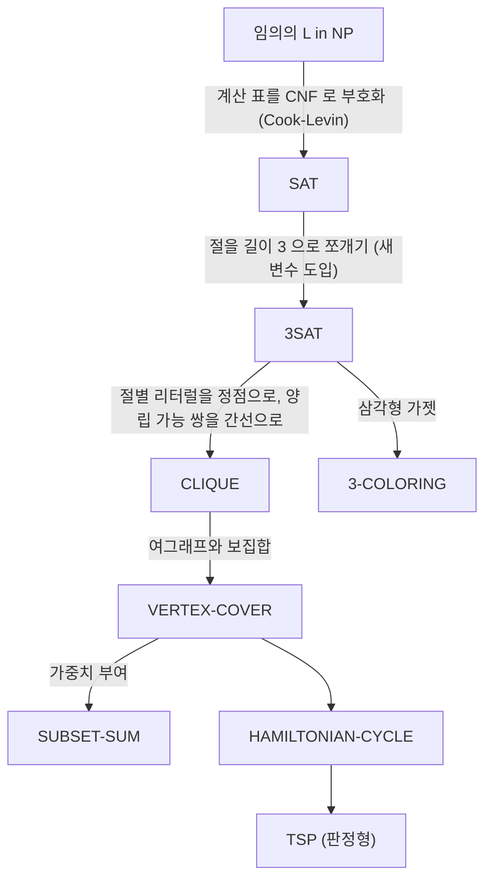

# NP-완전성과 Cook–Levin 정리

# 개요

NP-완전성은 [P 대 NP 문제](p-np.md)를 개별 문제 수준으로 내려놓는 도구다. NP에 속하는 문제들 가운데 "가장 어려운" 것들을 골라내면, 그중 하나만 다항시간에 풀려도 NP 전체가 P와 같아진다. 이런 문제를 NP-완전(NP-complete)이라 한다.

이 개념이 성립하려면 그런 가장 어려운 문제가 실제로 존재해야 한다. Cook–Levin 정리가 그것을 보장한다: 명제논리식의 충족가능성 문제 SAT이 NP-완전이다[^1]. 증명은 비결정적 Turing 기계의 계산 과정을 시간-공간 표(tableau)로 펼친 뒤 그 표의 국소 규칙을 CNF 절로 부호화하는 것이다.

Cook과 Levin이 첫 못을 박은 뒤 Karp가 SAT에서 출발하는 환원으로 21개의 조합 문제를 NP-완전으로 판정했고[^2], 오늘날 수천 개의 문제가 이 목록에 들어 있다. 새 문제의 NP-완전성을 보이는 일은 대개 새 증명을 짜는 게 아니라 이미 알려진 NP-완전 문제에서 환원을 만드는 일이다.

# 직관

"어렵다"를 절대적으로 재는 대신 상대적으로 재는 것이 환원의 발상이다. 문제 A를 문제 B로 바꾸는 값싼 번역기가 있다면, B를 푸는 방법이 곧 A를 푸는 방법이 된다. 따라서 B는 적어도 A만큼 어렵다.

NP에 속하는 모든 문제를 이 방식으로 흡수하는 문제가 있다면 그것이 NP의 최대 원소다. 그런 문제가 존재한다는 사실은 전혀 자명하지 않다. 핵심 통찰은 **NP의 정의 자체가 계산이라는 균일한 형식을 갖는다**는 점이다. NP 문제는 "다항 길이의 증거를 다항시간 검증기가 받아들이는가"로 정의되고, 검증기의 실행은 유한한 국소 규칙을 반복 적용하는 표로 적을 수 있다. 국소 규칙은 불 변수의 논리식으로 쓸 수 있으니, 결국 "이 계산이 받아들이는 실행을 갖는가"가 "이 논리식이 충족가능한가"로 번역된다.

이 번역이 가능한 이유는 계산이 이미 논리적이기 때문이다. 즉 Cook–Levin은 심오한 조합적 사실이라기보다 "계산의 문법을 논리의 문법으로 바꾸는 컴파일러"에 가깝다. 어려운 부분은 표의 크기와 부호화가 다항식에 머무르도록 관리하는 것이다.

# 정의

## 다항시간 환원

**정의.** 언어 $A$ , $B$ (알파벳 위의 문자열 집합)에 대해, 다항시간에 계산되는 함수 $f$ 가 존재하여 모든 $w$ 에 대해

$$
w \in A \iff f(w) \in B
$$

일 때 $A$ 는 $B$ 로 **다항시간 many-one 환원**(Karp 환원)된다고 하고 $A \le_p B$ 로 쓴다.

두 성질이 정의의 전부다. 첫째 $f$ 는 다항시간에 계산되어야 하고, 둘째 소속 여부를 정확히 보존해야 한다(예 인스턴스는 예로, 아니오 인스턴스는 아니오로). $f$ 가 전단사일 필요도, 역이 계산 가능할 필요도 없다.

**보조정리.** $\le_p$ 는 반사적이고 추이적이다. 또 $A \le_p B$ 이고 $B \in P$ 이면 $A \in P$ 이며, $B \in NP$ 이면 $A \in NP$ 다.

증명 스케치. 추이성은 다항식의 합성이 다항식이라는 사실에서 나온다. 두 번째 주장은 $f$ 를 적용한 뒤 $B$ 의 판정기를 돌리면 되고, 총 시간은 다항식 둘의 합성이므로 다항식이다.

이 보조정리가 환원을 쓸모 있게 만든다. 환원은 난이도를 위로 전달하고(어려움의 상한을 아래로 전달하고), 그 방향이 항상 일정하다.

## NP-hard와 NP-complete

**정의.** 언어 $B$ 가 **NP-hard**라는 것은 모든 $A \in NP$ 에 대해 $A \le_p B$ 라는 뜻이다. $B$ 가 NP-hard이면서 $B \in NP$ 이면 $B$ 는 **NP-complete**다.

직접적인 따름정리 두 개.

- 어떤 NP-complete 문제가 P에 속하면 $\mathrm P=\mathrm{NP}$ 다.
- $P \ne NP$ 이면 어떤 NP-complete 문제도 다항시간 알고리즘을 갖지 않는다.

NP-hard는 NP 안에 있을 필요가 없다. 정지 문제는 NP-hard이지만 결정가능조차 하지 않다([계산 가능성과 정지 문제](computability.md)). 최적화 버전(예: 최소 정점덮개의 크기 구하기)도 보통 NP-hard이지만 판정 문제가 아니므로 NP-complete라 부르지 않는다.

## SAT과 3SAT

명제 변수 $x_1,\dots,x_n$ 에 대해 리터럴은 변수 또는 그 부정이고, 절(clause)은 리터럴들의 논리합이며, CNF 논식은 절들의 논리곱이다. 각 절의 리터럴이 정확히 세 개인 CNF를 3CNF라 한다.

- $\mathrm{SAT}=\lbrace\text{충족가능한 명제논리식}\rbrace$
- $\mathrm{3SAT}=\lbrace\text{충족가능한 3CNF 논리식}\rbrace$

둘 다 NP에 속한다. 증거는 변수 할당이고, 검증기는 대입해서 참인지 확인하면 되므로 선형 시간이다.

## Cook–Levin 정리

**정리 (Cook 1971, Levin 1973).** SAT은 NP-complete다.

증명 스케치. $L \in NP$ 를 잡으면 시간 $p(n)$ 의 비결정적 Turing 기계 $M$ 이 $L$ 을 판정한다. 입력 $w$ (길이 $n$ )에 대해 $M$ 의 한 실행을 $p(n) \times p(n)$ 크기의 **계산 표**로 적는다. $i$ 번째 행이 시각 $i$ 의 테이프 구성(각 칸의 기호, 헤드 위치, 상태)이다. 시간이 $p(n)$ 이므로 헤드는 $p(n)$ 칸을 넘어 움직이지 못해 표의 폭도 $p(n)$ 이면 충분하다.

변수 $x[i,j,s]$ 를 "시각 $i$ 에 칸 $j$ 의 내용이 기호 $s$ 다"로 둔다($s$ 는 테이프 기호이거나 상태-기호 쌍). 변수 개수는 $O(p(n)^2)$ 이다. 다음 네 묶음의 절을 만든다.

1. **칸 일관성.** 각 $(i, j)$ 에 대해 정확히 하나의 $s$ 만 참이다. "적어도 하나"는 $s$ 에 대한 논리합 하나, "많아야 하나"는 쌍마다 $(\neg x[i,j,s] \vee \neg x[i,j,t])$ 이다.
2. **시작.** 0번 행이 시작 상태와 입력 $w$ , 나머지 공백을 나타내도록 해당 변수들을 단위 절로 고정한다.
3. **수용.** 어떤 $(i,j)$ 에서 수용 상태가 나타난다: 그 변수들의 논리합 한 절.
4. **전이.** 표의 모든 $2\times3$ 창(window)이 $M$ 의 전이 규칙에 비추어 합법이다. 창 하나의 합법적 내용은 유한 개(알파벳과 상태 집합에만 의존)이므로, 불법 내용마다 그것을 금지하는 절을 쓰면 창당 상수 개 절이다.

핵심 관찰은 4번이다. Turing 기계의 한 스텝은 헤드 주변만 바꾸므로, 두 연속 행이 정합적이라는 조건이 **국소적**으로 확인된다. 표 전체의 정합성은 $O(p(n)^2)$ 개의 창 조건의 논리곱과 같다.

이렇게 만든 CNF 논리식 $\varphi_w$ 의 크기는 $O(p(n)^2)$ 이고 $w$ 로부터 다항시간에 구성된다. 그리고

$$
\varphi_w \text{ 가 충족가능} \iff M \text{ 이 } w \text{ 를 받아들이는 실행을 갖는다} \iff w \in L
$$

이다. 충족 할당에서 합법적인 계산 표를 읽어 낼 수 있고, 역으로 받아들이는 실행이 표를 통해 할당을 준다. 따라서 $L \le_p \mathrm{SAT}$ 이다. ∎

Levin의 원 논문은 같은 결과를 탐색 문제(search problem)의 형태로 독립적으로 얻었다. 그래서 "보편 탐색 문제"라는 관점이 함께 붙는다.

# 성질

## 환원의 사슬

NP-완전성을 새로 증명할 때는 Cook–Levin을 반복하지 않는다. 이미 NP-complete인 문제 $B$ 에서 새 문제 $C$ 로의 환원 $B \le_p C$ 를 만들고 $C \in NP$ 를 확인하면, 추이성에 의해 $C$ 도 NP-complete다. 환원의 방향을 뒤집으면(즉 $C \le_p B$ 를 보이면) 아무것도 증명되지 않는다는 점이 가장 흔한 실수다.

## SAT에서 3SAT으로

임의의 CNF 절을 길이 3의 절들로 바꾼다. 절 $(l_1 \vee l_2 \vee \cdots \vee l_k)$ 에 대해 $k \ge 4$ 이면 새 변수 $y_1, \ldots, y_{k-3}$ 를 도입해

$$
(l_1 \vee l_2 \vee y_1) \wedge (\neg y_1 \vee l_3 \vee y_2) \wedge \cdots \wedge (\neg y_{k-3} \vee l_{k-1} \vee l_k)
$$

로 치환한다. $k\le2$ 이면 리터럴을 반복하거나 더미 변수로 채운다.

**충족성 보존.** 원래 절이 어떤 할당에서 참이면 참인 리터럴 $l_i$ 를 기준으로 $y_1,\dots,y_{i-2}$ 를 참, 나머지를 거짓으로 두면 모든 새 절이 참이다. 역으로 모든 $l_i$ 가 거짓이면 새 절들의 연쇄가 $y_1$ 부터 차례로 참을 강요하다 마지막 절에서 모순이 난다. 변환은 원식 크기에 선형이다.

## 3SAT에서 CLIQUE로

3CNF 논리식이 $m$ 개 절 $C_1, \ldots, C_m$ 을 가질 때 [그래프](graphs.md) $G$ 를 만든다. 정점은 각 절의 각 리터럴, 즉 $3m$ 개다. 두 정점 사이에 간선을 놓는 조건은 (1) 서로 다른 절에 속하고, (2) 서로 모순이 아니다(하나가 $x$ , 다른 하나가 $\neg x$ 가 아니다).

**주장.** 논리식이 충족가능한 것과 $G$ 가 크기 $m$ 의 clique를 갖는 것은 동치다.

증명 스케치. 충족 할당이 있으면 절마다 참인 리터럴을 하나씩 고른다. 서로 다른 절에서 왔고 같은 할당에서 모두 참이므로 모순 쌍이 없어 $m$ clique다. 역으로 $m$ clique는 절마다 정확히 한 정점을 쓰고(같은 절 안에는 간선이 없으므로) 모순이 없으므로, 그 리터럴들을 참으로 만드는 할당이 존재한다.

## CLIQUE에서 VERTEX-COVER로

$G$ 의 정점 집합 $S$ 가 clique인 것과, 여그래프 $G'$ (같은 정점, 간선을 뒤집음)에서 $V\setminus S$ 가 정점덮개인 것은 동치다. 따라서 "$G$ 에 크기 $k$ 의 clique가 있는가"는 "$G'$ 에 크기 $|V|-k$ 의 정점덮개가 있는가"와 같다. 독립집합(independent set)도 같은 보집합 관계로 묶인다.

이 세 문제는 사실상 같은 문제의 세 표현이며, 근사 가능성은 서로 크게 다르다. VERTEX-COVER는 2-근사가 쉽지만 CLIQUE는 어떤 상수 비율로도 근사하기 어렵다.

## NP-완전성의 범위

의미하는 것.

- 최악의 경우에 대한 진술이다. NP-완전 문제에 다항시간 알고리즘이 있다면 NP 전체가 붕괴한다.
- 문제들 사이의 구조적 동치성이다. NP-완전 문제들은 서로 다항시간 환원으로 오갈 수 있어, 하나의 좋은 휴리스틱이 다른 것들로 이식된다.
- 문제를 어느 틀에 넣어야 하는지 알려 준다. 완전한 알고리즘 대신 근사, 파라미터화, 평균적 경우, 휴리스틱 탐색을 고려하게 된다.

의미하지 않는 것.

- **실무에서 풀 수 없다는 뜻이 아니다.** 현대 SAT solver는 수백만 변수의 산업 인스턴스를 일상적으로 처리한다. 최악의 경우 지수 시간이라는 사실과 실제 인스턴스의 난이도는 별개다.
- **모든 인스턴스가 어렵다는 뜻이 아니다.** 특수한 입력 구조(트리 너비가 작은 그래프, 이분 그래프 등)에서는 다항시간에 풀리는 경우가 많다.
- **근사도 어렵다는 뜻이 아니다.** 근사 난이도는 별도의 이론(PCP 정리)이 필요하며, 같은 NP-완전 문제라도 근사 가능성은 천차만별이다.
- **NP에 속하는 모든 문제가 NP-완전은 아니다.** $P \ne NP$ 라면 Ladner 정리에 의해 두 부류 어디에도 속하지 않는 NP-중간(NP-intermediate) 문제가 존재한다. [그래프 동형](graph-isomorphism.md) 문제와 소인수분해([RSA 암호](rsa-cryptosystem.md)의 기반)가 그런 후보로 거론된다.
- **결정불가능성과 다르다.** NP-완전 문제는 모두 결정가능하며 지수 시간에 풀린다. [Rice 정리](rice-theorem.md)가 다루는 종류의 절대적 불가능성이 아니다.

# 활용

## 실무에서의 쓰임

- **모델링 언어로서의 SAT.** 하드웨어 검증, 소프트웨어 모델 체킹, 스케줄링, 패키지 의존성 해결이 CNF로 번역되어 SAT solver에 넘겨진다. Cook–Levin의 환원이 "모든 NP 문제는 SAT의 방언"임을 보장하므로 이 전략이 보편적으로 통한다.
- **정수계획법.** [선형계획법](linear-programming.md)은 다항시간에 풀리지만 변수에 정수 조건을 붙이면 NP-hard가 된다. 조합 최적화의 표준 무기인 분기한정(branch and bound)은 이 경계 위에서 동작한다.
- **암호의 전제.** 암호계의 안전성은 NP-완전성보다 강한 가정(평균적 경우의 난해성)을 요구한다. NP-완전성은 최악의 경우만 말하므로 암호에는 그대로 쓰이지 않는다.
- **하드니스의 언어.** 새 문제를 만났을 때 먼저 알려진 NP-완전 문제와의 환원을 찾는 것이 표준 절차다. Garey와 Johnson의 목록이 그 출발점 역할을 오래 해 왔다[^3].

## 이론적 확장

- **다른 환원.** Karp 환원 대신 Turing 환원(신탁 질의를 여러 번 허용)을 쓰면 NP-hard의 범위가 넓어진다. 최적화 문제와 판정 문제를 함께 다룰 때 편하다.
- **완전성의 일반화.** 각 복잡도 부류마다 완전 문제가 있다. PSPACE에는 양화된 불식(QBF), co-NP에는 tautology 판정, #P에는 영구식(permanent) 계산이 대응한다.
- **Ladner 정리.** $P \ne NP$ 이면 NP-완전도 P도 아닌 문제가 존재한다. 대각선 논법을 다항시간 틀에서 수행한 결과다.
- **상대화 장벽.** Cook–Levin의 증명은 신탁 기계에도 그대로 상대화되므로, 이런 종류의 논증만으로는 $\mathrm P$ 와 $\mathrm{NP}$ 를 분리할 수 없다(Baker–Gill–Solovay). [P 대 NP 문제](p-np.md)에 대해 알려진 첫 번째 장벽 결과다.

[^1]: S. A. Cook, The Complexity of Theorem-Proving Procedures, STOC 1971, https://dl.acm.org/doi/10.1145/800157.805047
[^2]: R. M. Karp, Reducibility Among Combinatorial Problems, 1972, https://cs.brown.edu/people/jsavage/book/pdfs/Karp1972.pdf
[^3]: M. R. Garey, D. S. Johnson, Computers and Intractability: A Guide to the Theory of NP-Completeness, 1979, https://archive.org/details/computersintract0000gare

# 연관 문서

## 선수지식

- [P 대 NP 문제](p-np.md)

## 더 알아보기

- [근사 알고리즘](approximation-algorithms.md)

#complexity #computation
