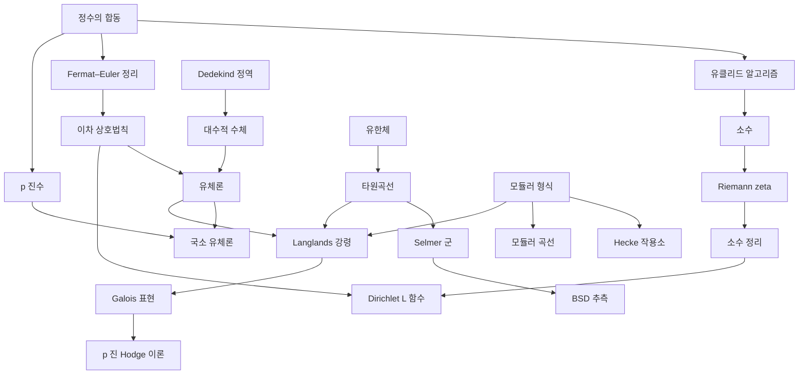

# 정수론 개관

# 개요

정수론은 정수와 그 확장(대수적 정수, $p$ 진수, 아델)에서 나눗셈, 소수, 합동, 방정식의 정수해를 묻는 분야다. 물음은 초등적이지만 답은 대수, 해석, 기하, 표현론을 전부 동원한다. 정수론의 갈래는 여섯 줄기다. 합동과 소수에서 시작하는 초등 정수론, 정수환의 아이디얼과 유체론으로 가는 대수적 정수론, $\zeta$ 와 $L$ 함수로 소수를 세는 해석적 정수론, 모듈러 형식, 타원곡선과 BSD(Birch–Swinnerton-Dyer) 추측, 그리고 이 모두를 표현론으로 통합하는 Langlands 강령이다.

처음 읽는다면 [정수의 합동](modular-arithmetic.md)에서 시작해 [Fermat 소정리와 Euler 정리](fermat-euler-theorem.md), [이차 상호법칙](quadratic-reciprocity.md)까지 가면 초등 정수론의 기본이 잡힌다. 그 다음 갈림길은 셋이다. 대수 쪽으로 [Dedekind 정역](dedekind-domains.md)과 [대수적 수체](algebraic-number-fields.md), 해석 쪽으로 [소수 정리](prime-number-theorem.md), 기하 쪽으로 [타원곡선](elliptic-curves.md)이다. 셋은 [유체론](class-field-theory.md)과 [모듈러 형식](modular-forms.md)을 거쳐 [Langlands 강령](langlands-program.md)에서 다시 만난다.

# 지도

핵심 문서 사이의 선수관계다. 화살표는 실제 간선이고, 위에서 아래로 갈수록 깊어진다.

# 갈래

## 초등 정수론

합동과 소수, 그리고 둘을 잇는 상호법칙. 다른 줄기들이 이 셋을 전제한다.

- [정수의 합동](modular-arithmetic.md): 정수를 나머지로 분류하는 첫 도구
- [유클리드 알고리즘](euclidean-algorithm.md): 최대공약수와 Bézout 항등식
- [연분수](continued-fractions.md): 실수를 정수 몫의 열로 펼쳐 최적 유리수 근사를 얻는다
- [Pell 방정식](pell-equation.md): $x^2-dy^2=1$ 의 해가 기본해의 거듭제곱으로 전부 나온다
- [Diophantine 근사](diophantine-approximation.md): 근사 지수가 대수적 수와 초월수를 가른다
- [초월수](transcendental-numbers.md): $e$ 와 $\pi$ 의 초월성, 로그의 일차형식
- [Baker 정리](baker-theorem.md): 로그의 일차형식에 대한 유효 하한, Diophantus 방정식의 해 상한
- [소수](primes.md): 산술의 기본 정리
- [Fermat 소정리와 Euler 정리](fermat-euler-theorem.md): 단위군의 위수가 주는 합동
- [중국인의 나머지 정리](chinese-remainder-theorem.md): 서로소 법의 합동식 결합
- [이차 상호법칙](quadratic-reciprocity.md): 제곱잉여의 대칭성, 유체론의 시작점
- [Gauss 정수환](gaussian-integers.md): 소수의 분해 유형과 두 제곱수의 합
- [유한체](finite-fields.md): 소수 위수의 체와 그 확대

## 암호와 계산

정수론의 어려운 문제가 곧 암호의 안전성이다. 계산 알고리즘도 여기 둔다.

- [이산로그와 Diffie–Hellman](discrete-logarithm.md), [RSA 암호](rsa-cryptosystem.md): 고전 공개키 암호
- [타원곡선과 군 구성](elliptic-curves.md), [쌍선형 암호](pairing-based-cryptography.md): 곡선 위의 암호
- [Schoof–Elkies–Atkin 알고리즘](sea-algorithm.md), [Kedlaya 알고리즘](kedlaya-algorithm.md): 유한체 위 곡선의 점 세기
- [초특이 동종사상 그래프와 SIDH](supersingular-isogeny-graphs.md)(supersingular isogeny Diffie–Hellman), [Deuring 대응](deuring-correspondence.md): 동종사상 기반 암호와 그 파괴
- [격자](lattices.md): 격자 기반 암호의 토대

## 대수적 정수론

정수환을 아이디얼로 다시 세우고, 아벨 확대를 정수환의 산술로 기술한다.

- [Dedekind 정역과 아이디얼의 유일분해](dedekind-domains.md) → [대수적 수체와 정수환](algebraic-number-fields.md)
- [대수적 수체와 정수환](algebraic-number-fields.md) → [Dirichlet 단수 정리](dirichlet-unit-theorem.md): 단수군의 계수와 조절자, 류수 공식
- [p 진수](p-adic-numbers.md) → [Newton 다각형](newton-polygon.md), [아델](adeles.md)
- [유체론](class-field-theory.md) → [국소 유체론과 Lubin–Tate 형식군](local-class-field-theory.md), [Chebotarev 밀도 정리](chebotarev.md), [복소 곱셈](complex-multiplication.md)
- [Brauer 군과 Hasse 원리](brauer-groups.md), [Poitou–Tate 완전열](poitou-tate.md): 국소–대역 원리의 코호몰로지

## 해석적 정수론과 L 함수

소수를 세려면 복소함수가 필요하다. $\zeta$ 에서 $L$ 함수로, 다시 Tate 의 아델적 재해석으로.

- [Riemann zeta 함수](riemann-zeta.md) → [소수 정리](prime-number-theorem.md) → [Dirichlet 지표와 L 함수](dirichlet-l-functions.md) → [Gauss 합과 국소 근 수](gauss-sums.md)
- [Riemann 가설](riemann-hypothesis.md): 영점의 실수부와 소수 계량 함수의 오차, GRH 의 응용
- [Poisson 합 공식](poisson-summation.md), [Mellin 변환과 Perron 공식](mellin-transform.md), [Euler–Maclaurin 공식](euler-maclaurin.md): 해석적 도구
- [Bernoulli 수와 von Staudt–Clausen 정리](bernoulli-numbers.md) → [Stickelberger 원소와 Gauss 합](stickelberger.md)
- [Tate 의 논문](tate-thesis.md): $\zeta$ 함수의 아델적 증명

## 모듈러 형식

상반평면 위의 대칭 함수가 정수론의 생성함수 역할을 한다.

- [모듈러 형식](modular-forms.md) → [Eisenstein 급수](eisenstein-series.md), [Hecke 작용소와 새형식](hecke-operators.md), [theta 급수](theta-series.md)
- [Maass 형식](maass-forms.md), [Selberg 대각합 공식](selberg-trace-formula.md): 비정칙 스펙트럼
- [모듈러 곡선](modular-curves.md) → [모듈러 기호](modular-symbols.md), [과수렴 모듈러 기호와 p 진 L 함수](overconvergent-modular-symbols.md)
- [분할수](partitions.md), [Mock 모듈러 형식](mock-modular-forms.md), [Dyson 의 rank 와 crank](dyson-rank-crank.md), [Borcherds 곱](borcherds-products.md): 조합론과의 접점
- [Weil 표현과 theta 대응](weil-representation.md) → [Shimura 대응](shimura-correspondence.md), [Siegel–Weil 공식](siegel-weil.md) → [질량 공식](mass-formula.md) → [Niemeier 격자](niemeier-lattices.md), [구 채우기](sphere-packing.md)
- [괴물 달빛 추측](monstrous-moonshine.md), [Umbral moonshine](umbral-moonshine.md): 모듈러 함수와 산재 단순군

## 타원곡선과 BSD 추측

곡선의 유리점을 세는 문제가 $L$ 함수의 영점 차수와 만난다.

- [타원곡선과 군 구성](elliptic-curves.md) → [Néron–Tate 높이와 Mordell–Weil 정리](canonical-height.md), [Selmer 군과 Tate–Shafarevich 군](selmer-groups.md)
- [Birch–Swinnerton-Dyer 추측](birch-swinnerton-dyer.md) → [Heegner 점과 Gross–Zagier 공식](heegner-points.md), [Kolyvagin–Logachev 정리](kolyvagin-logachev.md)
- [Euler 계와 Kolyvagin 유도류](euler-systems.md) → [Kolyvagin 계](kolyvagin-systems.md), [Iwasawa 주추측](iwasawa-main-conjecture.md) → [Vandiver 추측](vandiver-conjecture.md), [Greenberg 추측](greenberg-conjecture.md)
- [Eisenstein 아이디얼과 Mazur 의 비틀림점 정리](eisenstein-ideal.md) → [Merel 의 일양 유계성 정리](merel-theorem.md)
- [Sato–Tate 분포](sato-tate.md) → [Lang–Trotter 추측](lang-trotter.md): $a_p$ 의 통계

## Galois 표현과 p 진 Hodge 이론

정수론의 대상을 Galois 군의 표현으로 바꿔 읽는다. 모듈러성 정리가 사는 곳이다.

- [Galois 표현과 에탈 코호몰로지](galois-representations.md) → [Galois 표현의 변형과 보편 변형환](deformation-rings.md) → [Serre 추측과 Khare–Wintenberger 정리](serre-conjecture.md)
- [Fontaine–Mazur 추측](fontaine-mazur.md), [p 진 Hodge 이론](p-adic-hodge-theory.md) → [Sen 이론](sen-theory.md)
- [Herbrand–Ribet 정리](herbrand-ribet.md): 류수와 모듈러 형식의 합동
- [Dwork 의 유리성 정리](dwork-rationality.md) → [Deligne 의 Weil 추측 증명](deligne-weil-conjectures.md)
- [대수적 K 이론과 Quillen–Lichtenbaum](algebraic-k-theory.md)

## Langlands 강령과 자기동형 표현

유체론을 비가환 군으로 확장하려는 프로그램. 국소 적분, 대각합 공식, 기하화가 도구다.

- [Langlands 강령](langlands-program.md) → [Godement–Jacquet 적분](godement-jacquet.md) → [Rankin–Selberg 적분](rankin-selberg.md) → [Whittaker 모형](whittaker-models.md) → [Casselman–Shalika 공식](casselman-shalika.md)
- [Satake 동형](satake-isomorphism.md) → [기하학적 Satake 대응](geometric-satake.md) → [MV 순환](mv-cycles.md)(Mirkovic–Vilonen), [기하학적 Langlands 강령](geometric-langlands.md) → [Fargues–Scholze 기하화](fargues-scholze.md)
- [Jacquet–Langlands 대응](jacquet-langlands.md), [기본 보조정리와 대각합 공식의 안정화](fundamental-lemma.md)
- [Vogan L 꾸러미](vogan-packets.md) → [Arthur 매개변수](arthur-parameters.md) → [Speh 표현](speh-representations.md)
- [Gan–Gross–Prasad 추측](gan-gross-prasad.md) → [Waldspurger 정리](waldspurger-formula.md) → [Tunnell–Saito 공식](tunnell-saito.md)

# 연관 문서

## 선수지식

- [집합](sets.md)

## 더 알아보기

- [정수의 합동](modular-arithmetic.md)
- [Dedekind 정역과 아이디얼의 유일분해](dedekind-domains.md)
- [격자](lattices.md)
- [모듈러 형식](modular-forms.md)

#number_theory #overview
