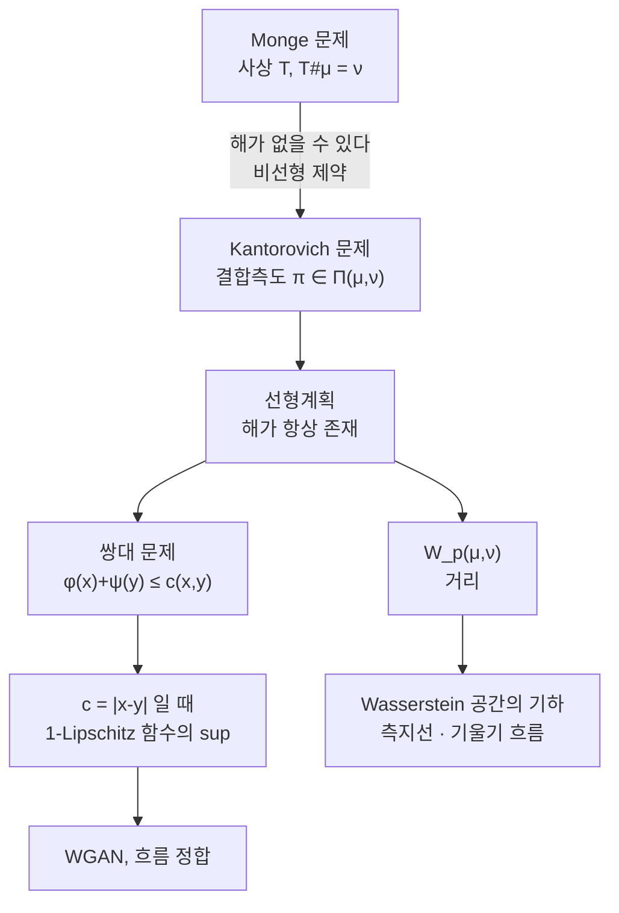

# 최적 수송과 Wasserstein 거리

# 개요

흙더미 하나를 파서 같은 부피의 구덩이를 메운다. 흙 한 삽을 거리 $d$ 만큼 옮기는 비용이 $d$ 에 비례할 때, 전체 비용을 최소로 하는 계획은 무엇인가. Monge 가 1781 년에 던진 이 질문이 최적 수송 이론의 출발점이다.

수학적으로는 두 확률분포 $\mu,\nu$ 가 주어졌을 때 $\mu$ 를 $\nu$ 로 옮기는 최소 비용을 묻는 것이다. 옮기는 방식을 사상 $T$ 로 쓰면 조건이 [상측도](pushforward-measure.md) 등식 $T_\#\mu=\nu$ 가 된다. 그런데 이 형태의 문제는 해가 아예 없을 수 있다. 한 점에 뭉친 질량을 두 곳으로 나눠야 하는 상황에서 사상은 무력하다.

Kantorovich 의 완화가 문제를 구했다. 사상 대신 **결합측도**를 쓰면 질량을 쪼갤 수 있고, 문제가 선형계획이 되어 해의 존재와 [쌍대성](lagrange-duality.md)이 함께 따라온다. 그렇게 얻은 최소 비용이 확률분포 사이의 거리가 되며, 이것이 Wasserstein 거리다.

$$
W_p(\mu,\nu)=\Big(\inf_{\pi\in\Pi(\mu,\nu)}\int|x-y|^p\,d\pi\Big)^{1/p}
$$

이 거리가 [KL 발산](kl-divergence.md)이나 총변동과 결정적으로 다른 점은 **바닥 공간의 기하를 본다**는 것이다. 지지집합이 겹치지 않는 두 분포에 대해서도 유한한 값을 주고, 얼마나 멀리 떨어져 있는지까지 말해 준다. 생성모형이 최적 수송을 쓰는 이유가 여기에 있다.

# 직관

## Monge 는 왜 부족한가

$\mu=\delta_0$ 이고 $\nu=\frac12(\delta_{-1}+\delta_1)$ 이라 하자. $\mu$ 의 질량은 원점 한 곳에 있고 $\nu$ 는 두 점에 나뉘어 있다. 사상 $T$ 는 원점을 한 곳으로만 보내므로 $T_\#\mu$ 는 언제나 디랙 측도이고, 절대 $\nu$ 가 될 수 없다. **Monge 문제는 실행가능해가 없다.**

한편 상식적으로는 답이 분명하다. 원점의 질량 절반을 $-1$ 로, 절반을 $1$ 로 보내면 되고 비용은 1 이다. 이 "절반씩 보낸다" 를 수학적으로 쓰려면 곱공간 위의 측도가 필요하다.

$$
\pi=\tfrac12\delta_{(0,-1)}+\tfrac12\delta_{(0,1)}
$$

$\pi$ 의 첫 좌표 주변분포가 $\mu$, 둘째 좌표 주변분포가 $\nu$ 다. $\pi(A\times B)$ 가 "$A$ 에서 출발해 $B$ 로 가는 질량" 을 뜻하는 **수송계획**이며, 사상은 $\pi$ 가 그래프 위에 집중된 특수한 경우다.

이 완화의 대가가 없다. 오히려 목적함수가 $\pi$ 에 대해 선형이 되고 실행가능집합 $\Pi(\mu,\nu)$ 가 볼록하고 약위상에서 콤팩트하므로, 최소값이 항상 달성된다.

## 왜 거리로 쓰는가

$\mu=\delta_0$, $\nu=\delta_t$ 를 비교해 보자.

| 측도 | 값 |
|---|---|
| KL 발산 | $\infty$ ($t\ne0$) |
| 총변동 | 2 ($t\ne0$) |
| $W_1$ | $|t|$ |

KL 과 총변동은 $t$ 가 0.001 이든 1000 이든 같은 답을 준다. 지지집합이 어긋난 순간 "완전히 다르다" 로 포화되기 때문이다. $W_1$ 만이 $t\to0$ 일 때 0 으로 간다.

생성모형에서 이 차이가 치명적이다. 생성된 분포와 데이터 분포는 둘 다 고차원 공간의 얇은 다양체 위에 있어 지지집합이 거의 겹치지 않는다. KL 기반 목적함수는 기울기가 죽거나 폭발하고, Wasserstein 기반 목적함수는 "어느 방향으로 얼마나" 를 알려 준다.



## 1 차원에서는 그냥 정렬이다

비용이 $|x-y|$ 의 볼록함수면, 1 차원에서 최적 계획은 **순서를 지키는 것**이다. $\mu$ 의 $u$ 분위수를 $\nu$ 의 $u$ 분위수로 보내면 된다.

이유는 교환 논증이다. 두 쌍이 교차한다면($x_1<x_2$ 인데 $y_1>y_2$) 목적지를 맞바꿔 비용을 줄일 수 있다. 볼록성이 정확히 이 부등식을 보장한다. 그래서 1 차원 문제는 정렬만으로 풀리고 닫힌 공식이 나온다.

$$
W_p(\mu,\nu)^p=\int_0^1\big|F_\mu^{-1}(u)-F_\nu^{-1}(u)\big|^p\,du
$$

고차원에서는 "순서" 가 없어 이 논증이 통하지 않는다. 그 자리를 메우는 것이 Brenier 정리의 볼록성이다.

# 정의

## Monge 문제와 Kantorovich 문제

비용함수 $c\colon X\times Y\to[0,\infty]$ 를 고정한다.

**Monge 문제.**

$$
\inf_{T:\,T_\#\mu=\nu}\int_Xc\big(x,T(x)\big)\,d\mu(x)
$$

제약 $T_\#\mu=\nu$ 가 $T$ 에 대해 비선형이고, 실행가능해가 없을 수 있다.

**Kantorovich 문제.** $\Pi(\mu,\nu)$ 를 $X\times Y$ 위의 확률측도 가운데 주변분포가 각각 $\mu,\nu$ 인 것들의 집합이라 하자.

$$
\mathrm{OT}_c(\mu,\nu)=\inf_{\pi\in\Pi(\mu,\nu)}\int_{X\times Y}c(x,y)\,d\pi(x,y)
$$

$\Pi(\mu,\nu)$ 는 $\mu\otimes\nu$ 를 포함하므로 비어 있지 않고, 볼록이며 약위상에서 콤팩트하다. $c$ 가 하반연속이면 최소값이 달성된다.

## Wasserstein 거리

$c(x,y)=|x-y|^p$ ($p\ge1$) 로 두고

$$
W_p(\mu,\nu)=\mathrm{OT}_{|x-y|^p}(\mu,\nu)^{1/p}
$$

로 정의한다. $p$ 차 적률이 유한한 확률측도들의 공간 $\mathcal P_p(X)$ 위에서 거리가 된다. 삼각부등식은 결합측도를 이어 붙이는 접합 보조정리로 증명한다.

$W_p$ 는 약수렴을 거리화한다. 정확히는 $W_p(\mu_n,\mu)\to0$ 인 것과 $\mu_n\Rightarrow\mu$ 이면서 $p$ 차 적률이 수렴하는 것이 동치다.

## 쌍대 문제

Kantorovich 문제는 무한차원 선형계획이므로 쌍대가 있다.

$$
\mathrm{OT}_c(\mu,\nu)=\sup\Big\{\int\varphi\,d\mu+\int\psi\,d\nu\ :\ \varphi(x)+\psi(y)\le c(x,y)\Big\}
$$

$\varphi$ 를 "출발지에서 받는 값", $\psi$ 를 "도착지에서 받는 값" 으로 읽으면, 제약은 수송업자가 직접 옮기는 비용보다 더 받을 수 없다는 조건이다. 최적에서 두 값이 같다는 것이 강쌍대성이다.

$c(x,y)=|x-y|$ 인 경우 쌍대가 한 함수로 줄어든다.

$$
W_1(\mu,\nu)=\sup_{\|f\|_{\mathrm{Lip}}\le1}\Big(\int f\,d\mu-\int f\,d\nu\Big)
$$

**Kantorovich–Rubinstein 공식**이라 한다. WGAN 의 판별자가 1-Lipschitz 로 제한되는 이유가 정확히 이것이다. 판별자는 쌍대해 $f$ 를 근사하고 있다.

# 성질

## Brenier 정리

> $c(x,y)=|x-y|^2$ 이고 $\mu$ 가 Lebesgue 측도에 절대연속이면, 최적 계획은 유일하고 어떤 사상 $T$ 의 그래프 위에 집중된다. 게다가 $T=\nabla\varphi$ 로 $\varphi$ 는 볼록함수다.

Monge 문제가 복원될 뿐 아니라 최적 사상의 형태까지 결정된다. 볼록함수의 기울기라는 조건은 사상이 "순서를 지킨다" 는 1 차원 직관의 고차원 판이다. 실제로 1 차원에서 볼록함수의 도함수는 단조증가함수이고, 그것이 분위수 사상이다.

$T=\nabla\varphi$ 를 $T_\#\mu=\nu$ 에 대입하면 Monge–Ampère 방정식

$$
\det\big(D^2\varphi(x)\big)=\frac{f(x)}{g(\nabla\varphi(x))}
$$

이 나온다. 최적 수송이 완전 비선형 타원 편미분방정식과 만나는 지점이며, 정칙성 이론은 그 자체로 큰 분야다.

## 이산 문제는 선형계획이다

$\mu=\sum_ia_i\delta_{x_i}$, $\nu=\sum_jb_j\delta_{y_j}$ 면 문제가 유한차원 선형계획이 된다.

$$
\min_{P\ge0}\sum_{ij}C_{ij}P_{ij}\quad\text{s.t.}\quad P\mathbf1=a,\ P^\top\mathbf1=b
$$

실행가능영역이 수송 다면체다. $a=b=\frac1n\mathbf1$ 이면 이중확률행렬의 집합이고, Birkhoff–von Neumann 정리에 따라 그 꼭짓점이 정확히 순열행렬이다. 선형계획의 최적해가 꼭짓점에서 달성되므로 **최적 계획을 순열 하나로 잡을 수 있다**. 질량을 쪼갤 수 있게 완화했는데 결국 쪼개지 않아도 되는 것이다.

이 경우가 할당 문제이며 Hungarian 알고리즘이 $O(n^3)$ 에 푼다. 쌍대변수 $\varphi_i,\psi_j$ 가 Lagrange 승수이고 상보여유조건이 $P_{ij}>0\Rightarrow\varphi_i+\psi_j=C_{ij}$ 다.

## 엔트로피 정규화와 Sinkhorn

선형계획은 정확하지만 느리고 미분가능하지 않다. 엔트로피 항을 더하면 둘 다 해결된다.

$$
\min_{P\in\Pi(a,b)}\ \langle C,P\rangle+\varepsilon\sum_{ij}P_{ij}\big(\log P_{ij}-1\big)
$$

목적함수가 강볼록이라 해가 유일하고, 최적성 조건을 풀면 해가

$$
P=\mathrm{diag}(u)\,K\,\mathrm{diag}(v),\qquad K_{ij}=e^{-C_{ij}/\varepsilon}
$$

꼴임이 나온다. 남은 것은 $u,v$ 를 주변분포 조건에 맞추는 일이고, 두 조건을 번갈아 강제하는 것이 **Sinkhorn 반복**이다. 행렬-벡터 곱만 쓰므로 GPU 에서 빠르고, 반복 전체가 미분가능해 신경망 손실함수로 쓸 수 있다.

대가는 편향이다. $\varepsilon>0$ 이면 해가 퍼져서 비용이 실제 $W$ 보다 크게 나온다. $\varepsilon\to0$ 에서 참값으로 수렴하지만 $K$ 가 수치적으로 무너지므로 로그영역 계산이 필요하다.

## Wasserstein 공간의 기하

$(\mathcal P_2(\mathbb R^d),W_2)$ 는 측지 거리공간이다. $\mu$ 에서 $\nu$ 로 가는 측지선은 최적 사상을 따라 선형보간하는 것이다.

$$
\mu_t=\big((1-t)\,\mathrm{id}+tT\big)_\#\mu
$$

**변위 보간**이라 한다. 두 밀도를 값으로 섞는 $(1-t)\mu+t\nu$ 와 전혀 다르다. 값 보간은 디랙 둘을 섞어 봉우리 두 개를 만들지만, 변위 보간은 봉우리 하나를 옮긴다. 이미지나 분포의 "형태" 를 섞을 때 후자가 원하는 결과를 준다.

Otto 는 여기서 더 나아가 $\mathcal P_2$ 를 무한차원 Riemann 다양체로 보았다. 그러면 열방정식이 엔트로피의 $W_2$ 기울기 흐름이 되고, Fokker–Planck 방정식이 자유에너지의 기울기 흐름이 된다. 확산 과정을 분포 공간 위의 경사하강으로 읽는 관점이며, 부등식의 증명과 생성모형의 설계 양쪽에 쓰인다.

# 활용

## 정렬과 Sinkhorn 을 직접 확인한다

```python
import math, random
from itertools import permutations

random.seed(0)
n = 7
xs = sorted(random.uniform(0, 1) for _ in range(n))
ys = [random.uniform(0, 1) for _ in range(n)]

def cost(perm, p):
    """i 번 점을 perm[i] 번 점으로 보내는 계획의 평균 비용."""
    return sum(abs(xs[i] - ys[perm[i]])**p for i in range(n)) / n

for p in (1, 2):
    brute = min(cost(s, p) for s in permutations(range(n)))     # n! 개 전수탐색
    order = sorted(range(n), key=lambda j: ys[j])               # 단조 재배열
    print(f"p={p}: 전수탐색 {brute:.10f}   정렬 {cost(order, p):.10f}"
          f"   같음 {abs(brute - cost(order, p)) < 1e-12}")

def sinkhorn(C, a, b, eps, iters):
    """엔트로피 정규화 최적 수송. P = diag(u) K diag(v) 의 u, v 를 번갈아 맞춘다."""
    K = [[math.exp(-c/eps) for c in row] for row in C]
    u, v = [1.0]*len(a), [1.0]*len(b)
    for _ in range(iters):
        u = [a[i] / sum(K[i][j]*v[j] for j in range(len(b))) for i in range(len(a))]
        v = [b[j] / sum(K[i][j]*u[i] for i in range(len(a))) for j in range(len(b))]
    P = [[u[i]*K[i][j]*v[j] for j in range(len(b))] for i in range(len(a))]
    return sum(P[i][j]*C[i][j] for i in range(len(a)) for j in range(len(b)))

C = [[abs(xs[i] - ys[j])**2 for j in range(n)] for i in range(n)]
a = b = [1/n]*n
exact = min(cost(s, 2) for s in permutations(range(n)))
print(f"\n정확한 W₂² = {exact:.8f}")
for eps in (0.1, 0.01, 0.003, 0.001):
    val = sinkhorn(C, a, b, eps, 3000)
    print(f"  Sinkhorn ε={eps:<6} 비용 {val:.8f}   편향 {val - exact:+.2e}")

# p=1: 전수탐색 0.0647733609   정렬 0.0647733609   같음 True
# p=2: 전수탐색 0.0070500391   정렬 0.0070500391   같음 True
#
# 정확한 W₂² = 0.00705004
#   Sinkhorn ε=0.1    비용 0.03528543   편향 +2.82e-02
#   Sinkhorn ε=0.01   비용 0.01023282   편향 +3.18e-03
#   Sinkhorn ε=0.003  비용 0.00806095   편향 +1.01e-03
#   Sinkhorn ε=0.001  비용 0.00719793   편향 +1.48e-04
```

$5040$ 개의 순열을 전부 훑어 얻은 답이 정렬 한 번과 정확히 같다. 1 차원 최적 수송이 정렬 문제라는 사실의 확인이다.

Sinkhorn 쪽은 편향이 항상 양수이고 $\varepsilon$ 에 대략 비례해 줄어든다. 엔트로피 항이 계획을 퍼뜨려 비용을 올리기 때문이다. 실무에서 $\varepsilon$ 을 무작정 줄이지 못하므로, 편향을 빼는 Sinkhorn 발산 같은 보정을 함께 쓴다.

## 생성모형

WGAN 은 판별자를 1-Lipschitz 로 제한해 $W_1$ 의 쌍대해를 근사하고, 생성자는 그 값을 줄인다. 기울기 벌점이나 스펙트럴 정규화가 Lipschitz 제약을 구현하는 방법이다.

더 최근의 흐름 기반 모형은 변위 보간을 직접 쓴다. 잡음 분포에서 데이터 분포로 가는 경로를 정해 두고 그 경로의 속도장을 회귀로 학습하는 방식인데, 경로를 최적 수송의 직선 보간으로 잡으면 샘플링에 필요한 적분 단계가 크게 줄어든다. [확산모형](diffusion-models.md)이 확률미분방정식의 역과정을 학습하는 것과 달리, 목표 경로를 미리 고정해 학습을 단순화하는 접근이다.

## 통계와 응용

- **분포 비교.** 두 표본이 같은 분포에서 왔는지 검정할 때 $W_1$ 을 통계량으로 쓴다. 1 차원에서는 분위수 차이의 적분이라 계산이 즉시 끝난다.
- **barycenter.** 여러 분포의 $W_2$ 가중평균을 정의할 수 있다. 값 평균이 봉우리를 여러 개 만드는 반면 barycenter 는 형태를 평균한다. 이미지 보간, 색 전이, 모양 평균에 쓰인다.
- **도메인 적응.** 원천 도메인과 목표 도메인의 특징 분포를 최적 수송으로 정렬한 뒤 레이블을 옮긴다.
- **경제학.** 원래 Kantorovich 의 동기가 자원 배분이었고, 쌍대변수가 가격으로 해석된다. 안정 결혼과 매칭 시장 이론에도 같은 쌍대성이 나타난다.

# 연관 문서

## 선수지식

- [상측도와 확률분포](pushforward-measure.md)
- [Lagrange 쌍대성과 KKT 조건](lagrange-duality.md)

## 더 알아보기

- [흐름 정합](flow-matching.md)
- [Sinkhorn 알고리즘과 엔트로피 정규화](sinkhorn.md)
- [Wasserstein 기울기 흐름](wasserstein-gradient-flow.md)

#optimization #probability #measure_theory #machine_learning
