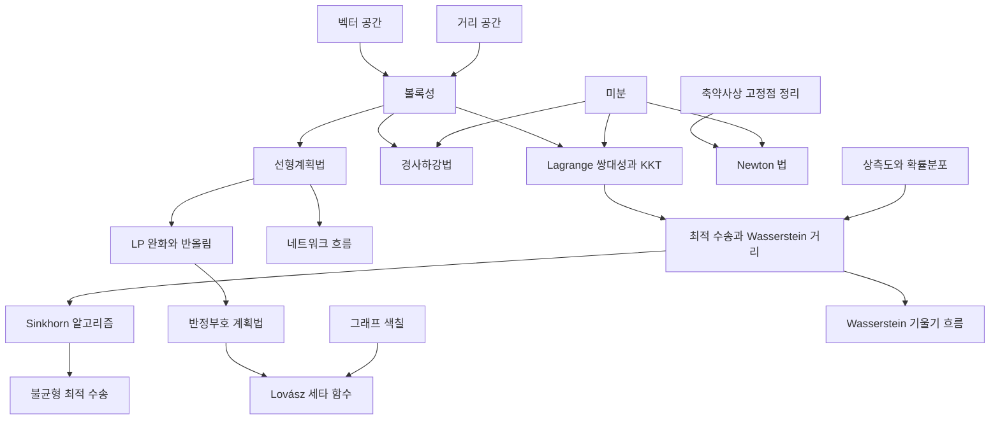

# 최적화 개관

# 개요

최적화는 제약 아래에서 목적함수를 최소화하는 문제를 다룬다. 물음은 "국소 최적해가 전역 최적해인가, 그리고 최적해를 몇 번의 반복으로 찾는가" 이고, 답을 가르는 조건이 볼록성이다. 볼록 문제에서는 두 물음이 모두 풀리고, 볼록하지 않으면 둘 다 일반적으로 어렵다.

최적화 문서는 네 줄기다. 볼록성과 쌍대성의 이론, 반복법으로 해를 찾는 알고리즘, 조합 문제를 완화해 푸는 선형·반정부호 계획법, 그리고 확률분포 사이의 거리를 최소화하는 최적 수송이다. 근사 알고리즘의 복잡도 쪽은 [PCP 정리](pcp-theorem.md)와 [유일게임 추측](unique-games.md)에 있다.

시작은 [볼록성](convexity.md)이다. 거기서 [Lagrange 쌍대성과 KKT 조건](lagrange-duality.md)이 이론의 축으로, [경사하강법](gradient-descent.md)이 알고리즘의 축으로, [선형계획법](linear-programming.md)이 조합 최적화의 축으로 갈라진다.

# 지도

# 갈래

## 볼록성과 쌍대성

- [볼록성](convexity.md): 볼록집합과 볼록함수, 국소 최적해가 전역 최적해가 되는 조건
- [Lagrange 쌍대성과 KKT 조건](lagrange-duality.md): 제약을 쌍대변수로 옮기는 변환과 최적성 조건

## 반복 알고리즘

- [경사하강법](gradient-descent.md): 기울기 방향의 1 차 방법과 그 수렴률
- [Newton 법](newton-method.md): 2 차 정보를 쓰는 국소 이차수렴

## 선형·반정부호 계획법

- [선형계획법](linear-programming.md): 다면체 위의 선형 목적함수, 꼭짓점 최적성과 쌍대성
- [반정부호 계획법과 최대 절단](semidefinite-programming.md): 반정부호 행렬 위의 완화와 Goemans–Williamson 알고리즘
- [Lovász 세타 함수](lovasz-theta.md): 독립수와 채색수 사이에 끼는 반정부호 계획값

## 최적 수송

- [최적 수송과 Wasserstein 거리](optimal-transport.md): 분포를 옮기는 최소 비용과 Kantorovich 쌍대성
- [Sinkhorn 알고리즘과 엔트로피 정규화](sinkhorn.md): 엔트로피 항을 더해 행렬 스케일링으로 푼다
- [불균형 최적 수송](unbalanced-optimal-transport.md): 질량이 보존되지 않는 경우로의 확장
- [Wasserstein 기울기 흐름](wasserstein-gradient-flow.md): 확률분포 공간 위의 기울기 흐름과 Fokker–Planck 방정식

# 연관 문서

## 선수지식

- [집합](sets.md)

## 더 알아보기

- [볼록성](convexity.md)
- [Newton 법](newton-method.md)

#optimization #analysis #algorithms #overview
