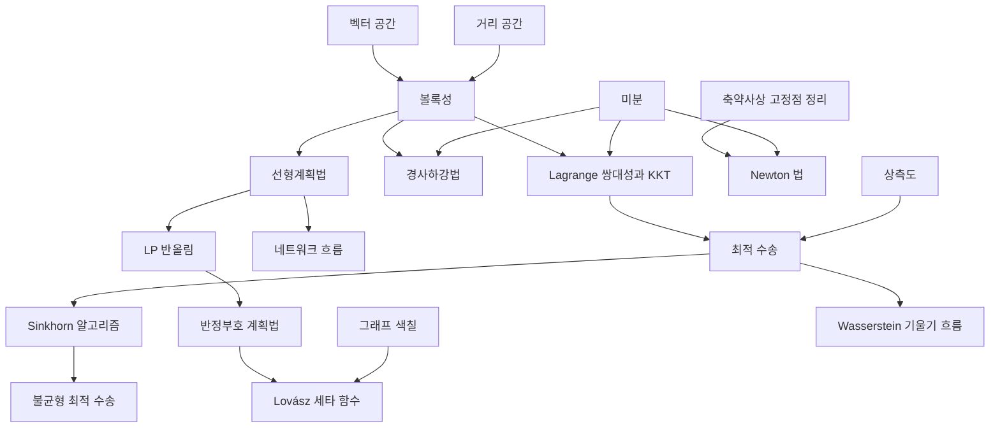

# 최적화 개관

# 개요

최적화는 제약 아래에서 목적함수를 최소화하는 문제를 다룬다. 물음은 "국소 최적해가 전역 최적해인가, 그리고 최적해를 몇 번의 반복으로 찾는가" 이고, 답을 가르는 조건이 볼록성이다. 볼록 문제에서는 두 물음이 모두 풀리고, 볼록하지 않으면 둘 다 일반적으로 어렵다.

최적화의 갈래는 네 줄기다. 볼록성과 쌍대성의 이론, 반복법으로 해를 찾는 알고리즘, 조합 문제를 완화해 푸는 선형·반정부호 계획법, 그리고 확률분포 사이의 거리를 최소화하는 최적 수송이다. 근사 알고리즘의 복잡도 쪽은 [PCP 정리](pcp-theorem.md)(probabilistically checkable proof)와 [유일게임 추측](unique-games.md)에 있다.

시작은 [볼록성](convexity.md)이다. 거기서 [Lagrange 쌍대성](lagrange-duality.md)이 이론의 축으로, [경사하강법](gradient-descent.md)이 알고리즘의 축으로, [선형계획법](linear-programming.md)이 조합 최적화의 축으로 갈라진다.

# 지도

```mermaid
graph TD
  VS["벡터 공간"] --> CX["볼록성"]
  MS["거리 공간"] --> CX
  CX --> LD["Lagrange 쌍대성과 KKT"]
  CX --> GD["경사하강법"]
  CX --> LP["선형계획법"]
  DV["미분"] --> LD
  DV --> GD
  BF["축약사상 고정점 정리"] --> NM["Newton 법"]
  DV --> NM
  LP --> LR["LP 반올림"]
  LP --> NF["네트워크 흐름"]
  LR --> SD["반정부호 계획법"]
  SD --> LT["Lovász 세타 함수"]
  GC["그래프 색칠"] --> LT
  LD --> OT["최적 수송"]
  PM["상측도"] --> OT
  OT --> SK["Sinkhorn 알고리즘"]
  SK --> UO["불균형 최적 수송"]
  OT --> WG["Wasserstein 기울기 흐름"]
```

# 갈래

## 볼록성과 쌍대성

- [볼록성](convexity.md): 볼록집합과 볼록함수, 국소 최적해가 전역 최적해가 되는 조건
- [준볼록 함수](quasiconvex-functions.md): 수준집합만 볼록인 함수, 이분 탐색으로 푸는 최소화
- [볼록 공액](convex-conjugate.md): 함수를 받침 아핀 함수의 모임으로 바꾸는 변환, Fenchel–Moreau 정리
- [Lagrange 쌍대성](lagrange-duality.md): 제약을 쌍대변수로 옮기는 변환과 최적성 조건
- [압축 센싱](compressed-sensing.md): 미지수보다 적은 측정에서 희소해를 복원하는 $\ell\_1$ 최소화, 제한 등거리 성질

## 반복 알고리즘

- [경사하강법](gradient-descent.md): 기울기 방향의 1 차 방법과 그 수렴률
- [Nesterov 가속법](nesterov-acceleration.md): 직전 변위를 더해 조건수 의존을 제곱근으로 낮추는 1 차 방법
- [근접 경사법](proximal-gradient-method.md): 미분 불가능한 볼록 항을 근접 연산자로 처리하는 반복, 연성 문턱과 ISTA(iterative shrinkage-thresholding algorithm)
- [확률적 경사하강법](stochastic-gradient-descent.md): 기울기를 표본으로 추정하는 반복, 잡음 구간과 보폭 일정
- [적응적 경사 방법](adaptive-gradient-methods.md): 좌표별 기울기 제곱의 누적으로 보폭을 나누는 AdaGrad, RMSProp, Adam
- [분산 축소 경사법](variance-reduced-gradient-methods.md): 항별 기울기를 기억해 추정량의 분산을 없애는 SVRG 와 SAGA
- [Kiefer–Wolfowitz 절차](kiefer-wolfowitz.md): 함숫값만 관측할 때 차분으로 기울기를 흉내 내는 반복, 동시 섭동과 $t^{-1/3}$ 수렴
- [Newton 법](newton-method.md): 2 차 정보를 쓰는 국소 이차수렴
- [준Newton 법](quasi-newton-methods.md): secant 조건으로 Hessian 근사를 갱신하는 BFGS 와 L-BFGS, 초선형 수렴

## 선형·반정부호 계획법

- [선형계획법](linear-programming.md): 다면체 위의 선형 목적함수, 꼭짓점 최적성과 쌍대성
- [정수계획법](integer-programming.md): 정수 조건을 더한 선형계획, 분기한정과 절단평면
- [Chvátal 계수](chvatal-rank.md): 절단평면을 몇 번 반복해야 정수 껍질에 닿는지 재는 값
- [완전 단일모듈 행렬](totally-unimodular-matrices.md): 선형 완화가 정수해를 주는 제약행렬, Hoffman-Kruskal 정리와 Ghouila-Houri 판정
- [반정부호 계획법](semidefinite-programming.md): 반정부호 행렬 위의 완화와 Goemans–Williamson 알고리즘
- [Lovász 세타 함수](lovasz-theta.md): 독립수와 채색수 사이에 끼는 반정부호 계획값
- [내점법](interior-point-method.md): 경계에서 발산하는 장벽을 더해 내부를 지나는 다항시간 해법

## 게임과 균형

- [Nash 균형](nash-equilibrium.md): 전략형 게임의 혼합전략 균형, 고정점 논증과 minimax 값, 계산의 복잡도
- [상관균형](correlated-equilibrium.md): 공통 신호를 보고 행동을 고르는 균형, 선형계획 표현과 후회 최소화의 수렴

## 최적 수송

- [최적 수송](optimal-transport.md): 분포를 옮기는 최소 비용과 Kantorovich 쌍대성
- [Sinkhorn 알고리즘](sinkhorn.md): 엔트로피 항을 더해 행렬 스케일링으로 푼다
- [불균형 최적 수송](unbalanced-optimal-transport.md): 질량이 보존되지 않는 경우로의 확장
- [Wasserstein 기울기 흐름](wasserstein-gradient-flow.md): 확률분포 공간 위의 기울기 흐름과 Fokker–Planck 방정식

# 연관 문서

## 선수지식

- [집합](sets.md)

## 더 알아보기

- [볼록성](convexity.md)
- [Newton 법](newton-method.md)

#optimization #analysis #algorithms #overview
