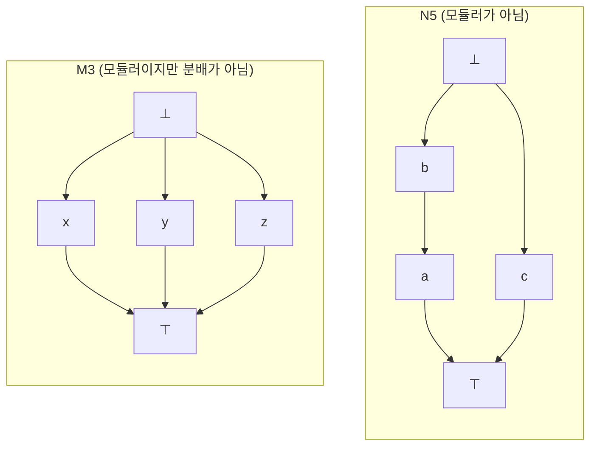

# 순서론의 격자

# 개요

격자는 두 원소마다 상한과 하한이 있는 [부분순서](partial-orders.md)집합이다. 멱집합의 합집합과 교집합, 정수의 최소공배수와 최대공약수, 명제의 이접과 합취가 모두 이 꼴이다.

격자는 순서로도 대수로도 정의된다. 순서 쪽에서는 $x \vee y$ 와 $x \wedge y$ 가 상한과 하한이고, 대수 쪽에서는 두 이항연산이 결합법칙, 교환법칙, 흡수법칙을 만족한다. 두 정의는 동치이므로 격자는 순서 구조인 동시에 대수 구조다.

분배법칙을 요구하면 분배격자가 되고, 여기에 보원을 더하면 [Boolean algebra](boolean-algebras.md), 보원 대신 상대 유사보원을 더하면 [Heyting algebra](heyting-algebras.md)가 된다. 모든 부분집합이 상한과 하한을 가지는 완비 격자는 [Galois 연결](galois-connections.md)에서 다룬다.

# 직관

분배법칙의 성립 여부가 격자를 두 부류로 가른다. 집합의 합집합과 교집합은 서로 분배하지만, 벡터 공간의 부분공간을 합과 교집합으로 순서지으면 분배법칙이 깨진다. 평면에서 서로 다른 세 직선 $A$ , $B$ , $C$ 를 원점을 지나는 1차원 부분공간으로 잡으면 $A \wedge (B \vee C) = A$ 이고 $(A \wedge B) \vee (A \wedge C) = 0$ 이다.

분배법칙이 깨지는 방식은 두 가지뿐이다. 부분공간 격자처럼 모듈러 법칙은 남기는 경우와, 모듈러 법칙까지 깨지는 경우다. 이 두 가지가 아래 M3, N5 판정 정리의 내용이다.

# 정의

## 순서 정의

부분순서집합 $L$ 의 임의의 두 원소 $x$ , $y$ 가 상한 $x \vee y$ 와 하한 $x \wedge y$ 를 가지면 $L$ 은 **격자**다. $\vee$ 를 이음, $\wedge$ 를 만남이라 한다.

유한 격자에는 최대 원소 $\top$ 과 최소 원소 $\bot$ 이 있다. 무한 격자에는 없을 수 있고, 있으면 **유계 격자**라 한다.

## 대수 정의

집합 $L$ 과 두 이항연산 $\vee$ , $\wedge$ 가 다음을 만족하면 격자다.

$$
x \vee y = y \vee x, \qquad x \wedge y = y \wedge x
$$

$$
(x \vee y) \vee z = x \vee (y \vee z), \qquad (x \wedge y) \wedge z = x \wedge (y \wedge z)
$$

$$
x \vee (x \wedge y) = x, \qquad x \wedge (x \vee y) = x
$$

마지막 줄이 흡수법칙이다. 흡수법칙에서 멱등성 $x \vee x = x$ 와 $x \wedge x = x$ 가 따라온다.

## 두 정의의 동치

**정리.** 순서 정의와 대수 정의는 같은 대상을 준다.

*증명의 요지.* 순서에서 대수로는 상한과 하한의 정의에서 세 법칙을 확인하면 된다. 대수에서 순서로는

$$
x \le y \iff x \wedge y = x
$$

로 두면 흡수법칙에서 $x \wedge y = x$ 와 $x \vee y = y$ 가 동치이고, 이 관계가 반사적, 반대칭적, 추이적이며 $x \vee y$ 와 $x \wedge y$ 가 그 순서의 상한과 하한이 된다. ∎

## 분배격자와 모듈러 격자

격자 $L$ 이 **분배격자**라는 것은 모든 $x$ , $y$ , $z$ 에 대해 다음이 성립한다는 뜻이다.

$$
x \wedge (y \vee z) = (x \wedge y) \vee (x \wedge z)
$$

이 등식과 $\vee$ , $\wedge$ 를 바꾼 등식은 서로 동치이므로 하나만 요구하면 된다.

$L$ 이 **모듈러 격자**라는 것은 $x \le z$ 일 때마다 다음이 성립한다는 뜻이다.

$$
x \vee (y \wedge z) = (x \vee y) \wedge z
$$

분배격자는 모듈러 격자이고 역은 성립하지 않는다.

## 격자 준동형

사상 $h : L \to M$ 이 $h(x \vee y) = h(x) \vee h(y)$ 와 $h(x \wedge y) = h(x) \wedge h(y)$ 를 만족하면 **격자 준동형**이다. 격자 준동형은 순서를 보존하지만, 순서를 보존하는 사상이 모두 격자 준동형인 것은 아니다.

# 성질

## M3–N5 판정 정리

**정리 (Dedekind, Birkhoff).** 격자 $L$ 에 대해 다음이 성립한다.

1. $L$ 이 모듈러일 필요충분조건은 $L$ 이 $N_5$ 와 동형인 부분격자를 가지지 않는 것이다.
2. $L$ 이 분배격자일 필요충분조건은 $L$ 이 $M_3$ 또는 $N_5$ 와 동형인 부분격자를 가지지 않는 것이다.

$N_5$ 는 다섯 원소 격자 $\lbrace \bot, a, b, c, \top\rbrace$ 에서 $b \lt a$ 이고 $c$ 가 $a$ , $b$ 와 비교되지 않는 것이다. $M_3$ 는 $\bot$ 과 $\top$ 사이에 서로 비교되지 않는 원소 셋이 놓인 격자다.

*증명의 요지.* 두 격자가 각각 모듈러 법칙과 분배법칙을 깨뜨리므로 필요성은 자명하다. 충분성은 법칙이 깨지는 원소 쌍에서 다섯 원소를 골라 부분격자를 직접 구성한다. 분배법칙이 깨질 때 $(x\wedge y)\vee(x\wedge z)$ 와 $x\wedge(y\vee z)$ 를 두 끝으로 잡으면 $M_3$ 나 $N_5$ 가 나온다. ∎

벡터 공간의 부분공간 격자는 모듈러이지만 분배가 아니다. 서로 다른 세 1차원 부분공간이 $M_3$ 를 이루기 때문이다. 군의 부분군 격자는 일반적으로 모듈러도 아니고, 정규부분군 격자는 모듈러다.

## Birkhoff 표현 정리

**정리.** 유한 분배격자 $L$ 은 어떤 유한 부분순서집합 $P$ 의 하향닫힌 집합족과 동형이다. 이때 $P$ 는 $L$ 의 이음기약 원소들을 $L$ 의 순서로 제한한 것이다.[^1]

원소 $p \ne \bot$ 이 **이음기약**이라는 것은 $p = x \vee y$ 이면 $p = x$ 또는 $p = y$ 라는 뜻이다.

*증명의 요지.* $x \in L$ 에 $\lbrace p \in P : p \le x\rbrace$ 를 대응시킨다. 분배법칙에서 이 대응이 이음과 만남을 보존하고, 유한성에서 모든 원소가 자기 아래의 이음기약 원소들의 이음이 되어 단사이며, 하향닫힌 집합족의 원소가 모두 상에 나타나 전사다. ∎

역방향으로 유한 부분순서집합 $P$ 에서 하향닫힌 집합족을 만들면 유한 분배격자가 나오므로, 유한 분배격자와 유한 부분순서집합이 서로 번역된다. [Boolean algebra](boolean-algebras.md)의 Stone 표현 정리는 $P$ 가 반사슬일 때의 경우다.

## 쌍대성

격자의 순서를 뒤집으면 $\vee$ 와 $\wedge$ 가 바뀌고 격자 공리는 그대로 성립한다. 격자에 관한 정리는 두 연산을 맞바꾼 정리를 짝으로 가진다. 분배법칙의 두 형태가 동치인 것이 그 예다.

## 사슬 조건과 차수

모듈러 격자에서 $x$ 와 $y$ 를 잇는 극대사슬은 길이가 모두 같다. 이 성질을 Jordan–Hölder 조건이라 하고, 여기서 차수 함수 $r$ 이 정해져 다음을 만족한다.

$$
r(x) + r(y) = r(x \vee y) + r(x \wedge y)
$$

[벡터 공간](vector-spaces.md)의 부분공간에서 이 등식이 차원 공식이고, 군의 조성열 길이가 유일하다는 Jordan–Hölder 정리도 같은 형태다.

# 활용

## 대수 구조의 부분대상

군의 부분군, 환의 [아이디얼](ideals-quotient-rings.md), 벡터 공간의 부분공간은 각각 격자를 이룬다. 두 부분대상의 만남은 교집합이고 이음은 둘을 포함하는 최소 부분대상이다. 이 격자가 분배인지 모듈러인지가 구조의 성질을 반영한다. [가군](modules.md)의 부분가군 격자는 모듈러이고, 이것이 Jordan–Hölder 정리의 배경이다.

## 논리의 대수

명제를 함의로 순서지으면 이접이 이음, 합취가 만남이다. 고전 명제논리의 Lindenbaum–Tarski 대수가 [Boolean algebra](boolean-algebras.md)이고, 직관주의 명제논리의 것이 [Heyting algebra](heyting-algebras.md)다. 두 구조 모두 분배격자이며, 차이는 보원을 요구하는지에 있다.

## 정적 분석의 추상 영역

[추상해석](abstract-interpretation.md)에서 추상 영역은 격자이고, 분기의 합류점에서 두 갈래의 정보를 이음으로 합친다. 구간 영역, 부호 영역, 다면체 영역이 모두 격자로 설계된다.

## 형식 개념 분석

객체와 속성의 표에서 닫힌 쌍들이 이루는 개념 격자는 [Galois 연결](galois-connections.md)의 고정점으로 얻어지며 완비 격자다.

[^1]: G. Birkhoff, *Lattice Theory*, 3rd ed., American Mathematical Society, 1967. 유한 분배격자의 표현 정리.

# 연관 문서

## 선수지식

- [부분순서](partial-orders.md)

## 더 알아보기

- [Boolean algebra](boolean-algebras.md)
- [Heyting algebra](heyting-algebras.md)

#order_theory #algebra #logic
