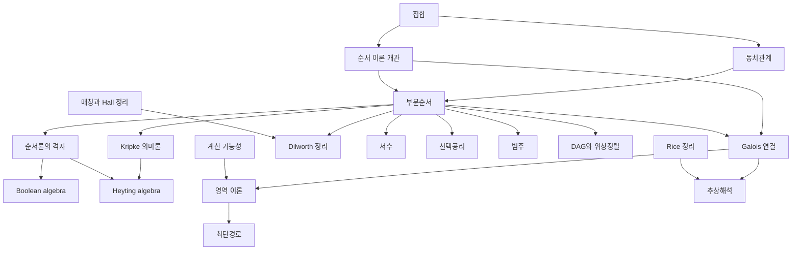

# 순서 이론 개관

# 개요

순서 이론은 비교 관계 하나만 가진 구조를 다룬다. 원소 사이에 $x \le y$ 가 정의되고 반사성, 반대칭성, 추이성만 요구한다. 두 원소가 비교되지 않아도 되므로 집합의 포함, 정수의 나눔, 작업의 의존, 명제의 함의가 모두 같은 틀에 들어간다.

[부분순서](partial-orders.md)에서 시작한다. 여기서 세 방향으로 갈린다. 상한과 하한을 늘 가지도록 요구하면 [순서론의 격자](order-lattices.md)가 되고, 여기에 보수나 함의를 얹으면 [Boolean algebra](boolean-algebras.md)와 [Heyting algebra](heyting-algebras.md)가 되어 고전 논리와 직관주의 논리의 대수적 대응물을 준다. 순서를 보존하는 사상의 쌍을 보면 [Galois 연결](galois-connections.md)이 되고, 그 고정점에서 [영역 이론](domain-theory.md)과 [추상해석](abstract-interpretation.md)이 나온다. 순서집합을 사슬과 반사슬로 쪼개면 [Dilworth 정리](dilworth-theorem.md)의 조합론이 된다.

순서는 범주의 특수한 경우이기도 하다. 사상이 각 쌍마다 최대 하나인 범주가 부분순서집합이다. 그 위의 수반이 Galois 연결이고 상한과 하한이 쌍대극한과 극한이다.

# 지도

# 갈래

## 순서의 기초

- [동치관계](equivalence-relations.md) — 반사성, 대칭성, 추이성. 대칭성을 반대칭성으로 바꾸면 순서가 된다
- [부분순서](partial-orders.md) — 반사슬, 사슬, Hasse 도형, 상한과 하한, 극대원소와 최대원소의 구별
- [DAG와 위상정렬](dag-topological.md) — 유한 부분순서를 방향 비순환 그래프(directed acyclic graph, DAG)로 실현하고 선형 확장을 계산한다

## 격자와 논리의 대수

- [순서론의 격자](order-lattices.md) — 순서 정의와 대수 정의의 동치, 분배격자와 모듈러 격자, Birkhoff 표현 정리
- [Boolean algebra](boolean-algebras.md) — 보수를 가지는 분배 격자. Stone 표현 정리가 이 구조를 집합의 부분집합족으로 되돌린다
- [직관주의 논리의 Kripke 의미론](kripke-semantics.md) — 부분순서를 시간이나 정보의 증가로 읽는 모형
- [Heyting algebra](heyting-algebras.md) — 함의를 만남 연산의 오른쪽 수반으로 얹은 격자. 배중률만 빠진다

## 수반과 고정점

- [Galois 연결과 완비 격자](galois-connections.md) — 순서 보존 사상의 쌍과 Knaster–Tarski 고정점 정리
- [영역 이론과 Kleene 고정점 정리](domain-theory.md) — 재귀 정의의 의미를 최소 고정점으로 주는 틀
- [추상해석과 정적 분석의 건전성](abstract-interpretation.md) — 구체 의미론과 추상 영역을 Galois 연결로 잇고 과대근사의 건전성을 얻는다

## 순서의 조합론

- [Dilworth 정리](dilworth-theorem.md) — 최소 사슬 덮개의 크기와 최대 반사슬의 크기가 같다는 최소최대 정리

## 집합론과 범주론과의 접점

- [선택공리와 Zorn 보조정리](axiom-of-choice.md) — 사슬마다 상계가 있으면 극대원소가 있다는 형태로 순서를 쓴다
- [서수와 초한귀납법](ordinals.md) — 정렬순서, 곧 모든 비어 있지 않은 부분집합이 최소원소를 가지는 전순서
- [범주](category.md) — 사상이 각 쌍마다 최대 하나인 범주가 부분순서집합이다
- [수반](adjunctions.md) — Galois 연결을 사상의 집합 사이 전단사로 승격시킨 것

# 연관 문서

## 선수지식

- [집합](sets.md)

## 더 알아보기

- [부분순서](partial-orders.md)
- [Galois 연결과 완비 격자](galois-connections.md)

#order_theory #logic #set_theory #overview
