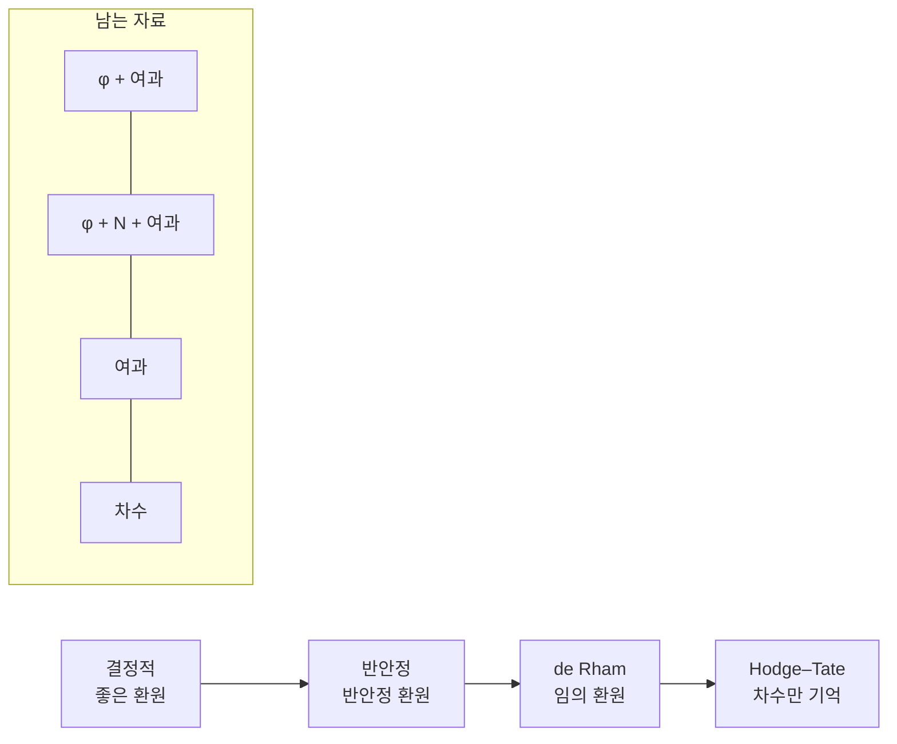

# p 진 Hodge 이론과 Fontaine 주기환

# 개요

[Galois 표현](galois-representations.md)에서 에탈 코호몰로지가 $\ell$ 진 표현을 대량으로 공급하는 것을 보았다. 그 표현들을 국소적으로, 즉 [국소체](local-class-field-theory.md) $K/\mathbb Q_p$ 의 절대 Galois 군 $G_K=\mathrm{Gal}(\bar K/K)$ 위에서 분류하려 할 때 $\ell\ne p$ 와 $\ell=p$ 사이에 건널 수 없는 골이 나타난다.

$\ell\ne p$ 쪽은 사실상 끝난 이야기다. Grothendieck 의 준안정 정리가 $\ell$ 진 표현의 관성 작용을 유한 자료로 압축해 버린다. $\ell=p$ 쪽은 그렇지 않다. $G_K$ 의 $p$ 진 표현은 연속성이 거의 제약을 주지 않아 무한히 많은 모양으로 존재하고, 그 가운데 기하에서 오는 것을 가려낼 방법이 없다.

Fontaine 의 착상은 **표현을 바꾸지 말고 계수를 키우자**는 것이다. $G_K$ 가 작용하는 거대한 위상환 $B$ 를 하나 잡고

$$
D_B(V)=(B\otimes_{\mathbb Q_p}V)^{G_K}
$$

를 본다. $B$ 를 잘 고르면 $G_K$ 작용이 이 불변식을 취하는 과정에서 상쇄되고, 남은 $D_B(V)$ 는 Frobenius 나 여과 같은 **선형대수 자료**만 갖는다. 표현의 범주가 훨씬 다루기 쉬운 범주로 옮겨 가는 것이다. 이런 $B$ 를 주기환(period ring)이라 하고, $\mathbb Q_p\subset B_{\mathrm{HT}},B_{\mathrm{dR}},B_{\mathrm{st}},B_{\mathrm{cris}}$ 의 사슬이 표현의 네 가지 등급을 정의한다.

이름에 Hodge 가 붙은 것은 우연이 아니다. 복소다양체에서 de Rham 코호몰로지와 특이 코호몰로지를 잇는 비교동형은 $\mathbb Q$ 위에서는 성립하지 않고 $\mathbb C$ 로 계수를 올려야 하며, 그 동형의 행렬 성분이 주기다. $p$ 진 세계에서 $\mathbb C$ 의 자리에 놓이는 것이 $B_{\mathrm{dR}}$ 이고, $2\pi i$ 의 자리에 놓이는 것이 아래에서 만들 원소 $t$ 다.

# 직관

## $\ell\ne p$ 는 왜 쉬운가

$G_K$ 의 $\ell$ 진 표현 $\rho\colon G_K\to\mathrm{GL}\_n(\mathbb Q_\ell)$ 을 보자. 관성군 $I_K$ 의 야생 부분 $P_K$ 는 프로-$p$ 군이고, 상 $\rho(P_K)$ 는 프로-$\ell$ 군 안의 콤팩트 부분군이다. $p\ne\ell$ 이므로 프로-$p$ 군에서 프로-$\ell$ 군으로 가는 연속 준동형은 상이 유한하다. 야생 관성은 유한한 정보밖에 남기지 못한다.

남은 순한 관성 $I_K/P_K\cong\prod_{\ell'\ne p}\mathbb Z_{\ell'}$ 의 $\ell$ 부분만 실제로 작용하고, Grothendieck 은 열린 부분군 위에서 그 작용이 유니포턴트임을 보였다.

$$
\rho(\sigma)=\exp\big(t_\ell(\sigma)N\big),\qquad N\ \text{멱영}
$$

그래서 $\ell$ 진 표현 하나가 Weil–Deligne 표현 $(r,N)$ 이라는 유한 자료로 환원된다. 결정적으로 이 자료에 $\ell$ 이 등장하지 않는다. 여러 소수에서의 표현을 한 자리에서 비교할 수 있는 것도 이 때문이다.

## $\ell=p$ 에서 무너지는 지점

$p$ 진 표현에서는 같은 논법이 전혀 통하지 않는다. $\rho(P_K)$ 가 프로-$p$ 군 안의 프로-$p$ 군이므로 무한히 클 수 있다. 가장 작은 예를 보자. 1차원 표현은 연속 지표

$$
\chi\colon G_K^{\mathrm{ab}}\cong\widehat{K^\times}\longrightarrow\mathbb Z_p^\times
$$

인데, 국소 유체론이 $K^\times\cong\pi^{\mathbb Z}\times\mathcal O_K^\times$ 를 주고 $\mathcal O_K^\times$ 는 $\mathbb Z_p^{[K:\mathbb Q_p]}$ 를 포함한다. 그러니 연속 지표가 양의 차원의 족을 이룬다. 유한 자료로 압축될 리가 없다.

그런데 이 무한함이 나쁘기만 한 것은 아니다. 기하에서 오는 $p$ 진 표현은 $\ell$ 진 표현보다 **더 많은** 정보를 지니고 있다. 좋은 환원을 가진 다양체의 $\ell$ 진 코호몰로지는 관성이 자명하다는 사실만 말해 주지만, $p$ 진 코호몰로지는 특수 올의 결정 코호몰로지 전체를, Frobenius 와 Hodge 여과까지 포함해 기억한다. 표현이 거칠어 보이는 것은 그 안에 실린 자료를 읽는 언어가 없었기 때문이다. $p$ 진 Hodge 이론은 그 언어다.

## 주기를 계수에 넣는다

복소 쪽 그림을 먼저 그려 보자. $X$ 가 $\mathbb Q$ 위의 매끄러운 사영 다양체일 때 [de Rham 코호몰로지](de-rham-cohomology.md) $H^n_{\mathrm{dR}}(X/\mathbb Q)$ 와 특이 코호몰로지 $H^n(X(\mathbb C),\mathbb Q)$ 는 둘 다 $\mathbb Q$ 위의 벡터공간이고 차원이 같지만 표준적인 동형이 없다. 적분

$$
\langle\omega,\gamma\rangle=\int_\gamma\omega
$$

이 주는 쌍대성은 $\mathbb C$ 로 계수를 올린 뒤에야 동형이 되고, 두 $\mathbb Q$ 구조 사이의 전이행렬 성분이 주기다. 가장 단순한 예가 $\mathbb G_m$ 에서 나오는 $\oint dz/z=2\pi i$ 다.

$p$ 진 유비를 세우면 다음과 같다. 왼쪽에 $G_K$ 가 작용하는 $H^n_{\mathrm{et}}(X_{\bar K},\mathbb Q_p)$ 를 놓고 오른쪽에 여과와 Frobenius 를 가진 $H^n_{\mathrm{dR}}(X/K)$ 를 놓는다. 둘을 잇는 동형은 $K$ 위에서 존재하지 않으며, 두 구조를 모두 담을 만큼 큰 환으로 올려야 한다. 그 환이 $B_{\mathrm{dR}}$ 이다.

$$
B_{\mathrm{dR}}\otimes_K H^n_{\mathrm{dR}}(X/K)\;\cong\;B_{\mathrm{dR}}\otimes_{\mathbb Q_p}H^n_{\mathrm{et}}(X_{\bar K},\mathbb Q_p)
$$

양변에 $G_K$ 가 작용한다. 왼쪽은 $B_{\mathrm{dR}}$ 성분으로만, 오른쪽은 두 성분 모두에. 불변식을 취하면 오른쪽에서 Galois 작용이 사라지고 왼쪽의 $H_{\mathrm{dR}}$ 만 남는다. 이것이 $D_{\mathrm{dR}}$ 의 의미다.

## $2\pi i$ 에 해당하는 원소

$p$ 진 주기 $t$ 를 실제로 만들어 보자. $\zeta_{p^n}$ 을 정합적으로 고른 계 $\varepsilon=(1,\zeta_p,\zeta_{p^2},\dots)$ 에서 출발한다. 형식적으로

$$
t=\log[\varepsilon]
$$

로 쓰는데, $[\varepsilon]$ 은 아래에서 정의할 Teichmüller 올림이고 $\log$ 는 $1$ 근방의 멱급수다. 중요한 것은 Galois 작용이다. $g\in G_K$ 가 $\zeta_{p^n}\mapsto\zeta_{p^n}^{\chi(g)}$ 로 작용하므로

$$
g(t)=\chi(g)\,t
$$

가 되어, $t$ 는 순환지표 $\chi$ 에 대한 고유벡터다. 복소 쪽에서 복소켤레가 $2\pi i\mapsto-2\pi i$ 로 작용하는 것과 정확히 같은 역할이다. $t$ 가 가역인 환에서는 Tate 꼬임 $\mathbb Q_p(1)$ 이 자명해진다. $t^{-1}\otimes e$ 가 불변원소이기 때문이다. 주기환이란 결국 "미리 정해 둔 꼬임들을 자명하게 만드는 계수환" 이다.

## 네 층의 사다리

주기환이 하나가 아닌 이유는, 기하의 환원 상태에 따라 남는 자료가 다르기 때문이다.



왼쪽으로 갈수록 조건이 강하고 남는 선형대수 자료가 풍부하다. 오른쪽 끝의 Hodge–Tate 는 정수 몇 개(무게)만 기억하고, 왼쪽 끝의 결정적은 Frobenius 와 여과를 모두 기억해 표현을 완전히 결정한다.

# 정의

## 허용 환과 Fontaine 함자

$G_K$ 가 작용하는 $\mathbb Q_p$ 대수 $B$ 가 정역이고 $\mathrm{Frac}(B)$ 로의 작용이 그 확장과 정합적이며 $E=B^{G_K}$ 가 체라고 하자. $B$ 가 정칙(regular)이라 함은 $b\in B$ 가 $B^\times$ 를 벗어나는 순간 $E$ 위 유한차원 $G_K$ 안정 부분공간을 생성하지 못한다는 조건, 즉

$$
\big(\mathrm{Frac}(B)\big)^{G_K}=B^{G_K}=E
$$

를 만족하는 상황이다. 이때 임의의 $p$ 진 표현 $V$ (유한차원 $\mathbb Q_p$ 벡터공간 위 연속 작용)에 대해

$$
D_B(V)=(B\otimes_{\mathbb Q_p}V)^{G_K},\qquad \dim_E D_B(V)\le\dim_{\mathbb Q_p}V
$$

가 성립한다. 등호가 성립하면 $V$ 를 **$B$ 허용**이라 부른다. 등호는 자연사상

$$
\alpha_V\colon B\otimes_E D_B(V)\longrightarrow B\otimes_{\mathbb Q_p}V
$$

가 동형인 것과 같고, 이것이 비교동형의 추상적 형태다. $B$ 허용 표현들은 부분표현, 몫, 텐서곱, 쌍대에 닫혀 있어 탄나키안 부분범주를 이룬다.

## $\mathbb C_p$ 와 Hodge–Tate 환

$\mathbb C_p=\widehat{\bar K}$ 를 $\bar K$ 의 $p$ 진 완비화라 하자. Tate 의 계산이 출발점이다.

$$
\mathbb C_p^{G_K}=K,\qquad
H^0(G_K,\mathbb C_p(i))=H^1(G_K,\mathbb C_p(i))=0\quad(i\ne0)
$$

서로 다른 꼬임이 불변식도 확대도 만들지 않는다는 뜻이므로, $\mathbb C_p$ 계수로 올린 뒤 꼬임별로 분해되면 그 분해가 유일하다. 이 성질을 담아 놓은 환이

$$
B_{\mathrm{HT}}=\bigoplus_{i\in\mathbb Z}\mathbb C_p(i)=\mathbb C_p[t,t^{-1}]
$$

다. $V$ 가 $B_{\mathrm{HT}}$ 허용일 때 **Hodge–Tate 표현**이라 하고, 이는

$$
\mathbb C_p\otimes_{\mathbb Q_p}V\;\cong\;\bigoplus_{i}\mathbb C_p(-h_i)
$$

와 같다. 중복도를 세어 나온 정수 $h_1\le\dots\le h_n$ 이 **Hodge–Tate 무게**다. 이 관례에서 $\mathbb Q_p(1)$ 의 무게는 $-1$ 이고, 아래의 de Rham 여과 점프와 부호가 일치한다[^1].

## $B_{\mathrm{dR}}$

구성은 표수 $p$ 로 내려갔다가 Witt 벡터로 되올라오는 길을 간다.

$$
R=\varprojlim_{x\mapsto x^p}\mathcal O_{\mathbb C_p}/p
$$

는 표수 $p$ 의 완전(perfect) 부치환이고, 그 분수체는 대수적으로 닫혀 있다. 위에서 잡은 $\varepsilon=(1,\zeta_p,\dots)$ 는 $R$ 의 원소다. $A_{\mathrm{inf}}=W(R)$ 을 Witt 벡터환으로 두면 표준적인 전사

$$
\theta\colon A_{\mathrm{inf}}\longrightarrow\mathcal O_{\mathbb C_p},\qquad
\theta\Big(\sum p^n[x_n]\Big)=\sum p^nx_n^\sharp
$$

가 있고, 그 핵은 주 아이디얼 $(\xi)$ 다. 여기서 $[\thinspace\cdot\thinspace]$ 이 Teichmüller 올림이다. 핵으로 완비화하고 $p$ 를 뒤집으면

$$
B_{\mathrm{dR}}^+=\varprojlim_n A_{\mathrm{inf}}[1/p]/(\ker\theta)^n,\qquad
B_{\mathrm{dR}}=B_{\mathrm{dR}}^+[1/t]
$$

를 얻는다. $B_{\mathrm{dR}}^+$ 는 완비 이산부치환이고 잔여체가 $\mathbb C_p$ 이며, 앞서 만든 $t=\log[\varepsilon]$ 이 극대 아이디얼의 생성원이다. 따라서 $B_{\mathrm{dR}}$ 은 체이고 여과

$$
\mathrm{Fil}^iB_{\mathrm{dR}}=t^iB_{\mathrm{dR}}^+,\qquad
\mathrm{gr}^\bullet B_{\mathrm{dR}}=B_{\mathrm{HT}}
$$

를 갖는다. $B_{\mathrm{dR}}$ 에는 $\mathbb C_p$ 로 가는 $G_K$ 동변 단면이 없다. 여과가 갈라지지 않는다는 이 사실이 de Rham 조건을 Hodge–Tate 조건보다 진짜로 강하게 만든다.

$D_{\mathrm{dR}}(V)=(B_{\mathrm{dR}}\otimes V)^{G_K}$ 는 $K$ 위 벡터공간이며 여과를 물려받는다. 차원이 꽉 찰 때 $V$ 를 **de Rham 표현**이라 한다.

## $B_{\mathrm{cris}}$ 와 $B_{\mathrm{st}}$

$B_{\mathrm{dR}}$ 은 너무 크다. $K$ 를 통째로 품고 있어서 Frobenius 를 가질 수 없다. Frobenius 를 살리려면 $A_{\mathrm{inf}}$ 에서 나누어진 거듭제곱(divided power) 포락을 취해 작은 부분환을 만들어야 한다.

$$
B_{\mathrm{cris}}=\Big(A_{\mathrm{inf}}\big[\tfrac{\xi^n}{n!}\big]^\wedge_p[1/p]\Big)[1/t]\ \subset\ B_{\mathrm{dR}}
$$

$W(R)$ 의 Frobenius 가 여기로 내려와 $\varphi$ 를 주고 $\varphi(t)=pt$ 다. 불변부분체는 $K_0=W(k)[1/p]$ 곧 $K$ 의 최대 비분기 부분체다. 여기에 $p$ 의 $p^n$ 제곱근 계 $\tilde p\in R$ 를 골라 초월원소 $u=\log[\tilde p]$ 를 형식적으로 붙이면

$$
B_{\mathrm{st}}=B_{\mathrm{cris}}[u],\qquad
\varphi(u)=pu,\qquad N=-\frac{d}{du}
$$

가 된다. $N$ 은 단일(monodromy) 작용소이고 관계식 $N\varphi=p\varphi N$ 을 만족한다. $u$ 를 $\log p$ 의 어떤 값으로 보내는 선택마다 $B_{\mathrm{st}}\hookrightarrow B_{\mathrm{dR}}$ 이 달라지지만, 허용성 판정은 그 선택에 의존하지 않는다.

$$
D_{\mathrm{cris}}(V)=(B_{\mathrm{cris}}\otimes V)^{G_K},\qquad
D_{\mathrm{st}}(V)=(B_{\mathrm{st}}\otimes V)^{G_K}
$$

는 $K_0$ 위의 벡터공간이고, 각각 $\varphi$ 와 $(\varphi,N)$ 을 가지며 $K$ 로 확대한 $D_K=K\otimes_{K_0}D$ 위에 여과가 온다. 차원이 꽉 차면 **결정적(crystalline)**, **반안정(semistable)** 표현이라 한다.

## 여과 $\varphi$ 가군과 약허용성

$D_{\mathrm{cris}}$ 의 상에 놓이는 대상을 추상화하자. 여과 $\varphi$ 가군이란 유한차원 $K_0$ 벡터공간 $D$ 에 $\sigma$ 반선형 전단사 $\varphi$ 와 $D_K$ 위의 감소 여과가 주어진 것이다. 두 개의 정수를 붙인다.

$$
t_N(D)=v_p(\det\varphi),\qquad
t_H(D)=\sum_{i\in\mathbb Z}i\cdot\dim_K\mathrm{gr}^iD_K
$$

$t_N$ 은 Newton 다각형의 총 기울기, $t_H$ 는 Hodge 다각형의 총 기울기다. $D$ 가 **약허용(weakly admissible)** 이라 함은

$$
t_H(D)=t_N(D)\quad\text{이고}\quad
t_H(D')\le t_N(D')\ \ \text{for all }\varphi\text{ 안정 } D'\subset D
$$

를 뜻한다. 부등식은 "모든 부분대상에서 Newton 다각형이 Hodge 다각형 위에 있다" 는 진술이며, [Newton 다각형](newton-polygon.md)에서 본 기울기 비교가 그대로 재등장한다.

# 성질

## 사슬과 엄밀한 포함

주기환의 포함 $B_{\mathrm{cris}}\subset B_{\mathrm{st}}\subset B_{\mathrm{dR}}$ 과 $\mathrm{gr}B_{\mathrm{dR}}=B_{\mathrm{HT}}$ 에서 곧바로 다음이 나온다.

$$
\text{결정적}\ \Longrightarrow\ \text{반안정}\ \Longrightarrow\ \text{de Rham}\ \Longrightarrow\ \text{Hodge–Tate}
$$

세 화살표 모두 역이 성립하지 않는다.

- 반안정이지만 결정적이 아닌 예: Tate 곡선 $E_q$ 의 $V_p(E_q)$ 가 있고 $N\ne0$ 이다.
- de Rham 이지만 반안정이 아닌 예: 잠재적으로만 좋은 환원을 갖는 곡선. $K$ 의 유한확대로 올라가면 반안정이 된다.
- Hodge–Tate 이지만 de Rham 이 아닌 예: $\mathbb Q_p\oplus\mathbb Q_p(1)$ 의 비자명한 확대 가운데 $H^1_g$ 밖에 놓인 것. $\mathbb C_p$ 로 올리면 분해되지만 $B_{\mathrm{dR}}$ 로 올려도 분해되지 않는다. $H^1(G_K,\mathbb Q_p(1))$ 이 $K^\times$ 의 완비화이므로 이런 확대는 실제로 많다.

## Colmez–Fontaine 정리

약허용성은 정의상 필요조건이지만, 충분하기도 하다는 것이 이 이론의 중심 결과다[^2].

$$
D_{\mathrm{st}}\colon\ \mathrm{Rep}^{\mathrm{st}}_{\mathbb Q_p}(G_K)\ \xrightarrow{\ \sim\ }\ \mathrm{MF}^{\varphi,N}_K(\text{약허용})
$$

가 범주 동치이고, $N=0$ 으로 제한하면 결정적 표현과 약허용 여과 $\varphi$ 가군의 동치가 된다. 즉 $p$ 진 표현이라는 해석적 대상이 유한한 선형대수 자료로 완전히 번역된다. 역함자는 $V_{\mathrm{st}}(D)=\mathrm{Fil}^0(B_{\mathrm{st}}\otimes_{K_0}D)^{\varphi=1,N=0}$ 이다.

## 비교정리

기하가 실제로 이 조건들을 만족한다는 것이 Fontaine 의 $C_{\mathrm{st}}$ 추측이며, Faltings, Tsuji, Nizioł 등에 의해 증명되었다. $X/K$ 가 고유하고 매끄러우며 $\mathcal O_K$ 위에 반안정 모형을 가지면

$$
B_{\mathrm{st}}\otimes_{K_0}H^n_{\mathrm{log-cris}}(X_k)\;\cong\;B_{\mathrm{st}}\otimes_{\mathbb Q_p}H^n_{\mathrm{et}}(X_{\bar K},\mathbb Q_p)
$$

가 $\varphi$ 와 $N$ 과 $G_K$ 와 여과를 모두 보존하며 성립한다. 좋은 환원이면 $N=0$ 이고 결정적이 되며, 이때 $D_{\mathrm{cris}}(H^n_{\mathrm{et}})=H^n_{\mathrm{cris}}(X_k/W)[1/p]$ 다. $\ell$ 진 코호몰로지가 관성 자명 여부만 말하는 자리에서 $p$ 진 코호몰로지는 특수 올의 결정 코호몰로지 전체를 복원한다.

또한 Hodge–Tate 분해

$$
\mathbb C_p\otimes_{\mathbb Q_p}H^n_{\mathrm{et}}(X_{\bar K},\mathbb Q_p)\;\cong\;\bigoplus_{i+j=n}\mathbb C_p(-i)\otimes_KH^j(X,\Omega^i_{X/K})
$$

이 나온다. [Hodge 이론](hodge-theory.md)의 $H^n(X,\mathbb C)=\bigoplus H^{p,q}$ 와 형태가 같고, $\mathbb C$ 자리에 $\mathbb C_p$ 가, 켤레 대칭 자리에 Tate 꼬임이 들어간 것이다.

## $p$ 진 단일화 정리

$\ell\ne p$ 의 Grothendieck 준안정 정리에 해당하는 진술은 다음이다.

$$
V\ \text{de Rham}\ \Longleftrightarrow\ V\ \text{잠재적으로 반안정}
$$

즉 어떤 유한확대 $L/K$ 위에서 $V|_{G_L}$ 가 반안정이다. Berger 가 이를 $p$ 진 미분방정식의 Crew 추측(André, Kedlaya, Mebkhout 이 독립적으로 증명)으로 환원해 해결했다. 이 정리 덕분에 de Rham 표현에서도 Weil–Deligne 표현을 뽑아낼 수 있고, $p$ 에서의 국소 Langlands 대응을 $\ell\ne p$ 와 같은 언어로 쓸 수 있게 된다.

## $(\varphi,\Gamma)$ 가군

허용성 이론이 좋은 표현만 다루는 반면, **모든** $p$ 진 표현을 선형대수로 옮기는 길도 Fontaine 이 열었다. $K_\infty=K(\mu_{p^\infty})$ 와 $\Gamma=\mathrm{Gal}(K_\infty/K)$ 로 두면 Fontaine–Wintenberger 의 노름체 정리가

$$
\mathrm{Gal}(\bar K/K_\infty)\;\cong\;\mathrm{Gal}\big(\overline{\mathbb F_q((\pi))}/\mathbb F_q((\pi))\big)
$$

를 준다. 표수 $0$ 의 탑을 올라가면 표수 $p$ 의 체가 나타나는 것이다. 그 결과

$$
\mathrm{Rep}_{\mathbb Z_p}(G_K)\;\cong\;\{\text{에탈 }\varphi\text{–}\Gamma\text{ 가군 over }\mathbf A_K\}
$$

가 동치가 되고, Galois 코호몰로지는 Herr 복체 $D\xrightarrow{(\varphi-1,\gamma-1)}D\oplus D\to D$ 로 계산된다. 무한 차원 프로유한군의 코호몰로지가 두 작용소의 유한 복체로 바뀐다.

## 예: 타원곡선의 Tate 가군

$E/K$ 가 타원곡선이고 $V=V_p(E)^\ast\cong H^1_{\mathrm{et}}$ 라 하자. Hodge–Tate 무게는 $\lbrace 0,1\rbrace$ 이고 $t_H=1$ 이다.

| 환원 | $V$ | $D_{\mathrm{cris}}$ 의 Frobenius 부치 |
|---|---|---|
| 좋은 환원, 초특이 | 결정적 | $\lbrace 1/2,1/2\rbrace$ 이고 $K_0$ 위 고유값 없음 |
| 좋은 환원, 보통 | 결정적 | $\lbrace 0,1\rbrace$ 이고 단위근 방향이 $\mathrm{Fil}^1$ 밖 |
| 곱셈 환원 | 반안정, $N\ne0$ | $\lbrace 0,1\rbrace$ |
| 잠재적 좋은 환원 | 잠재적 결정적 | 유한확대 후 위와 같음 |

좋은 환원과 결정적 성질이 동치라는 것이 Fontaine 의 기준이며, $p$ 진 판정법이 기하의 환원 상태를 정확히 읽어낸다는 뜻이다.

# 활용

## 약허용성 판정

2차원, Hodge 무게 $\lbrace 0,1\rbrace$ 인 경우를 코드로 확인해 보자. $\varphi$ 안정 직선마다 $t_H\le t_N$ 을 검사하면 된다.

```python
from fractions import Fraction

def weakly_admissible_2d(v_alpha, v_beta, phi_lines):
    """D = K_0^2, Hodge 여과 점프 {0,1} 이므로 t_H(D) = 1.

    v_alpha, v_beta : Frobenius 고유값의 p 진 부치
    phi_lines       : phi 안정 직선 목록. 각 원소는 (그 직선의 기울기, Fil^1 에 포함되는가)
                      고유값이 K_0 밖이면 빈 목록이다.
    """
    t_H, t_N = 1, v_alpha + v_beta
    if t_H != t_N:
        return False, f"t_H(D)={t_H} != t_N(D)={t_N}"
    for slope, in_fil1 in phi_lines:
        sub_tH = 1 if in_fil1 else 0          # 1차원 부분대상의 Hodge 기울기
        if sub_tH > slope:                     # slope 가 그 부분대상의 t_N
            return False, f"부분대상에서 t_H={sub_tH} > t_N={slope}"
    return True, "약허용"

half = Fraction(1, 2)
print(weakly_admissible_2d(half, half, []))                 # 초특이: 진부분대상 없음
print(weakly_admissible_2d(0, 1, [(0, False), (1, True)]))  # 보통, 여과가 단위근을 피함
print(weakly_admissible_2d(0, 1, [(0, True), (1, False)]))  # 보통, 분할된 경우
```

출력은 차례로 약허용, 약허용, 실패다. 세 번째가 실패하는 이유를 읽어 두자. 단위근 방향의 직선은 $t_N=0$ 인데 여과가 그 직선에 실려 있어 $t_H=1$ 이 된다. 기하적으로 이 배치는 보통 환원 타원곡선의 $p$ 진 표현이 $\mathbb Q_p\oplus\mathbb Q_p(1)$ 꼴로 분할된 상황에 해당하고, 실제로 그런 분할은 일어나지 않는다. 약허용성이 그것을 선형대수만으로 배제한다.

첫 번째 경우는 고유값 $\alpha,\beta$ 가 $x^2-a_px+p$ 의 근이고 $v_p(a_p)>0$ 이라 $K_0$ 위에서 고유벡터가 없다. $\varphi$ 안정 진부분공간이 아예 없으므로 조건이 자동으로 성립한다. 초특이 환원이 "더 안정한" 쪽인 이유가 여기서 보인다.

## 모듈러성 올림

Wiles 이후의 $R=\mathbb T$ 정리들은 Galois 변형환을 다루는데, 변형에 국소 조건을 걸지 않으면 환이 너무 커진다. $p$ 에서 거는 조건이 바로 $p$ 진 Hodge 이론의 언어로 쓰인다. 무게 $k$ 의 새형식 $f$ 에 붙는 $\rho_f\colon G_{\mathbb Q}\to\mathrm{GL}\_2(\bar{\mathbb Q}\_p)$ 는 $p\nmid N_f$ 일 때 $G_{\mathbb Q_p}$ 로 제한하면 결정적이고 Hodge–Tate 무게가 $\lbrace 0,1-k\rbrace$ 다[^1]. $p\Vert N_f$ 면 반안정이 된다.

Kisin 은 이 조건을 변형 공간 위의 닫힌 부분스킴(결정적 변형환, 준안정 변형환)으로 실현했고, 그 기하를 통제해 모듈러성 올림 정리를 무게와 준위의 넓은 범위로 확장했다. [Langlands 강령](langlands-program.md)의 국소–대역 정합성에서 $p$ 자리를 담당하는 것이 이 이론이다.

## Fontaine–Mazur 추측

$\rho\colon G_{\mathbb Q}\to\mathrm{GL}_n(\bar{\mathbb Q}_p)$ 가 기약이고

1. 유한 개의 소수를 제외하고 비분기이며
2. $G_{\mathbb Q_p}$ 로 제한하면 de Rham

이면 $\rho$ 는 어떤 대수다양체의 에탈 코호몰로지에서 (Tate 꼬임을 허용해) 온다는 추측이다. 조건 2 가 이 문서에서 만든 개념이고, "기하에서 오는 표현" 을 순수하게 국소적인 조건으로 특징짓는다는 점이 추측의 요점이다. 2차원 홀수 경우는 Kisin, Emerton 등에 의해 대체로 해결되었다.

## 완전체에서 프리즘으로

Fontaine–Wintenberger 의 노름체 대응은 "$p$ 진 탑을 충분히 올라가면 표수 $p$ 가 보인다" 는 현상이었다. Scholze 는 이를 공간 차원으로 끌어올려 perfectoid 공간을 정의했고, 틸팅 $X\mapsto X^\flat$ 이 에탈 위치를 보존한다는 정리로 이 이론 전체를 기하화했다. $A_{\mathrm{inf}}$ 와 $\theta$ 는 그 틀에서 프리즘(prism) $(A_{\mathrm{inf}},(\xi))$ 의 원형 예가 되고, Bhatt–Scholze 의 프리즘 코호몰로지는 결정 코호몰로지, de Rham 코호몰로지, 에탈 코호몰로지를 하나의 대상에서 특수화로 얻는다. 이 문서에서 손으로 만든 비교동형들이 그 이론에서는 한 코호몰로지의 여러 올로 설명된다.

[^1]: 무게의 부호 관례는 문헌마다 다르다. 여기서는 $\mathbb C_p\otimes V\cong\bigoplus\mathbb C_p(-h_i)$ 로 $h_i$ 를 정해 $\mathbb Q_p(1)$ 의 무게가 $-1$ 이고 $D_{\mathrm{dR}}$ 의 여과 점프와 부호가 맞도록 했다. 모듈러성 쪽 문헌은 반대 부호를 써서 순환지표의 무게를 $1$ 로 하고 무게 $k$ 형식의 무게를 $\lbrace 0,k-1\rbrace$ 로 적는 경우가 많다.

[^2]: Colmez, Fontaine, *Construction des représentations p-adiques semi-stables*, Invent. Math. 140 (2000). 약허용 여과 $\varphi$ 가군이 모두 허용임을 보인 논문이다. Fontaine 의 주기환 구성 자체는 *Le corps des périodes p-adiques*, Astérisque 223 (1994) 에 정리되어 있다.

# 연관 문서

## 선수지식

- [국소 유체론과 Lubin–Tate 형식군](local-class-field-theory.md)
- [Galois 표현과 에탈 코호몰로지](galois-representations.md)

## 더 알아보기

- [Sen 이론과 Hodge–Tate 무게](sen-theory.md)
- [Fontaine–Mazur 추측](fontaine-mazur.md)
- [Fargues–Scholze 기하화와 국소 Langlands](fargues-scholze.md)

#number_theory #field_theory #algebraic_topology
