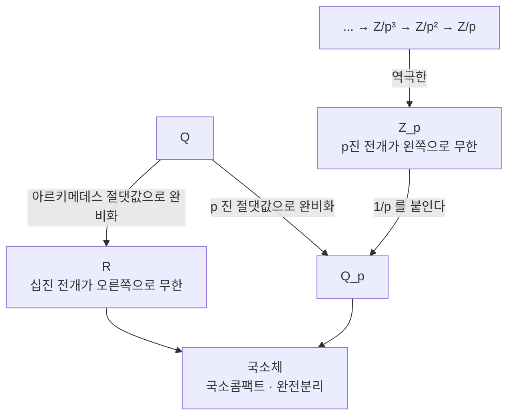

# p 진수와 부치

# 개요

$\mathbb Q$ 에서 $\mathbb R$ 를 만드는 방법은 Cauchy 수열로 [완비화](completeness.md)하는 것이고, 그 구성에서 가까움을 판단하는 것은 절댓값 $|x|$ 이다.

소수 $p$ 마다 다른 절댓값이 있다. $x$ 가 $p$ 로 많이 나누어질수록 $x$ 를 작다고 보는 $|\cdot|\_p$ 다. 이 절댓값으로 $\mathbb Q$ 를 완비화하면 $\mathbb R$ 와 다른 체 $\mathbb Q_p$ 가 나온다. Ostrowski 정리에 따르면 $\mathbb Q$ 위의 절댓값은 $|\cdot|\_\infty$ 와 $|\cdot|\_p$ 들뿐이다.

$$
\mathbb Q\ \longrightarrow\ \mathbb R,\ \mathbb Q_2,\ \mathbb Q_3,\ \mathbb Q_5,\ \mathbb Q_7,\ \dots
$$

$\mathbb Q_p$ 의 정수환 $\mathbb Z_p$ 는 $\mathbb Z/p^n\mathbb Z$ 의 역극한이다. [합동 산술](modular-arithmetic.md)에서 법을 $p,p^2,p^3,\dots$ 로 올려 가며 쌓은 정보가 $p$ 진수이고, 법 $p^n$ 에서 풀린다는 무한히 많은 조건이 한 체의 한 방정식으로 합쳐지며 Hensel 보조정리가 그 해를 한 자리씩 올린다.

방정식의 유리수 해를 찾을 때 모든 $\mathbb Q_v$ 에서 먼저 풀어 보는 국소-대역 전략이 여기서 나오고, 유체론과 Langlands 강령이 아델 위에서 서술되는 것도 같은 이유다.

# 직관

## $p$ 진 절댓값

$x=p^n\cdot\frac ab$ 이고 $a,b$ 가 $p$ 와 서로소면 $|x|\_p=p^{-n}$ 이다. $p$ 의 거듭제곱이 작고 $1/p^n$ 이 크다.

$p=3$ 에서 $1,\ 1+3,\ 1+3+9,\ 1+3+9+27,\dots$ 는 연속한 두 항의 차가 $3^n$ 이라 $3$ 진 거리가 $3^{-n}$ 으로 0 에 가는 Cauchy 수열이다. 실수로는 발산하는 이 수열이 $\mathbb Q_3$ 에서 수렴하고 극한이 $\frac1{1-3}=-\frac12$ 이다. $-1/2$ 의 3 진 전개가 $1+3+9+27+\cdots$ 다.

## 초거리 기하

$|\cdot|\_p$ 는 삼각부등식보다 강한 초거리 부등식을 만족한다.

$$
|x+y|\_p\le\max(|x|\_p,|y|\_p)
$$

모든 삼각형이 이등변이고, 공 안의 모든 점이 그 공의 중심이며, 두 공은 겹치거나 하나가 다른 하나를 포함할 뿐 반쯤 겹치지 않는다. 모든 공이 열린집합이면서 닫힌집합이라 공간이 완전히 분리된다.

급수 판정도 단순하다. $\sum a_n$ 이 수렴할 필요충분조건이 $|a_n|\_p\to0$ 이다. 부분합의 차가 $\max$ 로 통제되기 때문이다.

## 두 구성의 일치

해석적으로는 Cauchy 완비화이고 대수적으로는 $\mathbb Z_p=\varprojlim\mathbb Z/p^n\mathbb Z$ 다. 한쪽에서는 극한과 급수를, 다른 쪽에서는 합동식을 쓴다.

전개의 방향도 뒤집힌다. 실수는 $3.14159\ldots$ 처럼 오른쪽으로 무한히 가고 $p$ 진수는 왼쪽으로 무한히 간다. $2$ 진수에서 $-1=\cdots1111$ 인 것이 컴퓨터의 2 의 보수와 같은 현상이다.

## Hensel 과 Newton 법

$f(a)\equiv0\pmod p$ 이고 $f'(a)\not\equiv0\pmod p$ 이면 $a$ 를 법 $p^2,p^4,p^8$ 의 해로 올릴 수 있다. 갱신식이 [Newton 법](newton-method.md)과 같다.

$$
a\ \longmapsto\ a-\frac{f(a)}{f'(a)}
$$

실수에서 Newton 법의 수렴은 초기값에 달려 있지만 $p$ 진에서는 초거리 부등식 덕분에 오차의 부치가 매 단계 두 배가 되고 $|f'(a)|\_p=1$ 이 분모의 폭발을 막는다. [축약사상 고정점 정리](banach-fixed-point.md)를 완비체 $\mathbb Z_p$ 에 적용하는 것과 같다.

# 정의

## 절댓값과 부치

체 $K$ 위의 **절댓값**은 $|\cdot|\colon K\to\mathbb R_{\ge0}$ 으로 $|x|=0\iff x=0$ , $|xy|=|x||y|$ , $|x+y|\le|x|+|y|$ 를 만족하는 것이다. $|x+y|\le\max(|x|,|y|)$ 까지 성립하면 **비아르키메데스** 절댓값이다.

$\mathbb Q$ 에서 소수 $p$ 를 고정하고 **$p$ 진 부치**를 정의한다.

$$
v_p(x)=\max\lbrace n:p^n\mid x\rbrace\ \ (x\in\mathbb Z\setminus\lbrace 0\rbrace),\qquad
v_p\Big(\frac ab\Big)=v_p(a)-v_p(b),\qquad v_p(0)=\infty
$$

$|x|\_p=p^{-v_p(x)}$ 로 두면 비아르키메데스 절댓값이 되고, $v_p(x+y)\ge\min(v_p(x),v_p(y))$ 가 초거리 부등식이다.

> **Ostrowski 정리.** $\mathbb Q$ 위의 자명하지 않은 모든 절댓값은 $|\cdot|\_\infty$ 또는 어떤 $|\cdot|\_p$ 와 동치다.

절댓값의 동치류가 **자리**이고 $v$ 로 쓴다. $\mathbb Q$ 의 자리는 소수들과 하나의 무한 자리 $\infty$ 다. 이 목록이 완전하므로 다음 항등식이 성립한다.

$$
\prod_v|x|\_v=1\qquad(x\in\mathbb Q^\times)
$$

**곱 공식**이다. $x=p_1^{e_1}\cdots p_k^{e_k}$ 의 소인수분해를 다시 쓴 것이지만 모든 자리를 대등하게 놓아야 성립하는 형태라 국소-대역 관점의 출발점이 된다.

## $\mathbb Q_p$ 와 $\mathbb Z_p$

$|\cdot|\_p$ 에 대한 $\mathbb Q$ 의 완비화가 $\mathbb Q_p$ 다. 그 안의 **정수환**은 다음이다.

$$
\mathbb Z_p=\lbrace x\in\mathbb Q_p:|x|\_p\le1\rbrace=\lbrace x:v_p(x)\ge0\rbrace
$$

- 국소환이다. 유일한 극대 아이디얼이 $p\mathbb Z_p$ 이고 잉여체가 $\mathbb Z_p/p\mathbb Z_p\cong\mathbb F_p$ 다.
- 0 이 아닌 모든 아이디얼이 $p^n\mathbb Z_p$ 인 이산부치환이다.
- 모든 원소가 $a_i\in\lbrace 0,\dots,p-1\rbrace$ 을 써서 $x=\sum_{i\ge0}a_ip^i$ 로 유일하게 쓰인다.
- $\varprojlim\mathbb Z/p^n\mathbb Z$ 와 표준적으로 동형이다.
- 콤팩트하다. $\mathbb Q_p$ 자신은 국소콤팩트이고 완전분리다.

$\mathbb Q_p=\mathbb Z_p[1/p]$ 이고 0 이 아닌 모든 원소가 $n\in\mathbb Z$ 와 $u\in\mathbb Z_p^\times$ 를 써서 $x=p^nu$ 로 유일하게 쓰이므로 곱군이 분해된다.

$$
\mathbb Q_p^\times\cong p^{\mathbb Z}\times\mathbb Z_p^\times\cong\mathbb Z\times\mathbb Z_p^\times
$$

## 국소체

$\mathbb Q_p$ 의 유한 확대 $K$ 가 $p$ 진 국소체다. 부치가 유일하게 확장되고 다음이 성립한다.

$$
ef=[K:\mathbb Q_p]
$$

$e$ 는 부치군의 지표(분기지수), $f$ 는 잉여체 확대의 차수다. 수체에서는 여러 소 아이디얼로 갈라져 $\sum e_if_i=n$ 인데 국소체에서는 소수가 하나뿐이라 항이 하나다. 국소적으로는 분해가 사라지고 분기만 남는다.

국소콤팩트 위상체는 $\mathbb R$ , $\mathbb C$ , $\mathbb Q_p$ 의 유한 확대, 양의 표수 쪽의 $\mathbb F_q((t))$ 로 분류되어 있다.

# 성질

## Hensel 보조정리

> $f\in\mathbb Z_p[x]$ 이고 $a\in\mathbb Z_p$ 가 $|f(a)|\_p\lt |f'(a)|\_p^2$ 를 만족하면 $f(\alpha)=0$ 이고 $|\alpha-a|\_p\lt |f'(a)|\_p$ 인 $\alpha\in\mathbb Z_p$ 가 유일하게 있다.

가장 많이 쓰는 형태는 $f'(a)$ 가 단원인 경우다. $f(a)\equiv0\pmod p$ 이고 $f'(a)\not\equiv0\pmod p$ 이면 법 $p$ 에서의 단순근이 $p$ 진 근으로 올라간다.

- $p$ 가 홀소수일 때 $a\in\mathbb Z_p^\times$ 가 $\mathbb Q_p$ 에서 제곱원소일 필요충분조건은 $a\bmod p$ 가 $\mathbb F_p$ 의 제곱잉여인 것이고, $\mathbb Q_p^\times/(\mathbb Q_p^\times)^2$ 의 크기가 4 다. $p=2$ 에서는 $f'=2x$ 가 단원이 아니라 한 자리를 더 봐야 하고 크기가 8 이다.
- $x^{p-1}-1$ 의 근이 $\mathbb Z_p$ 안에 $p-1$ 개 있다. Teichmüller 대표원이며 $\mathbb Z_p^\times\cong\mu_{p-1}\times(1+p\mathbb Z_p)$ 를 준다.
- $\mathbb Q_p$ 의 불분기 확대는 각 차수마다 유일하고 잉여체 $\mathbb F_{p^f}$ 를 만드는 다항식을 Hensel 로 올려 얻는다. Galois 군이 $\mathbb F_{p^f}/\mathbb F_p$ 의 것과 같은 순환군이라 국소 유체론이 아벨 이론으로 작동한다.

## 국소-대역 원리

$\mathbb R$ 에서는 부호만 보면 되고 $\mathbb Q_p$ 에서는 Hensel 덕분에 유한 개의 합동식으로 환원되므로 각 자리에서 푸는 것은 쉽다.

> **Hasse–Minkowski 정리.** $\mathbb Q$ 위의 이차형식이 자명하지 않은 영점을 가질 필요충분조건은 모든 $\mathbb Q_v$ ($v=\infty$ 포함) 에서 자명하지 않은 영점을 갖는 것이다.

$x^2+y^2=3z^2$ 에 자명하지 않은 정수해가 없는 것은 $\mathbb Q_3$ 에서 막힌다는 것으로 설명된다. 법 3 에서 $x^2+y^2\equiv0$ 이려면 $x\equiv y\equiv0$ 이어야 하고 그러면 $3$ 으로 나눠 무한강하가 된다.

차수를 올리면 성립하지 않는다. Selmer 의 예 $3x^3+4y^3+5z^3=0$ 은 모든 $\mathbb Q_v$ 에서 자명하지 않은 해를 갖지만 $\mathbb Q$ 에서는 갖지 않는다. 이 실패를 재는 것이 Brauer 군이고 [유체론](class-field-theory.md)이 그 계산의 기반이다.

## $p$ 진 해석학

$\mathbb Q_p$ 위에서도 미적분을 하지만 규칙이 다르다.

- 멱급수 $\sum a_nx^n$ 의 수렴반경은 $|a_n|\_p^{1/n}$ 의 극한으로 정해지고 경계에서의 판정이 $|a_nx^n|\_p\to0$ 이라 단순하다.
- $\exp(x)=\sum x^n/n!$ 은 $n!$ 의 부치 때문에 $|x|\_p\lt p^{-1/(p-1)}$ 에서만 수렴하고, $\log(1+x)$ 는 $|x|\_p\lt 1$ 에서 수렴한다.
- 도함수가 어디서나 0 인데 상수가 아닌 함수가 있다. 공간이 완전분리라 평균값 정리가 없다.
- 국소해석적 함수, $p$ 진 측도, $p$ 진 $L$ 함수의 이론이 발달해 있다. Kubota–Leopoldt 의 $p$ 진 zeta 함수가 Bernoulli 수의 합동 관계를 보간하며 Iwasawa 이론의 출발점이 된다.

# 활용

## 전개와 Hensel 올리기

$-1$ 이 $\cdots666_7$ 인 것은 $6+6\cdot7+6\cdot49+\cdots=\frac6{1-7}=-1$ 이기 때문이다. $100=202_7$ 이라 전개가 유한하고 $2/5$ 처럼 분모가 $7$ 과 서로소인 유리수는 전개가 순환한다. 유리수인 것과 전개가 궁극적으로 순환하는 것이 동치라는 점은 십진 전개와 같다.

## 다항식 인수분해와 정확한 선형대수

컴퓨터 대수 시스템이 $\mathbb Z[x]$ 의 다항식을 인수분해하는 표준 경로가 Hensel 이다. 적당한 $p$ 를 골라 $\mathbb F_p[x]$ 에서 인수분해하고 그 인수들을 법 $p^k$ 로 올린 뒤 계수 상계를 넘을 때까지 $k$ 를 키워 $\mathbb Z[x]$ 의 인수를 복원한다. 인수의 조합을 시험하는 마지막 단계가 지수적이라 격자 환원으로 바꾼 것이 LLL 기반 알고리즘이다.

정수 행렬의 선형계도 같다. $\mathbb Q$ 에서 Gauss 소거를 하면 중간 계수가 폭발하지만, 법 $p$ 에서 풀고 $p$ 진 Newton 반복으로 정밀도를 올린 뒤 유리수를 복원하면 자릿수가 통제된다.

## 아델

$\mathbb Q$ 의 자리 전체를 한꺼번에 다룰 때 단순한 직적은 너무 크고 직합은 너무 작으므로 제한직적을 쓴다.

$$
\mathbb A_{\mathbb Q}=\Big\lbrace(x_v)\in\mathbb R\times\prod_p\mathbb Q_p:\text{거의 모든 } p \text{ 에서 } x_v\in\mathbb Z_p\Big\rbrace
$$

아델 환이다. $\mathbb Q$ 가 그 안에 이산 부분군으로 들어가고 몫이 콤팩트해지며, 곱군 쪽에서 만든 이델류군이 [유체론](class-field-theory.md)의 기본 대상이 된다.

## 자리들의 대등성

$\mathbb R$ 와 $\mathbb Q_p$ 는 $\mathbb Q$ 의 완비화로서 대등하다. 곱 공식은 모든 자리를 세어야 성립하고 유수 공식과 Riemann–Roch 의 유비도 자리들의 균형에서 나온다. 수체와 함수체의 평행 관계 역시 자리라는 공통 언어로 서술되며 $\mathbb F_q((t))$ 가 $\mathbb Q_p$ 의 기하적 짝이다.

# 연관 문서

## 선수지식

- [완비성](completeness.md)
- [정수의 합동과 나머지 연산](modular-arithmetic.md)

## 더 알아보기

- [아델과 이델](adeles.md)
- [국소 유체론과 Lubin–Tate 형식군](local-class-field-theory.md)
- [Newton 다각형](newton-polygon.md)
- [과수렴 모듈러 기호와 p 진 L 함수](overconvergent-modular-symbols.md)

#number_theory #analysis #field_theory
