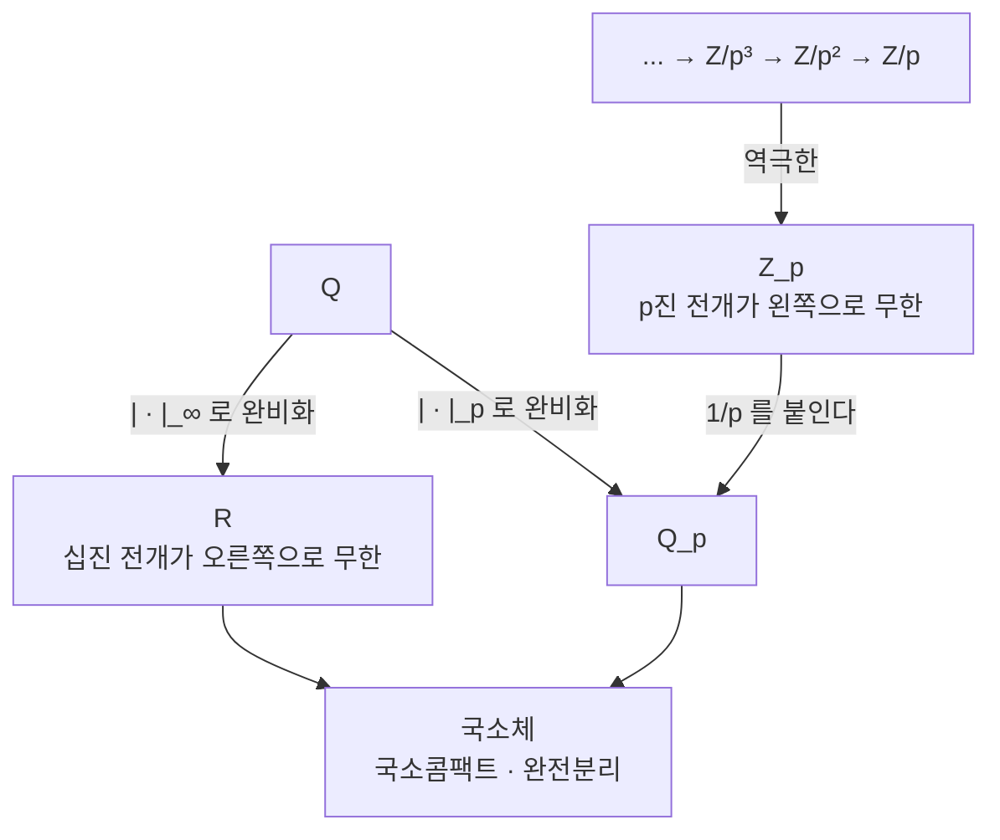

# p 진수와 부치

# 개요

`\mathbb Q` 에서 `\mathbb R` 를 만드는 방법은 Cauchy 수열로 [완비화](completeness.md)하는 것이다. 이 구성에서 "가깝다" 는 판단은 절댓값 `|x|` 이 하는데, 절댓값을 바꾸면 어떻게 될까.

소수 `p` 마다 다른 절댓값이 있다. `x` 가 `p` 로 많이 나누어질수록 `x` 를 작다고 보는 `|\cdot|_p` 다. 이 절댓값으로 `\mathbb Q` 를 완비화하면 `\mathbb R` 와 전혀 다른 체 `\mathbb Q_p` 가 나온다. Ostrowski 정리에 따르면 `\mathbb Q` 위의 절댓값은 본질적으로 `|\cdot|_\infty` 와 `|\cdot|_p` 들뿐이므로, 실수는 소수마다 하나씩 있는 형제들 가운데 하나에 불과하다.

$$
\mathbb Q\ \longrightarrow\ \mathbb R,\ \mathbb Q_2,\ \mathbb Q_3,\ \mathbb Q_5,\ \mathbb Q_7,\ \dots
$$

`\mathbb Q_p` 의 정수환 `\mathbb Z_p` 는 `\mathbb Z/p^n\mathbb Z` 의 역극한이다. 곧 [합동 산술](modular-arithmetic.md)에서 법을 `p,p^2,p^3,\dots` 로 계속 올려 가며 정보를 쌓은 것이 `p` 진수다. "법 `p^n` 에서 풀린다" 는 무한히 많은 조건이 하나의 체에서의 한 방정식으로 합쳐지고, Hensel 보조정리가 그 해를 한 자리씩 올려 준다.

방정식의 유리수 해를 찾을 때 모든 `\mathbb Q_v` 에서 먼저 풀어 보는 국소-대역 전략이 여기서 나온다. 유체론과 Langlands 강령이 아델 위에서 서술되는 것도 같은 이유다.

# 직관

## 가까움을 다시 정의한다

`|x|_p` 를 "`x` 가 `p` 로 몇 번 나누어지는가" 로 정한다. `x=p^n\cdot\frac ab` 이고 `a,b` 가 `p` 와 서로소면 `|x|_p=p^{-n}` 이다. `p` 의 거듭제곱은 아주 작고, `1/p^n` 은 아주 크다.

`p=3` 에서 `1,\ 1+3,\ 1+3+9,\ 1+3+9+27,\dots` 를 보자. 연속한 두 항의 차가 `3^n` 이라 `3` 진 거리가 `3^{-n}` 으로 0 에 간다. Cauchy 수열이다. 실수로 보면 발산하는 이 수열이 `\mathbb Q_3` 에서는 수렴하고, 극한은 등비급수 공식대로 `\frac1{1-3}=-\frac12` 이다. 실제로 `-1/2` 의 3 진 전개가 `1+3+9+27+\cdots` 다.

## 초거리라는 이상한 기하

`|\cdot|_p` 는 삼각부등식보다 강한 초거리 부등식을 만족한다.

$$
|x+y|_p\le\max(|x|_p,|y|_p)
$$

결과가 낯설다. 모든 삼각형이 이등변이고, 공 안의 모든 점이 그 공의 중심이며, 두 공은 겹치거나 하나가 다른 하나를 포함할 뿐 반쯤 겹치지 않는다. 모든 공이 열린집합이면서 닫힌집합이라 공간이 완전히 분리된다.

급수 판정도 단순해진다. `\sum a_n` 이 수렴할 필요충분조건이 `|a_n|_p\to0` 이다. 실수에서 조화급수 때문에 틀리는 그 명제가 여기서는 참이다. 부분합의 차가 `\max` 로 통제되기 때문이다.

## 두 가지 구성이 같은 것을 준다



해석적으로는 Cauchy 완비화이고, 대수적으로는 `\mathbb Z_p=\varprojlim\mathbb Z/p^n\mathbb Z` 다. 둘이 같은 대상이라는 것이 `p` 진수의 힘이다. 한쪽에서는 극한과 급수를 쓰고, 다른 쪽에서는 합동식을 쓴다.

전개의 방향도 뒤집힌다. 실수는 `3.14159\ldots` 처럼 오른쪽으로 무한히 가지만 `p` 진수는 왼쪽으로 무한히 간다. `2` 진수에서 `-1=\cdots1111` 인 것이 컴퓨터의 2 의 보수와 정확히 같은 현상이다.

## Hensel 은 자명하게 수렴하는 Newton 법이다

`f(a)\equiv0\pmod p` 이고 `f'(a)\not\equiv0\pmod p` 이면, `a` 를 법 `p^2`, `p^4`, `p^8` 의 해로 계속 올릴 수 있다. 갱신식은 [Newton 법](newton-method.md)과 똑같다.

$$
a\ \longmapsto\ a-\frac{f(a)}{f'(a)}
$$

실수에서 Newton 법의 수렴은 초기값에 달려 있고 증명도 까다롭다. `p` 진에서는 초거리 부등식 덕분에 수렴이 공짜다. 오차의 부치가 매 단계 두 배가 되고, `|f'(a)|_p=1` 이 분모의 폭발을 막는다. 사실상 [축약사상 고정점 정리](banach-fixed-point.md)를 완비체 `\mathbb Z_p` 에 적용하는 것이다.

# 정의

## 절댓값과 부치

체 `K` 위의 **절댓값**은 `|\cdot|\colon K\to\mathbb R_{\ge0}` 으로 `|x|=0\iff x=0`, `|xy|=|x||y|`, `|x+y|\le|x|+|y|` 를 만족하는 것이다. `|x+y|\le\max(|x|,|y|)` 까지 성립하면 **비아르키메데스** 절댓값이라 한다.

`\mathbb Q` 에서 소수 `p` 를 고정하고 **`p` 진 부치**를 정의한다.

$$
v_p(x)=\max\{n:p^n\mid x\}\ \ (x\in\mathbb Z\setminus\{0\}),\qquad
v_p\Big(\frac ab\Big)=v_p(a)-v_p(b),\qquad v_p(0)=\infty
$$

여기서 `|x|_p=p^{-v_p(x)}` 로 두면 비아르키메데스 절댓값이 된다. `v_p(x+y)\ge\min(v_p(x),v_p(y))` 가 초거리 부등식과 같은 말이다.

> **Ostrowski 정리.** `\mathbb Q` 위의 자명하지 않은 모든 절댓값은 `|\cdot|_\infty` 또는 어떤 `|\cdot|_p` 와 동치다.

절댓값의 동치류를 **자리**라 하고 `v` 로 쓴다. `\mathbb Q` 의 자리는 소수들과 하나의 무한 자리 `\infty` 로 이루어진다. 이 목록이 완전하다는 것이 다음 항등식을 의미 있게 만든다.

$$
\prod_v|x|_v=1\qquad(x\in\mathbb Q^\times)
$$

**곱 공식**이라 한다. `x=p_1^{e_1}\cdots p_k^{e_k}` 의 소인수분해를 다시 쓴 것에 지나지 않지만, 모든 자리를 대등하게 놓아야 성립하는 형태라 국소-대역 관점의 출발점이 된다.

## `\mathbb Q_p` 와 `\mathbb Z_p`

`|\cdot|_p` 에 대한 `\mathbb Q` 의 완비화를 `\mathbb Q_p` 라 한다. 그 안의 **정수환**은

$$
\mathbb Z_p=\{x\in\mathbb Q_p:|x|_p\le1\}=\{x:v_p(x)\ge0\}
$$

이고, 다음 성질을 갖는다.

- 국소환이다. 유일한 극대 아이디얼이 `p\mathbb Z_p` 이고 잉여체가 `\mathbb Z_p/p\mathbb Z_p\cong\mathbb F_p` 다.
- 0 이 아닌 모든 아이디얼이 `p^n\mathbb Z_p` 다. 곧 이산부치환이다.
- 모든 원소가 `x=\sum_{i\ge0}a_ip^i`(`a_i\in\{0,\dots,p-1\}`) 로 유일하게 쓰인다.
- `\varprojlim\mathbb Z/p^n\mathbb Z` 와 표준적으로 동형이다.
- 콤팩트하다. `\mathbb Q_p` 자신은 국소콤팩트이고 완전분리다.

`\mathbb Q_p=\mathbb Z_p[1/p]` 이고, 0 이 아닌 모든 원소가 `x=p^nu`(`n\in\mathbb Z`, `u\in\mathbb Z_p^\times`) 로 유일하게 쓰인다. 이것이 곱군의 분해

$$
\mathbb Q_p^\times\cong p^{\mathbb Z}\times\mathbb Z_p^\times\cong\mathbb Z\times\mathbb Z_p^\times
$$

를 준다.

## 국소체

`\mathbb Q_p` 의 유한 확대 `K` 를 `p` 진 국소체라 한다. 부치가 유일하게 확장되고, 수체에서와 같은 등식이 성립한다.

$$
ef=[K:\mathbb Q_p]
$$

`e` 는 부치군의 지표(분기지수), `f` 는 잉여체 확대의 차수다. 수체에서는 여러 소 아이디얼로 갈라지느라 `\sum e_if_i=n` 이었는데, 국소체에서는 소수가 하나뿐이라 항이 하나로 줄어든다. 국소적으로 보면 분해가 사라지고 분기만 남는다는 뜻이며, 이것이 국소 논증이 단순해지는 이유다.

국소콤팩트 위상체는 분류되어 있다. `\mathbb R`, `\mathbb C`, `\mathbb Q_p` 의 유한 확대, 그리고 양의 표수 쪽의 `\mathbb F_q((t))` 가 전부다.

# 성질

## Hensel 보조정리

> `f\in\mathbb Z_p[x]` 이고 `a\in\mathbb Z_p` 가 `|f(a)|_p<|f'(a)|_p^2` 를 만족하면, `f(\alpha)=0` 이고 `|\alpha-a|_p<|f'(a)|_p` 인 `\alpha\in\mathbb Z_p` 가 유일하게 있다.

가장 많이 쓰는 형태는 `f'(a)` 가 단원인 경우다. `f(a)\equiv0\pmod p` 이고 `f'(a)\not\equiv0\pmod p` 이면 근이 `\mathbb Z_p` 안에 있다. 곧 **법 `p` 에서의 단순근은 자동으로 `p` 진 근으로 올라간다.**

몇 가지 귀결이 바로 나온다.

- `p` 가 홀소수일 때 `a\in\mathbb Z_p^\times` 가 `\mathbb Q_p` 에서 제곱원소일 필요충분조건은 `a\bmod p` 가 `\mathbb F_p` 의 제곱잉여인 것이다. 따라서 `\mathbb Q_p^\times/(\mathbb Q_p^\times)^2` 의 크기가 4 다. `p=2` 에서는 `f'=2x` 가 단원이 아니라 한 자리를 더 봐야 하고 크기가 8 이 된다.
- `x^{p-1}-1` 의 근이 `\mathbb Z_p` 안에 `p-1` 개 있다. Teichmüller 대표원이며, `\mathbb Z_p^\times\cong\mu_{p-1}\times(1+p\mathbb Z_p)` 를 준다.
- `\mathbb Q_p` 의 불분기 확대는 각 차수마다 유일하고, 잉여체 `\mathbb F_{p^f}` 를 만드는 다항식을 Hensel 로 올려 얻는다. 그 Galois 군이 `\mathbb F_{p^f}/\mathbb F_p` 의 것과 같은 순환군이라, 국소 유체론이 아벨 이론으로 잘 작동한다.

## 국소-대역 원리

`\mathbb Q` 에서 방정식을 푸는 것은 어렵지만 각 `\mathbb Q_v` 에서 푸는 것은 쉽다. `\mathbb R` 에서는 부호만 보면 되고, `\mathbb Q_p` 에서는 Hensel 덕분에 유한 개의 합동식으로 환원된다. 그렇다면 모든 자리에서 풀리면 `\mathbb Q` 에서도 풀릴까.

> **Hasse–Minkowski 정리.** `\mathbb Q` 위의 이차형식이 자명하지 않은 영점을 가질 필요충분조건은 모든 `\mathbb Q_v`(`v=\infty` 포함) 에서 자명하지 않은 영점을 갖는 것이다.

이차형식에서는 참이다. 예를 들어 `x^2+y^2=3z^2` 에 자명하지 않은 정수해가 없음은 `\mathbb Q_3` 에서 막힌다는 것으로 설명된다. 법 3 에서 `x^2+y^2\equiv0` 이려면 `x\equiv y\equiv0` 이어야 하고, 그러면 `3` 으로 나눠 무한강하가 된다.

차수를 올리면 무너진다. Selmer 의 예 `3x^3+4y^3+5z^3=0` 은 모든 `\mathbb Q_v` 에서 자명하지 않은 해를 가지지만 `\mathbb Q` 에서는 갖지 않는다. 이 실패를 재는 것이 Brauer 군이고, [유체론](class-field-theory.md)이 그 계산의 기반을 제공한다.

## 해석학이 다시 만들어진다

`\mathbb Q_p` 위에서도 미적분을 할 수 있지만 규칙이 다르다.

- 멱급수 `\sum a_nx^n` 의 수렴반경은 `|a_n|_p^{1/n}` 의 극한으로 정해지고, 경계에서의 수렴 판정이 `|a_nx^n|_p\to0` 이라 단순하다.
- `\exp(x)=\sum x^n/n!` 은 `|x|_p<p^{-1/(p-1)}` 에서만 수렴한다. `n!` 의 부치가 커지기 때문이다. 반면 `\log(1+x)` 는 `|x|_p<1` 에서 수렴한다.
- 도함수가 어디서나 0 인데 상수가 아닌 함수가 있다. 공간이 완전분리라 평균값 정리가 없기 때문이다.
- 그럼에도 국소해석적 함수, `p` 진 측도, `p` 진 `L` 함수의 이론이 잘 발달해 있다. Kubota–Leopoldt 의 `p` 진 zeta 함수가 Bernoulli 수의 합동 관계를 보간하며, Iwasawa 이론의 출발점이 된다.

# 활용

## 전개와 Hensel 을 직접 계산한다

```python
from fractions import Fraction

def v_p(x, p):
    """유리수 x 의 p 진 부치. v_p(0) = ∞ 는 None 으로 둔다."""
    if x == 0: return None
    n, d, v = x.numerator, x.denominator, 0
    while n % p == 0: n //= p; v += 1
    while d % p == 0: d //= p; v -= 1
    return v

def digits(x, p, k):
    """x ∈ Z_p 의 p 진 전개 앞 k 자리. x = a0 + a1 p + a2 p² + ..."""
    x, out = Fraction(x), []
    for _ in range(k):
        a = (x.numerator * pow(x.denominator, -1, p)) % p    # a ≡ x (mod p)
        out.append(a)
        x = (x - a) / p                                      # 한 자리 내려간다
    return out

p = 7
print("Z_7 에서의 p 진 전개 (낮은 자리부터)")
for x in (Fraction(-1), Fraction(1, 3), Fraction(2, 5), Fraction(100)):
    print(f"  {str(x):>6} -> {digits(x, p, 8)}")

def hensel(f, df, a, p, k):
    """f(a) ≡ 0, f'(a) ≢ 0 (mod p) 인 a 를 mod p^k 의 해로 올린다."""
    m = p
    for _ in range(k - 1):
        a = (a - f(a) * pow(df(a), -1, m*m)) % (m*m)         # 정밀도가 매 단계 두 배
        m *= m
    return a % p**k

f, df = lambda x: x*x - 2, lambda x: 2*x                     # 3² = 2 (mod 7) 에서 출발
print("\n√2 ∈ Z_7 를 한 자리씩 올린다")
for k in range(1, 6):
    r = hensel(f, df, 3, 7, k)
    print(f"  mod 7^{k}: x = {r:<6}  v_7(x²-2) = {v_p(Fraction(r*r - 2), 7)}")

def product_formula(x, P):
    """∏_v |x|_v. P 는 |x| 에 관여하는 소수를 모두 포함해야 한다."""
    prod = abs(Fraction(x))
    for q in P:
        prod *= Fraction(q) ** (-v_p(Fraction(x), q))
    return prod

print()
for x in (Fraction(60, 7), Fraction(-98, 45), Fraction(1)):
    print(f"곱 공식  x = {str(x):>7} :  ∏|x|_v = {product_formula(x, [2,3,5,7,11,13])}")

# Z_7 에서의 p 진 전개 (낮은 자리부터)
#      -1 -> [6, 6, 6, 6, 6, 6, 6, 6]
#     1/3 -> [5, 4, 4, 4, 4, 4, 4, 4]
#     2/5 -> [6, 2, 1, 4, 5, 2, 1, 4]
#     100 -> [2, 0, 2, 0, 0, 0, 0, 0]
#
# √2 ∈ Z_7 를 한 자리씩 올린다
#   mod 7^1: x = 3       v_7(x²-2) = 1
#   mod 7^2: x = 10      v_7(x²-2) = 2
#   mod 7^3: x = 108     v_7(x²-2) = 3
#   mod 7^4: x = 2166    v_7(x²-2) = 4
#   mod 7^5: x = 4567    v_7(x²-2) = 5
#
# 곱 공식  x =    60/7 :  ∏|x|_v = 1
# 곱 공식  x =  -98/45 :  ∏|x|_v = 1
# 곱 공식  x =       1 :  ∏|x|_v = 1
```

`-1` 이 `\cdots666_7` 인 것은 `6+6\cdot7+6\cdot49+\cdots=\frac6{1-7}=-1` 이기 때문이다. `100=202_7` 이라 전개가 유한하고, `2/5` 처럼 분모가 `7` 과 서로소인 유리수는 전개가 순환한다. 유리수인 것과 전개가 궁극적으로 순환하는 것이 동치라는 점도 십진 전개와 같다.

Hensel 쪽에서는 `x^2-2` 의 부치가 자릿수를 늘릴 때마다 정확히 그만큼 커진다. 근이 존재한다는 추상적 주장이 유한 계산으로 확인된다.

## 다항식 인수분해와 정확한 선형대수

컴퓨터 대수 시스템이 `\mathbb Z[x]` 의 다항식을 인수분해하는 표준 경로가 Hensel 이다. 적당한 `p` 를 골라 `\mathbb F_p[x]` 에서 인수분해하고(유한체라 빠르다), 그 인수들을 법 `p^k` 로 올린 뒤, 계수 상계를 넘을 때까지 `k` 를 키워 `\mathbb Z[x]` 의 인수를 복원한다. 인수의 조합을 시험하는 마지막 단계가 지수적이라 격자 환원으로 바꾼 것이 LLL 기반 알고리즘이다.

정수 행렬의 선형계도 같은 방식으로 푼다. `\mathbb Q` 에서 Gauss 소거를 하면 중간 계수가 폭발하지만, 법 `p` 에서 풀고 `p` 진 Newton 반복으로 정밀도를 올린 뒤 유리수를 복원하면 자릿수가 통제된다.

## 자리들을 하나로 묶는다

`\mathbb Q` 의 자리 전체를 한꺼번에 다루려면 곱을 취해야 하는데, 단순한 직적은 너무 크고 직합은 너무 작다. 올바른 대상은 제한직적이다.

$$
\mathbb A_{\mathbb Q}=\Big\{(x_v)\in\mathbb R\times\prod_p\mathbb Q_p:\text{거의 모든 } p \text{ 에서 } x_v\in\mathbb Z_p\Big\}
$$

아델 환이라 한다. `\mathbb Q` 가 그 안에 이산 부분군으로 들어가고 몫이 콤팩트해지며, 곱군 쪽에서 만든 이델류군이 [유체론](class-field-theory.md)의 무대가 된다. 국소적으로 풀고 대역적으로 붙이는 전략이 여기서 하나의 위상적 대상으로 정착한다.

## 왜 실수만 특별하지 않은가

`\mathbb R` 와 `\mathbb Q_p` 는 `\mathbb Q` 의 완비화라는 점에서 대등하다. 물리적 직관이 `\mathbb R` 쪽에만 붙어 있을 뿐이다.

정수론의 많은 정리가 이 대등함을 활용한다. 곱 공식은 모든 자리를 세어야 성립하고, 유수 공식과 Riemann–Roch 의 유비도 자리들의 균형에서 나온다. 수체와 함수체의 평행 관계 역시 자리라는 공통 언어로 서술되며, `\mathbb F_q((t))` 가 `\mathbb Q_p` 의 기하적 짝이다. 대수기하가 정수론에 들어오는 통로가 바로 이 유비다.

# 연관 문서

## 선수지식

- [Cauchy 수열과 완비성](completeness.md)
- [정수의 합동과 나머지 연산](modular-arithmetic.md)

## 더 알아보기

- [아델과 이델](adeles.md)
- [국소 유체론과 Lubin–Tate 형식군](local-class-field-theory.md)

#number_theory #analysis #field_theory
