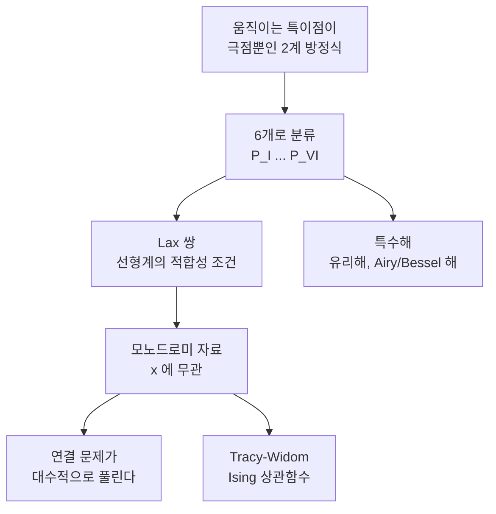

# Painlevé 방정식과 등모노드로미 변형

# 개요

2계 비선형 상미분방정식의 해는 보통 초기조건에 따라 위치가 달라지는 특이점을 가진다. $y' = y^2$ 의 해 $y = 1/(c-x)$ 가 $x = c$ 에서 터지는 것처럼, 특이점이 해를 따라 **움직인다**. 그런 특이점이 분지점이면 해가 다가(多價)가 되어 전역적으로 다루기 어렵다.

Painlevé 는 움직이는 특이점이 **극점뿐**인 방정식만 골라내면 좋은 함수 이론이 가능하리라 보았다. $y'' = F(x, y, y')$ 꼴에서 이 조건($\mathbf{P}$ 성질)을 만족하는 것을 분류하니, 알려진 함수로 풀리는 것을 제외하고 여섯 개의 새로운 방정식이 남았다. 이것이 **Painlevé 방정식** $\mathrm{P}\_{\mathrm{I}}$ 부터 $\mathrm{P}\_{\mathrm{VI}}$ 이고, 그 해를 Painlevé 초월함수라 한다. 타원함수가 1계 방정식에서 나온 새로운 함수였듯, 이들은 2계에서 나온 새로운 함수다.

이 목록이 중요한 이유는 분류 자체보다 어디에 나타나는가에 있다. 무작위 행렬의 [Tracy–Widom 분포](tracy-widom.md), 2차원 Ising 모형의 상관함수, 최장증가부분수열의 길이 분포가 모두 이 여섯 개 가운데 하나로 쓰인다. [Airy 함수](airy-functions.md)가 선형 세계의 보편적 표준형이라면 Painlevé 는 비선형 세계의 표준형이다.

# 직관

## 움직이는 특이점

선형 방정식 $y'' + p(x)y' + q(x)y = 0$ 의 해는 $p, q$ 가 정칙인 곳에서 정칙이다. 특이점의 위치가 계수로 고정되어 있어 초기조건과 무관하다. 비선형에서는 사정이 다르다. $y' = y^2$ 의 극점 위치 $c$ 는 초기값이 정한다.

움직이는 특이점이 극점이면 해를 유리형함수로 취급할 수 있어 여전히 좋다. 문제는 분지점이다. $y' = y^3$ 의 해 $y = (2(c-x))^{-1/2}$ 는 $x = c$ 를 돌면 부호가 바뀌어 일가함수가 아니다. 이런 방정식의 해는 복소평면 위에서 대역적으로 기술하기가 사실상 불가능하다. $\mathbf{P}$ 성질은 "대역적으로 말이 되는 함수를 정의하는 방정식만 남기자" 는 요구다.

## 왜 이 분류가 적분가능성과 같은가

$\mathbf{P}$ 성질을 만족하는 방정식은 예외 없이 **Lax 쌍**을 가진다. 즉 어떤 선형 방정식계의 적합성 조건으로 다시 쓰인다. 비선형 방정식 하나가 선형 문제의 그림자인 셈이고, 이 구조 덕분에 해의 대역적 거동을 선형 문제의 자료로 환원할 수 있다.

이 관찰은 우연이 아니다. 움직이는 분지점이 없다는 것은 해가 매개변수에 대해 충분히 부드럽게 의존한다는 뜻이고, 그런 부드러움은 배후에 선형 구조가 있을 때 나온다. 오늘날 "적분가능한 비선형 방정식" 을 판별하는 실용적 기준으로 $\mathbf{P}$ 성질 검사(Painlevé 검정)가 쓰이는 이유다.

## 모노드로미를 보존하는 변형

선형 방정식 $\partial_\lambda \Psi = A(\lambda, x)\Psi$ 를 생각하자. $\lambda$ 평면에서 특이점을 돌 때 해가 어떻게 섞이는지가 **모노드로미 자료**이고, Stokes 행렬과 연결 행렬이 그 내용이다. 계수 $A$ 를 $x$ 로 변형하되 모노드로미 자료는 그대로 두려면 $A$ 가 특정 편미분방정식을 만족해야 하는데, 그 조건이 바로 Painlevé 방정식이다.

그래서 Painlevé 초월함수의 $x \to \pm\infty$ 점근을 잇는 **연결 문제**가 대수적으로 풀린다. 양쪽 끝의 점근을 각각 모노드로미 자료로 번역하면, 그 자료가 $x$ 에 무관하므로 두 점근이 같은 자료로 표현되어야 한다. 선형 이론의 [Stokes 현상](stokes-phenomenon.md)이 비선형으로 옮겨 온 모습이다.



# 정의

## $\mathbf{P}$ 성질과 여섯 방정식

방정식의 모든 해에 대해 움직이는 특이점이 극점뿐일 때 그 방정식이 $\mathbf{P}$ **성질**을 가진다고 한다. $y'' = F(x,y,y')$ 에서 $F$ 가 $y, y'$ 의 유리함수이고 $x$ 에 해석적으로 의존하는 경우를 전부 조사하면 약 50 개의 표준형이 나오고, 그 가운데 44 개는 이미 알려진 함수(초등함수, 타원함수, 선형방정식의 해)로 풀린다. 남는 여섯이 다음이다.

| 이름 | 방정식 | 특수해가 되는 고전함수 |
|---|---|---|
| $\mathrm{P}_{\mathrm{I}}$ | $q'' = 6q^2 + x$ | 없음 |
| $\mathrm{P}_{\mathrm{II}}$ | $q'' = 2q^3 + xq + \alpha$ | Airy |
| $\mathrm{P}_{\mathrm{III}}$ | $q'' = \dfrac{(q')^2}{q} - \dfrac{q'}{x} + \dfrac{\alpha q^2+\beta}{x} + \gamma q^3 + \dfrac{\delta}{q}$ | Bessel |
| $\mathrm{P}_{\mathrm{IV}}$ | $q'' = \dfrac{(q')^2}{2q} + \dfrac32 q^3 + 4xq^2 + 2(x^2-\alpha)q + \dfrac{\beta}{q}$ | 포물린더 |
| $\mathrm{P}_{\mathrm{V}}$ | (유리형, 매개변수 4개) | 합류초기하 |
| $\mathrm{P}_{\mathrm{VI}}$ | 유리형, 매개변수 4개, 고정특이점 $0,1,\infty$ | 초기하 |

$\mathrm{P}_{\mathrm{I}}$ 을 제외한 다섯은 매개변수가 특정 값일 때 고전함수로 풀리는 해를 가진다. 나머지 매개변수에서는 그렇지 않고, 그때의 해가 진짜 새로운 초월함수다.

## $\mathrm{P}_{\mathrm{II}}$ 의 Airy 해

$\alpha = \tfrac12$ 일 때 Riccati 방정식

$$
q' = q^2 + \frac{x}{2}
$$

의 해는 $\mathrm{P}_{\mathrm{II}}$ 를 만족한다(미분해서 대입하면 바로 확인된다). Riccati 는 $q = -w'/w$ 로 선형화되고, 대입하면

$$
w'' = -\frac{x}{2}\thinspace w
$$

가 되어 $x = -2^{1/3}t$ 치환으로 Airy 방정식이 된다. 즉 $q(x) = -\frac{d}{dx}\log \operatorname{Ai}\bigl(-2^{-1/3}x\bigr)$ 가 $\mathrm{P}_{\mathrm{II}}$ 의 해다. **Bäcklund 변환**이 $\alpha \mapsto \alpha \pm 1$ 을 실현하므로, 이 해에서 출발해 $\alpha \in \mathbb Z + \tfrac12$ 전체에 대한 Airy 형 해의 사슬이 만들어진다.

## 등모노드로미 변형

$\mathrm{P}_{\mathrm{II}}$ 의 Lax 쌍은 $2\times2$ 선형계

$$
\frac{\partial \Psi}{\partial \lambda} = A(\lambda, x)\Psi, \qquad
\frac{\partial \Psi}{\partial x} = B(\lambda, x)\Psi
$$

이고, $A$ 는 $\lambda$ 의 2차 다항식, $B$ 는 1차 다항식이며 계수가 $q, q'$ 로 쓰인다. 두 식의 적합성 $\partial_x A - \partial_\lambda B + [A,B] = 0$ 이 정확히 $\mathrm{P}_{\mathrm{II}}$ 다.

$\lambda = \infty$ 는 비정칙 특이점이라 Stokes 현상이 일어나고, 그 Stokes 행렬들이 모노드로미 자료를 이룬다. $x$ 를 움직여도 이 자료가 변하지 않는다는 것이 **등모노드로미**이며, 그래서 해 하나가 자료 하나에 대응한다. 해를 이 자료로 이름 붙이는 것이 Painlevé 초월함수를 다루는 표준 방식이다.

# 성질

## Hastings–McLeod 해

$\alpha = 0$ 인 $\mathrm{P}_{\mathrm{II}}$

$$
q'' = 2q^3 + xq
$$

에서 $x \to +\infty$ 조건 $q(x) \sim \operatorname{Ai}(x)$ 를 붙이면 해가 유일하게 결정된다. 이것이 **Hastings–McLeod 해**다. 큰 $x$ 에서 $q$ 가 작아 $2q^3$ 항을 무시할 수 있으므로 방정식이 Airy 방정식에 가까워지고, 그래서 Airy 함수가 초기조건이 된다.

반대쪽 점근이 이 해의 성격을 보여 준다.

$$
q(x) \sim \sqrt{\frac{-x}{2}} \qquad (x \to -\infty)
$$

한쪽에서 지수적으로 0 에 가까운 해가 다른 쪽에서는 대수적으로 자란다. 두 점근을 잇는 연결 공식이 등모노드로미로 증명되는 대표적인 결과이고, 비선형 Stokes 현상의 전형이다. 조건을 $q \sim k\operatorname{Ai}(x)$ 로 놓으면 $k$ 값에 따라 해의 운명이 갈린다. $\lvert k\rvert < 1$ 이면 위와 같은 매끄러운 거동, $k = 1$ 이 임계, $\lvert k \rvert > 1$ 이면 유한한 $x$ 에서 극점으로 터진다.

## 유리해와 변환군

$\mathrm{P}_{\mathrm{II}}$ 는 $\alpha \in \mathbb Z$ 에서 유리해를 가진다. $\alpha = 0$ 에서 $q = 0$ 이고, $\alpha = 1$ 에서 $q = -1/x$ 이며, $\alpha = 2$ 에서 $q = \frac{1}{x} - \frac{3x^2}{x^3+4}$ 로 이어지며, 분자와 분모가 Yablonskii–Vorob'ev 다항식이라 불리는 정수계수 다항식열이 된다.

Bäcklund 변환들은 매개변수 공간에 아핀 Weyl 군의 작용을 만든다. $\mathrm{P}\_{\mathrm{II}}$ 에서는 $A_1^{(1)}$ 형, $\mathrm{P}\_{\mathrm{IV}}$ 에서는 $A_2^{(1)}$ 형이다. 방정식의 대칭이 Lie 이론의 언어로 정리된다는 점이 이 주제의 현대적 얼굴이다.

## 극점과 해의 전역 구조

$\mathrm{P}_{\mathrm{I}}$ 의 모든 해는 복소평면 전체에서 유리형이고 극점이 무한히 많다. 극점 근처에서 $q \sim (x-c)^{-2}$ 이며, 극점 위치 $c$ 하나와 Laurent 전개의 한 계수가 자유롭게 정해져 초기조건 두 개에 대응한다. 특이점의 위치가 자유롭지만 형태는 고정되어 있다는 것, 그것이 $\mathbf{P}$ 성질의 구체적인 모습이다.

# 활용

## Hastings–McLeod 해를 직접 계산한다

$x = 8$ 에서 Airy 점근으로 초기값을 잡고 음의 방향으로 Runge–Kutta 적분한다. 이 해는 양방향으로 불안정해 초기값이 조금만 어긋나도 갈라지지만, 출발점을 충분히 오른쪽에 두면 배정밀도로도 충분히 따라갈 수 있다.

```python
import math

def airy_pair(x, N=8):
    """x 가 클 때 Ai(x) 와 Ai'(x) 를 점근급수로."""
    z = 2 / 3 * x ** 1.5
    u = [1.0]
    for k in range(1, N):
        u.append(u[-1] * (6*k-5) * (6*k-3) * (6*k-1) / (216 * k * (2*k-1)))
    v = [1.0] + [u[k] * (6*k+1) / (1 - 6*k) for k in range(1, N)]
    pre = math.exp(-z) / (2 * math.sqrt(math.pi))
    ai = pre / x ** 0.25 * sum((-1) ** k * u[k] / z ** k for k in range(N))
    aip = -pre * x ** 0.25 * sum((-1) ** k * v[k] / z ** k for k in range(N))
    return ai, aip

def integrate(x0, x1, h=1e-3):
    """q'' = 2q^3 + x q 를 RK4 로. 관심 지점에서의 값을 함께 반환."""
    f = lambda x, y: (y[1], x * y[0] + 2 * y[0] ** 3)
    y = list(airy_pair(x0))
    n = int(abs((x1 - x0) / h))
    h = (x1 - x0) / n
    x, marks = x0, {}
    for _ in range(n):
        k1 = f(x, y)
        k2 = f(x + h/2, [y[j] + h/2 * k1[j] for j in range(2)])
        k3 = f(x + h/2, [y[j] + h/2 * k2[j] for j in range(2)])
        k4 = f(x + h, [y[j] + h * k3[j] for j in range(2)])
        y = [y[j] + h/6 * (k1[j] + 2*k2[j] + 2*k3[j] + k4[j]) for j in range(2)]
        x += h
        for t in (0.0, -2.0, -4.0, -6.0):
            if abs(x - t) < abs(h) / 2:
                marks[t] = y[0]
    return marks

for x0 in (6.0, 8.0, 10.0):
    m = integrate(x0, -7.0)
    print(f"출발 x0={x0:4.1f}:  q(0)={m[0.0]:.9f}  " +
          "  ".join(f"q({t:.0f})={m[t]:.6f}" for t in (-2.0, -4.0, -6.0)))
print("           참값 q(0)=0.367061552   " +
      "  ".join(f"sqrt({-t}/2)={math.sqrt(-t/2):.6f}" for t in (-2.0, -4.0, -6.0)))
```

출발점을 $6, 8, 10$ 으로 바꿔도 $q(0) = 0.367061552$ 가 아홉 자리까지 같게 나온다. 해가 유일하다는 정리의 수치적 확인이다. 음의 방향에서는 $q(-2) = 0.98339$ 와 $q(-4) = 1.41118$ 과 $q(-6) = 1.7310$ 으로 $\sqrt{-x/2}$ 의 값 $1, 1.41421, 1.73205$ 에 차례로 다가간다. 멀리 갈수록 출발점에 따른 마지막 자리의 차이가 보이는데, 해가 양방향으로 불안정해 적분 오차가 누적되기 때문이다. 지수적으로 작은 Airy 꼬리에서 출발한 해가 반대쪽에서 제곱근으로 자라는 연결 공식이 눈앞에서 확인된다.

## 분포함수로서의 Painlevé

[Tracy–Widom 분포](tracy-widom.md)는 위에서 계산한 $q$ 로

$$
F_2(s) = \exp\left(-\int_s^\infty (x-s)\thinspace q(x)^2\thinspace dx\right)
$$

로 쓰인다. 무작위 행렬 최대 고윳값의 분포표가 실제로 이 상미분방정식을 수치적분해 만들어진다. 무한차원 Fredholm 행렬식을 2계 방정식 하나로 바꾸는 것이 Painlevé 표현의 실용적 가치다.

2차원 Ising 모형의 두 점 상관함수가 임계온도 근방에서 $\mathrm{P}_{\mathrm{III}}$ 으로 쓰인다는 결과(1976)가 이 분야의 출발점이었다. 이후 최장증가부분수열, 육각형 타일링의 북극권, 양자장론의 형상인자에서 같은 함수들이 반복해 나타났다. 서로 무관해 보이는 문제들이 결국 등모노드로미 구조를 공유하기 때문이다.[^1]

## 적분가능성 판별

새로운 비선형 방정식을 만났을 때 $\mathbf{P}$ 성질을 검사하는 것이 적분가능성의 실용적 첫 시험이다. 해를 Laurent 급수로 놓고 움직이는 특이점 주변의 전개가 자유 매개변수를 충분히 가지는지 보는 절차(ARS 알고리즘)가 표준이며, 편미분방정식에도 진행파 환원을 통해 적용된다. KdV, 비선형 Schrödinger 같은 가지방정식들의 유사 환원이 Painlevé 방정식이 되는 것이 이 검사의 배경이다.

[^1]: Athanassios S. Fokas, Alexander R. Its, Andrei A. Kapaev, Victor Yu. Novokshenov, *Painlevé Transcendents: The Riemann–Hilbert Approach*, AMS (2006), 제1장(분류와 $\mathbf{P}$ 성질), 제4–5장(등모노드로미 변형과 $\mathrm{P}_{\mathrm{II}}$ 의 연결 문제).

# 연관 문서

## 선수지식

- [Airy 함수와 회전점](airy-functions.md)

## 더 알아보기

- [Tracy–Widom 분포와 Airy 핵](tracy-widom.md)

#analysis #complex_analysis #computation
