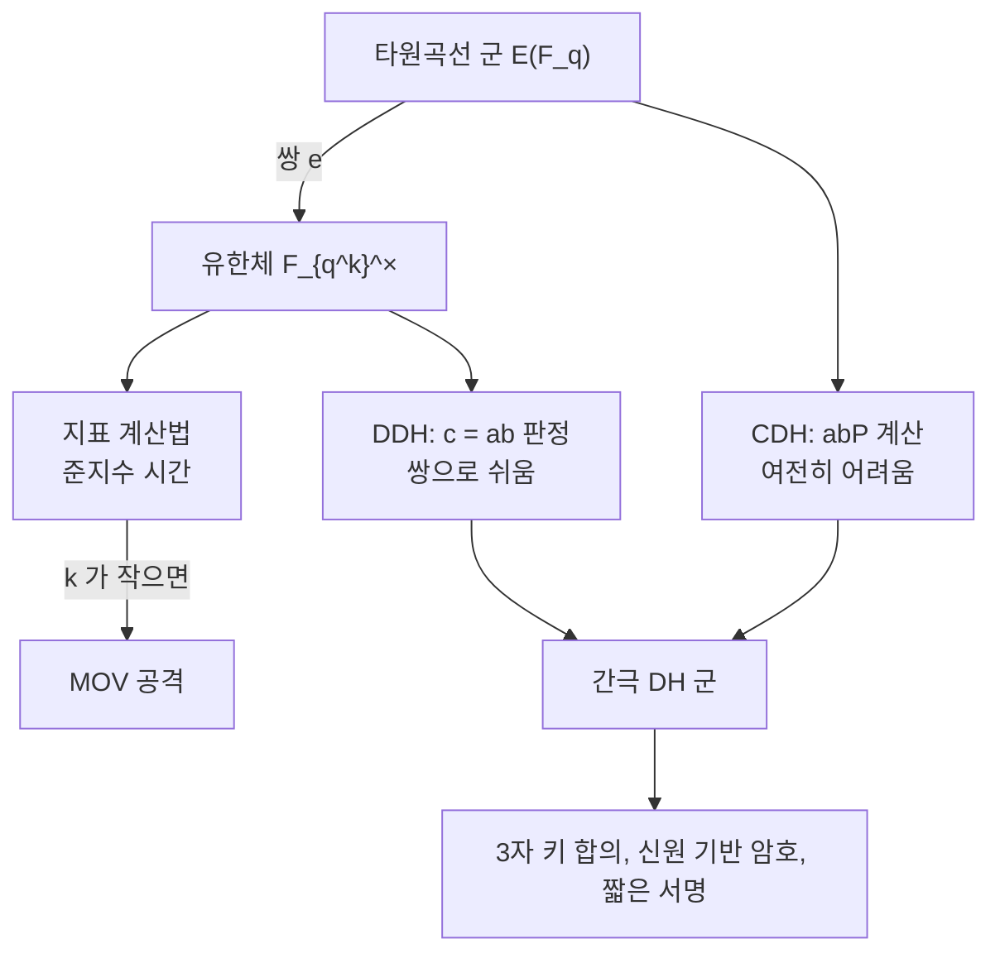

# Weil 쌍과 쌍선형 암호

# 개요

[타원곡선](elliptic-curves.md)이 암호에 쓰이는 이유는 그 군에 여분의 구조가 없어 이산로그가 어렵다는 것이었다. 그런데 어떤 곡선에는 여분의 구조가 있다. 비틀림점 사이에 정의되는 쌍선형 사상이 그것이고, 이것이 곡선의 군을 유한체의 곱셈군으로 옮긴다.

$$
e:E[r]\times E[r]\to\mu_r\subset\mathbb F_{q^k}^\times
$$

처음에는 공격 도구였다. MOV 환산은 이 사상으로 타원곡선 이산로그를 유한체 이산로그로 옮기고, $k$ 가 작으면 지표 계산법이 준지수 시간에 푼다. 초특이 곡선이 암호에서 배제된 이유다.

2000 년 무렵에 관점이 뒤집혔다. 쌍선형성 자체가 기존 가정으로는 만들 수 없던 암호 기능을 준다. 세 사람의 한 번짜리 키 합의, 신원 기반 암호, 짧은 서명이 몇 년 사이에 쏟아졌다. 같은 구조가 취약점이자 기능이 되는 드문 사례이며, 파라미터에서 $k$ 를 얼마로 잡느냐가 그 둘을 가른다.

# 직관

## 지수를 끌어내리는 사상

쌍선형성이 뜻하는 바는 다음 한 줄이다.

$$
e(aP,bQ)=e(P,Q)^{ab}
$$

곡선 위의 스칼라 곱이 유한체의 거듭제곱으로 번역된다. 곡선 군에서는 볼 수 없던 $a$ 와 $b$ 가 지수 자리에서 만나 곱해진다.

이 한 줄이 두 가지를 동시에 준다. 공격 쪽에서는 $aP$ 에서 $a$ 를 찾는 문제가 $e(P,P)^a$ 에서 $a$ 를 찾는 문제가 되어, 훨씬 연구가 많은 유한체 이산로그로 환원된다. 기능 쪽에서는 "곱을 계산할 수 있는" 새로운 대수적 능력이 생긴다.

## DDH 는 쉽고 CDH 는 어렵다

$(P,aP,bP,cP)$ 에서 $c=ab$ 인지 판정하는 문제가 DDH 다. 쌍이 있으면 $e(aP,bP)=e(P,cP)$ 인지 확인하면 끝난다.

그런데 $abP$ 를 실제로 계산하는 것(CDH)은 여전히 어렵다. $e(P,P)^{ab}$ 는 얻지만 그것을 곡선으로 되돌리는 것이 어렵기 때문이다.

두 문제가 갈라지는 이 군을 간극 Diffie–Hellman 군이라 한다. 판정은 쉽고 계산은 어렵다는 이 비대칭이 위의 암호 기능들이 나오는 원천이다. 쌍이 없는 군에서는 두 문제가 같이 어렵다고 믿어지며, 그러면 이런 구성이 불가능하다.



## 왜 확대체로 나가는가

$r$ 차 비틀림군 $E[r]$ 는 $(\mathbb Z/r\mathbb Z)^2$ 와 동형이라 원소가 $r^2$ 개다. 반면 기저체 $\mathbb F_q$ 위의 점 중 $r$ 차 비틀림은 대개 한 부분군 $r$ 개뿐이다.

쌍이 비퇴화하려면 서로 다른 두 부분군에서 점을 하나씩 가져와야 하므로, 두 번째 점이 확대체 $\mathbb F_{q^k}$ 위에 있어야 한다. 이 $k$ 가 매장 차수다.

$\mu_r\subset\mathbb F_{q^k}^\times$ 이므로 $r\mid q^k-1$ 이고, $k$ 는 이를 만족하는 최소의 지수다. 무작위 곡선에서 $k$ 는 $r$ 규모로 거대해서 쌍을 계산조차 할 수 없다. 쌍 암호는 $k$ 가 작은(보통 12 이하) 특수한 곡선을 일부러 구성해서 쓴다.

# 정의

## 비틀림 부분군

$$
E[r]=\{P\in E(\bar{\mathbb F}_q):rP=O\}
$$

$\gcd(r,q)=1$ 이면 $E[r]\cong\mathbb Z/r\mathbb Z\times\mathbb Z/r\mathbb Z$ 다. 곡선의 군이 순환군인 경우가 많은데도 비틀림 부분군은 계수 2 인 자유 가군이라는 점이 쌍의 존재 근거다.

## 매장 차수

$r\mid\#E(\mathbb F_q)$ 인 소수 $r$ 에 대해

$$
k=\min\{k\ge1:\ r\mid q^k-1\}
$$

초특이 곡선에서는 $k\le6$ 이고 표수 큰 경우 $k=2$ 다. 일반 곡선에서는 $k\approx r$ 이며, $k$ 가 작은 곡선은 Barreto–Naehrig 계열처럼 의도적으로 구성한다.

## Weil 쌍

$E[r]\times E[r]\to\mu_r$ 인 사상으로 다음 성질을 가진다.

- 쌍선형: $e(P_1+P_2,Q)=e(P_1,Q)e(P_2,Q)$ 이고 둘째 변수도 마찬가지다.
- 교대: $e(P,P)=1$ 이고 따라서 $e(P,Q)=e(Q,P)^{-1}$ 이다.
- 비퇴화: $P\ne O$ 면 $e(P,Q)\ne1$ 인 $Q$ 가 존재한다.
- Galois 동변: $e(\sigma P,\sigma Q)=\sigma(e(P,Q))$ 이다.

정의는 인자의 언어로 주어진다. $\mathrm{div}(f_P)=r[P]-r[O]$ 인 함수를 잡고 $e(P,Q)=f_P(Q)/f_Q(P)$ 꼴로 쓰는 것이다(적절한 평행이동으로 극점을 피한다).

## Tate 쌍

실무에서는 계산이 절반으로 싼 Tate 쌍을 쓴다.

$$
\langle P,Q\rangle=f_{r,P}(Q)^{(q^k-1)/r}
$$

$f_{r,P}$ 는 인자가 $r[P]-r[O]$ 인 함수다. 마지막 거듭제곱을 최종 멱승이라 하며, 이것이 값을 $\mu_r$ 로 보내면서 대표원의 모호성을 없앤다. Weil 쌍과 달리 $\langle P,P\rangle$ 이 자명하지 않을 수 있다.

## Miller 알고리즘

$f_{r,P}$ 를 명시적으로 만들지 않고 $Q$ 에서의 값만 계산한다. $r$ 의 이진 전개를 따라가며 이중화와 덧셈을 하고, 각 단계에서 직선과 수직선의 값을 곱하고 나눈다. 비용이 $O(\log r)$ 회의 곡선 연산이라 스칼라 곱과 같은 규모다.

# 성질

## MOV 환산

$P$ 의 위수가 $r$ 이고 $Q\in E[r]$ 를 $e(P,Q)\ne1$ 이 되도록 잡으면, $aP$ 에 대해

$$
e(aP,Q)=e(P,Q)^a
$$

이므로 $\mathbb F_{q^k}^\times$ 에서의 이산로그 한 번이 $a$ 를 준다. 곡선의 이산로그가 유한체의 이산로그로 환원된 것이다.

유한체 이산로그는 지표 계산법으로 준지수 시간에 풀린다. 곡선에서는 $O(\sqrt r)$ 이 최선이므로, $k$ 가 작으면 환산이 실질적인 공격이 된다. 초특이 곡선은 $k\le6$ 이라 일반 암호 용도에서 배제되었다.

반대로 $k$ 가 $r$ 규모면 $\mathbb F_{q^k}$ 자체가 천문학적으로 커서 환산이 무의미하다. 무작위로 뽑은 곡선은 거의 확실히 이 경우이며, 그래서 표준 곡선들이 안전하다.

## 파라미터의 균형

쌍 암호에서는 두 가지 어려움을 동시에 맞춰야 한다. 곡선 쪽은 $\sqrt r$ 이고 확대체 쪽은 $\mathbb F_{q^k}$ 의 이산로그다. 두 비용이 비슷해지도록 $k$ 를 고른다.

2016 년에 Kim–Barbulescu 가 확대체 이산로그의 수체 체 거름법을 개선하면서 이 균형이 깨졌다. 128 비트 안전성을 준다고 여겨지던 BN254 곡선이 100 비트 근처로 떨어져, 표준 곡선이 BN381 이나 BLS12-381 로 옮겨 갔다. 쌍 암호의 파라미터가 유한체 이산로그 알고리즘의 진보에 직접 노출되어 있음을 보여 준 사건이다.

## 작은 곡선에서 직접 계산

$p=23$ 에서 $E:y^2=x^3+1$ 은 $p\equiv2\pmod3$ 이라 초특이 곡선이고 $\#E(\mathbb F_{23})=24$ 이며 매장 차수가 2 다. $r=3$ 으로 잡고 Tate 쌍의 쌍선형성을 확인한다.

```python
p = 23                                   # p ≡ 3 mod 4 이므로 F_{p^2} = F_p[i], i^2 = -1

class F2:                                # F_{p^2} 의 원소 a + b i
    __slots__ = ("a", "b")
    def __init__(s, a, b=0): s.a, s.b = a % p, b % p
    def __add__(s, o): return F2(s.a + o.a, s.b + o.b)
    def __sub__(s, o): return F2(s.a - o.a, s.b - o.b)
    def __mul__(s, o): return F2(s.a*o.a - s.b*o.b, s.a*o.b + s.b*o.a)
    def inv(s):
        d = pow((s.a*s.a + s.b*s.b) % p, p - 2, p)
        return F2(s.a * d, -s.b * d)
    def __truediv__(s, o): return s * o.inv()
    def __eq__(s, o): return s.a == o.a and s.b == o.b
    def is0(s): return s.a == 0 and s.b == 0
    def __pow__(s, e):
        r, b = F2(1), s
        while e:
            if e & 1: r = r * b
            b, e = b * b, e >> 1
        return r
    def __repr__(s): return f"{s.a}+{s.b}i"

A, B = F2(0), F2(1)                      # E: y^2 = x^3 + 1

def on_curve(P):
    x, y = P
    return y*y == x*x*x + A*x + B

def add(P, Q):
    if P is None: return Q
    if Q is None: return P
    (x1, y1), (x2, y2) = P, Q
    if x1 == x2 and (y1 + y2).is0(): return None
    m = (F2(3)*x1*x1 + A) / (F2(2)*y1) if P == Q else (y2 - y1) / (x2 - x1)
    x3 = m*m - x1 - x2
    return (x3, m*(x1 - x3) - y1)

def mul(k, P):
    R, Q = None, P
    while k:
        if k & 1: R = add(R, Q)
        Q, k = add(Q, Q), k >> 1
    return R

def line(P, Q, R):
    """P, Q 를 지나는 직선을 R 에서 평가."""
    (x1, y1), (x2, y2), (xr, yr) = P, Q, R
    if x1 == x2 and (y1 + y2).is0(): return xr - x1          # 수직선
    m = (F2(3)*x1*x1 + A) / (F2(2)*y1) if P == Q else (y2 - y1) / (x2 - x1)
    return yr - y1 - m * (xr - x1)

def vert(T, R):
    """T 를 지나는 수직선을 R 에서 평가. T 가 무한원점이면 1."""
    return F2(1) if T is None else R[0] - T[0]

def miller(P, Q, r):
    """f_{r,P}(Q) 를 Miller 알고리즘으로 계산."""
    f, T = F2(1), P
    for bit in bin(r)[3:]:
        f = f * f * line(T, T, Q)
        T = add(T, T)
        f = f / vert(T, Q)
        if bit == "1":
            f = f * line(T, P, Q)
            T = add(T, P)
            f = f / vert(T, Q)
    return f

def tate(P, Q, r):
    return miller(P, Q, r) ** ((p*p - 1) // r)

pts = [None]                             # E(F_{p^2}) 의 점 전체를 훑는다
for xa in range(p):
    for xb in range(p):
        x = F2(xa, xb)
        rhs = x*x*x + B
        for ya in range(p):
            for yb in range(p):
                y = F2(ya, yb)
                if y*y == rhs: pts.append((x, y))
print(f"E(F_p^2) 의 점 개수 = {len(pts)},  (p+1)^2 = {(p+1)**2}")

r = 3
tors = [P for P in pts if P is not None and mul(r, P) is None]
Pt = next(P for P in tors if P[0].b == 0 and P[1].b == 0)     # F_p 위의 3-비틀림점
Qt = next(P for P in tors if not (P[0].b == 0 and P[1].b == 0)
          and all(mul(k, Pt) != P for k in (1, 2)))           # 다른 부분군
print("P =", Pt, " Q =", Qt, " 둘 다 곡선 위:", on_curve(Pt) and on_curve(Qt))
z = tate(Pt, Qt, r)
print("e(P,Q) =", z, " 위수 3 인가:", (z ** 3) == F2(1), " 자명하지 않은가:", not (z == F2(1)))
for a in (1, 2):
    for b in (1, 2):
        lhs = tate(mul(a, Pt), mul(b, Qt), r)
        print(f"  e({a}P,{b}Q) = {lhs}   e(P,Q)^{a*b} = {z ** (a*b)}   같은가: {lhs == z ** (a*b)}")

# E(F_p^2) 의 점 개수 = 576,  (p+1)^2 = 576
# P = (0+0i, 1+0i)  Q = (13+1i, 0+7i)  둘 다 곡선 위: True
# e(P,Q) = 11+8i  위수 3 인가: True  자명하지 않은가: True
#   e(1P,1Q) = 11+8i   e(P,Q)^1 = 11+8i   같은가: True
#   e(1P,2Q) = 11+15i   e(P,Q)^2 = 11+15i   같은가: True
#   e(2P,1Q) = 11+15i   e(P,Q)^2 = 11+15i   같은가: True
#   e(2P,2Q) = 11+8i   e(P,Q)^4 = 11+8i   같은가: True
```

$\#E(\mathbb F_{p^2})=576=(p+1)^2$ 이 나오는 것이 초특이성의 확인이다. 초특이 곡선은 $\#E(\mathbb F_p)=p+1$ 이고 Frobenius 의 고윳값이 $\pm i\sqrt p$ 라 확대체에서 위수가 완전제곱이 된다.

$P$ 는 $\mathbb F_p$ 좌표를 갖고 $Q$ 는 그렇지 않다. 두 점이 $E[3]\cong(\mathbb Z/3)^2$ 의 서로 다른 부분군에 있어야 쌍이 비퇴화하며, 그래서 $Q$ 를 확대체에서 찾아야 했다. 네 조합 모두에서 $e(aP,bQ)=e(P,Q)^{ab}$ 가 확인된다.

$e(P,Q)=11+8i$ 는 $\mathbb F_{23^2}^\times$ 의 위수 3 인 원소다. $23^2-1=528=3\cdot176$ 이므로 $\mu_3$ 이 이 체 안에 있고, $\mathbb F_{23}$ 안에는 없다($22$ 가 3 으로 나뉘지 않는다). 매장 차수가 2 라는 말의 구체적인 내용이 이것이다.

# 활용

## 세 사람의 한 번짜리 키 합의

Diffie–Hellman 은 두 사람이 한 번씩 공개값을 주고받아 공통 비밀을 만든다. 세 사람이면 두 번의 왕복이 필요했다.

Joux 의 프로토콜은 각자 $aP,bP,cP$ 를 한 번 뿌리는 것으로 끝낸다. 각자가 받은 두 값으로 쌍을 계산하면

$$
e(bP,cP)^a=e(aP,cP)^b=e(aP,bP)^c=e(P,P)^{abc}
$$

로 같은 값에 도달한다. 2000 년에 발표되었고, 쌍이 공격 도구가 아니라 구성 도구가 될 수 있음을 보인 첫 결과다.

## 신원 기반 암호

공개키가 임의의 문자열이면 좋겠다는 발상은 1984 년에 Shamir 가 제기했지만 구현이 없었다. Boneh–Franklin 이 2001 년에 쌍으로 해결했다.

신뢰 기관이 마스터 비밀 $s$ 를 갖고 공개값 $sP$ 를 공표한다. 신원 문자열을 곡선 점으로 해싱한 $Q_{ID}$ 에 대해 개인키는 $sQ_{ID}$ 다. 송신자는 무작위 $t$ 로 $tP$ 와 $e(Q_{ID},sP)^t$ 로 마스킹한 메시지를 보내고, 수신자는 $e(sQ_{ID},tP)$ 를 계산해 같은 값을 얻는다. 두 표현이 같은 것은 쌍선형성 때문이다.

공개키 기반구조의 인증서 관리가 사라지는 대신 기관이 모든 개인키를 알게 된다. 이 키 위탁 문제가 실제 배치를 제한했고, 대신 속성 기반 암호와 함수 암호 같은 후속 구성의 출발점이 되었다.

## 짧은 서명과 집계

BLS 서명은 서명이 곡선 점 하나라 같은 안전성에서 ECDSA 의 절반 길이다. 서명은 $\sigma=xH(m)$ 이고 검증은 $e(\sigma,P)=e(H(m),xP)$ 다.

더 중요한 것은 집계다. 여러 서명을 그냥 더하면 하나의 짧은 서명이 되고, 검증도 한 번의 쌍 계산 묶음으로 끝난다. 수십만 명이 참여하는 합의 프로토콜에서 서명 용량이 문제가 되지 않게 만들어, 지분증명 블록체인의 표준 서명 방식이 되었다.

## 영지식 증명

zk-SNARK 의 검증식이 쌍의 등식이다. 증명자가 다항식의 값을 곡선 점으로 약속하면, 검증자는 그 점들 사이의 곱셈 관계를 쌍으로 확인한다. 곡선에서는 덧셈만 할 수 있고 곱셈을 확인할 수 없으므로, 쌍이 없으면 이 구조가 성립하지 않는다.

증명 크기가 수백 바이트로 상수이고 검증이 쌍 몇 번으로 끝난다는 점이 실용화의 근거다. 다만 쌍 기반 SNARK 는 양자 공격에 취약하고 신뢰 설정이 필요해, 해시 기반의 STARK 계열이 대안으로 함께 연구된다.

## 후양자 시대의 위치

쌍의 안전성은 이산로그에 의존하므로 Shor 알고리즘 앞에서 무너진다. [후양자 암호](post-quantum-cryptography.md)로의 전환에서 쌍 기반 구성은 통째로 대체 대상이며, 격자 기반의 신원 기반 암호와 해시 기반 서명이 그 자리를 노린다.

다만 쌍이 준 기능들(집계 서명, 상수 크기 증명)을 격자에서 같은 효율로 재현하는 것은 아직 어렵다. 기능과 양자 내성을 동시에 갖춘 구성이 현재 활발한 연구 주제다.

# 연관 문서

## 선수지식

- [타원곡선과 군 구성](elliptic-curves.md)

## 더 알아보기

아직 연결한 문서가 없다.

#cryptography #number_theory #algebra
