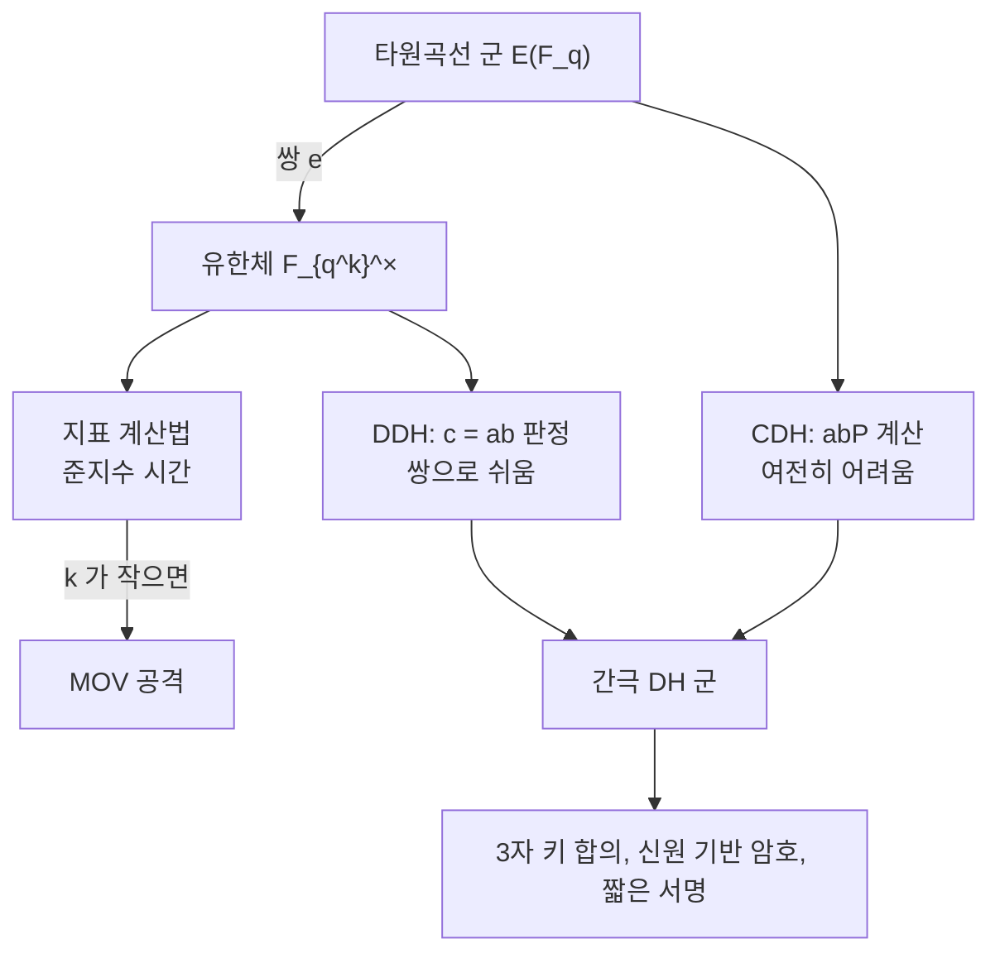

# 쌍선형 암호

# 개요

[타원곡선](elliptic-curves.md)의 비틀림점 사이에는 쌍선형 사상이 정의된다. 이 사상은 곡선의 군을 유한체의 곱셈군으로 옮긴다.

$$
e:E[r]\times E[r]\to\mu_r\subset\mathbb F_{q^k}^\times
$$

**MOV**(Menezes–Okamoto–Vanstone) 환산은 이 사상으로 타원곡선 이산로그를 유한체 이산로그로 옮긴다. 매장 차수 $k$ 가 작으면 지표 계산법이 준지수 시간에 풀어 버리므로 초특이 곡선은 일반 암호에서 배제되었다.

2000 년 무렵부터는 쌍선형성 자체가 구성 도구로 쓰인다. 세 사람의 한 번짜리 키 합의, 신원 기반 암호, 짧은 서명이 여기서 나왔다. 같은 구조가 취약점이 되느냐 기능이 되느냐는 $k$ 를 얼마로 잡느냐가 가른다.

# 직관

## 쌍선형성

쌍선형성은 다음 한 줄이다.

$$
e(aP,bQ)=e(P,Q)^{ab}
$$

곡선 위의 스칼라 곱이 유한체의 거듭제곱으로 번역되고, 곡선 군에서는 만날 수 없던 $a$ 와 $b$ 가 지수 자리에서 곱해진다. 공격 쪽에서는 $aP$ 에서 $a$ 를 찾는 문제가 $e(P,P)^a$ 에서 $a$ 를 찾는 유한체 이산로그로 환원된다. 구성 쪽에서는 지수의 곱셈을 확인하는 능력이 생긴다.

## 간극 Diffie–Hellman 군

$(P,aP,bP,cP)$ 에서 $c=ab$ 인지 판정하는 문제가 **DDH**(decisional Diffie–Hellman)다. 쌍이 있으면 $e(aP,bP)=e(P,cP)$ 인지 확인해 풀린다. 반면 $abP$ 를 계산하는 **CDH**(computational Diffie–Hellman)는 어렵다. $e(P,P)^{ab}$ 는 얻어도 그것을 곡선으로 되돌릴 수 없다.

DDH 는 쉽고 CDH 는 어려운 군을 **간극 Diffie–Hellman 군**이라 한다. 쌍 기반 구성은 이 비대칭에 기댄다.

## 매장 차수

$r$ 차 비틀림군 $E[r]$ 는 $(\mathbb Z/r\mathbb Z)^2$ 와 동형이라 원소가 $r^2$ 개다. 반면 기저체 $\mathbb F_q$ 위의 점 중 $r$ 차 비틀림은 대개 한 부분군 $r$ 개뿐이다.

쌍이 비퇴화하려면 서로 다른 두 부분군에서 점을 하나씩 가져와야 하므로, 두 번째 점이 확대체 $\mathbb F_{q^k}$ 위에 있어야 한다. 이 $k$ 가 매장 차수다.

$\mu_r\subset\mathbb F_{q^k}^\times$ 이므로 $r\mid q^k-1$ 이고 $k$ 는 이를 만족하는 최소의 지수다. 무작위 곡선에서 $k$ 는 $r$ 규모라 쌍을 계산할 수 없다. 쌍 암호는 $k$ 가 보통 12 이하인 특수한 곡선을 구성해 쓴다.

# 정의

## 비틀림 부분군

$$
E[r]=\lbrace P\in E(\bar{\mathbb F}\_q):rP=O\rbrace
$$

$\gcd(r,q)=1$ 이면 $E[r]\cong\mathbb Z/r\mathbb Z\times\mathbb Z/r\mathbb Z$ 다. 비틀림 부분군이 계수 2 인 자유 가군이므로 두 개의 독립한 부분군에서 인수를 취하는 쌍이 정의된다.

## 매장 차수

$r\mid\char35{}E(\mathbb F_q)$ 인 소수 $r$ 에 대해

$$
k=\min\lbrace k\ge1:\ r\mid q^k-1\rbrace
$$

초특이 곡선에서는 $k\le6$ 이고 표수 큰 경우 $k=2$ 다. 일반 곡선에서는 $k\approx r$ 이며, $k$ 가 작은 곡선은 Barreto–Naehrig 계열처럼 의도적으로 구성한다.

## Weil 쌍

$E[r]\times E[r]\to\mu_r$ 인 사상으로 다음 성질을 가진다.

- 쌍선형: $e(P_1+P_2,Q)=e(P_1,Q)e(P_2,Q)$ 이고 둘째 변수도 마찬가지다.
- 교대: $e(P,P)=1$ 이고 따라서 $e(P,Q)=e(Q,P)^{-1}$ 이다.
- 비퇴화: $P\ne O$ 면 $e(P,Q)\ne1$ 인 $Q$ 가 존재한다.
- Galois 동변: $e(\sigma P,\sigma Q)=\sigma(e(P,Q))$ 이다.

정의는 인자의 언어로 주어진다. $\mathrm{div}(f_P)=r[P]-r[O]$ 인 함수를 잡아 $e(P,Q)=f_P(Q)/f_Q(P)$ 로 쓰고, 극점은 평행이동으로 피한다.

## Tate 쌍

실무에서는 계산 비용이 절반인 Tate 쌍을 쓴다.

$$
\langle P,Q\rangle=f_{r,P}(Q)^{(q^k-1)/r}
$$

$f_{r,P}$ 는 인자가 $r[P]-r[O]$ 인 함수다. 마지막 거듭제곱이 **최종 멱승**이고, 값을 $\mu_r$ 로 보내 대표원의 모호성을 없앤다. Weil 쌍과 달리 $\langle P,P\rangle$ 은 자명하지 않을 수 있다.

## Miller 알고리즘

Miller 알고리즘은 $f_{r,P}$ 를 만들지 않고 $Q$ 에서의 값만 계산한다. $r$ 의 이진 전개를 따라 이중화와 덧셈을 하며 각 단계에서 직선과 수직선의 값을 곱하고 나눈다. 비용은 $O(\log r)$ 회의 곡선 연산으로 스칼라 곱과 같은 규모다.

# 성질

## MOV 환산

$P$ 의 위수가 $r$ 이고 $Q\in E[r]$ 를 $e(P,Q)\ne1$ 이 되도록 잡으면, $aP$ 에 대해

$$
e(aP,Q)=e(P,Q)^a
$$

이므로 $\mathbb F_{q^k}^\times$ 에서의 이산로그 한 번이 $a$ 를 준다.

유한체 이산로그는 지표 계산법으로 준지수 시간에 풀리고 곡선에서는 $O(\sqrt r)$ 이 최선이다. 따라서 $k$ 가 작으면 환산이 실질적인 공격이 되고, $k\le6$ 인 초특이 곡선은 일반 암호 용도에서 배제되었다. $k$ 가 $r$ 규모이면 $\mathbb F_{q^k}$ 가 너무 커서 환산이 무의미하며, 무작위로 뽑은 곡선은 거의 확실히 이 경우다.

## 파라미터의 균형

쌍 암호는 두 어려움을 맞춰야 한다. 곡선 쪽 비용은 $\sqrt r$ 이고 확대체 쪽 비용은 $\mathbb F_{q^k}$ 의 이산로그이며, 둘이 비슷해지도록 $k$ 를 고른다.

2016 년 Kim–Barbulescu 가 확대체 이산로그의 수체 체 거름법을 개선하면서 이 균형이 깨졌다. 128 비트 안전성으로 여겨지던 BN254 곡선이 100 비트 근처로 떨어졌고, 표준 곡선이 BN381 과 BLS12-381 로 옮겨 갔다.

## 작은 곡선에서의 Tate 쌍

$p=23$ 에서 $E:y^2=x^3+1$ 은 $p\equiv2\pmod3$ 이므로 초특이 곡선이고, $\char35{}E(\mathbb F_{23})=24$ 이며 매장 차수는 2 다. $r=3$ 으로 잡고 Tate 쌍을 계산한다.

초특이 곡선은 $\char35{}E(\mathbb F_p)=p+1$ 이고 Frobenius 의 고윳값이 $\pm i\sqrt p$ 이므로 확대체에서 위수가 완전제곱 $\char35{}E(\mathbb F_{p^2})=(p+1)^2=576$ 이 된다.

$P$ 는 $\mathbb F_p$ 좌표를 갖고 $Q$ 는 그렇지 않다. 쌍이 비퇴화하려면 두 점이 $E[3]\cong(\mathbb Z/3)^2$ 의 서로 다른 부분군에 있어야 하므로 $Q$ 는 확대체에서 나온다. $e(P,Q)=11+8i$ 는 $\mathbb F_{23^2}^\times$ 의 위수 3 인 원소다. $23^2-1=528=3\cdot176$ 이므로 $\mu_3$ 은 이 체 안에 있고 $22$ 가 3 으로 나뉘지 않으므로 $\mathbb F_{23}$ 안에는 없다.

# 활용

## 3자 키 합의

Diffie–Hellman 으로 세 사람이 공통 비밀을 만들려면 두 번의 왕복이 필요하다. Joux 의 프로토콜은 각자 $aP,bP,cP$ 를 한 번 뿌리는 것으로 끝난다. 각자가 받은 두 값으로 쌍을 계산하면

$$
e(bP,cP)^a=e(aP,cP)^b=e(aP,bP)^c=e(P,P)^{abc}
$$

로 같은 값에 도달한다. 2000 년에 발표된 이 프로토콜이 쌍을 구성 도구로 쓴 첫 결과다.

## 신원 기반 암호

공개키를 임의의 문자열로 삼는 구상은 1984 년 Shamir 가 제기했고 Boneh–Franklin 이 2001 년에 쌍으로 구현했다.

신뢰 기관이 마스터 비밀 $s$ 를 갖고 공개값 $sP$ 를 공표한다. 신원 문자열을 곡선 점으로 해싱한 $Q_{ID}$ 에 대해 개인키는 $sQ_{ID}$ 다. 송신자는 무작위 $t$ 로 $tP$ 와 $e(Q_{ID},sP)^t$ 로 마스킹한 메시지를 보내고, 수신자는 쌍선형성에 의해 값이 같은 $e(sQ_{ID},tP)$ 를 계산한다.

인증서 관리가 사라지는 대신 기관이 모든 개인키를 안다. 이 키 위탁 문제가 실제 배치를 제한했고, 속성 기반 암호와 함수 암호가 후속 구성으로 나왔다.

## 짧은 서명과 집계

BLS(Boneh–Lynn–Shacham) 서명은 $\sigma=xH(m)$ 이고 검증은 $e(\sigma,P)=e(H(m),xP)$ 다. 서명이 곡선 점 하나이므로 같은 안전성에서 ECDSA(elliptic curve digital signature algorithm)의 절반 길이다.

여러 서명을 더하면 하나의 짧은 서명이 되고 검증도 쌍 계산 한 묶음으로 끝난다. 이 집계 성질 때문에 수십만 명이 참여하는 지분증명 합의 프로토콜의 표준 서명이 되었다.

## 영지식 증명

zk-SNARK(zero-knowledge succinct non-interactive argument of knowledge)의 검증식은 쌍의 등식이다. 증명자가 다항식의 값을 곡선 점으로 약속하면 검증자는 그 점들 사이의 곱셈 관계를 쌍으로 확인한다. 곡선 군만으로는 덧셈밖에 확인할 수 없다.

증명 크기가 수백 바이트로 상수이고 검증이 쌍 몇 번으로 끝난다. 쌍 기반 SNARK 는 양자 공격에 취약하고 신뢰 설정이 필요하므로 해시 기반 STARK(scalable transparent argument of knowledge) 계열이 대안으로 연구된다.

## 양자 내성

쌍의 안전성은 이산로그에 의존하므로 Shor 알고리즘 앞에서 무너진다. [후양자 암호](post-quantum-cryptography.md)로의 전환에서 쌍 기반 구성은 전부 대체 대상이고, 격자 기반 신원 기반 암호와 해시 기반 서명이 후보다. 집계 서명과 상수 크기 증명을 격자에서 같은 효율로 재현하는 방법은 아직 없다.

# 연관 문서

## 선수지식

- [타원곡선과 군 구성](elliptic-curves.md)

## 더 알아보기

아직 연결한 문서가 없다.

#cryptography #number_theory #algebra
