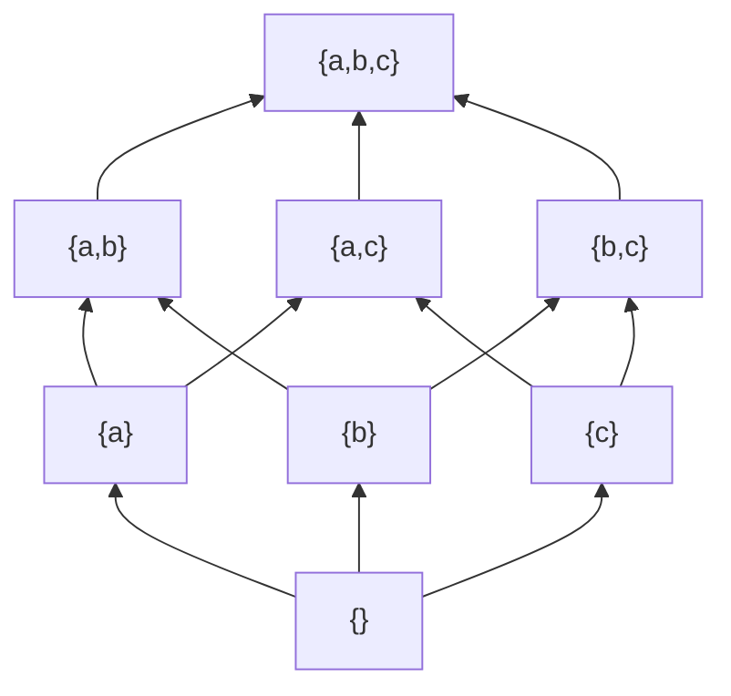

# 부분순서

# 개요

부분순서는 "비교할 수 없는 쌍이 있어도 괜찮은 순서" 다. 일상에서 순서라 하면 성적표나 줄서기처럼 모든 대상을 일렬로 세우는 것을 떠올리지만, 실제로 다루는 관계의 대부분은 그렇지 않다. 집합의 포함, 정수의 나눔, 작업의 의존, 타입의 상속, 명제의 함의는 모두 "어떤 두 대상은 서로 무관하다" 는 상태를 정상으로 허용한다.

[동치관계](relations.md)의 세 공리 중 대칭성 하나를 반대칭성으로 바꾸면 부분순서가 나온다. 동치관계가 "차이를 지우는" 장치였다면 부분순서는 "차이에 방향을 주는" 장치다. 같은 자리를 한 칸 비틀어 정반대 성격의 이론이 나오며, 이 문서가 다루는 대상은 그 후자다.

# 직관

## 비교 불가능성은 결함이 아니다

`{1}` 과 `{2}` 는 어느 쪽도 다른 쪽을 포함하지 않는다. 이것을 "아직 정하지 못한 순서" 로 보고 억지로 하나의 점수를 매기면, 원래 없던 정보를 지어내는 셈이 된다. 부분순서는 이 미결정 상태를 구조의 일부로 인정한다.

이 태도가 실질적인 차이를 만드는 자리가 있다. 여러 기준으로 대상을 평가할 때 "A 가 모든 기준에서 B 이상" 이면 A 를 택하는 것이 정당하지만, 서로 다른 기준에서 엇갈리면 어느 쪽도 우월하지 않다. 이 엇갈림의 집합, 곧 극대원소들의 모임이 Pareto 최적해다. 기준들을 가중합으로 뭉개면 하나의 답이 나오지만 그 답은 가중치를 고른 사람의 선택이지 데이터의 결론이 아니다.

## 화살표를 그리면 그래프가 된다

부분순서는 `x < y` 일 때 화살표를 그린 그래프로 볼 수 있고, 추이성으로 따라오는 화살표를 지우면 Hasse 도형이 남는다. 반대칭성과 추이성은 이 그래프에 방향 순환이 없다는 말과 같다. 그래서 부분순서와 [DAG](dag-topological.md)는 사실상 같은 대상을 다른 언어로 부른 것이다.



세 원소 집합의 멱집합이다. 아래에서 위로 포함이고, `{a,b}` 와 `{a,c}` 사이에는 선이 없다. Hasse 도형에서 선이 없다는 것과 관계가 없다는 것은 다르다. `{}` 에서 `{a,b}` 로 가는 직접 선은 없지만 두 원소는 관계되어 있다.

# 정의

## 부분순서 집합

집합 `P` 위의 이항관계 `≤` 가 임의의 `x, y, z ∈ P` 에 대해 다음 셋을 만족하면 부분순서다.

$$
\begin{aligned}
&x\le x &&\text{반사성}\\
&(x\le y\ \text{and}\ y\le x)\Rightarrow x=y &&\text{반대칭성}\\
&(x\le y\ \text{and}\ y\le z)\Rightarrow x\le z &&\text{추이성}
\end{aligned}
$$

`P` 와 `≤` 를 함께 지정한 대상을 부분순서 집합(poset)이라 한다. `x ≤ y` 이고 `x ≠ y` 이면 `x < y` 로 쓴다. 두 원소가 `x ≤ y` 도 `y ≤ x` 도 아니면 비교 불가능하다고 하고, 모든 쌍이 비교 가능하면 전순서다.

반대칭성은 대칭성의 부정이 아니다. 대칭성은 "관계되면 반대 방향도 관계된다" 이고 반대칭성은 "양방향으로 관계되는 것은 자기 자신뿐" 이다. 두 조건을 동시에 만족하는 관계는 등호뿐이다.

## 극대와 최대

| 이름 | 조건 | 유일성 |
|---|---|---|
| 최대원소 | 모든 `x` 에 대해 `x ≤ m` | 있으면 유일 |
| 극대원소 | `m < x` 인 `x` 가 없음 | 여럿 가능 |
| 상계 | 부분집합 `S` 의 모든 원소보다 크거나 같음 | 여럿 가능 |
| 상한 | 상계 중 최소인 것 | 있으면 유일 |

최소·극소·하계·하한은 방향을 뒤집어 같게 정의한다. `{2, 3, 6}` 을 나눔 관계로 보면 `2` 와 `3` 이 극소원소이고 최소원소는 없으며 `6` 은 최대원소다. 최대와 극대를 혼동하면 "극대원소가 유일하니 최대원소" 라는 잘못된 추론을 하게 되는데, 유한 poset 에서는 참이지만 무한에서는 거짓이다.

## 쌍대성

`x ≤* y` 를 `y ≤ x` 로 정의하면 `≤*` 도 부분순서다. 이를 쌍대 순서라 하고 `P^op` 로 쓴다. 부분순서에 관한 모든 정리는 부등호 방향을 전부 뒤집은 정리를 쌍으로 가진다. 최대와 최소, 상한과 하한, 극대와 극소가 그렇게 짝지어진다. 증명을 한 번만 하면 되는 이 절약은 [범주](category.md)의 쌍대성으로 그대로 이어진다.

## 격자

모든 두 원소가 상한과 하한을 가지면 격자다. 상한을 `x ∨ y`, 하한을 `x ∧ y` 로 쓴다. 멱집합은 합집합과 교집합으로 격자이고, 양의 정수의 나눔 관계는 최소공배수와 최대공약수로 격자다. 격자에 분배법칙과 보원을 더하면 [Boolean algebra](boolean-algebras.md)이고, 보원 대신 더 약한 조건을 두면 [Heyting algebra](heyting-algebras.md)가 된다.

# 성질

## 선형 확장은 항상 존재한다

유한 poset `P` 의 부분순서를 보존하는 전순서를 선형 확장이라 한다. 극소원소를 하나 골라 맨 앞에 놓고 남은 집합에서 반복하면 구성되며, 이것이 위상정렬 알고리즘이다. 극소원소가 항상 존재한다는 사실이 유한성에서 나오고, 무한 poset 에서는 [선택공리](axiom-of-choice.md)에 해당하는 원리가 필요하다.

비교 불가능한 쌍의 상대 순서는 자유롭게 정할 수 있으므로 선형 확장은 대개 여럿이다. 선형 확장의 개수는 poset 이 얼마나 전순서에서 먼지를 재는 척도이고, 이 값을 세는 문제는 `#P`-완전이다. 위상정렬 결과 하나를 유일한 정답처럼 다루면 안 되는 이유가 여기 있다.

```python
def linear_extensions(elements, leq):
    """모든 선형 확장을 나열한다. leq(x, y)는 x <= y 여부."""
    if not elements:
        yield []
        return
    for x in elements:
        # x보다 엄밀히 작은 원소가 남아 있으면 아직 x를 놓을 수 없다
        if any(y != x and leq(y, x) for y in elements):
            continue
        rest = [y for y in elements if y != x]
        for tail in linear_extensions(rest, leq):
            yield [x] + tail


divides = lambda a, b: b % a == 0
print(sum(1 for _ in linear_extensions([1, 2, 3, 4, 6, 12], divides)))  # 5
```

## 사슬과 반사슬

원소들이 서로 모두 비교 가능한 부분집합을 사슬, 서로 모두 비교 불가능한 부분집합을 반사슬이라 한다. Dilworth 정리는 유한 poset 을 덮는 데 필요한 사슬의 최소 개수가 최대 반사슬의 크기와 같다고 말한다. Mirsky 정리는 방향을 뒤집어 반사슬 덮개의 최소 개수가 최대 사슬의 길이와 같다고 말한다.

이 두 정리는 "쌓아 올릴 수 있는 깊이" 와 "동시에 처리할 수 있는 폭" 이 서로를 결정한다는 뜻이다. 작업 의존 그래프라면 최대 사슬은 총 소요 시간의 하한이고, 최대 반사슬은 병렬화로 얻을 수 있는 이득의 상한이다. Dilworth 정리는 [매칭](matchings.md)의 Hall 정리와 동치이며 최소 사슬 덮개는 이분 그래프 최대 매칭으로 계산한다.

## 사다리꼴 조건과 귀납

`P` 의 모든 공집합 아닌 부분집합이 최소원소를 가지면 정렬 순서다. 정렬 순서에서는 초한귀납법이 성립하고, 이것이 [서수](ordinals.md)를 다루는 기반이 된다. 더 약하게 무한 하강 사슬이 없기만 하면 well-founded 라 하며 구조적 귀납과 재귀 정의는 이 조건 위에서 정당화된다. 종료하는 알고리즘의 정지 증명이 대개 "각 단계마다 어떤 well-founded 순서에서 엄밀히 감소한다" 는 형태인 것도 같은 이유다.

## poset 은 범주다

`P` 의 원소를 대상으로 삼고 `x ≤ y` 일 때 `x` 에서 `y` 로 가는 사상을 정확히 하나 두면 [범주](category.md)가 된다. 반사성이 항등사상, 추이성이 합성이고, 반대칭성은 동형인 두 대상이 같다는 조건에 해당한다. 이 관점에서 상한은 쌍대곱, 하한은 곱, 최대원소는 종대상이다. 사상이 많아야 두 대상 사이에 하나뿐이므로 poset 은 범주론의 명제를 부등식으로 확인해 보는 가장 작은 시험장이 된다.

# 활용

## 의존과 스케줄링

빌드 시스템, 패키지 관리자, 작업 스케줄러는 모두 "A 를 먼저 해야 B 를 할 수 있다" 는 부분순서를 다룬다. 순환이 생기면 순서가 존재하지 않으므로 반대칭성과 추이성의 위반을 감지하는 것이 이들 도구의 첫 번째 검사다. 최대 사슬이 임계 경로이고 반사슬이 동시 실행 가능한 작업 묶음이다.

## 논리와 타입

명제들을 함의로 순서지으면 격자가 되고, 합취와 이접이 하한과 상한이다. 직관주의 논리에서는 보원이 없어 Heyting algebra 가 되며, 가능세계 사이의 접근가능성을 부분순서로 둔 것이 [Kripke 의미론](kripke-semantics.md)이다. 타입 시스템의 서브타이핑도 부분순서이고, 최소 상계가 존재해야 조건식의 타입을 결정할 수 있다.

## 정보의 근사

계산 과정의 중간 상태를 "아직 덜 알려진 값" 으로 보고 정보량으로 순서지으면, 재귀 정의의 해는 그 순서에서의 최소 부동점이 된다. 여기서 부분순서는 크기가 아니라 확정된 정보의 양을 재며, 비교 불가능성은 서로 모순되는 두 부분 정보를 뜻한다.[^1]

[^1]: William T. Trotter, *Partially Ordered Sets*, in Handbook of Combinatorics. 사슬·반사슬과 Dilworth 정리, 선형 확장의 조합론.

# 연관 문서

## 선수지식

- [동치관계와 동치류](relations.md)

## 더 알아보기

- [DAG와 위상정렬](dag-topological.md)
- [범주](category.md)
- [직관주의 논리의 Kripke 의미론](kripke-semantics.md)
- [선택공리와 Zorn 보조정리](axiom-of-choice.md)
- [서수와 초한귀납법](ordinals.md)
- [Heyting algebra](heyting-algebras.md)
- [Boolean algebra](boolean-algebras.md)

#order_theory #set_theory
