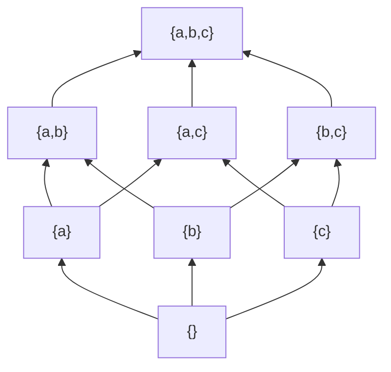

# 부분순서

# 개요

부분순서는 비교할 수 없는 쌍을 허용하는 순서다. 집합의 포함, 정수의 나눔, 작업의 의존, 타입의 상속, 명제의 함의가 모두 여기 속한다. 이 관계들에서 두 대상이 서로 무관한 것은 정상 상태다.

[동치관계](relations.md)의 세 공리 가운데 대칭성을 반대칭성으로 바꾸면 부분순서가 된다. 동치관계는 차이를 지우고 부분순서는 차이에 방향을 준다.

# 직관

## 비교 불가능성

$\lbrace 1\rbrace$ 과 $\lbrace 2\rbrace$ 는 어느 쪽도 다른 쪽을 포함하지 않는다. 부분순서는 이 미결정 상태를 구조의 일부로 인정하고, 억지로 하나의 점수를 매기지 않는다.

여러 기준으로 대상을 평가할 때 A 가 모든 기준에서 B 이상이면 A 를 택한다. 기준마다 우열이 엇갈리는 쌍은 비교 불가능하고, 이때의 극대원소 모임이 Pareto 최적해다. 기준들을 가중합으로 묶으면 답이 하나로 좁혀지지만 그 답은 가중치의 선택에 달려 있다.

## Hasse 도형

부분순서는 $x\lt y$ 일 때 화살표를 그린 그래프로 볼 수 있고, 추이성으로 따라오는 화살표를 지우면 Hasse 도형이 남는다. 반대칭성과 추이성은 이 그래프에 방향 순환이 없다는 조건과 같으므로 부분순서와 [DAG](dag-topological.md)는 같은 대상이다.

세 원소 집합의 멱집합이다. 아래에서 위로 포함이고 $\lbrace a,b\rbrace$ 와 $\lbrace a,c\rbrace$ 는 비교 불가능하다. 선이 없는 것과 관계가 없는 것은 다르다. $\lbrace\rbrace$ 에서 $\lbrace a,b\rbrace$ 로 가는 직접 선은 없지만 두 원소는 관계되어 있다.

# 정의

## 부분순서 집합

집합 $P$ 위의 이항관계 $\le$ 가 임의의 $x, y, z \in P$ 에 대해 다음 셋을 만족하면 부분순서다.

$$
\begin{aligned}
&x\le x &&\text{반사성}\cr
&(x\le y\ \text{and}\ y\le x)\Rightarrow x=y &&\text{반대칭성}\cr
&(x\le y\ \text{and}\ y\le z)\Rightarrow x\le z &&\text{추이성}
\end{aligned}
$$

$P$ 와 $\le$ 를 함께 지정한 대상을 부분순서 집합(poset)이라 한다. $x \le y$ 이고 $x \ne y$ 이면 $x \lt y$ 로 쓴다. 두 원소가 $x \le y$ 도 $y \le x$ 도 아니면 비교 불가능하다고 하고, 모든 쌍이 비교 가능하면 전순서다.

반대칭성은 대칭성의 부정이 아니다. 대칭성은 관계되면 반대 방향도 관계된다는 조건이고, 반대칭성은 양방향으로 관계되는 것이 자기 자신뿐이라는 조건이다. 두 조건을 동시에 만족하는 관계는 등호뿐이다.

## 극대와 최대

| 이름 | 조건 | 유일성 |
|---|---|---|
| 최대원소 | 모든 $x$ 에 대해 $x \le m$ | 있으면 유일 |
| 극대원소 | $m \lt x$ 인 $x$ 가 없음 | 여럿 가능 |
| 상계 | 부분집합 $S$ 의 모든 원소보다 크거나 같음 | 여럿 가능 |
| 상한 | 상계 중 최소인 것 | 있으면 유일 |

최소, 극소, 하계, 하한은 방향을 뒤집어 같게 정의한다. $\lbrace 2, 3, 6\rbrace$ 을 나눔 관계로 보면 $2$ 와 $3$ 이 극소원소이고 최소원소는 없으며 $6$ 은 최대원소다. 극대원소가 유일하면 최대원소라는 명제는 유한 poset 에서만 참이다.

## 쌍대성

$x \le^\ast y$ 를 $y \le x$ 로 정의하면 $\le^\ast$ 도 부분순서다. 이것이 쌍대 순서 $P^{\mathrm{op}}$ 다. 부분순서에 관한 정리는 부등호 방향을 뒤집은 정리를 쌍으로 가지며, 최대와 최소, 상한과 하한, 극대와 극소가 짝지어진다. 같은 쌍대성이 [범주](category.md)에서 되풀이된다.

## 격자

모든 두 원소가 상한과 하한을 가지는 poset 이 격자다. 상한을 $x \vee y$ , 하한을 $x \wedge y$ 로 쓴다. 멱집합은 합집합과 교집합으로 격자이고, 양의 정수의 나눔 관계는 최소공배수와 최대공약수로 격자다. 격자에 분배법칙과 보원을 더하면 [Boolean algebra](boolean-algebras.md)이고, 보원 대신 더 약한 조건을 두면 [Heyting algebra](heyting-algebras.md)가 된다.

# 성질

## 선형 확장

유한 poset $P$ 의 부분순서를 보존하는 전순서가 선형 확장이고, 유한 poset 에는 항상 존재한다. 극소원소를 하나 골라 맨 앞에 놓고 남은 집합에서 반복하는 위상정렬 알고리즘이 구성을 준다. 무한 poset 에서는 [선택공리](axiom-of-choice.md)에 해당하는 원리가 필요하다.

비교 불가능한 쌍의 상대 순서는 자유로우므로 선형 확장은 대개 여럿이다. 선형 확장의 개수는 poset 이 전순서에서 얼마나 먼지를 재고, 이 값을 세는 문제는 $\char35{}\mathrm P$ 완전이다.

## 사슬과 반사슬

원소들이 서로 모두 비교 가능한 부분집합을 사슬, 서로 모두 비교 불가능한 부분집합을 반사슬이라 한다. Dilworth 정리는 유한 poset 을 덮는 데 필요한 사슬의 최소 개수가 최대 반사슬의 크기와 같다고 말한다. Mirsky 정리는 방향을 뒤집어 반사슬 덮개의 최소 개수가 최대 사슬의 길이와 같다고 말한다.

작업 의존 그래프에서 최대 사슬은 총 소요 시간의 하한이고 최대 반사슬은 병렬화로 얻을 수 있는 이득의 상한이다. Dilworth 정리는 [매칭](matchings.md)의 Hall 정리와 동치이고, 최소 사슬 덮개는 이분 그래프 최대 매칭으로 계산한다.

## 정렬 순서와 well-founded 관계

$P$ 의 모든 공집합 아닌 부분집합이 최소원소를 가지면 정렬 순서다. 정렬 순서에서는 초한귀납법이 성립하고 [서수](ordinals.md) 이론이 여기 선다. 무한 하강 사슬이 없기만 하면 well-founded 라 하며 구조적 귀납과 재귀 정의가 이 조건 위에서 정당화된다. 알고리즘의 정지 증명은 각 단계마다 어떤 well-founded 순서에서 엄밀히 감소함을 보이는 형태다.

## 범주 구조

$P$ 의 원소를 대상으로 삼고 $x \le y$ 일 때 $x$ 에서 $y$ 로 가는 사상을 정확히 하나 두면 [범주](category.md)가 된다. 반사성이 항등사상, 추이성이 합성이며, 반대칭성은 동형인 두 대상이 같다는 조건이다. 이 범주에서 상한은 쌍대곱, 하한은 곱, 최대원소는 종대상이다. 두 대상 사이의 사상이 많아야 하나이므로 범주론의 명제가 부등식으로 환원된다.

# 활용

## 의존과 스케줄링

빌드 시스템, 패키지 관리자, 작업 스케줄러는 선행 관계라는 부분순서를 다룬다. 순환이 생기면 선형 확장이 없으므로 반대칭성과 추이성의 위반을 먼저 검사한다. 최대 사슬이 임계 경로이고 반사슬이 동시 실행 가능한 작업 묶음이다.

## 논리와 타입

명제를 함의로 순서지으면 격자가 되고 합취와 이접이 하한과 상한이다. 직관주의 논리에서는 보원이 없어 Heyting algebra 가 된다. 가능세계 사이의 접근가능성을 부분순서로 둔 것이 [Kripke 의미론](kripke-semantics.md)이다. 타입 시스템의 서브타이핑도 부분순서이고, 조건식의 타입은 두 가지의 최소 상계다.

## 정보의 근사

계산 과정의 중간 상태를 확정된 정보의 양으로 순서지으면 재귀 정의의 해가 그 순서의 최소 부동점이 된다. 이 순서에서 비교 불가능성은 서로 모순되는 두 부분 정보다.[^1]

[^1]: William T. Trotter, *Partially Ordered Sets*, in Handbook of Combinatorics. 사슬·반사슬과 Dilworth 정리, 선형 확장의 조합론.

# 연관 문서

## 선수지식

- [동치관계와 동치류](relations.md)

## 더 알아보기

### 순서와 격자

- [Galois 연결과 완비 격자](galois-connections.md)
- [Boolean algebra](boolean-algebras.md)
- [Heyting algebra](heyting-algebras.md)

### 집합론

- [서수와 초한귀납법](ordinals.md)
- [선택공리와 Zorn 보조정리](axiom-of-choice.md)

### 그래프, 범주, 논리

- [DAG와 위상정렬](dag-topological.md)
- [범주](category.md)
- [직관주의 논리의 Kripke 의미론](kripke-semantics.md)

#order_theory #set_theory
