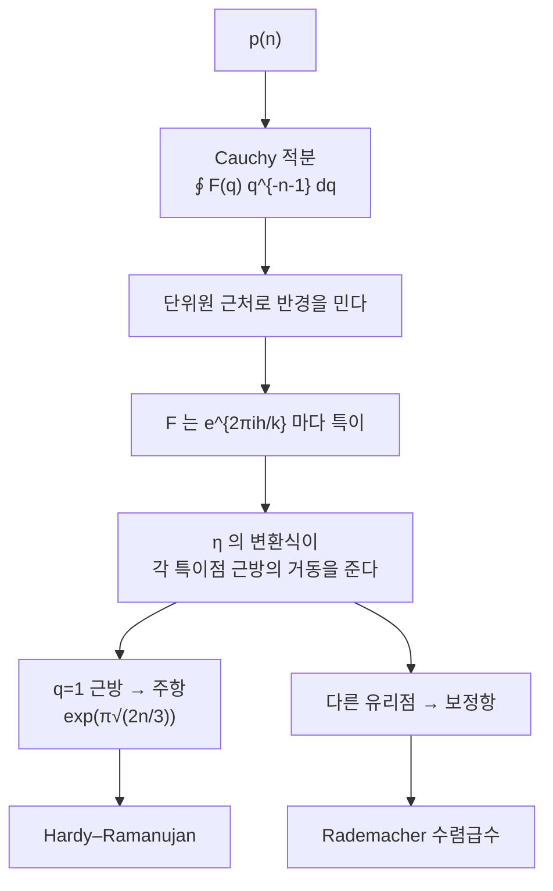

# 분할수와 원법

# 개요

`n` 을 양의 정수의 합으로 쓰는 방법의 수를 `p(n)` 이라 한다. 순서는 무시한다. `4=4=3+1=2+2=2+1+1=1+1+1+1` 이므로 `p(4)=5` 다.

[생성함수](generating-functions.md)는 즉시 나온다.

$$
\sum_{n\ge0}p(n)q^n=\prod_{k\ge1}\frac1{1-q^k}
$$

그런데 여기서 멈추면 아무것도 얻지 못한다. `p(n)` 에는 닫힌 공식이 없고, 점화식으로 계산할 수는 있어도 얼마나 빨리 자라는지가 보이지 않는다. `p(100)=190569292` 인데 이 크기를 조합적 논증만으로 설명하기는 어렵다.

돌파구는 생성함수를 복소함수로 보는 것이었다. $F(q)=\prod(1-q^k)^{-1}$ 은 단위원 안에서 정칙이고 단위원 위의 모든 유리점에서 폭발한다. Cauchy 적분으로 `p(n)` 을 뽑되 각 특이점 근방의 거동을 알면 점근식이 나온다. 그 거동을 주는 것이 [모듈러 형식](modular-forms.md)의 변환 규칙, 구체적으로는 Dedekind eta 함수의 $\tau\mapsto-1/\tau$ 변환식이다.

$$
p(n)\sim\frac1{4n\sqrt3}\exp\Big(\pi\sqrt{\tfrac{2n}3}\Big)
$$

Hardy 와 Ramanujan 이 1918 년에 얻은 이 결과가 **원법**의 출발점이며, 이후 가법적 정수론의 표준 도구가 되었다.

# 직관

## 곱은 선택의 기록이다

$\frac1{1-q^k}=1+q^k+q^{2k}+\cdots$ 이므로, 이 인자에서 `q^{mk}` 를 고르는 것은 "부분 `k` 를 `m` 번 쓴다" 는 뜻이다. 모든 `k` 에 대해 곱하면 각 항이 하나의 분할에 대응하고, `q^n` 의 계수가 `p(n)` 이 된다.

변형도 같은 방식으로 읽는다. 서로 다른 부분만 쓰려면 $\prod(1+q^k)$, 홀수 부분만 쓰려면 $\prod_{k\ \mathrm{odd}}(1-q^k)^{-1}$ 이다. 이 둘이 같다는 Euler 의 항등식은 두 곱이 같은 급수를 준다는 계산으로 끝난다.

## 왜 점근식이 어려운가

`p(n)` 의 증가 속도는 $\exp(c\sqrt n)$ 이다. 다항식보다 빠르고 지수보다 느리다. 이런 중간 속도는 단순한 조합 논증으로 나오지 않는다.

상하계를 대충 잡아 보면 왜 그런지 보인다. 부분의 크기를 대략 $\sqrt n$ 규모로 $\sqrt n$ 개 쓰는 분할이 가장 많고, 그 개수를 세면 지수에 $\sqrt n$ 이 들어온다. 하지만 이 논증은 상수 $c=\pi\sqrt{2/3}$ 를 주지 못한다. 정확한 상수를 얻으려면 생성함수의 해석적 성질이 필요하다.

## 원법

`p(n)` 은 Cauchy 적분으로 꺼낼 수 있다.

$$
p(n)=\frac1{2\pi i}\oint_{|q|=r}\frac{F(q)}{q^{n+1}}\,dq\qquad(0<r<1)
$$

$r\to1$ 로 보내면 분모 `q^{n+1}` 이 작아져 유리하지만 `F` 가 폭발한다. 두 효과의 균형점에서 주된 기여가 나온다.

핵심은 `F` 의 폭발 방식이 단위원 위의 유리점 $e^{2\pi ih/k}$ 마다 다르다는 것이다. 분모가 작은 유리점일수록 더 심하게 폭발하며, `q=1` 이 가장 강하다. 그래서 `q=1` 근방의 작은 호에서 주항이 나오고, 나머지 호들이 보정항과 오차를 준다.



`q=1` 근방의 거동을 어떻게 아는가. $q=e^{2\pi i\tau}$ 로 두면 $q\to1$ 은 $\tau\to0$ 이고, 이는 $\mathbb H$ 의 첨점이 아니라 실축 위의 점이다. 여기서 Dedekind eta 의 변환식

$$
\eta\Big(-\frac1\tau\Big)=\sqrt{-i\tau}\,\eta(\tau)
$$

이 $\tau\to0$ 의 문제를 $\tau\to i\infty$ 의 문제로 바꿔 준다. 후자에서는 `q` 전개의 첫 항만 보면 되므로 거동이 즉시 읽힌다. 모듈러 대칭이 어려운 극한을 쉬운 극한으로 옮기는 것이 원법의 기술적 심장이다.

# 정의

## 분할

$n=\lambda_1+\cdots+\lambda_r$, $\lambda_1\ge\cdots\ge\lambda_r\ge1$ 를 `n` 의 분할이라 하고 그 개수를 `p(n)` 이라 한다. `p(0)=1` 로 약속한다.

Ferrers 도표는 `i` 번째 줄에 $\lambda_i$ 개의 점을 찍은 그림이다. 행과 열을 바꾸면 켤레 분할이 되고, 이 대합이 여러 항등식을 즉시 준다. 예를 들어 "부분이 `m` 개 이하인 분할" 과 "부분이 모두 `m` 이하인 분할" 의 개수가 같다.

## 생성함수와 오각수 정리

$$
F(q)=\sum_{n\ge0}p(n)q^n=\prod_{k\ge1}\frac1{1-q^k}
$$

역수 쪽이 놀랍도록 성기다. Euler 의 오각수 정리다.

$$
\prod_{k\ge1}(1-q^k)=\sum_{j\in\mathbb Z}(-1)^jq^{j(3j-1)/2}
=1-q-q^2+q^5+q^7-q^{12}-q^{15}+\cdots
$$

지수에 나오는 `j(3j-1)/2` 가 오각수다. 무한곱을 전개하면 대부분의 항이 상쇄되고 오각수 지수만 남는다는 사실이며, 부호를 바꾸는 대합을 만들어 조합적으로 증명한다.

이 정리가 $F(q)\cdot\prod(1-q^k)=1$ 과 결합해 점화식을 준다.

$$
p(n)=\sum_{j\ge1}(-1)^{j+1}\Big[p\big(n-\tfrac{j(3j-1)}2\big)+p\big(n-\tfrac{j(3j+1)}2\big)\Big]
$$

항의 개수가 $O(\sqrt n)$ 이라 `p(n)` 을 빠르게 계산할 수 있다.

## Dedekind eta

$$
\eta(\tau)=q^{1/24}\prod_{k\ge1}(1-q^k),\qquad q=e^{2\pi i\tau}
$$

$\eta$ 는 무게 `1/2` 의 모듈러 형식처럼 변환한다.

$$
\eta(\tau+1)=e^{\pi i/12}\eta(\tau),\qquad
\eta\Big(-\frac1\tau\Big)=\sqrt{-i\tau}\,\eta(\tau)
$$

그러므로 $F(q)=q^{1/24}/\eta(\tau)$ 이고, 분할 생성함수가 모듈러 대상의 역수다. $\eta^{24}=\Delta$ 이므로 판별식 형식과도 직접 이어진다.

# 성질

## Hardy–Ramanujan 과 Rademacher

원법을 `q=1` 근방에서만 적용하면 주항이 나온다.

$$
p(n)\sim\frac1{4n\sqrt3}\,e^{\pi\sqrt{2n/3}}
$$

수렴은 느리다. `n=400` 에서도 오차가 2 퍼센트 남는다. 다른 유리점의 기여를 모두 더하면 개선되는데, Rademacher 는 이 급수가 수렴할 뿐 아니라 `p(n)` 을 **정확히** 준다는 것을 보였다.

$$
p(n)=\frac1{\pi\sqrt2}\sum_{k\ge1}A_k(n)\sqrt k\,\frac{d}{dn}\left(\frac{\sinh\big(\frac\pi k\sqrt{\frac23(n-\frac1{24})}\big)}{\sqrt{n-\frac1{24}}}\right)
$$

`A_k(n)` 은 Kloosterman 합 꼴의 유한합이다. 정수를 주는 무한급수라는 점이 기이하고, 실제로 몇 항만 더해 반올림하면 `p(n)` 이 나온다.

## Ramanujan 합동

`p(n)` 의 값 표를 보던 Ramanujan 이 발견한 규칙이다.

$$
p(5n+4)\equiv0\ (5),\qquad p(7n+5)\equiv0\ (7),\qquad p(11n+6)\equiv0\ (11)
$$

`5,7,11` 에서만 이런 깔끔한 형태가 나오고 `2,3,13` 에는 없다. 증명은 생성함수의 항등식으로 한다. 예를 들어

$$
\sum_{n\ge0}p(5n+4)q^n=5\prod_{k\ge1}\frac{(1-q^{5k})^5}{(1-q^k)^6}
$$

이고 우변에 5 가 붙어 있다. 이런 항등식이 $\eta$ 몫들이 모듈러 곡선 위의 함수라는 사실에서 나온다.

왜 하필 `5,7,11` 인가에는 더 나은 설명이 있다. Dyson 이 분할에 rank 라는 통계량을 붙여 `5,7` 의 경우를 다섯 덩이, 일곱 덩이로 실제로 나눌 수 있다고 추측했고, `11` 에는 rank 가 통하지 않아 crank 라는 다른 통계량이 필요하다고 예측했다. crank 는 1988 년에 Andrews 와 Garvan 이 찾았다. 합동이 단순한 나눗셈이 아니라 분할 집합의 실제 분할이었던 것이다.

한편 `p(n)` 의 합동은 이 셋으로 끝나지 않는다. Ono 는 5 이상의 모든 소수 $\ell$ 에 대해 어떤 등차수열에서 $p(n)\equiv0\pmod\ell$ 이 성립함을 증명했다. 증명은 $\eta$ 몫에 붙는 Galois 표현을 쓴다.

## 원법의 일반적 쓸모

Hardy–Littlewood 가 이 방법을 가법적 문제 전반으로 확장했다.

- **Waring 문제.** 모든 큰 정수를 `s` 개의 `k` 제곱수의 합으로 쓸 수 있는가. 주 호에서 나오는 특이급수가 답의 개수에 대한 점근식을 준다.
- **삼소수 정리.** 충분히 큰 홀수는 세 소수의 합이다. Vinogradov 가 원법으로 증명했다.
- **Goldbach.** 짝수 경우는 주 호와 부 호의 균형이 깨져 원법만으로는 닿지 않는다. 이 실패가 방법의 한계를 보여준다.

공통 구조는 같다. 생성함수를 만들고, 단위원을 주 호와 부 호로 나누고, 주 호에서 주항을 계산하고, 부 호를 오차로 통제한다. 분할 문제에서는 모듈러 변환식이 주 호의 계산을 정확하게 만들어 줘서 오차 없는 공식까지 나아갈 수 있었다.

# 활용

## 계산으로 확인한다

```python
import math

N = 400
p = [0]*(N + 1); p[0] = 1
for k in range(1, N + 1):                       # 부분 k 를 허용하며 누적
    for n in range(k, N + 1): p[n] += p[n - k]
print("p(0..10) =", p[:11])
print("p(100) =", p[100], " p(200) =", p[200])

# 오각수 정리에서 나오는 점화식으로 교차검증
q = [0]*(N + 1); q[0] = 1
for n in range(1, N + 1):
    k, s = 1, 0
    while True:
        g1, g2 = k*(3*k - 1)//2, k*(3*k + 1)//2
        if g1 > n: break
        sign = -1 if k % 2 == 0 else 1
        s += sign*q[n - g1] + (sign*q[n - g2] if g2 <= n else 0)
        k += 1
    q[n] = s
print("오각수 점화식과 일치 :", p == q)

hr = lambda n: math.exp(math.pi*math.sqrt(2*n/3))/(4*n*math.sqrt(3))
print("\n   n        p(n)              HR 점근식        비율")
for n in (10, 50, 100, 200, 400):
    print(f" {n:>4}  {p[n]:>18}  {hr(n):>16.4e}   {hr(n)/p[n]:.4f}")

print("\nRamanujan 합동")
for a, m in ((4, 5), (5, 7), (6, 11), (3, 5)):
    ok = all(p[m*n + a] % m == 0 for n in range((N - a)//m + 1))
    print(f"  p({m}n+{a}) ≡ 0 (mod {m}) : {ok}")

# p(0..10) = [1, 1, 2, 3, 5, 7, 11, 15, 22, 30, 42]
# p(100) = 190569292  p(200) = 3972999029388
# 오각수 점화식과 일치 : True
#
#    n        p(n)              HR 점근식        비율
#    10                  42        4.8104e+01   1.1453
#    50              204226        2.1759e+05   1.0654
#   100           190569292        1.9928e+08   1.0457
#   200       3972999029388        4.1003e+12   1.0320
#   400  6727090051741041926        6.8785e+18   1.0225
#
# Ramanujan 합동
#   p(5n+4) ≡ 0 (mod 5) : True
#   p(7n+5) ≡ 0 (mod 7) : True
#   p(11n+6) ≡ 0 (mod 11) : True
#   p(5n+3) ≡ 0 (mod 5) : False
```

두 계산 경로가 일치한다. 하나는 부분을 하나씩 허용하는 단순 동적 계획법이고 다른 하나는 오각수 정리의 점화식이다. 후자는 항이 $O(\sqrt n)$ 개뿐이라 훨씬 빠르다.

Hardy–Ramanujan 점근식의 비율이 `n=400` 에서도 `1.02` 다. 수렴이 느린 이유는 보정항이 `n^{-1/2}` 규모로 줄기 때문이며, Rademacher 급수가 이 항들을 전부 되살린다.

마지막 줄의 `p(5n+3)` 은 통제군이다. 법 5 의 합동이 잔여류 `4` 에서만 성립하고 `3` 에서는 성립하지 않는다. 합동이 우연한 관찰이 아니라 특정 잔여류에 붙은 구조라는 확인이다.

## 어디에 쓰이는가

- **대칭군의 표현.** `S_n` 의 기약표현은 `n` 의 분할과 일대일 대응한다. 그래서 `p(n)` 이 기약표현의 개수이고, 켤레류의 개수이기도 하다. Young 도표의 조합이 표현론의 계산을 그대로 대신한다.
- **통계역학.** 에너지 준위가 정수인 보손계의 상태수가 분할수다. $\log p(n)\sim c\sqrt n$ 이 엔트로피를 주고, 여기서 Hagedorn 온도 같은 물리량이 나온다.
- **가환대수와 기하.** 유한 아벨 `p` 군의 동형류가 분할로 분류되고, Hilbert 스킴과 Nakajima 다양체의 셈 문제에서도 분할이 기본 단위로 등장한다.
- **정수론의 도구.** $\eta$ 몫이 만드는 모듈러 형식들은 theta 급수와 함께 이차형식의 표현 개수를 세는 데 쓰인다. 분할이라는 조합 문제에서 출발한 함수가 산술의 도구가 된 것이다.

# 연관 문서

## 선수지식

- [생성함수](generating-functions.md)
- [모듈러 형식](modular-forms.md)
- [Laplace 방법과 안장점](laplace-method.md)

## 더 알아보기

- [Dyson 의 rank 와 crank](dyson-rank-crank.md)

#combinatorics #number_theory #complex_analysis
