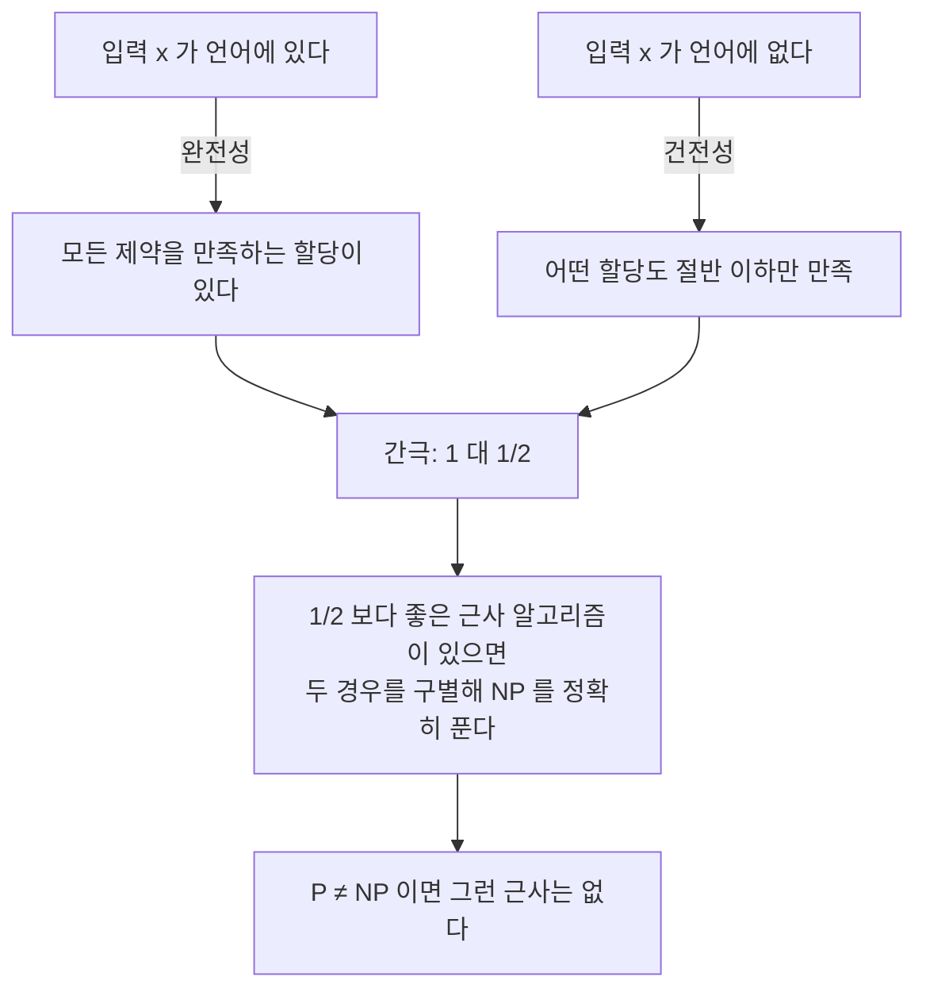

# PCP 정리와 근사 불가능성

# 개요

[근사 알고리즘](approximation-algorithms.md)은 NP-어려운 문제를 정확히 풀지 못하는 대신 보장된 비율의 답을 낸다. 자연히 따라오는 질문이 있다. 비율을 얼마나 좋게 만들 수 있는가? 어떤 문제는 임의로 좋은 근사가 가능하고(FPTAS), 어떤 문제는 어느 선에서 멈춘다. 그 선이 어디인지를 알고리즘 설계로는 알 수 없다. 더 나은 알고리즘을 못 찾은 것인지 존재하지 않는 것인지 구별할 방법이 없기 때문이다.

**PCP 정리**가 그 구별을 가능하게 한다. 1992 년에 완성된 이 정리는 NP 를 전혀 다른 방식으로 기술한다.

$$
\mathsf{NP}=\mathsf{PCP}(\log n,\ O(1))
$$

읽는 법은 이렇다. NP 문제의 증명은 항상 **무작위 `O(\log n)` 비트를 써서 상수 개 비트만 읽고 검증할 수 있는 형태**로 다시 쓸 수 있다. 옳은 주장에는 검증자가 반드시 통과시키는 증명이 있고, 틀린 주장에는 어떤 증명을 내밀어도 검증자가 최소 절반의 확률로 잡아낸다. 증명 전체를 읽지 않고 세 비트만 보고도 그렇다는 것이 이 정리의 놀라운 부분이다.

근사와의 연결은 이 서술을 뒤집는 데서 나온다. 검증자를 제약충족 문제로 번역하면, 옳은 입력에서는 모든 제약을 만족할 수 있고 틀린 입력에서는 어떤 할당도 절반 이상을 만족시키지 못한다. 두 경우 사이에 **간극**이 생기고, 간극을 좁히는 근사 알고리즘이 있다면 그것으로 원래 NP 문제를 정확히 풀 수 있다. 그러므로 그런 근사 알고리즘은 `\mathsf{P}=\mathsf{NP}` 가 아닌 한 존재하지 않는다.

$$
\text{검증자의 무작위성}\ \longrightarrow\ \text{간극 있는 제약충족}\ \longrightarrow\ \text{근사 하한}
$$

이 문서는 그 사슬을 따라가고, 사슬의 끝에서 MAX-3SAT 의 `7/8` 이 정확히 최적임을 확인한다. 상한 쪽은 무작위 할당 한 줄로 나오고, 하한 쪽이 PCP 정리의 가장 정교한 판본에서 나온다.

# 직관

## 증명을 어떻게 세 비트로 검사하는가

보통의 NP 증명은 한 글자만 틀려도 무효인데, 그 한 글자를 찾으려면 전체를 읽어야 한다. PCP 의 발상은 증명을 **오류에 강한 형식으로 다시 쓰는** 것이다.

비유가 도움이 된다. 메시지를 그대로 보내면 한 비트 오류를 찾기 위해 전부 비교해야 하지만, 오류정정부호로 부호화해 보내면 두 부호어가 대부분의 자리에서 서로 다르다. 그래서 무작위로 몇 자리만 비교해도 다름이 드러난다. PCP 증명은 같은 아이디어를 "증명" 에 적용한다. 증명이 조금이라도 틀렸다면 부호화된 증명은 **아주 많은 자리에서** 틀리도록 만든다. 그러면 무작위 몇 자리를 찍어 보는 것으로 충분하다.

실제 구성에서 쓰이는 부호가 Hadamard 부호(선형성 검사)와 저차 다항식 부호(다변수 다항식의 차수 검사)다. 검사는 "이 세 자리가 선형성을 만족하는가" 같은 국소 질문이고, 국소 검사를 통과하는 함수가 전역적으로 부호어에 가깝다는 정리(선형성 검사, 저차 검사)가 정확성을 준다.

## 간극이 곧 근사 하한이다

PCP 검증자를 제약충족 문제로 번역한다. 검증자가 쓰는 무작위 문자열 `r` 하나마다 제약 하나를 만든다. 그 제약은 "검증자가 `r` 을 뽑았을 때 읽는 상수 개 비트가 검증자를 통과시키는 값이어야 한다" 는 조건이다. 무작위 비트가 `O(\log n)` 개이므로 제약은 다항식 개다.



핵심은 **간극 있는 문제가 NP-어렵다** 는 것이지, 원래 문제가 NP-어렵다는 것이 아니다. 간극이 없으면 근사 알고리즘이 두 경우를 구별하지 못해도 모순이 없다. PCP 정리의 내용 전부가 "간극을 만들 수 있다" 에 있다.

## 왜 `7/8` 인가

MAX-3SAT 에서 각 절은 리터럴 세 개의 논리합이다. 변수에 값을 동전 던지기로 주면 한 절이 만족되지 않을 확률은 세 리터럴이 모두 거짓일 확률 `1/8` 이다. 따라서 기대 만족 절 수가 `\frac78 m` 이고, 기댓값을 달성하는 할당이 반드시 존재한다. 알고리즘은 무작위조차 필요 없다. 조건부 기댓값을 따라가며 변수를 하나씩 고정하면 결정적으로 `\frac78 m` 을 달성한다.

이렇게 아무 생각 없이 얻은 `7/8` 을 개선할 수 없다는 것이 Håstad 의 정리다. 임의의 `\varepsilon>0` 에 대해 `\frac78+\varepsilon` 비율을 보장하는 다항시간 알고리즘은 `\mathsf{P}=\mathsf{NP}` 를 함의한다. 동전 던지기가 최적 알고리즘인 문제가 실제로 존재하고, 그것을 증명하는 데 PCP 정리의 가장 정교한 판본이 필요했다.

이 현상의 원인은 3 비트 검증자의 구조에 있다. 세 비트를 읽고 통과 여부를 정하는 검사 가운데 "세 비트의 배타적 논리합이 주어진 값과 같은가" 형태가 가장 강력하고, 이 검사로 만든 제약충족 문제(MAX-3LIN)에서 `1/2+\varepsilon` 이 이미 어렵다. 3SAT 절로 번역할 때 `1/2` 가 `7/8` 로 옮겨진다.

# 정의

## 확률 검증 가능 증명

검증자 `V` 는 입력 `x`, 무작위 문자열 `r`, 증명 `\pi` 에 대한 신탁 접근을 갖는 다항시간 알고리즘이다. `V` 가 언어 `L` 에 대해 `\mathsf{PCP}(R(n),Q(n))` 검증자라는 것은 다음을 뜻한다.

- **자원**: `|r|=O(R(n))` 이고 `V` 는 `\pi` 의 비트를 많아야 `O(Q(n))` 개 읽는다.
- **완전성**: `x\in L` 이면 어떤 `\pi` 가 있어 `\Pr_r[V^{\pi}(x,r)=1]=1`.
- **건전성**: `x\notin L` 이면 모든 `\pi` 에 대해 `\Pr_r[V^{\pi}(x,r)=1]\le\frac12`.

읽는 위치는 이전에 읽은 값에 의존해도 된다(적응적). 비적응적으로 바꿔도 질의 수가 상수배만 늘어난다.

## PCP 정리

$$
\mathsf{NP}=\mathsf{PCP}(\log n,\ 1)
$$

포함 `\supseteq` 는 쉽다. 무작위 문자열이 `O(\log n)` 비트뿐이므로 가능한 `r` 이 다항식 개이고, 전부 돌려 보면 결정적 다항시간 검증이 된다. 어려운 방향은 `\subseteq` 이고, 이것이 정리의 내용이다.

원래 증명(Arora–Safra, Arora–Lund–Motwani–Sudan–Szegedy)은 대수적이다. 산술화로 3SAT 을 다항식 항등식 검사로 바꾸고, 저차 검사와 합 검사를 조합한 뒤 질의 수를 줄이는 합성 정리를 반복 적용한다. 2007 년에 Dinur 가 전혀 다른 조합적 증명을 냈다. 제약 그래프의 **간극을 한 번에 두 배씩 키우는** 연산(그래프 거듭제곱 + expander 화 + 알파벳 축소)을 `O(\log n)` 번 반복해 상수 간극에 도달하는 방식이고, 증명이 훨씬 짧다.

## 간극 문제

`\mathsf{Gap}\text{-}\mathrm{CSP}[c,s]` 는 다음 약속 문제다. 주어진 제약충족 인스턴스에 대해

- 만족 가능 비율이 `\ge c` 인 경우와
- 만족 가능 비율이 `\le s` 인 경우를

구별하라. 그 사이 값은 입력으로 주어지지 않는다고 약속한다. PCP 정리는 `\mathsf{Gap}\text{-}\mathrm{CSP}[1,\frac12]` 가 NP-어렵다는 진술과 동치다.

근사와의 연결은 정확히 이것이다. 비율 `s/c` 보다 좋은 근사 알고리즘이 있으면 두 경우를 구별할 수 있으므로, 간극 문제의 NP-어려움이 근사 비율 `s/c` 의 하한을 준다.

## Håstad 의 3 비트 검증자

Håstad 는 완전성을 `1` 에서 `1-\varepsilon` 로 조금 양보하는 대신 건전성을 `\frac12+\varepsilon` 까지 밀어 내리는 3 질의 검증자를 만들었다. 검사 형태는 배타적 논리합이다.

$$
\pi[i]\oplus\pi[j]\oplus\pi[k]=b
$$

이로부터 MAX-3LIN(법 `2` 선형방정식 최대 만족)에서 `\frac12+\varepsilon` 근사가 NP-어렵고, 무작위 할당이 `\frac12` 를 주므로 이 역시 최적이다. 여기서 MAX-3SAT 로 환원하면 `\frac78+\varepsilon` 의 어려움이 나온다.

## 유일게임 추측

PCP 정리로도 최적 상수가 안 나오는 문제가 많다. 대표적으로 MAX-CUT 은 [반정부호 계획법](semidefinite-programming.md)의 Goemans–Williamson 알고리즘이 `\alpha_{GW}\approx0.878` 을 주는데, PCP 만으로는 `16/17\approx0.941` 아래로 하한을 내리지 못한다.

Khot 의 **유일게임 추측**은 특수한 형태의 간극 문제 — 각 제약이 한 변수의 값을 정하면 다른 변수의 값이 유일하게 정해지는 2 변수 제약 — 가 임의의 `\varepsilon,\delta` 에 대해 `\mathsf{Gap}[1-\varepsilon,\delta]` 수준에서 NP-어렵다고 주장한다. 이 추측을 가정하면 Goemans–Williamson 의 `0.878` 이 정확히 최적이 되고, 놀랍게도 매우 넓은 종류의 제약충족 문제에서 "기본 SDP 완화가 최적 근사 알고리즘" 이라는 통일된 결론이 나온다.

추측 자체는 미해결이지만 2022 년에 그 절반에 해당하는 **2-to-2 게임 정리**가 증명되었다. 완전한 해결은 여전히 열려 있다.

# 성질

## 근사 가능성의 지형

PCP 정리 이후 NP-어려운 최적화 문제들이 근사 가능성에 따라 계층으로 갈라졌다.

| 부류 | 뜻 | 예 |
|---|---|---|
| FPTAS | 임의의 `1+\varepsilon`, 시간이 `1/\varepsilon` 에 다항 | 배낭 문제 |
| PTAS | 임의의 `1+\varepsilon`, 시간이 `1/\varepsilon` 에 지수여도 됨 | 유클리드 TSP |
| APX | 어떤 상수 비율은 되지만 PTAS 는 없음 | MAX-3SAT, 정점 덮개 |
| 상수 불가 | 상수 비율 근사조차 NP-어려움 | 일반 TSP, 최대 클릭 |

경계가 전부 PCP 정리로 그어졌다. 예컨대 최대 클릭은 `n^{1-\varepsilon}` 보다 좋은 근사가 NP-어렵고, 집합 덮개는 `(1-\varepsilon)\ln n` 이 하한이며 탐욕 알고리즘의 `\ln n` 이 정확히 최적이다.

## 알고리즘 하한을 증명하는 유일한 일반 도구

"이 문제에 좋은 알고리즘이 없다" 를 증명하는 방법은 매우 적다. 무조건적 하한은 극히 제한된 모형에서만 알려져 있고, 일반적인 다항시간 알고리즘에 대해서는 `\mathsf{P}\ne\mathsf{NP}` 같은 가정 아래에서만 말할 수 있다. PCP 정리는 그 가정을 근사 문제로 옮기는 번역기다. 근사 하한 결과의 사실상 전부가 이 번역을 거친다.

## 간극 증폭과 expander

Dinur 증명의 핵심 연산은 제약 그래프 `G` 를 `t` 거듭제곱해 길이 `t` 경로를 제약 하나로 묶는 것이다. 순진하게 하면 간극이 `t` 배 커져야 하는데, 실제로는 그래프의 연결성이 나쁘면 증폭이 안 된다. 그래서 먼저 그래프를 **expander** 로 만들어 무작위 걷기가 빠르게 섞이도록 하고, 그 위에서 거듭제곱한다. 대신 알파벳이 커지므로 합성으로 알파벳을 다시 줄인다. 세 연산을 한 라운드로 묶어 `O(\log n)` 번 돌리면 간극이 상수가 된다.

expander 의 스펙트럼 간극이 조합적 증명의 엔진이 된다는 점이 이 증명의 미학이다. 대수적 원 증명과 달리 다항식이 전혀 등장하지 않는다.

# 활용

## MAX-3SAT 의 `7/8` 을 직접 확인한다

무작위 할당의 기댓값이 `\frac78 m` 이라는 계산과, 조건부 기댓값 방법으로 그것을 결정적으로 달성하는 알고리즘을 함께 확인한다. 변수를 하나씩 고정할 때마다 "아직 정하지 않은 변수를 동전으로 채운다면 기대 만족 절 수가 얼마인가" 를 두 선택에 대해 계산하고 큰 쪽을 택한다. 기댓값의 성질상 매 단계에서 값이 줄지 않으므로 끝까지 가면 처음 기댓값 `\frac78 m` 이상이 보장된다.

```python
import random
from itertools import product

def satisfied(clauses, assign):
    return sum(any(assign[abs(l) - 1] == (l > 0) for l in c) for c in clauses)

def random_3sat(n, m, rng):
    cls = []
    while len(cls) < m:
        vs = rng.sample(range(1, n + 1), 3)
        cls.append(tuple(v if rng.random() < .5 else -v for v in vs))
    return cls

def expected_sat(clauses, partial):
    """미정 변수를 동전으로 채웠을 때의 기대 만족 절 수."""
    total = 0.0
    for c in clauses:
        undecided, sat = 0, False
        for l in c:
            v = partial[abs(l) - 1]
            if v is None:
                undecided += 1
            elif v == (l > 0):
                sat = True
                break
        total += 1.0 if sat else 1 - 0.5 ** undecided
    return total

def conditional_expectation(clauses, n):
    """조건부 기댓값 방법. 무작위성 없이 7m/8 을 달성한다."""
    assign = [None] * n
    for i in range(n):
        assign[i] = True;  e1 = expected_sat(clauses, assign)
        assign[i] = False; e0 = expected_sat(clauses, assign)
        assign[i] = e1 >= e0
    return assign

rng = random.Random(20260913)
print("n  m   최적   조건부기대값   7m/8   무작위평균")
worst = 1.0
for _ in range(8):
    n, m = 8, rng.randint(20, 40)
    cls = random_3sat(n, m, rng)
    best = max(satisfied(cls, a) for a in product([False, True], repeat=n))
    ce = satisfied(cls, conditional_expectation(cls, n))
    avg = sum(satisfied(cls, [rng.random() < .5 for _ in range(n)])
              for _ in range(2000)) / 2000
    print(f"{n} {m:3d} {best:5d} {ce:11d} {7*m/8:8.1f} {avg:10.2f}")
    assert ce >= 7 * m / 8, "7/8 보장이 깨졌다"
    worst = min(worst, ce / best)
print(f"\n항상 7m/8 이상. 최적 대비 최악 비율 {worst:.3f}")

# n  m   최적   조건부기대값   7m/8   무작위평균
# 8  23    23          22     20.1      20.10
# 8  33    32          31     28.9      28.88
# 8  27    27          27     23.6      23.63
# 8  39    39          39     34.1      34.11
# 8  25    25          24     21.9      21.87
#
# 항상 7m/8 이상. 최적 대비 최악 비율 0.957
```

무작위 할당의 실측 평균이 `7m/8` 과 소수점 둘째 자리까지 맞는다. 조건부 기댓값 방법은 그 값을 무작위성 없이 항상 넘는다. 작은 인스턴스에서는 최적에 거의 닿지만, Håstad 의 정리는 최악의 경우 이 `7/8` 을 상수만큼도 넘길 수 없다고 말한다. 여기서 보이는 `0.957` 같은 값은 무작위 인스턴스가 쉽기 때문이고, 어려운 인스턴스는 PCP 구성으로 만들어진다.

## 어디에 쓰이는가

- **근사 하한의 표준 도구**: 새 최적화 문제의 근사 한계를 증명하려면 알려진 간극 문제에서 환원한다. 환원이 간극을 보존하도록 설계하는 것이 기술의 전부다.
- **최적 알고리즘의 확인**: 상한과 하한이 만나면 그 문제의 근사 가능성이 완전히 결정된다. MAX-3SAT 의 `7/8`, 집합 덮개의 `\ln n`, MAX-3LIN 의 `1/2` 가 그런 예다.
- **부호와 검사의 이론**: 국소 검사 가능 부호(LTC)와 국소 복호 가능 부호(LDC)는 PCP 구성에서 떨어져 나온 개념이고, 지금은 독립적인 연구 대상이다. 최근의 상수 비율 LTC 구성이 여기서 나왔다.
- **영지식과 위임 계산**: 짧은 증명을 조금만 읽고 검증한다는 구조가 SNARK 류 증명 시스템의 뼈대다. 실용 시스템의 계산 위임과 블록체인 검증이 이 계보에 있다.

[^1]: S. Arora, S. Safra, *Probabilistic checking of proofs*, JACM 45 (1998), 그리고 S. Arora, C. Lund, R. Motwani, M. Sudan, M. Szegedy, *Proof verification and the hardness of approximation problems*, JACM 45 (1998). 원 증명.
[^2]: I. Dinur, *The PCP theorem by gap amplification*, JACM 54 (2007). 간극 증폭에 의한 조합적 증명.
[^3]: J. Håstad, *Some optimal inapproximability results*, JACM 48 (2001). 3 비트 검증자와 `7/8` 최적성.

# 연관 문서

## 선수지식

- [근사 알고리즘](approximation-algorithms.md)
- [Expander 그래프와 스펙트럼 간극](expander-graphs.md)

## 더 알아보기

- [유일게임 추측과 2-to-2 정리](unique-games.md)

#complexity #algorithms #theorem
