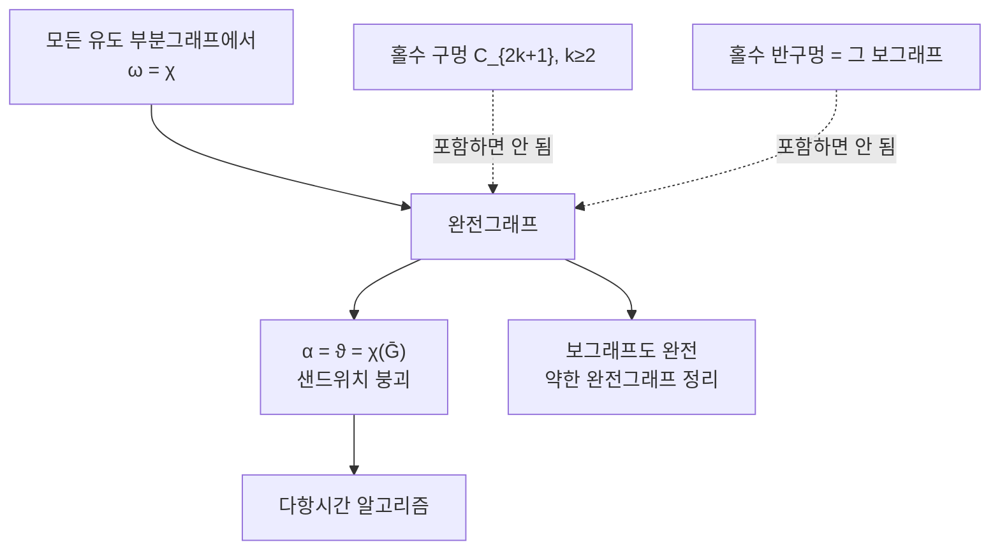

# 완전그래프와 강한 완전그래프 정리

# 개요

그래프에서 최대 클릭의 크기 $\omega(G)$ 는 채색수 $\chi(G)$ 의 자명한 하계다. 클릭 안의 정점은 서로 인접하므로 색이 모두 달라야 하기 때문이다. 두 값의 간격은 얼마든지 벌어진다. 삼각형이 없으면서, 곧 $\omega=2$ 이면서 채색수가 임의로 큰 그래프가 존재한다.

그런데 어떤 그래프에서는 이 하계가 정확하다. 게다가 모든 유도 부분그래프에서 동시에 정확한 부류가 있고, 이를 완전그래프라 한다. 이분그래프, 구간 그래프, 현 그래프, 비교가능성 그래프가 모두 여기 속한다.

[Lovász 세타 함수](lovasz-theta.md)에서 본 샌드위치가 완전그래프에서 붕괴한다. $\alpha(G)=\vartheta(G)=\chi(\bar G)$ 가 되어, 양 끝의 NP-난해한 두 양이 가운데의 다항시간 계산으로 결정된다. 완전그래프의 최대 독립집합과 채색수를 다항시간에 구하는 알고리즘은 지금도 이 경로를 지난다.

Berge 가 1961 년에 완전성을 구조적으로 특징짓는 추측을 내놓았고, 40 년 뒤 강한 완전그래프 정리로 해결되었다. 장애물이 홀수 구멍과 그 보그래프 둘뿐이라는 내용이다.

# 직관

## 왜 유도 부분그래프까지 요구하는가

$\omega(G)=\chi(G)$ 만 요구하면 부류가 닫히지 않는다. 어떤 그래프에 큰 클릭을 하나 붙이면 $\omega$ 와 $\chi$ 가 같이 커져 등식이 우연히 맞을 수 있고, 그 안에는 여전히 나쁜 부분그래프가 숨어 있다.

모든 유도 부분그래프에서 등식을 요구하면 부류가 유도 부분그래프에 대해 닫힌다. 그러면 "포함하면 안 되는 구조" 의 목록으로 특징지을 수 있다는 희망이 생기고, 실제로 그 희망이 정리가 되었다.

## 가장 작은 반례

$C_5$ 는 $\omega=2$ 이고 $\chi=3$ 이다. 홀수 길이 순환이라 두 색으로 칠할 수 없는데 삼각형은 없다. 홀수 순환 전체가 같은 이유로 완전하지 않다.

보그래프 쪽도 봐야 한다. $\bar G$ 에서의 클릭이 $G$ 의 독립집합이고 $\bar G$ 의 채색이 $G$ 의 클릭 덮개이므로, 완전성은 보그래프를 취해도 유지되어야 할 성질이다. 그래서 홀수 구멍의 보그래프인 홀수 반구멍도 장애물이 된다.

## 왜 5 개 꼭짓점부터인가

꼭짓점이 4 개 이하인 그래프는 모두 완전하다. 홀수 구멍 중 가장 작은 것이 $C_5$ 이기 때문이다. 삼각형 $C_3$ 은 $\omega=\chi=3$ 이라 완전하고, 그다음 홀수 순환이 $C_5$ 다.

아래 계산에서 꼭짓점 5 개짜리 그래프 1024 개 중 완전하지 않은 것이 정확히 $C_5$ 의 12 가지 이름 붙이기뿐임이 확인된다.

# 정의

## 완전그래프

$G$ 의 모든 유도 부분그래프 $H$ 에 대해 $\omega(H)=\chi(H)$ 이면 $G$ 를 완전그래프라 한다.

## 구멍과 반구멍

길이 4 이상인 유도 순환을 구멍이라 하고, 그 길이가 홀수면 홀수 구멍이다. 홀수 구멍의 보그래프를 홀수 반구멍이라 한다.

$C_5$ 는 자기 보그래프와 동형이라 구멍이자 반구멍이다. $C_7$ 의 보그래프는 $C_7$ 과 다른 그래프이며, 7 개 꼭짓점에서 홀수 반구멍이 따로 등장한다.

## Berge 그래프

홀수 구멍도 홀수 반구멍도 유도 부분그래프로 갖지 않는 그래프다.

## 완전한 그래프족

- 이분그래프: $\omega\le2$ 이고 $\chi\le2$ 다.
- 현 그래프: 길이 4 이상의 구멍이 아예 없다. 완벽 소거 순서로 탐욕 채색이 최적이 된다.
- 구간 그래프: 실직선의 구간들을 정점으로, 겹침을 간선으로 둔 것. 현 그래프의 부분족이다.
- 비교가능성 그래프: 부분순서에서 비교 가능한 쌍을 잇는다. Dilworth 정리와 Mirsky 정리가 이 경우의 $\alpha=\chi(\bar G)$ 진술이다.

# 성질

## 약한 완전그래프 정리

$G$ 가 완전하면 $\bar G$ 도 완전하다. Lovász 가 1972 년에 증명했다.

동치인 형태가 더 대칭적이다. $G$ 가 완전할 필요충분조건은 모든 유도 부분그래프 $H$ 에서 $\alpha(H)\,\omega(H)\ge|V(H)|$ 인 것이다. 이 조건이 $G$ 와 $\bar G$ 에 대해 대칭이므로 정리가 즉시 따라온다.

## 강한 완전그래프 정리

$G$ 가 완전할 필요충분조건은 $G$ 가 Berge 그래프인 것이다. Chudnovsky, Robertson, Seymour, Thomas 가 2002 년에 증명했고 2006 년에 출판되었다. 논문이 150 쪽이 넘는다.

증명의 골격은 구조 분해다. 모든 Berge 그래프가 다섯 가지 기본 부류 중 하나이거나, 네 가지 분해 중 하나로 더 작은 Berge 그래프들로 쪼개진다는 것을 보인다. 분해가 완전성을 보존하므로 귀납이 돌아간다.

한쪽 방향은 쉽다. 홀수 구멍은 $\omega=2,\chi=3$ 이고 홀수 반구멍 $\bar C_{2k+1}$ 은 $\omega=k,\chi=k+1$ 이라 둘 다 완전하지 않다. 어려운 것은 그 둘 말고는 장애물이 없다는 것이다.

## 인식 문제

Berge 그래프인지 판정하는 문제는 다항시간에 풀린다. 2005 년에 $O(n^9)$ 알고리즘이 나왔고, 강한 완전그래프 정리와는 독립적으로 홀수 구멍과 반구멍을 직접 찾는 방식이다.

흥미로운 대비가 있다. 홀수 구멍만 없는지 판정하는 문제도 다항시간에 풀린다는 것이 2020 년에야 밝혀졌고, 그 전까지는 보그래프 쪽 조건 없이는 어렵다고 여겨졌다.

## 알고리즘

완전그래프에서 $\alpha,\omega,\chi$ 와 클릭 덮개수를 모두 다항시간에 계산할 수 있다. 유일하게 알려진 방법이 $\vartheta$ 를 반정부호 계획으로 계산하는 것이다.

구조 정리가 나온 뒤에도 이 상황은 바뀌지 않았다. 구조 분해를 따라가는 조합적 채색 알고리즘은 아직 없으며, 연속 최적화가 순수 조합 문제의 유일한 해법으로 남아 있는 드문 사례다.

# 활용

## 스케줄링과 자원 배정

구간 그래프의 채색이 곧 구간 스케줄링이다. 겹치는 작업에 서로 다른 자원을 배정하는 문제이고, 완전성 덕분에 필요한 자원의 최소 개수가 "동시에 겹치는 작업의 최대 개수" 와 정확히 같다.

레지스터 할당에서 프로그램의 간섭 그래프가 현 그래프인 경우(정적 단일 배정 형식의 프로그램이 그렇다)에도 같은 성질이 쓰인다. 일반 프로그램에서는 NP-난해인 문제가 이 구조적 제약 아래에서 선형시간에 풀린다.

## 순서 이론의 정리들

Dilworth 정리는 유한 부분순서에서 최대 반사슬의 크기가 사슬 덮개의 최소 개수와 같다는 진술이다. 비교가능성 그래프의 언어로 옮기면 정확히 $\alpha=\chi(\bar G)$ 이고, 그 그래프가 완전하다는 사실의 한 절반이다.

Mirsky 정리(최장 사슬의 길이 = 반사슬 분할의 최소 개수)가 나머지 절반이며, 두 정리가 약한 완전그래프 정리로 서로의 보그래프 진술이 된다. $\alpha$ 와 $\omega$ 와 $\chi$ 사이의 최소최대 등식들이 완전성이라는 한 틀에 모인다.

## 최소최대 정리의 통일

이분그래프의 König 정리(최대 매칭 = 최소 꼭짓점 덮개)도 완전성의 따름이다. 조합 최적화의 고전적 최소최대 등식들이 대부분 완전그래프 위의 진술이라는 관찰이 이 이론의 출발점이었다.

다면체 쪽에서도 같은 것이 보인다. 완전그래프는 독립집합 다면체가 클릭 부등식만으로 기술되는 그래프와 정확히 일치한다. 정수계획의 선형 완화가 타이트해지는 조건이며, 이 때문에 완전성은 다면체 조합론의 중심 개념이기도 하다.

# 연관 문서

## 선수지식

- [Lovász 세타 함수](lovasz-theta.md)

## 더 알아보기

아직 연결한 문서가 없다.

#graph_theory #combinatorics #theorem
