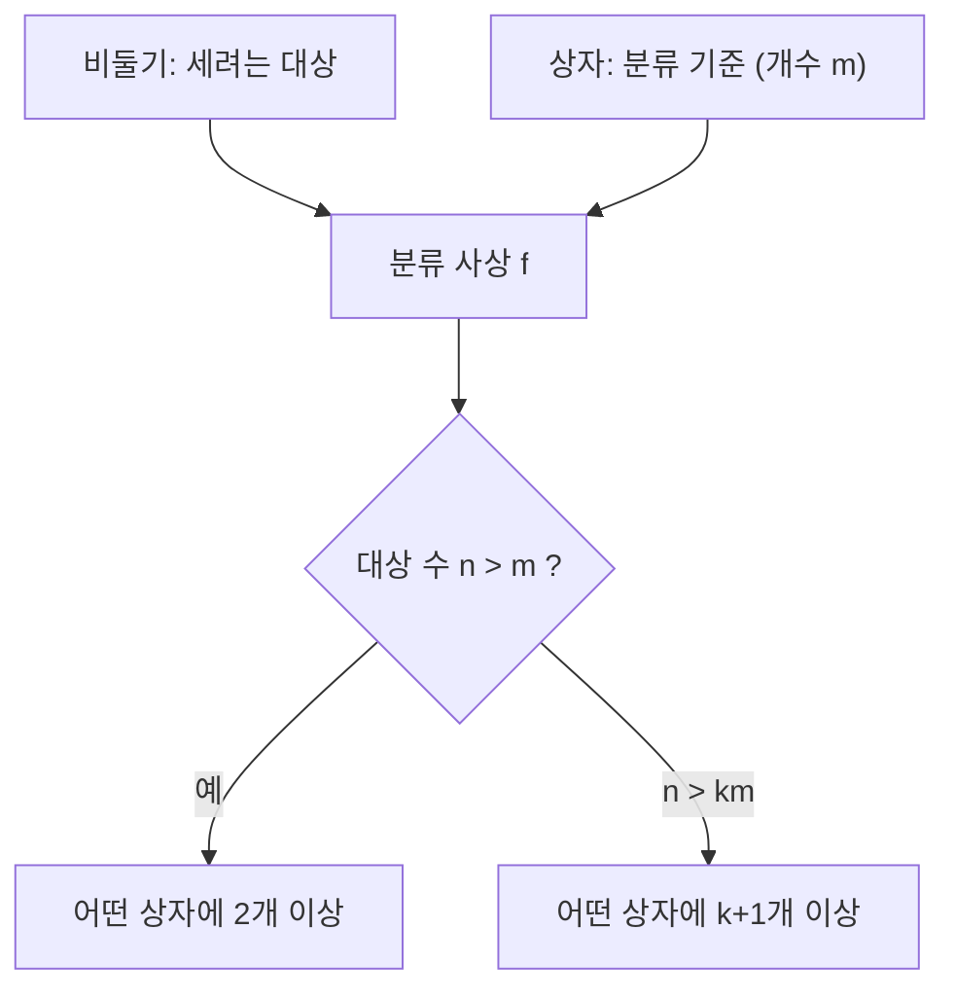

# 비둘기집 원리

# 개요

비둘기집 원리(pigeonhole principle, Dirichlet의 서랍 원리)는 n개의 물건을 m개의 상자에 넣을 때 n이 m보다 크면 어떤 상자에는 둘 이상이 들어간다는 진술이다. 증명은 한 줄이지만, 존재성을 비구성적으로 확보하는 거의 유일한 초등적 수단이어서 쓰임이 넓다.

핵심은 "무엇을 비둘기로, 무엇을 상자로 볼지"를 정하는 것이다. 상자의 개수는 곧 분류 기준의 개수이고, 이 기준을 고르는 것이 증명 전체의 아이디어다. Erdős–Szekeres 정리, Dirichlet의 유리수 근사 정리, [Ramsey 이론](ramsey-theory.md)의 기초가 모두 이 원리의 적절한 응용이다.

무한 버전은 가산 집합을 유한 개로 분할하면 어느 한 조각이 무한하다는 형태이고, 측도 버전은 전체 측도보다 작은 조각들로는 전체를 덮을 수 없다는 형태다.

# 직관

13명이 있으면 생일의 달이 같은 두 사람이 반드시 있다. 사람을 달로 분류하면 상자가 12개뿐이기 때문이다. 여기서 "누가 같은지"는 전혀 알 수 없다. 존재만 알려주는 원리다.



강한 형태는 평균 논증으로 본다. 상자당 평균이 n/m이므로 적어도 하나는 평균 이상, 즉 n/m의 천장값 이상을 담는다. 반대로 어떤 상자도 평균 이하일 수는 없다.

# 정의

유한집합 A, B와 [함수](functions.md) f: A → B를 생각한다. 기본형은 다음과 같다.

$$
|A|>|B| \ \Longrightarrow\ \exists\, b\in B:\ |f^{-1}(b)|\ge 2
$$

## 일반형 (강한 비둘기집 원리)

$$
\exists\, b\in B:\ \bigl|f^{-1}(b)\bigr|\ \ge\ \left\lceil \frac{|A|}{|B|} \right\rceil
$$

증명: 모든 섬유의 크기가 천장값보다 작다고 하면 각 섬유 크기는 천장값보다 1 이상 작으므로 다음 모순이 나온다.

$$
|A|=\sum_{b\in B}\bigl|f^{-1}(b)\bigr|\ \le\ |B|\Bigl(\Bigl\lceil \frac{|A|}{|B|}\Bigr\rceil-1\Bigr)<|B|\cdot\frac{|A|}{|B|}=|A|
$$

## 무한형

$$
|A|>|B|,\ |B|<\aleph_0,\ A=\bigsqcup_{b\in B}f^{-1}(b)\ \text{이고 }A\text{가 무한이면}\ \exists\, b:\ f^{-1}(b)\ \text{무한}
$$

[가산성](cardinality.md)의 언어로는 가산 집합을 유한 개 조각으로 나누면 적어도 하나가 가산 무한이라는 뜻이다.

## 측도형

유한 [측도](measure.md) 공간에서 부분집합족의 측도 합이 전체 측도를 넘으면 두 집합이 양의 측도로 겹친다.

$$
\sum_{i=1}^{n}\mu(A_i)>\mu(X)\ \Longrightarrow\ \exists\, i\ne j:\ \mu(A_i\cap A_j)>0
$$

# 성질

## 원리 자체의 위상

기본형은 유한집합 사이의 단사함수가 존재하지 않는다는 진술과 동치이며, Dedekind 유한성의 정의와 맞물린다. 자연수 위의 수학적 귀납법으로 증명되므로 [증명](proofs.md) 체계에서 추가 공리가 필요하지 않다. 무한형에서 상자가 무한 개로 늘어나면 성립하지 않는다. 자연수를 홀수와 짝수가 아니라 각 원소마다 따로 담으면 모든 상자가 유한하다.

## 비구성성

원리는 존재를 주장하지만 대상을 지목하지 않는다. 같은 달에 태어난 두 사람을 찾으려면 결국 조사해야 한다. 배타적 논리합에 의존하는 이 성격은 [직관주의 논리](intuitionism.md)에서 논쟁의 대상이 되는 전형적 형태다. 다만 유한형은 유한 탐색으로 증인을 찾을 수 있으므로 구성적으로도 받아들여진다.

## Erdős–Szekeres 정리

서로 다른 실수로 이루어진 길이가 (r-1)(s-1)+1 이상인 수열은 길이 r의 증가 부분수열 또는 길이 s의 감소 부분수열을 가진다[^1].

$$
N\ \ge\ (r-1)(s-1)+1
$$

증명: 각 항 a_i에 쌍 (x_i, y_i)를 붙인다. x_i는 a_i에서 끝나는 최장 증가 부분수열의 길이, y_i는 a_i에서 끝나는 최장 감소 부분수열의 길이다. i < j이면 a_i < a_j일 때 x_j > x_i이고 a_i > a_j일 때 y_j > y_i이므로, 서로 다른 두 항의 쌍은 항상 다르다. 결론이 거짓이라면 모든 쌍이 다음 집합에 속한다.

$$
\{1,\dots,r-1\}\times\{1,\dots,s-1\},\qquad \bigl|\,\cdot\,\bigr|=(r-1)(s-1)
$$

항이 (r-1)(s-1)+1개인데 상자가 (r-1)(s-1)개이므로 두 항의 쌍이 같아 모순이다. 경계는 최적이다. 길이 (r-1)(s-1)의 수열을 s-1개씩 감소하는 블록 r-1개로 배열하면 증가 부분수열은 최대 r-1, 감소 부분수열은 최대 s-1이다. r=s=n인 특수 경우가 "길이 (n-1)^2+1의 수열에는 길이 n의 단조 부분수열이 있다"는 진술이다.

## Dirichlet 근사 정리

임의의 실수 alpha와 양의 정수 Q에 대해 다음을 만족하는 정수 p와 q가 존재한다[^2].

$$
1\le q\le Q,\qquad |q\alpha-p|<\frac{1}{Q},\qquad \text{따라서}\quad \Bigl|\alpha-\frac{p}{q}\Bigr|<\frac{1}{qQ}\le\frac{1}{q^{2}}
$$

증명: Q+1개의 소수부 값을 길이 1/Q인 Q개의 구간에 넣는다.

$$
\{0\cdot\alpha\},\{\alpha\},\dots,\{Q\alpha\}\in[0,1)=\bigsqcup_{u=0}^{Q-1}\Bigl[\frac{u}{Q},\frac{u+1}{Q}\Bigr)
$$

비둘기집 원리로 같은 구간에 든 두 값 {q_1 alpha}와 {q_2 alpha}(q_1 < q_2)가 있다. q = q_2 - q_1, p = ⌊q_2 alpha⌋ - ⌊q_1 alpha⌋로 두면 주장이 따른다. alpha가 무리수이면 Q를 키워가며 분모가 무한히 커지는 근사열을 얻고, 이것이 연분수 근사의 이론적 출발점이다. 지수 2는 무리수 전체에 대해 개선할 수 없다. 황금비류의 badly approximable 수에서 막히며, 대수적 무리수에 대해서는 Roth 정리가 2+epsilon이 최선임을 말한다.

## 이중 계산과의 관계

비둘기집 원리는 합과 평균의 부등식을 쓰는 이중 계산의 특수한 형태다. 같은 논리를 기댓값으로 바꾸면 "어떤 원소는 기댓값 이상의 값을 갖는다"는 평균 논증(averaging argument)이 되고, 여기서 확률적 방법이 출발한다.

# 활용

## 정수론적 예제

1부터 2n까지에서 n+1개를 뽑으면 하나가 다른 하나를 나누는 쌍이 있다. 각 수를 2의 거듭제곱을 뺀 홀수 부분으로 분류하면 상자가 n개(1, 3, ..., 2n-1)이므로 같은 홀수 부분을 가진 두 수가 있고, 그 둘은 2의 거듭제곱 배 관계다.

또한 n+1개를 뽑으면 서로소인 두 수가 있다. 연속한 두 정수가 반드시 포함되기 때문이다. [정수의 합동](modular-arithmetic.md)으로는 임의의 n+1개 정수 중 차가 n으로 나누어떨어지는 두 개가 있다. 나머지가 n가지뿐이다.

## 그래프에서

정점이 2개 이상인 [그래프](graphs.md)에는 차수가 같은 두 정점이 있다. 정점이 n개일 때 차수는 0부터 n-1까지 n가지지만 0과 n-1이 동시에 나타날 수 없어 실제 상자는 n-1개다.

## 알고리즘

해시 테이블에서 키 공간이 슬롯 수보다 크면 충돌은 불가피하다. 손실 없는 압축이 모든 입력을 짧게 만들 수 없다는 사실도 같은 논증이다. 길이 n-1 이하의 이진 문자열은 2^n - 1개뿐이므로, 길이 n인 입력 2^n개를 모두 더 짧은 문자열로 단사적으로 보낼 수 없다. [계산 가능성](computability.md)의 대각선 논법과는 다른, 순수 셈에 의한 하한이다.

```python
def find_collision(values, buckets):
    """비둘기집 원리가 존재를 보장하는 충돌을 실제로 찾는다."""
    seen = {}
    for i, v in enumerate(values):
        key = buckets(v)
        if key in seen:
            return seen[key], i        # 같은 상자에 든 두 인덱스
        seen[key] = i
    return None                        # len(values) <= 상자 수일 때만 도달

# 1..2n에서 n+1개를 뽑으면 홀수 부분이 같은 두 수가 있다
def odd_part(m):
    while m % 2 == 0:
        m //= 2
    return m

subset = [3, 4, 6, 9, 10, 11, 12]      # n = 6, 1..12에서 7개
i, j = find_collision(subset, odd_part)
print(subset[i], subset[j])            # 3 6  (3이 6을 나눈다)
```

## 더 나아가서

상자를 색으로, 비둘기를 그래프의 간선으로 바꾸면 Ramsey 정리의 R(3,3) ≤ 6 증명이 곧바로 나온다. [Ramsey 이론](ramsey-theory.md)은 비둘기집 원리를 조직적으로 일반화한 분야다. 평균 논증을 확률로 강화하면 확률적 방법이 되어, 셈만으로는 닿지 않는 하한을 얻는다.

[^1]: P. Erdős and G. Szekeres, "A combinatorial problem in geometry", Compositio Mathematica 2 (1935), 463–470. 진술과 비둘기집 증명 정리: https://en.wikipedia.org/wiki/Erd%C5%91s%E2%80%93Szekeres_theorem
[^2]: Dirichlet's approximation theorem (1842), 진술과 증명: https://en.wikipedia.org/wiki/Dirichlet%27s_approximation_theorem

# 연관 문서

## 선수지식

- [셈의 기본 원리](counting-principles.md)
- [명제와 증명](proofs.md)

## 더 알아보기

- [Ramsey 이론](ramsey-theory.md)
- [그래프 색칠](graph-coloring.md)

#combinatorics
