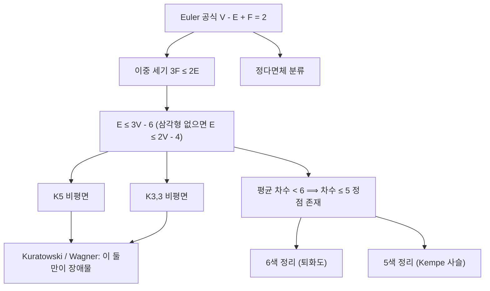

# 평면 그래프

# 개요

평면 그래프는 평면 위에 간선이 서로 교차하지 않게 그릴 수 있는 [그래프](graphs.md)다. "종이에 선을 겹치지 않고 그릴 수 있는가"라는 소박한 질문이지만, 답은 그래프의 조합적 구조를 강하게 제약한다.

중심에 **Euler 공식** $V - E + F = 2$ 가 있다. 이 한 줄에서 간선 수의 상한 $E \le 3V - 6$ , $K_5$ 와 $K_{3,3}$ 의 비평면성, 평면 그래프에 항상 차수 5 이하 정점이 있다는 사실, 그리고 5색 정리가 차례로 따라 나온다. 같은 공식이 정다면체가 다섯 개뿐임을 증명한다. Euler 공식은 [Euler 지표](euler-characteristic.md)의 가장 낮은 차원 사례이며, 위상수학적 불변량이 순수 조합론적 결론을 강제하는 전형적인 장면이다.

평면성 자체의 특징 짓기는 **Kuratowski 정리**가 준다. 평면이 아닌 것은 오직 $K_5$ 나 $K_{3,3}$ 을 (세분한 형태로) 품고 있기 때문이다.

# 직관

그래프를 평면에 그리면 평면이 조각으로 나뉜다. 이 조각을 **면**(face)이라 한다. 바깥의 무한한 영역도 하나의 면으로 센다.

Euler 공식의 직관은 "간선을 하나씩 지우면서 세기"다. 트리에서 시작하자. 트리는 사이클이 없으므로 면이 하나뿐($F=1$)이고 $E=V-1$ 이므로 $V-E+F=V-(V-1)+1=2$ 다. 여기에 간선을 하나 추가할 때마다 사이클이 하나 생기고 면이 정확히 하나 늘어난다. $E$ 와 $F$ 가 동시에 1씩 늘어나므로 $V-E+F$ 는 변하지 않는다. 연결 평면 그래프는 모두 이렇게 만들 수 있으므로 항상 2다.

그다음이 핵심 트릭이다. 각 면은 최소 3개의 간선으로 둘러싸여 있고(단순 그래프이므로 이중 간선이나 고리가 없다), 각 간선은 정확히 두 면의 경계에 놓인다. 면-간선 접촉을 두 방식으로 세면 $3F \le 2E$ 다. 이를 Euler 공식에 넣으면 $E \le 3V - 6$ 이 나온다. 이중 세기 한 번으로 평면 그래프가 "성길 수밖에 없다"는 결론을 얻는 것이다.

$K_5$ 는 $V = 5$ , $E = 10 > 9 = 3 \cdot 5 - 6$ 이므로 평면이 아니다. $K_{3,3}$ 은 삼각형이 없어 $4F \le 2E$ 라는 더 강한 제약을 받고, $E = 9 > 8 = 2 \cdot 6 - 4$ 이므로 역시 평면이 아니다.



# 정의

## 평면 그래프와 평면 그리기

그래프 $G$ 의 **평면 그리기**(plane embedding)는 각 정점을 평면의 서로 다른 점에, 각 간선을 끝점을 잇는 단순 곡선에 대응시키되, 두 곡선이 공통 끝점 외에는 만나지 않게 하는 것이다. 평면 그리기가 존재하는 그래프를 **평면 그래프**(planar graph)라 한다.

평면 그리기가 하나 지정된 그래프를 **plane graph** 라 구별해 부르기도 한다. 같은 평면 그래프가 여러 개의 본질적으로 다른 그리기를 가질 수 있기 때문이다(3-연결이면 Whitney 정리에 의해 본질적으로 유일하다).

## 면

plane graph $G$ 에 대해 평면에서 그림(정점과 간선의 합집합)을 제거하고 남은 집합의 연결 성분을 **면**이라 한다. 유계가 아닌 면이 정확히 하나 있고 이를 **외부면**이라 한다. 면의 개수를 $F$ 로 쓴다.

면 $f$ 의 **차수** $\deg(f)$ 는 $f$ 의 경계를 한 바퀴 돌 때 지나는 간선의 수다(다리 역할을 하는 간선은 두 번 센다).

## 세분과 마이너

- **세분**(subdivision): 간선을 새 정점으로 쪼개 두 간선으로 바꾸는 연산을 반복해 얻은 그래프. 세분은 평면성을 바꾸지 않는다.
- **마이너**(minor): 간선 삭제, 정점 삭제, 간선 축약(contraction)만으로 얻을 수 있는 그래프.

## 쌍대 그래프

plane graph $G$ 에 대해 **쌍대 그래프** $G^\ast$ 를 다음과 같이 만든다. $G$ 의 각 면에 정점 하나를 두고, $G$ 의 각 간선 $e$ 에 대해 $e$ 를 사이에 둔 두 면의 정점을 잇는 간선을 둔다(같은 면이 양쪽이면 고리가 된다). $G^\ast$ 도 평면이고 $|V(G^\ast)| = F(G)$ , $|E(G^\ast)| = E(G)$ , $F(G^\ast) = V(G)$ 다. 연결 plane graph에 대해 $(G^\ast)^\ast \cong G$ 다. 쌍대는 그리기에 의존하므로 추상 그래프의 불변량이 아니다.

# 성질

## Euler 공식

**정리 (Euler, 1758).** 연결된 plane graph $G$ 에 대해

$$
V - E + F = 2
$$

가 성립한다. 연결 성분이 $k$ 개면 $V-E+F=1+k$ 다.

**증명 (간선 수에 대한 귀납).** 사이클이 없으면 $G$ 는 트리이고 $E=V-1$, $F=1$ 이므로 성립한다. 사이클이 있으면 사이클 위의 간선 $e$ 를 하나 고른다. $e$ 는 서로 다른 두 면의 경계에 있으므로 $G-e$ 에서는 그 두 면이 하나로 합쳐진다. 따라서 $E$ 와 $F$ 가 각각 1씩 줄고 $V-E+F$ 는 보존된다. $G-e$ 는 여전히 연결이므로 귀납 가정을 적용한다. ∎

$F$ 가 그리기와 무관하게 $E-V+2$ 로 결정된다는 것 자체가 놀라운 결론이다. 이는 $V-E+F$ 가 구면의 [Euler 지표](euler-characteristic.md)라는 위상수학적 사실의 그림자다. 종수 $g$ 의 곡면에 그린 그래프는 $V-E+F=2-2g$ 를 만족한다.

## 간선 수 상한

**따름정리.** $V \ge 3$ 인 단순 평면 그래프는

$$
E \le 3V - 6
$$

를 만족한다. 삼각형이 없으면 더 강하게

$$
E \le 2V - 4
$$

가 성립한다.

**증명.** 각 면의 차수는 3 이상이고(삼각형이 없으면 4 이상), 차수의 합은 $2E$ 다. 따라서 $3F \le 2E$ , 즉 $F \le 2E/3$ 이다. Euler 공식에 대입하면 $2 = V - E + F \le V - E + 2E/3 = V - E/3$ 이므로 $E \le 3V - 6$ 이다. 삼각형 없는 경우는 $4F \le 2E$ 로 같은 계산을 반복한다. ∎

**따름정리 (차수).** 단순 평면 그래프의 평균 차수는 $2E/V \le 6 - 12/V < 6$ 이므로, 차수가 5 이하인 정점이 반드시 존재한다. 이 사실은 [비둘기집 원리](pigeonhole-principle.md)의 평균 논법 형태이며, 평면 그래프의 퇴화도가 5 이하임을 뜻한다.

## K5 와 K3,3

$K_5$ 는 $V = 5, E = 10$ 이고 $3 \cdot 5 - 6 = 9 < 10$ 이므로 비평면이다. $K_{3,3}$ 은 이분 그래프라 삼각형이 없고 $V = 6, E = 9$ 인데 $2 \cdot 6 - 4 = 8 < 9$ 이므로 비평면이다.

세분해도 평면성은 변하지 않으므로, $K_5$ 나 $K_{3,3}$ 의 세분을 부분그래프로 품는 그래프는 모두 비평면이다. Kuratowski 정리는 그 역이 성립한다고 말한다.

## Kuratowski 정리와 Wagner 정리

**정리 (Kuratowski, 1930).** 그래프 $G$ 가 평면일 필요충분조건은 $G$ 가 $K_5$ 의 세분도 $K_{3,3}$ 의 세분도 부분그래프로 포함하지 않는 것이다.

**정리 (Wagner, 1937).** 그래프 $G$ 가 평면일 필요충분조건은 $G$ 가 $K_5$ 도 $K_{3,3}$ 도 마이너로 갖지 않는 것이다.

두 진술은 최대차수 3 이하인 그래프에 대한 관찰을 통해 서로 동치임이 확인된다. 증명의 어려움은 충분성 방향에 있고, 표준적인 접근은 최소 반례를 잡아 3-연결로 환원한 뒤 3-연결 그래프가 볼록 그리기를 가짐(Tutte의 스프링 정리)을 쓰는 것이다.

Wagner 형태는 훨씬 큰 그림의 첫 사례다. Robertson–Seymour의 그래프 마이너 정리에 의해 마이너에 대해 닫힌 모든 그래프 성질은 유한 개의 금지 마이너로 특징지어진다[^1]. 평면성은 그 목록이 $\lbrace K_5,K_{3,3}\rbrace$ 인 경우다.

평면성 판정 자체는 어렵지 않다. Hopcroft–Tarjan 알고리즘이 $O(V)$ 시간에 평면 그리기를 찾거나 Kuratowski 부분그래프를 출력한다. 반면 [그래프 동형](graph-isomorphism.md) 문제는 평면 그래프로 제한하면 선형 시간에 풀린다는 점도 평면성이 주는 구조적 이득이다.

## 5색 정리

**정리.** 모든 평면 그래프는 5-색칠 가능하다.

**증명 스케치 (정점 수에 대한 귀납).** 평면 그래프에는 차수 5 이하인 정점 $v$ 가 있다. $G-v$ 는 귀납 가정으로 5-색칠된다. $v$ 의 차수가 4 이하이거나 이웃들이 5색을 다 쓰지 않으면 남은 색을 주면 끝난다.

문제는 $v$ 의 이웃이 정확히 5개이고 색이 모두 다른 경우다. 평면 그리기에서 $v$ 주위를 시계 방향으로 돈 이웃을 $v_1,\dots,v_5$, 색을 $1,\dots,5$ 라 하자. 색 1과 3만 쓰인 정점들이 이루는 부분그래프에서 $v_1$ 을 포함하는 연결 성분을 **Kempe 사슬**이라 한다. 만약 $v_3$ 이 이 성분에 속하지 않으면, 성분 안의 색 1과 3을 통째로 맞바꿔도 색칠은 여전히 적절하고 $v_1$ 의 색이 3이 되므로 색 1이 $v$ 에 남는다. 만약 $v_3$ 이 같은 성분에 속한다면 $v_1$ 에서 $v_3$ 으로 가는 1-3 경로가 존재하고, 이 경로와 $v$ 가 만드는 닫힌 곡선이 $v_2$ 와 $v_4$ 를 갈라놓는다. 평면성 때문에 $v_2$ 에서 $v_4$ 로 가는 2-4 경로는 이 곡선을 넘을 수 없으므로 존재하지 않는다. 그러면 $v_2$ 쪽 2-4 사슬을 뒤집어 색 2를 비운다. ∎

Kempe는 1879년 같은 논법으로 4색 정리를 증명했다고 발표했으나, 차수 5 정점에서 두 개의 사슬을 동시에 뒤집는 단계에 오류가 있었다(Heawood, 1890). 그 잔해에서 5색 정리가 남았다. 4색 정리는 결국 불가피 집합과 축약 가능 배치를 컴퓨터로 검사하는 방식으로 1976년에 증명되었고[^2], 자세한 내용은 [그래프 색칠](graph-coloring.md)에 있다.

## 그 밖의 구조

- **삼각형 없는 평면 그래프**는 3-색칠 가능하다(Grötzsch 정리).
- **평면 그래프의 분리자**: Lipton–Tarjan 정리에 의해 $O(\sqrt{V})$ 크기의 정점 집합을 제거해 그래프를 균형 있게 쪼갤 수 있다. 분할 정복 알고리즘의 근거다.
- **쌍대와 절단**: $G$ 의 사이클은 $G^*$ 의 절단에 대응하고, 그 역도 성립한다. 이 대응은 [matroid](matroids.md) 쌍대성의 기하적 실현이며, 평면 그래프에서 최소 절단을 쌍대 그래프의 최단 경로로 푸는 알고리즘의 기반이다([네트워크 흐름](network-flow.md)).
- **평면 그래프의 세기**: 평면 삼각분할의 개수는 Tutte가 생성함수로 계산했다([생성함수](generating-functions.md)).

# 활용

## 정다면체 분류

볼록 다면체의 꼭짓점-모서리 그래프는 3-연결 평면 그래프다(Steinitz 정리). 따라서 Euler 공식이 그대로 적용된다.

정다면체는 모든 면이 같은 정 $p$ 각형이고 모든 꼭짓점에 같은 수 $q$ 개의 면이 모이는 다면체다. 면-모서리와 꼭짓점-모서리를 이중 세기하면

$$
pF = 2E, \qquad qV = 2E
$$

이므로 $F=2E/p$, $V=2E/q$ 다. Euler 공식에 넣으면

$$
\frac{2E}{q} - E + \frac{2E}{p} = 2
$$

이고 양변을 $2E$ 로 나누면

$$
\frac{1}{p} + \frac{1}{q} - \frac{1}{2} = \frac{1}{E} > 0
$$

를 얻는다. $p \ge 3$ , $q \ge 3$ 인 정수해는

$$
(p, q) \in \lbrace(3,3), (3,4), (4,3), (3,5), (5,3)\rbrace
$$

다섯 개뿐이고, 각각 정사면체, 정팔면체, 정육면체, 정이십면체, 정십이면체에 대응한다. 다면체가 다섯 개뿐이라는 고전적 사실이 조합적 등식 한 줄에서 나온다. $(p,q)$ 와 $(q,p)$ 의 교환이 쌍대 그래프에 대응한다는 점도 여기서 보인다.

같은 계산을 $1/p+1/q-1/2$ 의 부호로 분류하면 0일 때 평면 타일링(삼각형, 사각형, 육각형), 음수일 때 쌍곡 타일링이 나온다.

## 코드

Euler 공식으로 면의 수를 예측하고, 간선 수 상한으로 비평면성을 판정하는 코드다.

```python
from itertools import combinations

def components(n, edges):
    parent = list(range(n))
    def find(x):
        while parent[x] != x:
            parent[x] = parent[parent[x]]
            x = parent[x]
        return x
    for u, v in edges:
        ru, rv = find(u), find(v)
        if ru != rv:
            parent[ru] = rv
    return len({find(x) for x in range(n)})

def is_bipartite(n, edges):
    adj = {i: set() for i in range(n)}
    for u, v in edges:
        adj[u].add(v); adj[v].add(u)
    color = {}
    for s in range(n):
        if s in color:
            continue
        color[s] = 0
        stack = [s]
        while stack:
            u = stack.pop()
            for w in adj[u]:
                if w not in color:
                    color[w] = 1 - color[u]
                    stack.append(w)
                elif color[w] == color[u]:
                    return False
    return True

def planarity_certificate(n, edges):
    """상한 위반이면 '확실히 비평면'. 위반이 없으면 판정 보류."""
    E = len(edges)
    if n >= 3 and E > 3 * n - 6:
        return f"비평면: E={E} > 3V-6={3*n-6}"
    if n >= 3 and is_bipartite(n, edges) and E > 2 * n - 4:
        return f"비평면: 삼각형 없음이고 E={E} > 2V-4={2*n-4}"
    return "상한 위반 없음 (평면 여부는 미결정)"

def euler_faces(n, edges):
    """평면 그래프라고 가정했을 때의 면 수: F = E - V + 1 + k."""
    return len(edges) - n + 1 + components(n, edges)

K5 = list(combinations(range(5), 2))
K33 = [(i, 3 + j) for i in range(3) for j in range(3)]
print(planarity_certificate(5, K5))    # 비평면: E=10 > 3V-6=9
print(planarity_certificate(6, K33))   # 비평면: 삼각형 없음이고 E=9 > 2V-4=8

cube = [(0,1),(1,2),(2,3),(3,0),(4,5),(5,6),(6,7),(7,4),(0,4),(1,5),(2,6),(3,7)]
print(planarity_certificate(8, cube))  # 상한 위반 없음
print(euler_faces(8, cube))            # 6
```

정다면체 분류는 그대로 정수해 열거다.

```python
sols = [(p, q) for p in range(3, 10) for q in range(3, 10)
        if 1 / p + 1 / q - 0.5 > 1e-12]
for p, q in sols:
    E = round(1 / (1 / p + 1 / q - 0.5))
    print(p, q, "V =", 2 * E // q, "E =", E, "F =", 2 * E // p)
```

## 다른 분야와의 연결

- **위상수학**: Euler 공식은 [Euler 지표](euler-characteristic.md)의 특수한 경우이고, 구면에 그린 그래프의 셀 분할에 대한 [단체 호몰로지](homology.md) 계산이 같은 값을 준다. 곡면 분류([다양체](manifolds.md))로 자연스럽게 이어진다.
- **알고리즘**: 평면성은 실제 속도로 환산된다. 평면 그래프에서는 최대유량, 최단 경로, [그래프 동형](graph-isomorphism.md)이 모두 일반 그래프보다 빠르게 풀리고, 분리자 정리가 동적 계획법의 근거를 준다. 회로 배선(VLSI), 지도 렌더링, 지리 정보 시스템이 직접적인 응용이다.
- **조합 최적화**: 평면 그래프에서의 최대 절단은 다항 시간에 풀리며(쌍대 그래프의 $T$ 조인 문제), 이는 일반 그래프에서 NP-난해인 것과 대비된다.
- **색칠**: 평면성이 채색수를 4로 묶는다는 4색 정리가 평면 그래프 이론의 가장 유명한 결과다([그래프 색칠](graph-coloring.md)).
- **스펙트럼**: 평면 그래프의 [그래프 Laplacian](graph-laplacian.md) 고윳값은 분리자 크기와 연결되며, Tutte의 스프링 그리기는 Laplacian 조화함수로 볼록 그리기를 만든다.

[^1]: N. Robertson, P. Seymour, "Graph Minors. XX. Wagner's conjecture", Journal of Combinatorial Theory Series B 92 (2004), https://doi.org/10.1016/j.jctb.2004.08.001
[^2]: K. Appel, W. Haken, "Every planar map is four colorable", Bulletin of the American Mathematical Society 82 (1976), https://www.ams.org/journals/bull/1976-82-05/S0002-9904-1976-14122-5/

# 연관 문서

## 선수지식

- [그래프](graphs.md)
- [Euler 지표](euler-characteristic.md)

## 더 알아보기

아직 연결한 문서가 없다.

#graph_theory #topology
