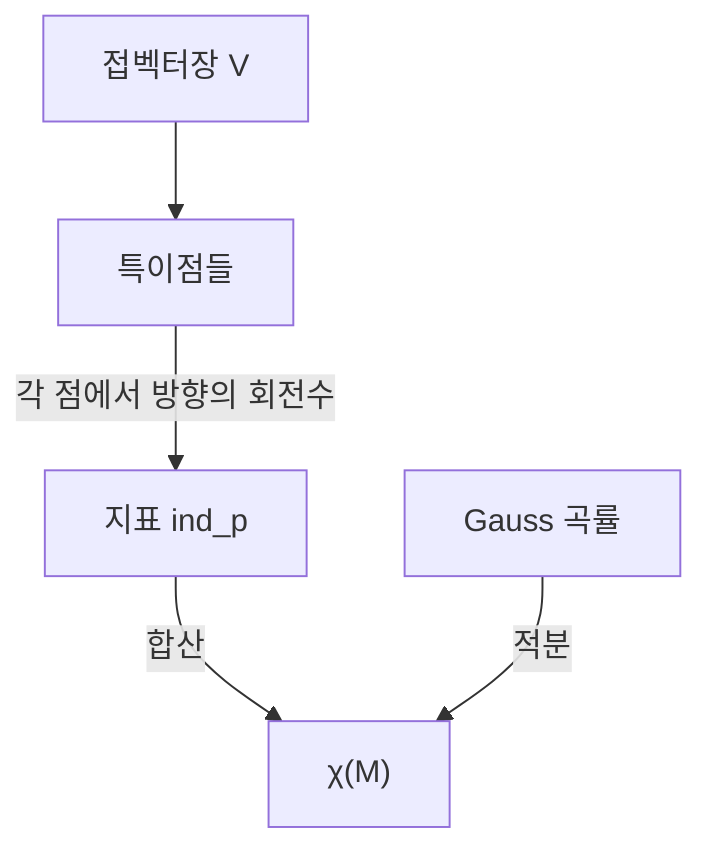

# Poincaré–Hopf 정리

# 개요

곡면 위에 접벡터장을 하나 놓으면 어딘가에서는 벡터가 0 이 되는 자리(특이점)가 생기기 마련이다. Poincaré–Hopf 정리는 그 특이점들에 붙는 정수(지표)를 모두 더하면 언제나 같은 값이 나온다고 말한다.

$$
\sum_{p:\,V(p)=0}\operatorname{ind}_p(V)=\chi(M)
$$

벡터장은 마음대로 고를 수 있고 특이점의 개수와 위치도 그에 따라 달라지지만, 지표의 합은 [Euler 지표](euler-characteristic.md)로 고정된다. [Gauss–Bonnet 정리](gauss-bonnet.md)에서 곡률의 적분이 위상으로 고정되던 것과 같은 형태이며, 실제로 두 정리는 서로를 유도할 수 있다. 국소적으로 자유롭게 정할 수 있는 양의 총합이 전역 불변량이 되는 현상의 또 하나의 얼굴이다.

# 직관

## 털을 빗어 넘길 수 있는가

구면 위의 모든 점에 0 이 아닌 접벡터를 매끄럽게 배정하는 일은 "털 난 공을 가마 없이 빗는" 일이다. $\chi(\text{구면}) = 2 \ne 0$ 이므로 지표의 합이 2 여야 하고, 특이점이 하나도 없으면 합이 0 이 되어 모순이다. 따라서 가마가 반드시 생긴다. 반면 원환면은 $\chi = 0$ 이라 특이점 없는 벡터장이 존재하고, 실제로 구멍을 도는 방향으로 일정하게 흐르는 장을 잡으면 된다.

지구 표면의 바람이 어디선가 반드시 잦아든다는 이야기, 머리에 가마가 있다는 이야기가 모두 이 정리의 특수한 경우다.

## 지표는 회전수다

특이점 $p$ 를 작은 원으로 둘러싸고 그 원을 한 바퀴 돌면서 벡터가 가리키는 방향을 관찰하면, 방향도 몇 바퀴를 돈다. 그 회전수가 지표다. 소용돌이나 원천은 $+1$, 안장은 $-1$, 가마처럼 두 겹으로 말린 자리는 $+2$ 가 된다. 벡터장을 조금 흔들면 특이점이 여러 개로 갈라지거나 합쳐지지만, 갈라진 것들의 지표 합은 원래 값과 같다. 이 국소적 보존이 전역적 보존의 이유다.

# 정의

## 지표

$M$ 을 콤팩트 다양체, $V$ 를 매끄러운 접벡터장이라 하고 $V(p) = 0$ 인 특이점이 고립되어 있다고 하자. $p$ 주위의 좌표에서 $V$ 를 $\mathbb R^n$ 값 함수로 보고, $p$ 를 둘러싼 작은 구면 위에서 $V/\|V\|$ 가 정의하는 사상을 보자.

$$
\frac{V}{\lVert V\rVert}:S^{n-1}_\varepsilon(p)\longrightarrow S^{n-1}
$$

이 사상의 차수가 $ind_p(V)$ 다. 2 차원에서는 원을 한 바퀴 돌 때 벡터 방향이 도는 횟수라는 앞의 설명과 같다. 좌표 선택에 의존하지 않고 정수값을 가진다.

## 정리

경계가 없는 콤팩트 방향지음 가능 다양체 $M$ 과 고립 특이점만 갖는 벡터장 $V$ 에 대해 지표의 합은 $\chi(M)$ 이다. 경계가 있으면 벡터장이 경계에서 바깥을 향한다는 조건을 붙여 같은 결론을 얻는다.

# 성질

## 삼각분할로 보는 증명 스케치

$M$ 을 삼각분할하고, 각 꼭짓점에서 나와 각 변의 중점을 지나 각 면의 중심으로 흘러드는 벡터장을 만든다. 이 장의 특이점은 꼭짓점(원천, 지표 $+1$), 변의 중점(안장, 지표 $-1$), 면의 중심(흡입, 지표 $+1$)에 정확히 하나씩 놓인다. 따라서 지표의 합은 다음과 같다.

$$
V-E+F=\chi(M)
$$

특정한 벡터장 하나에 대해 성립함을 보인 뒤, 임의의 두 벡터장이 호모토피로 연결되어 지표의 합이 변하지 않음을 보이면 증명이 끝난다.

## Gauss–Bonnet과의 관계

두 정리는 서로를 유도한다. 곡면 위에서 벡터장이 만드는 흐름을 따라 곡률을 적분하면 특이점 근처에 곡률이 몰리고, 그 몰린 양이 각 특이점의 지표에 $2\pi$ 를 곱한 값이 된다. 곡률의 총합이 $2\pi\chi$ 라는 진술과 지표의 총합이 $\chi$ 라는 진술이 같은 내용의 두 표현인 셈이다. 두 정리 모두 Chern 의 일반화를 거쳐 Atiyah–Singer 지표 정리로 흡수된다.

## 따름정리

- **털난 공 정리.** 짝수 차원 구면에는 영점 없는 접벡터장이 없다. $\chi(S^{2n}) = 2$ 이기 때문이다. 홀수 차원 구면은 $\chi = 0$ 이라 존재하고, 실제로 좌표를 짝지어 회전시키는 장이 그런 예다.
- **고정점.** 흐름이 없으면 안 되는 자리를 찾는 논법은 Brouwer 고정점 정리, Lefschetz 고정점 정리와 같은 계열이다. 지표를 세어 해의 존재를 증명하는 방식은 미분방정식과 경제학의 균형 존재 증명에도 쓰인다.
- **분류에의 응용.** 어떤 다양체에 특이점 없는 벡터장이 존재하는지를 $\chi$ 만 보고 판정할 수 있다. 유동 시뮬레이션이나 표면 위의 방향장 설계에서 특이점을 몇 개까지 줄일 수 있는지를 정하는 하한이 된다.

# 활용

## 시뮬레이션과 그래픽스

곡면 위에 방향장을 설계하는 작업(텍스처의 결, 사원수 기반 프레임, 재메싱의 방향 안내장)에서 특이점은 제거 대상이 아니라 반드시 배치해야 하는 요소다. 정리가 특이점 지표의 총합을 고정하므로, 설계자는 "어디에 몇 개를 둘 것인가" 만 선택할 수 있다. 총합을 어기는 설계는 애초에 존재하지 않는다.

## 물리와 결함

액정, 초전도체, 자기 스킬미온처럼 질서 매개변수가 방향을 갖는 계에서 위상 결함의 개수와 부호는 경계 조건과 바탕 공간의 위상으로 제한된다. 결함을 없애려는 시도가 어느 지점에서 반드시 실패하는지를 이 정리가 알려 준다.

## 해의 존재 증명

벡터장의 영점을 방정식의 해로 읽으면 지표 계산이 해의 존재 증명이 된다. 지표의 합이 0 이 아니면 영점이 반드시 있고, 이 논법은 비선형 방정식의 해, 동역학계의 평형점, 게임의 균형 존재 증명에서 반복해서 쓰인다.

# 연관 문서

## 선수지식

- [Gauss–Bonnet 정리](gauss-bonnet.md)

## 더 알아보기

아직 연결한 문서가 없다.

#differential_geometry #topology #theorem
