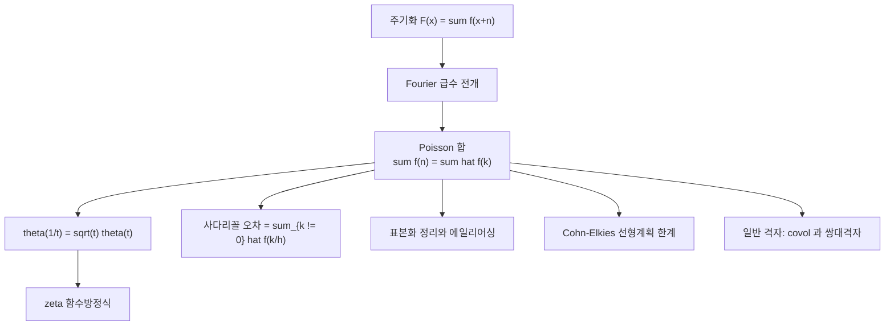

# Poisson 합 공식

# 개요

정수점 위에서 함수를 다 더한 값과, 그 Fourier 변환을 정수점 위에서 다 더한 값이 같다.

$$
\sum_{n\in\mathbb Z}f(n)=\sum_{k\in\mathbb Z}\hat f(k),
\qquad
\hat f(\xi)=\int_{-\infty}^{\infty}f(x)e^{-2\pi i x\xi}\thinspace dx
$$

좌변은 공간 쪽의 합, 우변은 진동수 쪽의 합이다. 두 합이 같다는 것만으로도 놀랍지만, 실제 쓸모는 **한쪽이 느리면 반드시 다른 쪽이 빠르다**는 데 있다. $f$ 가 폭 $\sigma$ 로 퍼져 있으면 $\hat f$ 는 폭 $1/\sigma$ 로 모여 있으므로, 수렴이 나쁜 합은 변환해서 더하면 된다.

이 공식은 [Euler–Maclaurin](euler-maclaurin.md)이 답하지 못한 자리를 정확히 메운다. Euler–Maclaurin 은 합과 적분의 차이를 도함수의 급수로 전개하지만 그 급수는 발산하고, 최적 절단에서 $e^{-2\pi N}$ 규모의 오차가 남았다. Poisson 합은 **그 남은 항이 무엇인지 정확히 말한다**. 차이는 $\sum_{k\ne0}\hat f(k)$ 이고, 지수적으로 작은 이유도 $\hat f$ 의 감쇠로 설명된다. 하나는 점근적, 하나는 정확한 항등식이다.

[Fourier 급수](fourier-series.md)의 수렴 정리를 한 점에서 읽은 것이 증명의 전부라는 점도 기억할 만하다. 도구는 초등적인데 결과는 theta 함수의 변환식, $\zeta$ 의 함수방정식, 표본화 정리, 구 채우기의 상한까지 닿는다.

# 직관

## 주기화하면 Fourier 급수가 된다

$f$ 를 정수만큼 평행이동해 전부 더한다.

$$
F(x)=\sum_{n\in\mathbb Z}f(x+n)
$$

$F$ 는 정의상 주기 1 이다. 주기함수이므로 Fourier 급수로 전개할 수 있고, 그 계수를 계산하면

$$
c_k=\int_0^1F(x)e^{-2\pi ikx}dx=\sum_n\int_0^1f(x+n)e^{-2\pi ikx}dx=\int_{-\infty}^{\infty}f(x)e^{-2\pi ikx}dx=\hat f(k)
$$

적분 구간이 잘린 조각들이 다시 실선 전체로 이어 붙는 것이 핵심이다. 그러므로 $F(x)=\sum_k\hat f(k)e^{2\pi ikx}$ 이고, **$x=0$ 을 넣으면 그것이 Poisson 합 공식**이다. 곧 이 공식은 "주기화의 Fourier 계수는 원래 함수의 Fourier 변환을 정수점에서 샘플한 것" 이라는 한 문장의 특수한 경우다.

## 좁으면 넓다

$f_t(x)=e^{-\pi x^{2}t}$ 를 넣으면 $\hat f_t(\xi)=t^{-1/2}e^{-\pi\xi^{2}/t}$ 이므로

$$
\theta(t)=\sum_ne^{-\pi n^{2}t}=\frac1{\sqrt t}\thinspace\theta\negthinspace\left(\frac1t\right)
$$

$t$ 가 크면 좌변은 항 몇 개로 끝나고, $t$ 가 작으면 우변이 그렇다. **$t$ 와 $1/t$ 중 계산하기 쉬운 쪽을 고를 수 있다**는 것이 이 항등식의 실질이다. 이것이 [theta 급수](theta-functions.md)의 모듈러 변환 $\tau\mapsto-1/\tau$ 의 출발점이고, 모듈러성이라는 현상이 결국 Fourier 쌍대성의 다른 이름임을 보여 준다.

## 사다리꼴 오차의 정체

간격 $h$ 의 사다리꼴로 $\int_{\mathbb R}f$ 를 근사하면 Poisson 합이 오차를 정확히 준다.

$$
h\sum_{n\in\mathbb Z}f(nh)-\int_{\mathbb R}f=\sum_{k\ne0}\hat f\negthinspace\left(\frac kh\right)
$$

$f$ 가 매끄러울수록 $\hat f$ 는 빨리 죽고, $f$ 가 해석적이면 $\hat f$ 가 지수적으로 죽는다. Euler–Maclaurin 절에서 "모든 차수보다 빠르게 줄어든다" 고만 말했던 것이 여기서는 **$e^{-c/h}$ 라는 구체적인 값**으로 나온다.



# 정의

## 공식

$f:\mathbb R\to\mathbb C$ 가 충분히 좋으면

$$
\sum_{n\in\mathbb Z}f(n)=\sum_{k\in\mathbb Z}\hat f(k)
$$

"충분히 좋다" 의 간편한 판정 하나는 다음이다. $f$ 가 연속이고, 어떤 $C,\varepsilon>0$ 에 대해 $|f(x)|\le C(1+|x|)^{-1-\varepsilon}$ 이며 $|\hat f(\xi)|\le C(1+|\xi|)^{-1-\varepsilon}$ 이면 양변이 절대수렴하고 등식이 성립한다. Schwartz 함수는 물론 여기 들어간다.

## 스케일과 평행이동

$f_h(x)=f(x/h)$ 에 적용하면

$$
h\sum_{n}f(nh)=\sum_k\hat f\negthinspace\left(\frac kh\right),
\qquad
\sum_nf(n+x)=\sum_k\hat f(k)e^{2\pi ikx}
$$

앞의 것이 수치적분에서 쓰는 꼴이고, 뒤의 것이 주기화의 Fourier 전개 그 자체다.

## 일반 격자

[격자](lattices.md) $L\subset\mathbb R^{d}$ 와 쌍대격자 $L^{*}=\lbrace\mu:\langle\mu,\lambda\rangle\in\mathbb Z\ \forall\lambda\in L\rbrace$ 에 대해

$$
\sum_{\lambda\in L}f(\lambda)=\frac1{\operatorname{covol}(L)}\sum_{\mu\in L^{*}}\hat f(\mu)
$$

$L$ 이 촘촘하면 $L^{*}$ 는 성기다. 부피 인자가 붙는 것은 기본영역의 크기가 바뀌기 때문이고, $L=\mathbb Z^{d}$ 면 $\operatorname{covol}=1$ 이라 원래 공식으로 돌아온다.

# 성질

## 증명

위 직관 절의 계산이 그대로 증명이다. 감쇠 조건에서 $\sum_nf(x+n)$ 이 균등수렴하므로 $F$ 는 연속이고, $\sum_k|\hat f(k)|<\infty$ 이므로 $F$ 의 Fourier 급수가 절대수렴해 $F$ 에 균등수렴한다. 두 사실을 $x=0$ 에서 맞추면 끝난다. $\square$

조건을 빼면 실제로 깨진다. 연속이고 $\sum f(n)$ 과 $\sum\hat f(k)$ 가 모두 절대수렴하는데도 등식이 성립하지 않는 예가 있다. **Fourier 급수가 점별로 값을 복원한다는 보장이 없으면 이 논법은 무너진다**는 것이 이유다.

## Gauss 함수의 자기쌍대성

$e^{-\pi x^{2}}$ 는 $\hat f=f$ 를 만족하는 대표적인 함수다. Poisson 합을 적용하면

$$
\sum_ne^{-\pi n^{2}}=\sum_ke^{-\pi k^{2}}
$$

라는 자명한 등식이 나오지만, 스케일을 넣은 순간 $\theta(t)=t^{-1/2}\theta(1/t)$ 라는 비자명한 관계가 된다. **자기쌍대 함수에 대칭을 깨는 매개변수를 넣는 것**이 이 공식에서 정보를 뽑는 표준 수법이다.

```python
from math import exp, pi, sqrt

theta = lambda t: sum(exp(-pi * n * n * t) for n in range(-200, 201))
for t in (0.5, 2.0, 3.7):
    print(t, "%.3e" % abs(theta(1 / t) - sqrt(t) * theta(t)))
# 0.5 0.000e+00 / 2.0 2.2e-16 / 3.7 2.2e-16

f = lambda x: exp(-pi * x * x)                       # 사다리꼴 오차의 예측
for h in (1.0, 0.8, 0.6, 0.5):
    err = h * sum(f(j * h) for j in range(-400, 401)) - 1.0
    pred = 2 * sum(exp(-pi * k * k / h ** 2) for k in range(1, 20))
    print("h=%.1f  실제 %.3e  예측 %.3e" % (h, err, pred))
# h=1.0 8.643e-02 8.643e-02 / h=0.8 1.476e-02 1.476e-02
# h=0.6 3.244e-04 3.244e-04 / h=0.5 6.975e-06 6.975e-06
```

오차가 자릿수까지 맞는다. Euler–Maclaurin 의 모든 보정항이 0 이 되는 자리에서 남는 것이 정확히 이 값이다.

## 불확정성이 만드는 제약

$f$ 와 $\hat f$ 를 동시에 마음대로 정할 수는 없다. 그래서 Poisson 합은 **양변에 부호 조건을 걸면 강력한 부등식이 된다**. $f\le0$ 을 원점 밖에서, $\hat f\ge0$ 을 모든 곳에서 요구하면

$$
0\ \ge\ \sum_{\lambda\ne0}f(\lambda)=\frac{\hat f(0)}{\operatorname{covol}(L)}-f(0)+\frac1{\operatorname{covol}(L)}\sum_{\mu\ne0}\hat f(\mu)\ \ge\ \frac{\hat f(0)}{\operatorname{covol}(L)}-f(0)
$$

에서 $\operatorname{covol}(L)\ge\hat f(0)/f(0)$ 이 나온다. 격자를 하나도 지정하지 않았는데 **모든 격자에 대한 하한**이 나온 것이다. 이것이 Cohn–Elkies 선형계획 한계의 뼈대이고, [구 채우기](sphere-packing.md)의 8 차원과 24 차원 해결은 이 부등식이 등호가 되게 하는 $f$ 를 실제로 구성한 것이다.

# 활용

## $\zeta$ 의 함수방정식

$\theta$ 의 변환식을 Mellin 변환으로 읽으면 곧바로 나온다. [감마 함수](gamma-function.md)를 써서

$$
\pi^{-s/2}\Gamma\negthinspace\left(\frac s2\right)\zeta(s)=\int_0^{\infty}\frac{\theta(t)-1}{2}\thinspace t^{s/2-1}dt
$$

로 쓰고 적분을 $t=1$ 에서 자른 뒤 앞쪽 조각에 $t\mapsto1/t$ 와 $\theta(1/t)=\sqrt t\thinspace\theta(t)$ 를 적용하면 $s\mapsto1-s$ 에 대해 대칭인 표현이 남는다. **Riemann 의 두 번째 증명이 이것이고, 대칭의 근원이 Poisson 합**이다. [소수 정리](prime-number-theorem.md)의 해석적 도구가 전부 이 함수방정식 위에 서 있다.

## 표본화와 에일리어싱

$\hat f$ 가 $[-B,B]$ 밖에서 0 인 대역제한 함수를 간격 $h$ 로 표본화하면, 주기화된 스펙트럼 $\sum_k\hat f(\xi-k/h)$ 가 겹치지 않을 조건이 $1/h\ge2B$ 다. 이것이 Nyquist 조건이고, 겹칠 때 생기는 왜곡이 에일리어싱이다. **신호처리의 기본 정리가 Poisson 합의 한 줄 따름정리**다. 실제 계산에서 이산 Fourier 변환이 연속 변환의 근사가 되는 정도도 같은 식으로 평가된다.

## 격자합의 빠른 계산

정전기 에너지 $\sum_{\lambda}1/|\lambda+r|$ 처럼 느리게 수렴하거나 조건수렴하는 격자합은 그대로 더할 수 없다. Ewald 합은 $1/|x|$ 를 감마 적분으로 쪼개 **가까운 쪽은 실공간에서, 먼 쪽은 Poisson 으로 옮겨 쌍대격자에서** 더한다. 양쪽 모두 지수적으로 수렴하도록 분할 매개변수를 잡는 것이 요령이고, 분자동역학과 결정 계산의 표준 기법이다.

## 대각합 공식의 가환판

$\mathbb R/\mathbb Z$ 위의 Laplace 작용소를 보면, 좌변은 고윳값 쪽 합이고 우변은 닫힌 측지선 길이 쪽 합이다. 이 구조를 비가환군과 쌍곡곡면으로 일반화한 것이 [Selberg 대각합 공식](selberg-trace-formula.md)이다. **스펙트럼과 기하가 마주 보는 공식의 가장 단순한 원형**이 Poisson 합이고, 그래서 등장하는 자리마다 "이쪽에서 어려운 것이 저쪽에서 쉽다" 는 같은 이야기가 반복된다.[^1]

[^1]: 표준 참고는 E. M. Stein, R. Shakarchi, *Fourier Analysis* 5 장과 H. Iwaniec, E. Kowalski, *Analytic Number Theory* 4 장. 선형계획 한계는 H. Cohn, N. Elkies, *New upper bounds on sphere packings I*, Ann. of Math. 157 (2003). 등식이 깨지는 반례는 Y. Katznelson, *An Introduction to Harmonic Analysis* 의 연습문제로 있다. 본문의 수치는 직접 실행해 확인했다.

# 연관 문서

## 선수지식

- [Fourier 급수](fourier-series.md)
- [Euler–Maclaurin 공식과 점근급수](euler-maclaurin.md)

## 더 알아보기

- [theta 급수와 Dedekind eta](theta-functions.md)
- [Mellin 변환과 Perron 공식](mellin-transform.md)

#analysis #number_theory #theorem
