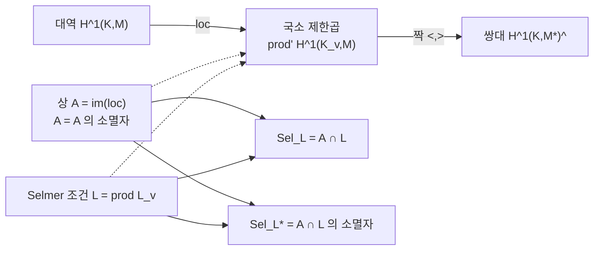

# Poitou–Tate 완전열과 대역 상호법칙

# 개요

[Selmer 군](selmer-groups.md)을 정의할 때 한 일은 대역 코호몰로지 `H^1(K,M)` 을 모든 자리의 국소 코호몰로지 `H^1(K_v,M)` 로 보내고 국소 조건으로 걸러내는 것이었다. 이 방식이 쓸모 있으려면 **대역에서 국소로 가는 사상이 무엇을 놓치고 무엇을 덮는지**를 알아야 한다. 그 답이 Poitou–Tate 완전열이다.

$$
\begin{aligned}
0\to H^0(K,M)\to\ &\textstyle\prod_v H^0(K_v,M)\to H^2(K,M^{*})^{\vee}\\
\to H^1(K,M)\to\ &\textstyle\prod'_v H^1(K_v,M)\to H^1(K,M^{*})^{\vee}\\
\to H^2(K,M)\to\ &\textstyle\bigoplus_v H^2(K_v,M)\to H^0(K,M^{*})^{\vee}\to0
\end{aligned}
$$

아홉 항이 한 줄로 이어지고, 위쪽 줄과 아래쪽 줄이 `M` 과 그 Cartier 쌍대 $M^{*}=\mathrm{Hom}(M,\mu)$ 사이를 오간다. 이 열의 정보는 두 가지로 요약된다.

- **상호법칙.** $H^1(K,M)\to\prod'_vH^1(K_v,M)$ 의 상은 국소 짝에 대해 **자기 소멸자**다. 곧 두 대역류의 국소 짝을 모든 자리에서 더하면 0 이다.
- **크기 공식.** 국소 조건으로 잘라낸 Selmer 군과, 소멸자 조건으로 잘라낸 쌍대 Selmer 군의 **크기 비가 순전히 국소 데이터로 계산된다.** 이것이 Greenberg–Wiles 공식이다.

두 진술의 뿌리는 하나다. [국소 유체론](local-class-field-theory.md)이 각 자리에서 완전 짝을 주고, [Brauer 군](brauer-groups.md)에서 본 $\sum_v\mathrm{inv}_v=0$ 이 그 짝들을 대역적으로 묶는다. Poitou–Tate 는 이 두 사실을 계수 `M` 짜리로 승격한 것이고, 그 결과가 산술 기하의 거의 모든 "군의 크기를 세는" 논법의 바닥에 깔려 있다.

# 직관

## 대역에 관한 사실은 단 하나뿐이다

수체의 산술에서 진정으로 대역적인 입력은 놀랄 만큼 적다. [유체론](class-field-theory.md)의 대역 부분을 한 줄로 적으면

$$
0\longrightarrow \mathrm{Br}(K)\longrightarrow\bigoplus_v\mathrm{Br}(K_v)\xrightarrow{\ \sum\mathrm{inv}_v\ }\mathbb Q/\mathbb Z\longrightarrow0
$$

이다. 가운데 사상은 순전히 국소적이고, 대역적인 내용은 "합이 0 인 것만 대역적으로 실현된다" 는 한 문장에 다 들어 있다.

Poitou–Tate 완전열은 이 열을 계수 `M` 으로 확장한 것에 지나지 않는다. $M=\mu_n$ 이면 실제로 위 열이 그대로 나온다. 그러므로 아래에 나오는 모든 계산은 **상호법칙 한 줄을 선형대수로 증폭한 것**이라고 보아도 좋다.

## 국소 공간은 짝을 가진 큰 공간, 대역 상은 그 안의 라그랑지안

`M` 이 유한이고 `M^{*}=M` 인 자기쌍대 경우를 생각하자. `E[p]` 가 Weil 짝 때문에 그렇다. 그러면

$$
V=\prod_v{}'\,H^1(K_v,M)
$$

위에 비퇴화 교대 짝이 있고, 대역류의 상 $A=\mathrm{im}\big(H^1(K,M)\to V\big)$ 는 $A=A^{\perp}$ 를 만족한다. 유한차원 심플렉틱 공간에서 $A=A^{\perp}$ 인 부분공간을 **라그랑지안**이라 하고 차원은 정확히 절반이다.

Selmer 조건 $L=\prod_v L_v$ 도 `V` 의 부분공간이다. 그러면

$$
\mathrm{Sel}_L=A\cap L,\qquad \mathrm{Sel}_{L^{*}}=A\cap L^{\perp}
$$

이고, 두 Selmer 군은 **같은 라그랑지안을 서로 소멸자인 두 부분공간으로 자른 것**이다. 이 그림에서는 크기 비교가 순수 선형대수다.

$$
\dim(A\cap L)-\dim(A\cap L^{\perp})=\dim L-\tfrac12\dim V
$$

증명도 한 줄이다. $A=A^{\perp}$ 이므로 $A\cap L^{\perp}=(A+L)^{\perp}$ 이고, 차원을 세면 위 식이 나온다. 오른쪽에는 `A` 가 등장하지 않는다. **대역적으로 알기 어려운 대상이 차이 공식에서는 사라진다**는 것이 Poitou–Tate 가 주는 실질적 이득이다.

```python
# dim(A ∩ L) - dim(A ∩ L^perp) = dim L - n   (A 는 F_p^{2n} 의 라그랑지안)
import random, itertools
p, n = 3, 3; N = 2 * n

def rank(rows):
    rows = [r[:] for r in rows]; r = 0
    for c in range(N):
        piv = next((i for i in range(r, len(rows)) if rows[i][c] % p), None)
        if piv is None: continue
        rows[r], rows[piv] = rows[piv], rows[r]
        inv = pow(rows[r][c], p - 2, p)
        rows[r] = [(x * inv) % p for x in rows[r]]
        for i in range(len(rows)):
            if i != r and rows[i][c] % p:
                f = rows[i][c]
                rows[i] = [(rows[i][j] - f * rows[r][j]) % p for j in range(N)]
        r += 1
    return r

form = lambda x, y: sum(x[i] * y[n + i] - x[n + i] * y[i] for i in range(n)) % p

def span(basis):
    out = set()
    for coef in itertools.product(range(p), repeat=len(basis)):
        v = [0] * N
        for c, b in zip(coef, basis):
            v = [(v[j] + c * b[j]) % p for j in range(N)]
        out.add(tuple(v))
    return out

random.seed(7)
for _ in range(200):
    S = [[0] * n for _ in range(n)]                  # 대칭행렬 -> 라그랑지안
    for i in range(n):
        for j in range(i, n):
            S[i][j] = S[j][i] = random.randrange(p)
    A = [[int(k == i) for k in range(n)] + S[i] for i in range(n)]
    L = [[random.randrange(p) for _ in range(N)] for _ in range(random.randrange(N + 1))]

    Aset, Lset = span(A), span(L)
    Lperp = {v for v in itertools.product(range(p), repeat=N)
             if all(form(v, s) == 0 for s in Lset)}
    lhs = rank([list(v) for v in Aset & Lset]) - rank([list(v) for v in Aset & Lperp])
    assert lhs == rank(L) - n
```

## 조건을 한 칸 넓히면 무슨 일이 생기는가

위 항등식의 가장 요긴한 따름이 이것이다. 한 자리 $\ell$ 에서만 $L_\ell$ 을 1 차원 넓히면 $\dim L$ 이 1 늘고 $\dim L^{\perp}$ 이 1 준다. 따라서

$$
\dim\mathrm{Sel}_{L'}-\dim\mathrm{Sel}_{L'^{*}}=\big(\dim\mathrm{Sel}_{L}-\dim\mathrm{Sel}_{L^{*}}\big)+1
$$

이고, 한편 $\mathrm{Sel}_{L}\subset\mathrm{Sel}_{L'}$ 의 지표는 최대 1 이다. 그러므로 **조건을 넓히면 Selmer 가 1 커지거나, 아니면 쌍대 Selmer 가 1 작아지거나, 둘 중 하나다.** 어느 쪽인지를 결정하는 것이 국소 계산이고, 이 이분법이 Euler 계 논법과 Taylor–Wiles 논법의 공통 엔진이다.

| 조작 | $\mathrm{Sel}_L$ | $\mathrm{Sel}_{L^{*}}$ |
|---|---|---|
| $\ell$ 에서 조건 완화(relaxed) | $\le+1$ | $\ge-1$ |
| $\ell$ 에서 조건 강화(strict) | $\ge-1$ | $\le+1$ |
| 둘 다 변하지 않는다 | 불가능 | 불가능 |

목표가 Selmer 를 줄이는 것이면 쌍대 쪽을 키워야 하고, 목표가 쌍대를 죽이는 것이면 그쪽 조건을 강화해야 한다. Kolyvagin 소수와 Taylor–Wiles 소수는 정확히 이 표의 한 칸을 원하는 방향으로 쓰기 위해 고르는 소수다.

## 왜 제한곱인가

가운데 항이 단순한 곱이 아니라 제한곱 $\prod'_v$ 인 이유는 유한성 때문이다. 거의 모든 자리에서 `M` 이 비분기이고 그런 자리에서 `H^1(K_v,M)` 의 "비분기부" $H^1_{\mathrm{ur}}(K_v,M)$ 는 $H^1(\hat{\mathbb Z},M^{I_v})$ 와 같다. 대역류는 유한 개 자리를 뺀 모든 곳에서 비분기이므로 상이 제한곱 안에 들어간다.

비분기부는 국소 짝에 대해 스스로의 소멸자다. 그래서 "거의 모든 자리에서 짝이 자동으로 0" 이 되고, 상호법칙의 무한합이 실제로는 유한합이 된다. 조건 $L_v=H^1_{\mathrm{ur}}$ 이 기본값이 되는 이유이기도 하다.



# 정의

## 국소 Tate 쌍대성

`K_v` 를 국소체, `M` 을 `\#M` 이 $\mathrm{char}$ 과 서로소인 유한 `G_{K_v}` 가군, $M^{*}=\mathrm{Hom}(M,\mu_{\#M})$ 이라 하자.

**정리(국소 Tate 쌍대성).** 컵곱과 불변량 사상

$$
H^{i}(K_v,M)\times H^{2-i}(K_v,M^{*})\xrightarrow{\ \cup\ }H^{2}(K_v,\mu)=\mathrm{Br}(K_v)[\#M]\xrightarrow{\ \mathrm{inv}_v\ }\tfrac1{\#M}\mathbb Z/\mathbb Z
$$

는 `i=0,1,2` 에서 완전 짝이다. 또한 국소 Euler 표수 공식

$$
\frac{\#H^{0}(K_v,M)\cdot\#H^{2}(K_v,M)}{\#H^{1}(K_v,M)}=\|\#M\|_v
$$

가 성립한다. `v` 가 `\#M` 을 나누지 않으면 오른쪽이 1 이고, 그때 $\#H^1_{\mathrm{ur}}=\#H^0$ 이며 $H^1_{\mathrm{ur}}$ 은 자기 소멸자다.

## 제한곱

`S` 를 무한 자리, `\#M` 을 나누는 자리, `M` 이 분기하는 자리를 포함하는 유한 집합이라 하자.

$$
P^{i}(M)=\prod_v{}'\,H^{i}(K_v,M)
$$

는 $v\notin S$ 에서 $H^i_{\mathrm{ur}}(K_v,M)$ 에 들어가는 성분만 모은 제한곱이다. `i=0` 에서는 보통의 곱, `i=2` 에서는 직합이 된다.

## Poitou–Tate 9 항 완전열

**정리.** `K` 가 수체일 때 다음이 완전열이다.

$$
\begin{aligned}
0\to\ &H^0(K,M)\to P^0(M)\to H^2(K,M^{*})^{\vee}\\
\to\ &H^1(K,M)\to P^1(M)\to H^1(K,M^{*})^{\vee}\\
\to\ &H^2(K,M)\to P^2(M)\to H^0(K,M^{*})^{\vee}\to0
\end{aligned}
$$

여기서 $(-)^{\vee}$ 는 Pontryagin 쌍대다. 특히 $H^1(K,M)\to P^1(M)$ 의 상은 $H^1(K,M^{*})\to P^1(M^{*})$ 의 상의 소멸자다. `M=M^{*}` 이면 상이 자기 소멸자, 곧 앞에서 말한 라그랑지안이다.

## Tate–Shafarevich 군의 쌍대성

$$
Ш^{i}(K,M)=\ker\Big(H^{i}(K,M)\to\prod_vH^{i}(K_v,M)\Big)
$$

라 두면 완전열에서 곧바로

$$
Ш^{1}(K,M)\ \cong\ Ш^{2}(K,M^{*})^{\vee},\qquad
Ш^{2}(K,M)\ \cong\ Ш^{1}(K,M^{*})^{\vee}
$$

가 나온다. `E[p]` 에 적용하면 [Selmer 군](selmer-groups.md) 문서의 `Ш(E/K)` 가 자기쌍대라는 사실, 따라서 그 위수가 제곱수라는 사실의 출처가 된다.

## Selmer 구조와 쌍대 구조

각 자리에서 부분군 $L_v\subset H^1(K_v,M)$ 를 고른 것을 Selmer 구조라 하고, 거의 모든 `v` 에서 $L_v=H^1_{\mathrm{ur}}$ 을 요구한다. **쌍대 구조**는

$$
L^{*}_v=\big(L_v\big)^{\perp}\subset H^1(K_v,M^{*})
$$

로 정의한다. 두 Selmer 군은

$$
\mathrm{Sel}_L(K,M)=\ker\Big(H^1(K,M)\to\prod_v\frac{H^1(K_v,M)}{L_v}\Big),\qquad
\mathrm{Sel}_{L^{*}}(K,M^{*})
$$

이다. `L_v=H^1_f` 를 고르면 앞의 것이 보통의 Selmer 군이다.

# 성질

## 대역 상호법칙

**정리.** $a\in H^1(K,M)$, $b\in H^1(K,M^{*})$ 이면

$$
\sum_v\mathrm{inv}_v\big(\mathrm{loc}_v(a)\cup\mathrm{loc}_v(b)\big)=0
$$

이다. 합은 유한 개 항만 0 이 아니다.

**증명.** $a\cup b\in H^2(K,\mu)$ 이고 $H^2(K,\mu_n)\subset\mathrm{Br}(K)[n]$ 이다. 컵곱은 국소화와 교환하므로 $\mathrm{loc}_v(a)\cup\mathrm{loc}_v(b)=\mathrm{loc}_v(a\cup b)$ 이고, Brauer 군의 대역 열에서 $\mathrm{Br}(K)$ 의 원소는 국소 불변량의 합이 0 이다. $\square$

증명은 두 줄이지만 내용은 대역 유체론 전부다. 이 항등식이 **Selmer 군을 위에서 누르는 유일한 대역 입력**이며, [Euler 계](euler-systems.md) 논법은 이 합에서 한 항만 남기도록 대역류를 고르는 기술이다.

## Greenberg–Wiles 공식

**정리.** 위 기호에서

$$
\frac{\#\mathrm{Sel}_{L}(K,M)}{\#\mathrm{Sel}_{L^{*}}(K,M^{*})}
=\frac{\#H^{0}(K,M)}{\#H^{0}(K,M^{*})}\prod_v\frac{\#L_v}{\#H^{0}(K_v,M)}
$$

곱은 유한 개 자리를 빼면 1 이다.

이 공식이 실무에서 하는 일은 명확하다. **좌변의 두 군은 대역적이라 계산하기 어렵지만, 그 비는 국소 계산만으로 확정된다.** 그래서 둘 중 하나를 다른 수단으로 잡아 두면 나머지가 자동으로 나온다. Euler 계는 쌍대 Selmer 쪽을 죽여 왼쪽을 잡고, Taylor–Wiles 는 소수를 붙여 쌍대 Selmer 를 죽인 뒤 접공간의 차원을 고정한다. 방향만 다르고 쓰는 공식은 같다.

$\dim$ 으로 다시 쓰면 직관 절의 선형대수 항등식이 그대로 보인다. 자기쌍대 `M` 과 `H^0=0` 인 경우

$$
\dim\mathrm{Sel}_{L}-\dim\mathrm{Sel}_{L^{*}}=\sum_v\Big(\dim L_v-\dim H^{0}(K_v,M)\Big)
$$

이고, 오른쪽이 $\dim L-\tfrac12\dim V$ 의 자리별 판본이다.

## 대역 Euler 표수

`K_S` 를 `S` 밖에서 비분기인 최대 확대라 하면 Tate 의 공식

$$
\frac{\#H^{0}(K_S/K,M)\cdot\#H^{2}(K_S/K,M)}{\#H^{1}(K_S/K,M)}=\prod_{v\mid\infty}\frac{\#H^{0}(K_v,M)}{\#M}
$$

가 성립한다. 오른쪽은 무한 자리만 보므로 전적으로 "실 대 복소" 의 조합 계산이다. $K=\mathbb Q$ 이고 `M` 이 복소켤레에 대해 $\pm$ 로 쪼개지면 오른쪽이 `\#M^{+}/\#M` 이 된다.

이 공식은 `H^2` 를 `H^1` 로 바꿔 세는 데 쓴다. 변형 이론에서 `H^1` 이 접공간, `H^2` 가 장애공간이므로, Euler 표수가 **장애가 접공간보다 얼마나 작은지의 하한**을 주고 그것이 곧 변형환의 차원 하한이 된다.

## 국소 조건의 사전

자주 쓰는 조건을 정리한다. `M=E[p]`, $v\nmid p$ 인 경우가 표준이다.

| 조건 | 정의 | $\dim$ (일반 $v\nmid p$) | 소멸자 |
|---|---|---|---|
| 비분기 $H^1_{\mathrm{ur}}$ | $\ker(H^1(K_v,M)\to H^1(I_v,M))$ | $\dim H^0(K_v,M)$ | 자기 자신 |
| 완화 `H^1` | 전체 | $2\dim H^0$ | `0` |
| 강화 `0` | 영 | `0` | 전체 |
| 가로지름 $H^1_{\mathrm{tr}}$ | 분기 방향의 보충 | $\dim H^0$ | 자기 자신 |

비분기와 가로지름이 둘 다 자기 소멸자라는 점이 결정적이다. 하나를 다른 하나로 바꾸면 $\dim L$ 이 변하지 않고 $\mathrm{Sel}_L$ 만 다른 군으로 옮겨 간다. Kolyvagin 유도류가 사는 곳이 정확히 이 "비분기를 가로지름으로 갈아 끼운" Selmer 군이다.

## 계산의 실제

한 자리의 조건만 완화했을 때를 보자. `L'` 을 $\ell$ 에서만 $H^1(K_\ell,M)$ 전체로 바꾼 구조라 하면

$$
0\to\mathrm{Sel}_L\to\mathrm{Sel}_{L'}\xrightarrow{\ \partial_\ell\ }H^1_s(K_\ell,M)
$$

이 완전하고, $\partial_\ell$ 의 상이 무엇인지가 유일한 미지수다. 상호법칙이 이 상을 결정한다. $\mathrm{Sel}_{L'^{*}}$ 의 원소는 $\ell$ 에서 강화 조건, 곧 $\mathrm{loc}_\ell=0$ 을 만족하므로, $\partial_\ell(\mathrm{Sel}_{L'})$ 는 $\mathrm{loc}_\ell(\mathrm{Sel}_{L^{*}})$ 의 소멸자다. 곧

$$
\mathrm{im}\,\partial_\ell=\big(\mathrm{loc}_\ell\,\mathrm{Sel}_{L^{*}}\big)^{\perp}
$$

이다. 이 한 줄이 "쌍대 Selmer 에 $\ell$ 에서 보이는 원소가 있으면 완화해도 Selmer 가 커지지 않는다" 를 뜻하고, 대우로 읽으면 **쌍대 Selmer 를 죽이려면 그 원소가 보이는 자리를 골라 완화하면 된다**가 된다. [Chebotarev](chebotarev.md) 가 그런 자리의 존재를 보장한다.

# 활용

## 하강과 Selmer 군의 크기

`m` 하강에서 $\mathrm{Sel}^m(E/K)$ 의 크기를 셀 때 쓰는 것이 Greenberg–Wiles 다. `E[m]` 이 Weil 짝으로 자기쌍대이므로 `L=L^{*}` 를 고르면 좌변이 1 이 되고, 국소 항의 곱이 1 이라는 비자명한 항등식이 나온다. 이 항등식이 각 자리의 국소 지표 `\#(E(K_v)/mE(K_v))` 들 사이의 관계를 주고, 하강 알고리즘의 정당성과 복잡도 추정의 근거가 된다.

## 변형환의 접공간과 Taylor–Wiles 소수

[변형환](deformation-rings.md)의 접공간은 국소 조건을 단 Selmer 군 $H^1_{\mathcal L}(K,\mathrm{ad}\bar\rho)$ 이고, 장애는 `H^2` 에 있다. Greenberg–Wiles 를 $\mathrm{ad}\bar\rho$ 에 적용하면

$$
\dim H^1_{\mathcal L}-\dim H^1_{\mathcal L^{*}}=\text{국소 항의 합}
$$

이 되고, 오른쪽은 곧바로 계산된다. Taylor–Wiles 는 $q\equiv1\ (\mathrm{mod}\ p^{n})$ 인 보조 소수를 $r=\dim H^1_{\mathcal L^{*}}$ 개 골라 그 자리들에서 조건을 완화한다. Chebotarev 로 각 소수가 쌍대 Selmer 의 원소 하나씩을 "보도록" 고르면 위 표의 두 번째 행에 따라 쌍대 Selmer 가 한 칸씩 줄고, `r` 번 반복하면 `0` 이 된다. 그러면 접공간의 차원이 국소 항만으로 확정되어 패칭에 필요한 균일한 표현이 얻어진다.

## Euler 계 논법의 뼈대

[Euler 계](euler-systems.md)는 상호법칙의 합에서 한 항만 살아남게 대역류를 설계한다. 유도류 $\kappa_n$ 이 `n` 밖에서 Selmer 조건을 만족한다는 성질이 정확히 "그 자리들에서 짝이 0" 을 뜻하고, 남은 $\ell$ 자리의 짝이 0 이라는 결론이 $\mathrm{loc}_\ell(s)=0$ 을 강제한다. 이 문서의 상호법칙이 없으면 Euler 계는 아무것도 증명하지 못한다.

## Hasse 원리의 장애

$Ш^{2}(K,M)\cong Ш^{1}(K,M^{*})^{\vee}$ 는 "국소적으로 자명한 2 차 류" 의 개수를 1 차 쪽 계산으로 바꿔 준다. 이 대응이 매몰 문제(embedding problem)의 국소-대역 원리, 그리고 [Brauer 군](brauer-groups.md)에서 본 Hasse 원리의 반례를 다루는 표준 도구다. `M^{*}` 쪽이 다루기 쉬운 경우가 많아, 장애의 존재를 손에 잡히는 유한 계산으로 옮기는 데 쓰인다.

[^1]: 표준 참고는 J. Neukirch, A. Schmidt, K. Wingberg, *Cohomology of Number Fields* (2판, Springer 2008) 8 장, 그리고 J. S. Milne, *Arithmetic Duality Theorems* (2판, 2006) I 장. Greenberg–Wiles 공식은 A. Wiles, *Modular elliptic curves and Fermat's Last Theorem*, Ann. of Math. **141** (1995) 의 명제 1.6 과 R. Greenberg 의 Iwasawa 이론 강의록에 있다. 읽기 쉬운 입문으로 B. Mazur, K. Rubin, *Kolyvagin Systems* (Memoirs AMS 168, 2004) 2 장을 권한다. 본문의 라그랑지안 항등식과 코드는 직접 확인한 것이다.

# 연관 문서

## 선수지식

- [Selmer 군과 Tate–Shafarevich 군](selmer-groups.md)
- [국소 유체론과 Lubin–Tate 형식군](local-class-field-theory.md)

## 더 알아보기

- [Euler 계와 Kolyvagin 유도류](euler-systems.md)
- [Galois 표현의 변형과 보편 변형환](deformation-rings.md)

#number_theory #theorem #algebra
