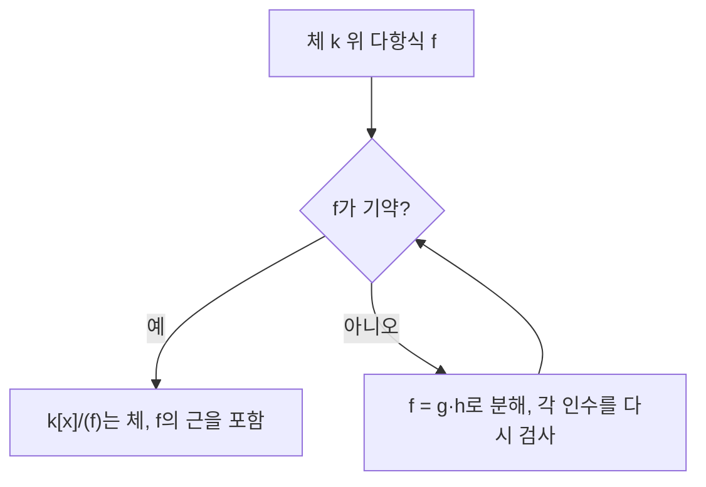

# 다항식환

# 개요

다항식환은 환 R의 원소를 계수로 갖는 형식적 다항식 전체가 이루는 환이다. 계수가 [체](fields.md)일 때 다항식환은 나눗셈 정리를 가지므로 유클리드 정역이 되고, 그 결과 [소수와 유일분해](primes.md)에서 정수에 대해 성립했던 이론이 거의 그대로 옮겨진다. 기약다항식이 소수의 역할을 하고, 최대공약수는 [유클리드 알고리즘](euclidean-algorithm.md)으로 계산되며, 인수분해는 단위원 배수와 순서를 무시하면 유일하다.

다항식환이 이 지도에서 차지하는 위치는 "체를 만드는 기계"다. 기약다항식 f로 생성한 아이디얼은 극대 아이디얼이고, 그 몫환은 f의 근을 하나 품은 새로운 체가 된다. [체의 확대](field-extensions.md), [유한체](finite-fields.md), [Galois 이론](galois-theory.md)이 모두 이 구성에서 출발한다.

# 직관

정수에서 하던 일을 다항식에서 반복한다고 보면 된다. 차수가 절댓값의 역할을 하고, 나머지의 차수가 나누는 다항식의 차수보다 작아지는 것이 "나머지가 제수보다 작다"에 대응한다.

$$
x^3-1=(x-1)(x^2+x+1),\qquad x^3+x+1 \text{는 } \mathbb{F}_2 \text{ 위에서 기약}
$$

중요한 점은 기약성이 계수체에 의존한다는 것이다. x^2+1은 R 위에서는 기약이지만 C 위에서는 (x+i)(x-i)로 쪼개지고, F_2 위에서는 (x+1)^2이 된다. 따라서 "인수분해"는 다항식만의 성질이 아니라 다항식과 체의 쌍의 성질이다.



# 정의

R를 항등원 있는 가환환이라 하자. R 위 한 변수 다항식환은 유한개만 0이 아닌 계수열의 집합에 통상의 덧셈과 합성곱(convolution) 곱셈을 준 환이다.

$$
R[x]=\Big\{\textstyle\sum_{i=0}^{n}a_ix^i \ :\ n\ge 0,\ a_i\in R\Big\},\qquad
\Big(\sum_i a_ix^i\Big)\Big(\sum_j b_jx^j\Big)=\sum_k\Big(\sum_{i+j=k}a_ib_j\Big)x^k
$$

0이 아닌 다항식 f의 차수 deg f는 0이 아닌 최고차 계수의 지수이고, 그 계수를 leading coefficient라 한다. leading coefficient가 1인 다항식을 monic이라 한다. 0 다항식의 차수는 정의하지 않거나 음의 무한으로 둔다.

체 k 위의 0이 아닌 다항식 f가 기약(irreducible)이라는 것은 deg f ≥ 1이고, f=gh로 쓰면 g 또는 h가 상수(즉 단위원)라는 뜻이다.

원소 a가 f의 근이라는 것은 다음을 뜻한다. 여기서 f(a)는 계수를 그대로 두고 x에 a를 대입한 값이다.

$$
f(a)=0
$$

# 성질

## 나눗셈 정리

k가 체이고 f, g가 k[x]의 원소, g가 0이 아니면 다음을 만족하는 q, r가 유일하게 존재한다[^1].

$$
f=qg+r,\qquad r=0 \ \text{또는}\ \deg r<\deg g
$$

증명 개요: deg f < deg g면 q=0, r=f. 그렇지 않으면 f에서 (leading coefficient의 비)·x^(deg f - deg g)·g를 빼서 차수를 내리고 귀납한다. g의 leading coefficient로 나누는 단계에서 k가 체라는 조건이 쓰인다. 계수환이 체가 아니면 이 정리는 깨진다. 예컨대 Z[x]에서 x를 2x로 나눌 수 없다.

## 유클리드 정역과 유일분해

차수를 크기 함수로 쓰면 k[x]는 유클리드 정역이고, 모든 유클리드 정역은 주 아이디얼 정역이며 유일분해 정역(UFD)이다[^2]. 따라서 k[x]의 0이 아닌 모든 비단위 다항식은 기약다항식들의 곱으로 쓰이고, 그 분해는 순서와 0이 아닌 상수배를 무시하면 유일하다.

$$
f=c\,p_1^{e_1}\cdots p_m^{e_m},\qquad c\in k^{\times},\ p_i \text{ monic 기약}
$$

주 아이디얼 정역이라는 사실의 증명 개요: [아이디얼](ideals-quotient-rings.md) I가 0이 아니면 I에서 차수가 최소인 원소 g를 잡는다. 임의의 f∈I를 g로 나누면 나머지 r=f-qg가 I에 속하고 차수가 g보다 작으므로 r=0이다. 즉 I=(g)다.

## 근과 인수 정리

f를 x-a로 나누면 나머지는 상수이고, 대입하면 그 상수가 f(a)임을 알 수 있다.

$$
f(x)=(x-a)q(x)+f(a)
$$

따라서 a가 f의 근인 것과 (x-a)가 f를 나누는 것이 동치다. 귀납하면 체 위의 0이 아닌 차수 n 다항식은 근을 최대 n개 가진다. 이 계수는 체(더 일반적으로 정역)에서만 성립한다. Z/8Z 위에서 x^2-1은 근이 1,3,5,7로 네 개다.

deg f가 2 또는 3인 k[x]의 다항식은 기약성과 근의 부재가 동치다. 인수분해하면 반드시 1차 인수가 나오기 때문이다. 4차 이상에서는 성립하지 않는다. x^4+2x^2+1=(x^2+1)^2은 Q 위에서 근이 없지만 기약이 아니다.

## 기약다항식과 극대 아이디얼

k[x]는 주 아이디얼 정역이므로, 0이 아닌 (f)가 [극대 아이디얼](prime-ideals.md)인 것과 f가 기약인 것이 동치다. 따라서 다음이 성립한다.

$$
f \text{ 기약} \iff k[x]/(f) \text{가 체}
$$

몫체에서 x의 동치류는 f의 근이 된다. 예컨대 F_2[x]/(x^2+x+1)은 원소 4개인 체이고, R[x]/(x^2+1)은 C와 동형이다.

## 기약성 판정

- Q[x]: Gauss의 보조정리로 Z[x]에서의 기약성과 동치다. Eisenstein 판정법, 소수 p로 환원해 F_p[x]에서 기약성을 보는 방법을 쓴다.
- 유리근 정리: 정수계수 다항식의 유리근 b/c는 b가 상수항을, c가 leading coefficient를 나눈다.
- C[x]: 대수학의 기본정리에 의해 기약다항식은 1차뿐이다. R[x]에서는 1차와 판별식이 음인 2차뿐이다.

# 활용

## 최대공약수와 확장 유클리드

k[x]에서 유클리드 알고리즘은 정수판과 동일한 형태로 돌아간다. 확장형은 gcd(f,g)=1일 때 f의 역원을 k[x]/(g)에서 계산하는 수단이므로, 유한체 산술과 오류정정 부호 구현의 기본 연산이다.

```python
def poly_gcd_F2(a, b):
    # F_2[x] 다항식을 비트마스크로 표현: x^3+x+1 -> 0b1011
    while b:
        while a.bit_length() >= b.bit_length() and a:
            a ^= b << (a.bit_length() - b.bit_length())
        a, b = b, a
    return a

print(bin(poly_gcd_F2(0b1011, 0b110)))  # x^3+x+1 과 x^2+x 는 서로소 -> 0b1
```

## 체의 구성

기약다항식으로 몫을 취하는 절차가 [체의 확대](field-extensions.md)의 단순 확대이며, [유한체](finite-fields.md)는 F_p[x]를 차수 n의 기약다항식으로 나눈 몫으로 구성된다. 최소다항식(minimal polynomial)은 확대체 원소를 소멸시키는 monic 다항식 중 차수가 최소인 것으로, 기약이며 그 원소를 소멸시키는 모든 다항식을 나눈다.

## 선형대수와의 연결

정사각행렬 A에 대해 특성다항식과 최소다항식은 k[x]의 원소이며, k[x]의 유일분해가 Jordan 표준형과 고윳값 중복도 이론의 뼈대를 준다. [선형사상](linear-maps.md)을 k[x]-모듈 구조로 보는 관점이 그 형식화다.

[^1]: UC Irvine Math 120B, "Rings of Polynomials" — 체 위 다항식환의 나눗셈 알고리즘과 인수 정리. https://www.math.uci.edu/~ndonalds/math120b/2poly.pdf
[^2]: R. Woodroofe, "Polynomial rings and unique factorization domains" — 유클리드 정역이 PID이고 UFD임, k[x]의 유일분해. https://osebje.famnit.upr.si/~russ.woodroofe/wustl-notes/ufds.pdf

# 연관 문서

## 선수지식

- [환](rings.md)
- [체](fields.md)

## 더 알아보기

- [체의 확대](field-extensions.md)

#ring_theory
