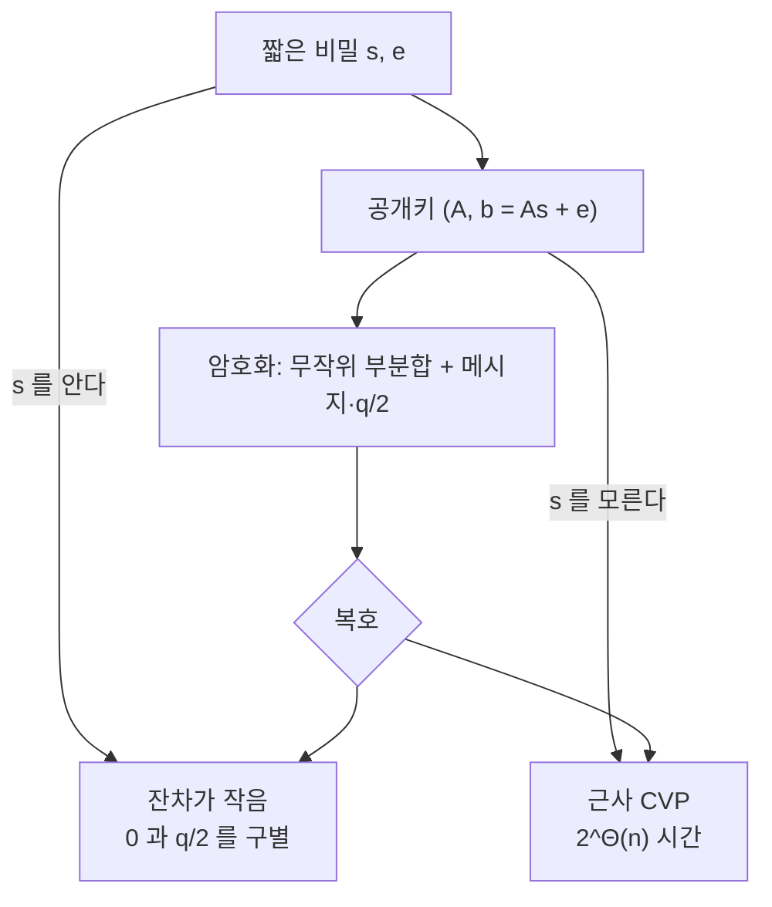

# 격자 기반 후양자 암호

# 개요

오늘 쓰이는 공개키 암호는 거의 전부 두 가지 가정 위에 서 있다. 소인수분해가 어렵다는 것([RSA](rsa-cryptosystem.md))과 [이산로그](discrete-logarithm.md)가 어렵다는 것(Diffie–Hellman, [타원곡선](elliptic-curves.md) 암호)이다. Shor 알고리즘은 충분히 큰 양자컴퓨터에서 둘 다 다항시간에 푼다. 두 가정이 동시에 무너지는 이유는 둘이 같은 문제의 사례이기 때문이다. 유한 아벨군의 숨은 부분군을 찾는 문제이고, 양자 Fourier 변환이 정확히 그 구조를 겨냥한다.

대체재의 조건은 아벨 숨은 부분군으로 환원되지 않는 어려운 문제다. [격자](lattices.md)의 근사 최단벡터 문제가 현재 가장 유력한 후보다. 40 년 가까이 연구되었지만 최선의 알고리즘이 고전이든 양자든 $2^{\Theta(n)}$ 시간을 쓰고, 양자가 주는 이득이 상수배에 그친다.

여기에 다른 어떤 암호 가정에도 없는 성질이 하나 더 있다. 무작위로 뽑은 사례가 최악의 사례만큼 어렵다는 것이 정리로 증명된다. 이 두 가지 때문에 NIST 가 2024 년에 표준화한 후양자 알고리즘의 주류가 격자 기반이 되었다.

# 직관

## 잡음이 방어다

`A s = b` 를 푸는 것은 쉽다. Gauss 소거법이 다항시간에 끝난다. 그런데 오른쪽에 작은 잡음을 더해 보자.

$$
b = As + e,\qquad \|e\|\ \text{작음}
$$

`s` 를 복원하는 문제가 갑자기 어려워진다. 소거를 하면 계수가 커지면서 잡음이 증폭되고, 몇 단계 지나면 잡음이 법 `q` 전체를 덮어 아무 정보도 남지 않는다. 이것이 LWE 문제이고, 격자 언어로는 `A` 가 정하는 격자에서 `b` 에 가장 가까운 점을 찾는 CVP 다.

"작은 오차를 더하면 선형대수가 무너진다" 는 것이 격자 암호 전체를 관통하는 한 줄이다.

## 비밀은 짧다는 것이다

격자 암호의 비밀키는 언제나 "짧은 것" 이다. 짧은 비밀벡터, 짧은 오차, 짧은 기저. 공개 정보만으로는 그것이 짧다는 사실조차 확인하기 어렵고, 알고 있으면 계산이 순식간에 끝난다.



## 왜 Shor 가 통하지 않는가

Shor 알고리즘의 핵심은 주기 찾기다. $f(x)=g^x \bmod p$ 처럼 아벨군 위에서 정의된 함수의 주기를 양자 Fourier 변환이 한 번에 읽는다. 소인수분해와 이산로그가 모두 이 꼴로 번역된다.

격자의 근사 SVP 도 숨은 부분군 문제로 번역할 수는 있는데, 나오는 군이 아벨이 아닌 이면체군이다. 이면체군의 숨은 부분군 문제에는 다항시간 양자 알고리즘이 알려져 있지 않고, 준지수 시간의 Kuperberg 알고리즘이 최선이며 그마저 격자 파라미터에 직접 적용되지 않는다.

보장이 아니라 현재까지의 관찰이라는 점은 분명히 해 둘 필요가 있다. 격자 문제가 양자적으로 어렵다는 증명은 없다.

# 정의

이하에서 `q` 는 법, `n` 은 비밀의 차원, $\chi$ 는 $\mathbb Z_q$ 위의 좁은 확률분포(보통 폭 $\sigma\ll q$ 인 이산 Gauss)다.

## LWE

비밀 $s\in\mathbb Z_q^n$ 를 고정한다. LWE 표본은 $a\leftarrow\mathbb Z_q^n$ 를 균등하게, $e\leftarrow\chi$ 를 뽑아 만든 쌍이다.

$$
(a,\ \langle a,s\rangle+e \bmod q)
$$

- 탐색 LWE: 표본을 원하는 만큼 보고 `s` 를 복원하라.
- 판정 LWE: 표본들이 위 분포에서 왔는지, $\mathbb Z_q^{n+1}$ 의 균등분포에서 왔는지 구별하라.

암호 구성은 판정판을 쓴다. 암호문이 균등한 무작위와 구별되지 않아야 의미론적 안전성이 나오기 때문이다.

## SIS

LWE 의 쌍대 문제다. 균등한 $A\in\mathbb Z_q^{n\times m}$ 이 주어질 때 다음을 만족하는 짧은 비영 정수벡터를 찾아라.

$$
Az=0 \bmod q,\qquad 0<\|z\|\le\beta
$$

`m` 이 충분히 크면 해가 반드시 존재하지만(비둘기집) 찾기가 어렵다. LWE 가 암호화에, SIS 가 서명과 해시에 쓰인다.

## 구조화된 변형

평문 LWE 의 공개키는 $n\times m$ 행렬이라 크기가 `n^2` 급이다. 실용화를 위해 구조를 넣는다.

- Ring-LWE: $\mathbb Z_q^n$ 대신 $R_q=\mathbb Z_q[x]/(x^n+1)$ 을 쓴다. 행렬 곱이 다항식 곱이 되어 키가 `n` 개 계수로 줄고, 수론 변환([FFT](fft.md)의 유한체판)으로 곱셈이 $O(n\log n)$ 에 끝난다.
- Module-LWE: 위 환 위의 작은 차원 가군을 쓴다. 둘 사이의 절충이며, 환의 차수를 고정한 채 가군 차수만 바꿔 보안 수준을 조절할 수 있다.

표준이 된 ML-KEM 과 ML-DSA 의 M 이 module 이다. 구조를 넣으면 효율이 오르지만 추가 대수 구조가 공격 표면이 될 수 있다는 우려가 남아 있고, 실제로 이상 격자에 특화된 공격이 일부 파라미터에서 성공한 전례가 있다.

## Regev 암호

공개키 `(A,b=As+e)` 에서 비트 $\mu\in\{0,1\}$ 를 암호화한다. 표본 첨자의 무작위 부분집합 `S` 를 골라

$$
u=\sum_{i\in S}a_i,\qquad v=\sum_{i\in S}b_i+\mu\Big\lfloor\frac q2\Big\rfloor
$$

복호는 $v-\langle u,s\rangle$ 를 계산해 `0` 과 `q/2` 중 가까운 쪽을 고른다. 잔차가 $\mu\lfloor q/2\rfloor+\sum_{i\in S}e_i$ 이므로, 오차의 합이 `q/4` 보다 작으면 정확히 복호된다.

# 성질

## 탐색과 판정이 같다

`q` 가 다항 크기의 소수면 판정 LWE 를 푸는 알고리즘에서 탐색 LWE 를 푸는 알고리즘이 나온다. `s` 의 첫 좌표를 $0,1,\dots,q-1$ 로 추측해 그만큼 보정한 표본을 만들면, 추측이 맞을 때만 LWE 분포가 유지되고 틀리면 균등해지기 때문이다. 좌표마다 `q` 번 시도하면 되므로 다항 횟수다.

이 동치 덕분에 안전성 증명은 판정판으로 하고 어려움의 근거는 탐색판으로 댈 수 있다.

## 최악 경우에서 평균 경우로

Regev 가 2005 년에 증명했다. 평균적인 LWE 사례를 푸는 알고리즘이 있으면, 모든 `n` 차원 격자의 근사 SVP 를 다항 근사비로 푸는 양자 알고리즘이 나온다. Peikert 가 뒤에 고전 환산도 얻었다(법 `q` 가 지수적으로 커야 한다는 대가를 치른다).

이 정리의 실질적 의미는 파라미터 선택의 안전성이다. 다른 암호에서는 무작위로 뽑은 열쇠가 우연히 약한 사례일 위험이 늘 있다. RSA 의 소수가 특수한 꼴이면 인수분해가 쉬워지는 것이 그 예다. 격자에서는 무작위 사례가 최악 사례만큼 어렵다는 것이 증명되어 이 위험이 구조적으로 배제된다.

다만 환산의 상수와 근사비 때문에 정리를 그대로 쓴 파라미터는 비실용적으로 크다. 실무 파라미터는 아래의 공격 비용 추정으로 정한다.

## 잡음 예산

복호가 성립하려면 누적 오차가 `q/4` 미만이어야 한다. 반면 잡음이 작으면 문제가 쉬워진다. 두 요구가 정면으로 충돌하고, 파라미터 선택은 이 사이의 좁은 창을 찾는 일이다.

```python
import random
random.seed(2026)

n, m, q, B = 16, 128, 3329, 2      # 차원, 표본 수, 법, 오차 크기

def keygen():
    s = [random.randrange(q) for _ in range(n)]
    A = [[random.randrange(q) for _ in range(n)] for _ in range(m)]
    e = [random.randint(-B, B) for _ in range(m)]
    b = [(sum(a * x for a, x in zip(A[i], s)) + e[i]) % q for i in range(m)]
    return s, (A, b)

def encrypt(pk, bit):
    A, b = pk
    S = [i for i in range(m) if random.random() < 0.5]       # 무작위 부분집합
    u = [sum(A[i][j] for i in S) % q for j in range(n)]
    v = (sum(b[i] for i in S) + bit * (q // 2)) % q
    return u, v

def decrypt(s, ct):
    u, v = ct
    d = (v - sum(a * x for a, x in zip(u, s))) % q
    return 0 if min(d, q - d) < q // 4 else 1                # 0 과 q/2 중 가까운 쪽

s, pk = keygen()
ok = sum(decrypt(s, encrypt(pk, bit)) == bit
         for bit in (random.randrange(2) for _ in range(2000)))
print(f"n={n}, q={q}, 오차 |e|<={B}: 2000 회 중 복호 성공 {ok}")

u, v = encrypt(pk, 1)
d = (v - sum(a * x for a, x in zip(u, s))) % q
print(f"암호문 1 개의 복호 잔차 = {d}  (q/2 = {q//2}, 오차 여유 {abs(d - q//2)})")

B = 200                                                      # 잡음을 키우면
s2, pk2 = keygen()
ok2 = sum(decrypt(s2, encrypt(pk2, bit)) == bit
          for bit in (random.randrange(2) for _ in range(2000)))
print(f"오차 |e|<=200 으로 키우면: 2000 회 중 복호 성공 {ok2}")

# n=16, q=3329, 오차 |e|<=2: 2000 회 중 복호 성공 2000
# 암호문 1 개의 복호 잔차 = 1652  (q/2 = 1664, 오차 여유 12)
# 오차 |e|<=200 으로 키우면: 2000 회 중 복호 성공 1500
```

`q=3329` 는 ML-KEM 이 실제로 쓰는 법이다. 오차가 작을 때는 2000 회 모두 복호되지만, 오차를 100 배로 키우면 성공률이 75% 로 떨어져 암호로 쓸 수 없게 된다. 부분집합의 크기가 평균 64 이므로 오차가 64 개 더해지고, $|e|\le200$ 이면 그 합이 쉽게 `q/4=832` 를 넘기 때문이다.

여기 쓴 `n=16` 은 보여 주기 위한 장난감 값이라 LLL 로 바로 깨진다. 실제 ML-KEM 은 `256` 차 다항식환 위의 2 차에서 4 차 가군을 쓴다.

## 덧셈 준동형과 완전동형암호

암호문끼리 더하면 평문이 더해진다. `(u_1+u_2,v_1+v_2)` 의 잔차가 두 오차의 합이므로, 예산이 남아 있는 한 복호가 된다.

곱셈까지 지원하도록 확장한 것이 완전동형암호다. 곱셈은 오차를 제곱 규모로 키우므로 그대로는 몇 단계 만에 예산이 고갈되고, 재부팅(암호화된 상태에서 복호 회로를 평가해 오차를 초기화하는 기법)으로 이를 해결한다. 암호화된 데이터 위에서 임의 계산을 하는 유일한 실용적 경로이며, 격자가 아닌 가정으로는 아직 구성되지 않았다.

## 공격과 파라미터 추정

실무 파라미터는 두 공격의 비용으로 정해진다.

- 원시 공격: `(A,b)` 에서 `b` 가 격자에 아주 가깝다는 사실을 이용해 CVP 를 푼다.
- 쌍대 공격: 쌍대격자의 짧은 벡터를 찾아 `b` 와 내적을 취하고, 분포가 균등한지 치우쳤는지로 판정한다.

둘 다 결국 격자 축소로 환원되므로 비용이 BKZ 의 블록 크기 $\beta$ 로 결정된다. $\beta$ 차원 SVP 를 $2^{0.292\beta}$ (고전) 또는 $2^{0.265\beta}$ (양자) 시간에 푼다고 보수적으로 가정하고, 목표 보안 수준을 주는 $\beta$ 를 역산하는 방식이 표준이다. 이 추정에 쓰이는 상수가 개선될 여지가 있어 파라미터에 여유를 크게 둔다.

# 활용

## 표준과 실제 배치

NIST 가 2024 년에 세 표준을 확정했다. 키 교환용 ML-KEM(CRYSTALS-Kyber), 서명용 ML-DSA(CRYSTALS-Dilithium)가 격자 기반이고, 서명용 SLH-DSA(SPHINCS+)는 해시 기반이다. Falcon 계열도 뒤이어 표준화되었다.

대가는 크기다. ML-KEM-768 의 공개키가 1184 바이트로 타원곡선의 32 바이트보다 훨씬 크다. 대신 연산 속도는 오히려 빠르다. 다항식 곱과 덧셈만 쓰고 큰 수 모듈러 거듭제곱이 없기 때문이다.

현장 배치는 대개 혼합 방식이다. 기존 타원곡선 키 교환과 ML-KEM 을 함께 수행해 두 비밀을 결합하며, 격자 가정이 무너져도 기존 안전성은 남는다. TLS 와 Signal 을 비롯한 주요 프로토콜이 이미 이 형태로 전환했다.

## 지금 수확하고 나중에 복호한다

전환을 서두르는 이유는 양자컴퓨터가 아직 없어도 위협이 이미 존재하기 때문이다. 오늘 오간 암호문을 저장해 두었다가 나중에 복호하면 된다. 20 년 뒤에도 비밀이어야 하는 데이터는 지금 후양자 암호로 보호해야 한다.

서명은 사정이 다르다. 검증이 실시간에 일어나므로 저장 공격이 통하지 않고, 양자컴퓨터가 실제로 나타난 뒤에 바꿔도 늦지 않다. 다만 펌웨어 서명처럼 오래 사는 신뢰 근원은 예외다.

## 격자가 더 주는 것들

기존 가정으로는 어렵거나 불가능하던 구성이 격자에서 자연스럽게 나온다. 신원 기반 암호와 속성 기반 암호, 함수 암호, 난독화 후보가 모두 격자 위에서 구성되었다. 공통 원리는 짧은 기저가 함정문 역할을 하면서 그 함정문을 위임할 수 있다는 점이다.

완전동형암호까지 포함하면, 격자는 양자 내성이라는 방어적 이유 없이도 채택할 이유가 충분한 유일한 가정이다.

## 남은 위험

격자 기반 구성이 안전하다는 증명은 없다. 최악 경우 환산은 실무 파라미터가 아니라 훨씬 큰 파라미터에서만 적용되고, 구조화된 변형에는 그마저 온전히 적용되지 않는다. 구현 측면에서는 이산 Gauss 표본 추출과 거부 표본 추출이 부채널 공격에 취약해, 서명 구현의 실제 사고가 대부분 여기서 나왔다.

대안 계열을 함께 유지하는 것이 이 위험에 대한 답이다. 해시 기반 서명은 해시 함수의 안전성만 가정하므로 가장 보수적이고, 부호 기반과 아이소제니 기반이 격자와 독립적인 가정을 준다. 2022 년에 아이소제니 계열의 SIDH 가 고전 알고리즘으로 깨진 사건이 다양성을 유지해야 하는 이유를 보여 주었다.

# 연관 문서

## 선수지식

- [격자와 최단벡터 문제](lattices.md)
- [이산로그와 Diffie–Hellman](discrete-logarithm.md)

## 더 알아보기

- [완전동형암호](homomorphic-encryption.md)

#cryptography #computation #linear_algebra
