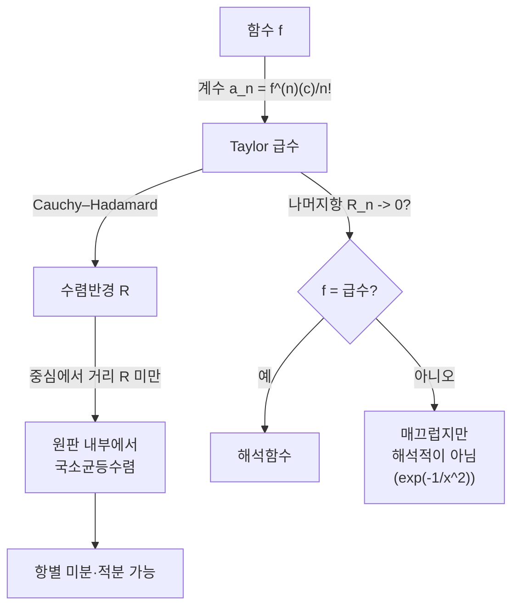

# 멱급수와 Taylor 급수

# 개요

멱급수(power series)는 무한히 많은 항을 가진 다항식이다.

$$
\sum_{n=0}^{\infty} a_n (x - c)^n .
$$

다항식은 계산이 쉽고 [미분](derivative.md)과 적분이 항별로 처리되지만 표현력이 제한된다. 멱급수는 다항식의 계산 편의를 유지한 채 지수·삼각·로그 같은 초월함수를 담을 수 있다. 대신 "어디서 수렴하는가"라는 질문이 새로 생기고, 그 답이 수렴반경(radius of convergence)이다.

Taylor 급수는 주어진 함수에서 계수를 뽑아내는 반대 방향의 작업이다. 무한번 미분가능한 함수는 언제나 Taylor 급수를 형식적으로 쓸 수 있지만, 그 급수가 수렴하는지, 수렴하더라도 원래 함수와 같은지는 별개의 문제다. 이 간극을 재는 것이 나머지항(remainder)이고, 간극이 사라지는 함수가 해석함수(analytic function)다.

# 직관

멱급수는 중심 `c` 에서 함수를 "다항식으로 근사해 나가는" 과정이다. 0차 근사는 함숫값, 1차 근사는 접선, 2차 근사는 곡률까지 맞춘 포물선이다. 차수를 올릴수록 중심 근처에서 오차가 빠르게 줄어든다.

수렴반경의 정체는 기하적이다. 실수축에서만 보면 `1/(1+x^2)` 이 왜 `|x| < 1` 에서만 수렴하는지 알 수 없다. 이 함수는 실직선 전체에서 매끄럽고 특이점이 보이지 않기 때문이다. 복소평면으로 올라가면 즉시 설명된다. 분모가 0 이 되는 점이 허수축 위의 `i` 와 `-i` 이고, 중심에서 그 특이점까지의 거리가 정확히 1 이다. 멱급수는 중심에서 가장 가까운 특이점에 부딪힐 때까지의 원판에서 수렴한다.



# 정의

## 멱급수와 수렴반경

중심 `c`, 계수열 `a_n` 에 대한 멱급수는 위의 형식적 합이다. **수렴반경** `R` 은 Cauchy–Hadamard 공식으로 주어진다.

$$
\frac{1}{R} = \limsup_{n \to \infty} |a_n|^{1/n}, \qquad R \in [0, \infty] .
$$

역수는 관례적으로 `1/0` 을 무한대, `1/∞` 를 0 으로 읽는다. 계수의 비가 극한을 가지면 더 쉬운 판정도 쓸 수 있다.

$$
R = \lim_{n \to \infty} \left| \frac{a_n}{a_{n+1}} \right| \quad (\text{극한이 존재할 때}) .
$$

`|x - c| < R` 이면 급수는 절대수렴하고, `|x - c| > R` 이면 발산한다. 경계 `|x - c| = R` 에서는 점마다 다르며 일반 정리가 없다. 예를 들어 `sum x^n / n^2` 은 `R = 1` 이고 경계 전체에서 수렴, `sum x^n` 은 경계 전체에서 발산, `sum x^n / n` 은 `x = -1` 에서 수렴하고 `x = 1` 에서 발산한다.

## Taylor 급수

`f` 가 `c` 근방에서 무한번 미분가능할 때 `f` 의 `c` 중심 Taylor 급수는

$$
T f(x) = \sum_{n=0}^{\infty} \frac{f^{(n)}(c)}{n!} (x - c)^n .
$$

`c = 0` 인 경우를 Maclaurin 급수라 부른다. 계수가 도함수로 결정된다는 사실은 역으로도 성립한다. 멱급수가 어떤 함수를 나타내면 그 계수는 유일하며 위 식으로 복원된다.

## 해석함수

열린집합 `U` 위의 함수 `f` 가 **해석적**이라는 것은, `U` 의 모든 점 `c` 에서 어떤 양의 반경의 근방 안에서 `f` 가 `c` 중심 멱급수의 합과 일치한다는 뜻이다. 실해석적 함수 전체를 `C^omega` 로 쓰며

$$
C^\omega(U) \subsetneq C^\infty(U) \subsetneq \cdots \subsetneq C^1(U) \subsetneq C^0(U)
$$

이고, 첫 포함이 진부분집합이라는 점이 실해석과 복소해석을 가르는 결정적 차이다. [정칙함수](holomorphic-functions.md)에서는 한 번 복소미분 가능하면 자동으로 해석적이다.

## Taylor 정리와 나머지항

`f` 가 `c` 근방에서 `n+1` 번 미분가능할 때

$$
f(x) = \sum_{k=0}^{n} \frac{f^{(k)}(c)}{k!} (x - c)^k + R_n(x) .
$$

나머지항 `R_n` 은 두 가지 표준형이 있다.

**Lagrange 형**: `c` 와 `x` 사이의 어떤 `xi` 가 존재하여

$$
R_n(x) = \frac{f^{(n+1)}(\xi)}{(n+1)!} (x - c)^{n+1} .
$$

**적분형**: `f^{(n+1)}` 이 연속이면

$$
R_n(x) = \frac{1}{n!} \int_c^x (x - t)^n f^{(n+1)}(t) \, dt .
$$

적분형은 [미적분학의 기본 정리](fundamental-calculus.md)에 부분적분을 반복 적용해 얻으며, 여기에 적분의 평균값 정리를 쓰면 Lagrange 형이 나온다. `f` 가 `c` 근방에서 해석적이라는 것은 정확히 그 근방에서 `R_n(x)` 가 0 으로 수렴한다는 뜻이다.

# 성질

## 수렴원 내부의 균등수렴

**정리.** 수렴반경이 `R` 인 멱급수는 임의의 `r < R` 에 대해 `|x - c| <= r` 위에서 [균등수렴](uniform-convergence.md)한다.

**증명 스케치.** `r < rho < R` 인 `rho` 를 잡으면 `|a_n| rho^n` 이 유계이므로 `|a_n| r^n <= M (r/rho)^n` 이고, 우변은 등비급수라 수렴한다. Weierstrass M-test 가 균등수렴을 준다.

주의: 수렴원 **전체**에서 균등수렴하지는 않는다(`sum x^n` 이 `(-1,1)` 에서 균등수렴하지 않는다). 이런 성질을 국소균등수렴(locally uniform convergence) 또는 compact 수렴이라 한다. 균등수렴이 [연속성](continuity.md)을 보존하므로 멱급수의 합은 수렴원 내부에서 연속이다.

## 항별 미분과 적분

**정리.** 수렴반경 `R` 인 멱급수의 합을 `f` 라 하면, `f` 는 `|x - c| < R` 에서 무한번 미분가능하고

$$
f'(x) = \sum_{n=1}^{\infty} n \, a_n (x - c)^{n-1}, \qquad \int_c^x f(t) \, dt = \sum_{n=0}^{\infty} \frac{a_n}{n+1} (x - c)^{n+1} ,
$$

이며 두 급수의 수렴반경도 모두 `R` 이다.

**증명 스케치.** `n^{1/n}` 이 1 로 가므로 Cauchy–Hadamard 값이 바뀌지 않아 반경이 보존된다. 도함수열이 국소균등수렴하므로 [균등수렴](uniform-convergence.md) 절의 미분 정리가 항별 미분을 정당화한다. 적분은 균등수렴에서 곧바로 따른다.

따름정리로 계수의 유일성이 나온다. 항별 미분을 `n` 번 하고 `x = c` 를 대입하면 `a_n = f^{(n)}(c)/n!` 이다. 즉 한 함수를 나타내는 멱급수는 하나뿐이며, 멱급수의 합은 항상 해석함수다.

## Abel 정리

경계에서의 거동에 대한 유일한 일반 정리다. `sum a_n R^n` 이 수렴하면

$$
\lim_{x \to R^-} \sum_{n=0}^{\infty} a_n x^n = \sum_{n=0}^{\infty} a_n R^n .
$$

이 정리로 `log 2` 의 교대급수 표현이나 Leibniz 의 `pi/4` 급수를 정당화한다.

## 매끄럽지만 해석적이 아닌 함수

Taylor 급수가 수렴해도 원래 함수와 같지 않을 수 있다. 표준 예는

$$
f(x) = \begin{cases} e^{-1/x^2} & x \ne 0 \\ 0 & x = 0 \end{cases}
$$

이다. `x` 가 0 이 아닌 곳에서 도함수는 `p(1/x) e^{-1/x^2}` 꼴(`p` 는 다항식)이고, 지수적 감쇠가 임의의 다항식 증가를 이기므로 `x` 가 0 으로 갈 때 모든 도함수가 0 으로 간다. 따라서 모든 계 도함수가 원점에서 0 이며 Maclaurin 급수는 항등적으로 0 이다. 이 급수는 실직선 전체에서 수렴하지만 `f` 와 같은 값을 갖는 점은 원점뿐이다.

이 함수의 중요성은 반례를 넘어선다. 지지집합이 compact 인 매끄러운 함수(bump function)와 단위분할(partition of unity)을 만드는 재료가 되며, [다양체](manifolds.md) 위에서 국소적으로 정의된 대상을 전역적으로 붙이는 표준 도구다. 해석함수로는 이런 일이 불가능하다. 해석함수는 한 점 근방에서 0 이면 연결된 정의역 전체에서 0 이기 때문이다(항등정리, identity theorem).

## 대표 급수

| 함수 | Maclaurin 급수 | 수렴반경 |
| --- | --- | --- |
| `exp(x)` | 모든 `n` 에 대해 `x^n / n!` 의 합 | 무한대 |
| `sin(x)` | 홀수차 교대항 `x^{2k+1}/(2k+1)!` | 무한대 |
| `1/(1-x)` | `x^n` 의 합 | 1 |
| `log(1+x)` | `(-1)^{n+1} x^n / n` | 1 |
| `(1+x)^a` (이항급수) | 일반화 이항계수 곱하기 `x^n` | 1 (`a` 가 음이 아닌 정수면 무한대) |
| `1/(1+x^2)` | `(-1)^k x^{2k}` | 1 (복소 특이점 때문) |

지수·삼각 급수의 무한 반경은 계수의 팩토리얼이 분모에 있어 `|a_n|^{1/n}` 이 0 으로 가기 때문이다. 이 급수들의 곱셈(Cauchy 곱)이 [생성함수](generating-functions.md)의 조합적 계산과 같은 형식을 갖는다.

# 활용

## 수치 계산: 나머지항으로 오차 통제

`exp(1)` 을 부분합으로 계산하고 Lagrange 나머지항이 주는 상한과 실제 오차를 비교한다. `f^{(n+1)}` 이 `exp` 이므로 `0 < xi < 1` 에서 나머지항은 `e/(n+1)!` 이하다.

```python
from math import factorial, exp

def partial_exp(x, n):
    return sum(x**k / factorial(k) for k in range(n + 1))

x = 1.0
for n in [3, 6, 9, 12, 15]:
    approx = partial_exp(x, n)
    err = abs(exp(x) - approx)
    bound = exp(1.0) * x**(n + 1) / factorial(n + 1)   # Lagrange 상한
    print(f"n={n:3d}  approx={approx:.12f}  err={err:.3e}  bound={bound:.3e}")

# 수렴반경을 계수비로 추정: 1/(1-x) 와 1/(1+x^2)
for name, a in [("1/(1-x)", lambda n: 1.0),
                ("1/(1+x^2)", lambda n: 1.0 if n % 2 == 0 else 0.0)]:
    coeffs = [a(n) for n in range(1, 41)]
    root = max(abs(c) ** (1.0 / n) for n, c in enumerate(coeffs, start=1))
    print(f"{name}: limsup |a_n|^(1/n) ~ {root:.3f}  ->  R ~ {1/root:.3f}")
```

부분합의 오차가 Lagrange 상한 아래에 항상 놓이고, 두 급수 모두 수렴반경 1 을 재현한다.

## 해석학과 그 너머

- **[정칙함수](holomorphic-functions.md)**: 복소미분 가능한 함수는 Cauchy 적분 공식으로 멱급수 전개를 얻으므로 자동으로 해석적이다. 수렴반경은 중심에서 가장 가까운 특이점까지의 거리이고, 위에서 본 `1/(1+x^2)` 의 반경 1 이 이렇게 설명된다.
- **[상미분방정식](ordinary-differential-equations.md)**: 계수가 해석적인 선형 방정식은 멱급수 해를 가진다(Frobenius 방법). Airy·Bessel·Legendre 함수가 이 방식으로 정의된다.
- **[생성함수](generating-functions.md)**: 조합 수열을 계수로 갖는 멱급수를 대수적으로 조작해 점화식을 푼다. 형식적 멱급수로 다루면 수렴은 아예 문제 삼지 않아도 된다.
- **점근 전개**: 발산하는 급수도 처음 몇 항이 좋은 근사를 줄 수 있다. Stirling 급수가 대표적이며, 수렴과 유용성이 별개임을 보여준다.[^1]

## 최적화와 계산

[경사하강법](gradient-descent.md)과 [Newton 방법](newton-method.md)은 각각 목적함수의 1차·2차 Taylor 전개를 최소화하는 절차다. 수렴 속도 분석에서 나머지항 크기가 그대로 오차 재귀식에 들어간다. 자동미분(automatic differentiation)의 전방 모드는 Taylor 계수를 유한 차수까지 정확히 전파하는 구현으로 볼 수 있다.[^2] [볼록성](convexity.md) 논의에서 2차 항의 부호가 국소 최소를 판정하는 것도 Taylor 정리의 직접 응용이다.

[^1]: Carl M. Bender, Steven A. Orszag, *Advanced Mathematical Methods for Scientists and Engineers*, Springer, 3장 (Asymptotic series), https://link.springer.com/book/10.1007/978-1-4757-3069-2
[^2]: Andreas Griewank, Andrea Walther, *Evaluating Derivatives*, 2nd ed., SIAM, 13장 (Taylor arithmetic), https://epubs.siam.org/doi/book/10.1137/1.9780898717761

# 연관 문서

## 선수지식

- [수열의 극한](limits.md)
- [미분](derivative.md)

## 더 알아보기

아직 연결한 문서가 없다.

#analysis
