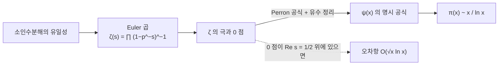

# 소수 정리와 Riemann zeta 함수

# 개요

$x$ 이하의 [소수](primes.md) 개수 $\pi(x)$ 에는 닫힌 공식이 없지만 큰 $x$ 에서의 점근 행동은 단순하다.

$$
\pi(x)\sim\frac{x}{\ln x}
$$

이것이 소수 정리다. $x$ 근처의 정수가 소수일 확률이 대략 $1/\ln x$ 다.

증명의 도구는 복소함수의 [유수 정리](residue-theorem.md)다. Riemann zeta 함수에 소수 전체의 정보를 담고 그 함수의 0 점 위치로 소수의 분포를 읽는다. 해석적 정수론이 이 다리 위에 섰다.

# 직관

## Euler 곱

$\zeta(s)=\sum n^{-s}$ 는 소수에 대한 곱으로 다시 쓰인다.

$$
\sum_{n=1}^\infty\frac1{n^s}=\prod_{p\ \text{소수}}\frac1{1-p^{-s}}
$$

오른쪽의 각 인자를 등비급수로 펴서 곱하면 $\prod p_i^{-a_is}$ 꼴의 항이 나오고, 소인수분해의 유일성으로 각 자연수가 정확히 한 번씩 나타난다. 이 등식이 유일분해 정리의 해석적 판본이다.

왼쪽은 해석적 대상이고 오른쪽은 소수 전체를 담으므로, 왼쪽의 해석적 성질이 오른쪽의 산술적 정보로 번역된다.

## 밀도 $1/\ln x$

$s\to1^+$ 에서 $\zeta(s)$ 가 발산하므로 소수는 무한히 많다. 소수가 유한하면 오른쪽 곱이 유한하기 때문이다. $\zeta(s)$ 가 $s=1$ 에서 단순극을 가진다는 사실을 쓰면 $\sum_p p^{-1}$ 의 발산 속도가 나오고 소수의 밀도 $1/\ln x$ 가 따라온다.

## 0 점의 역할

소수 계수 함수를 적분으로 표현하면, 그 적분을 유수 정리로 계산할 때 $\zeta$ 의 극과 0 점이 각각 기여한다. $s=1$ 의 극이 주항 $x$ 를 주고, 각 0 점 $\rho$ 가 $-x^\rho/\rho$ 만큼의 진동 항을 준다.

0 점의 실수부가 오차의 크기를 결정한다. 실수부가 $1$ 에 가까운 0 점이 있으면 오차가 크고 모두 $1/2$ 에 있으면 오차가 $\sqrt x$ 수준이다. 소수 정리에는 실수부가 1 인 0 점이 없다는 것으로 충분하고, Riemann 가설은 모든 0 점의 실수부가 $1/2$ 이라는 더 강한 주장이다.

# 정의

## Riemann zeta 함수

$\mathrm{Re}\thinspace s\gt 1$ 에서 다음 급수가 절대수렴한다.

$$
\zeta(s)=\sum_{n=1}^\infty\frac1{n^s}
$$

이 함수는 $s=1$ 의 단순극을 제외한 복소평면 전체로 해석적 연속되고 함수방정식을 만족한다.

$$
\zeta(s)=2^s\pi^{s-1}\sin\negthinspace\Big(\frac{\pi s}2\Big)\Gamma(1-s)\thinspace\zeta(1-s)
$$

이 방정식이 $s$ 와 $1-s$ 를 맞바꾸므로 $\mathrm{Re}\thinspace s=1/2$ 직선이 대칭축이 된다.

## 0 점

$s=-2,-4,-6,\dots$ 에서 $\zeta$ 가 0 이 되고, 이 값들이 함수방정식의 사인 인자에서 나오는 자명한 0 점이다.

나머지 0 점은 모두 임계띠 $0\lt\mathrm{Re}\thinspace s\lt 1$ 안에 있는 비자명한 0 점이다. Riemann 가설은 이들이 전부 $\mathrm{Re}\thinspace s=1/2$ 위에 있다는 추측이다.

## 소수 계수 함수들

$$
\pi(x)=\sum_{p\le x}1,\qquad
\vartheta(x)=\sum_{p\le x}\ln p,\qquad
\psi(x)=\sum_{p^k\le x}\ln p
$$

$\psi$ 가 해석적으로 가장 다루기 쉽고, 세 함수의 점근 행동이 서로 동치다. 소수 정리는 $\psi(x)\sim x$ 와 같은 진술이다.

## 로그 적분

$$
\mathrm{Li}(x)=\int_2^x\frac{dt}{\ln t}
$$

$\mathrm{Li}(x)$ 는 $x/\ln x$ 보다 정확한 근사다. 부분적분으로 $\mathrm{Li}(x)=x/\ln x+x/\ln^2x+\cdots$ 이므로 둘의 비는 1 로 가고 차이는 커진다.

# 성질

## Euler 곱

$\mathrm{Re}\thinspace s\gt 1$ 에서 다음이 성립한다.

$$
\zeta(s)=\prod_p\big(1-p^{-s}\big)^{-1}
$$

각 인자를 $\sum_{k\ge0}p^{-ks}$ 로 펴고 유한 개의 소수에 대해 곱한 뒤 극한을 취한다. 절대수렴으로 항의 재배열이 허용된다. 소인수분해의 존재가 모든 $n$ 이 나타남을, 유일성이 정확히 한 번씩 나타남을 보장한다.

로그를 취하면 소수에 대한 합이 나온다.

$$
-\frac{\zeta'}{\zeta}(s)=\sum_{n\ge1}\frac{\Lambda(n)}{n^s},\qquad
\Lambda(n)=\begin{cases}\ln p&n=p^k\cr 0&\text{그 외}\end{cases}
$$

$\Lambda$ 가 von Mangoldt 함수이고 $\psi(x)=\sum_{n\le x}\Lambda(n)$ 이다. $\zeta'/\zeta$ 의 극은 $\zeta$ 의 극과 0 점이므로 이 식이 소수 계수 함수와 0 점을 잇는다.

## 명시 공식

Perron 공식으로 $\psi(x)$ 를 복소적분으로 쓰고 유수 정리를 적용하면 다음을 얻는다.

$$
\psi(x)=x-\sum_\rho\frac{x^\rho}{\rho}-\ln(2\pi)-\frac12\ln\big(1-x^{-2}\big)
$$

합은 비자명한 0 점 $\rho$ 전체에 대한 것이다. 주항 $x$ 는 $s=1$ 의 극에서 나오고, 각 0 점이 하나의 파동을 기여한다.

$\rho=\beta+i\gamma$ 이면 $|x^\rho|=x^\beta$ 이므로 $\beta$ 가 진폭을, $\gamma$ 가 진동수를 정한다. 소수의 불규칙한 분포가 이 파동들의 중첩이다.

## 증명의 핵심 단계

소수 정리는 $\mathrm{Re}\thinspace s=1$ 위에 0 점이 없다는 것과 동치다.

$\zeta(1+it)\ne0$ 을 보이는 고전적 논증은 다음 부등식을 쓴다.

$$
3+4\cos\theta+\cos2\theta=2(1+\cos\theta)^2\ge0
$$

이것을 $|\zeta(\sigma)^3\zeta(\sigma+it)^4\zeta(\sigma+2it)|\ge1$ 로 번역한다. $\zeta(1+it)=0$ 을 가정하면 0 점의 차수 4 가 $s=1$ 의 극의 차수 1 을 이겨 $\sigma\to1^+$ 에서 좌변이 0 으로 가고 모순이 된다.

Tauber 형 정리를 결합하면 $\psi(x)\sim x$ 가 나온다. Hadamard 와 de la Vallée Poussin 이 1896 년에 독립적으로 이 길을 완성했다. 복소해석을 쓰지 않는 Erdős–Selberg 의 초등적 증명이 1949 년에 나왔다.

## 오차항

현재까지 알려진 최선의 무조건적 결과는 다음 형태다.

$$
\pi(x)=\mathrm{Li}(x)+O\negthinspace\left(x\exp\negthinspace\left(-c(\ln x)^{3/5}(\ln\ln x)^{-1/5}\right)\right)
$$

$\mathrm{Re}\thinspace s=1$ 근처에서 0 점이 없는 영역의 너비가 이 지수를 결정한다.

Riemann 가설이 참이면 오차가 작아진다.

$$
\pi(x)=\mathrm{Li}(x)+O\big(\sqrt x\thinspace\ln x\big)
$$

명시 공식에서 $|x^\rho|=x^{1/2}$ 가 되기 때문이다. 역도 성립하므로 Riemann 가설은 소수가 가능한 한 규칙적으로 분포한다는 진술과 동치다.

## $\pi(x)$ 와 $\mathrm{Li}(x)$ 의 부호

계산된 범위에서는 $\pi(x)\lt\mathrm{Li}(x)$ 이지만 Littlewood 는 차의 부호가 무한히 자주 바뀜을 증명했다. 처음 바뀌는 지점의 상계인 Skewes 수는 매우 크다.

# 활용

## 소수의 밀도를 쓰는 계산

$n$ 자리 난수가 소수일 확률이 대략 $1/(n\ln 10)$ 이므로 [RSA 암호](rsa-cryptosystem.md)의 키 생성에서 소수 하나를 찾는 시도 횟수를 추정할 수 있다. 2048 비트 소수는 평균 700 번 남짓 뽑으면 되고, 짝수와 작은 소수의 배수를 걸러 내면 더 줄어든다.

## 산술수열과 일반화

Dirichlet 지표로 $L$ 함수를 만들면 같은 방법이 산술수열의 소수에 적용된다. $\gcd(a,q)=1$ 이면 $a \bmod q$ 인 소수가 무한히 많고 각 잉여류에 $1/\varphi(q)$ 씩 고르게 분포한다.

수체와 대수다양체에도 대응하는 zeta 함수가 정의되고, 유한체 위에서는 대응하는 Riemann 가설이 Weil 추측으로 증명되었다.

## 계산 정수론

소수를 일일이 세지 않고 $\pi(x)$ 를 계산하는 Meissel–Lehmer 계열 알고리즘이 $10^{27}$ 규모까지 도달했다. 이 계산이 명시 공식의 수치적 검증과 0 점 계산의 검산에 쓰인다.

$\zeta$ 의 0 점은 수십조 개까지 계산되었고 모두 임계선 위에 있다. Littlewood 의 결과가 보이듯 이런 계산은 증명이 되지 않는다.

## 무작위 행렬과의 연결

Montgomery 와 Dyson 은 0 점의 간격 분포가 Gauss 유니터리 앙상블의 고유값 간격 분포와 일치함을 관찰했다. 소수의 분포가 양자 혼돈계의 스펙트럼과 같은 통계를 따른다. 수치 실험이 이를 뒷받침하지만 증명은 없다.

# 연관 문서

## 선수지식

- [소수와 유일분해](primes.md)
- [Laurent 급수와 유수 정리](residue-theorem.md)
- [해석적 연속](analytic-continuation.md)

## 더 알아보기

- [Dirichlet 지표와 L 함수](dirichlet-l-functions.md)
- [논문: Fourier Analysis in Number Fields and Hecke's Zeta-Functions](tate-thesis.md)
- [Eisenstein 급수와 스펙트럼 분해](eisenstein-series.md)
- [Bernoulli 수와 von Staudt–Clausen 정리](bernoulli-numbers.md)

#number_theory #complex_analysis #theorem
