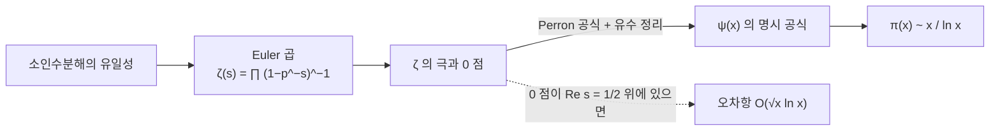

# 소수 정리와 Riemann zeta 함수

# 개요

[소수](primes.md)는 무한히 많지만 드문드문 나타난다. 얼마나 드문가. `x` 이하의 소수 개수 `\pi(x)` 를 나타내는 간단한 공식은 없지만, 큰 `x` 에서의 점근 행동은 놀랄 만큼 단순하다.

$$
\pi(x)\sim\frac{x}{\ln x}
$$

이것이 소수 정리다. 대략 `\ln x` 개 중 하나가 소수라는 뜻이며, 정수 근처에서 소수가 나타날 확률이 `1/\ln x` 라고 읽을 수 있다.

증명이 뜻밖의 곳에서 나온다. 정수에 관한 이산적 진술인데, 결정적 도구가 복소함수의 [유수 정리](residue-theorem.md)다. Riemann zeta 함수라는 해석적 대상에 소수 전체의 정보를 담고, 그 함수의 0 점 위치를 조사해 소수의 분포를 읽는다. 이산과 연속을 잇는 이 다리가 해석적 정수론 전체를 낳았다.

# 직관

## Euler 곱이 다리를 놓는다

`\zeta(s)=\sum n^{-s}` 를 소수에 대한 곱으로 다시 쓸 수 있다.

$$
\sum_{n=1}^\infty\frac1{n^s}=\prod_{p\ \text{소수}}\frac1{1-p^{-s}}
$$

오른쪽의 각 인자를 등비급수로 펴서 모두 곱하면 `\prod p_i^{-a_is}` 꼴의 항들이 나오는데, 소인수분해의 유일성 때문에 각 자연수가 정확히 한 번씩 나타난다. 즉 이 등식은 유일분해 정리를 해석적 언어로 옮긴 것이다.

이 한 줄이 모든 것을 시작한다. 왼쪽은 매끄러운 해석적 대상이고 오른쪽은 소수 전체를 담고 있으므로, 왼쪽의 해석적 성질이 오른쪽의 산술적 정보로 번역된다.

## 왜 `1/\ln x` 인가

`s\to1^+` 에서 `\zeta(s)` 가 발산한다는 사실만으로 소수가 무한히 많음이 나온다. 소수가 유한하면 오른쪽 곱이 유한한 값이기 때문이다. 더 정밀하게 `\zeta(s)` 가 `s=1` 에서 단순극을 가진다는 사실을 쓰면 `\sum_p p^{-1}` 이 발산하는 속도까지 나오고, 여기서 소수의 밀도가 `1/\ln x` 임이 따라온다.



## 0 점이 왜 중요한가

소수 계수 함수를 적분으로 표현하면, 그 적분을 유수 정리로 계산할 때 `\zeta` 의 극과 0 점이 각각 기여한다. `s=1` 의 극이 주항 `x` 를 주고, 각 0 점 `\rho` 가 `-x^\rho/\rho` 만큼의 진동 항을 준다.

따라서 0 점의 실수부가 오차의 크기를 직접 결정한다. 실수부가 `1` 에 가까운 0 점이 있으면 오차가 크고, 모두 `1/2` 에 몰려 있으면 오차가 `\sqrt x` 수준으로 작다. 소수 정리 자체는 "실수부가 1 인 0 점이 없다" 만으로 충분하고, Riemann 가설은 "모두 실수부가 정확히 `1/2`" 라는 훨씬 강한 주장이다.

# 정의

## Riemann zeta 함수

`\mathrm{Re}\,s>1` 에서 다음 급수가 절대수렴한다.

$$
\zeta(s)=\sum_{n=1}^\infty\frac1{n^s}
$$

이 함수는 `s=1` 의 단순극을 제외한 복소평면 전체로 해석적 연속된다. 연속된 함수는 함수방정식을 만족한다.

$$
\zeta(s)=2^s\pi^{s-1}\sin\!\Big(\frac{\pi s}2\Big)\Gamma(1-s)\,\zeta(1-s)
$$

이 방정식이 `s` 와 `1-s` 를 맞바꾸므로 `\mathrm{Re}\,s=1/2` 직선이 대칭축이 된다.

## 0 점

`s=-2,-4,-6,\dots` 에서 `\zeta` 가 0 이 되며 이를 자명한 0 점이라 한다. 함수방정식의 사인 인자에서 나온다.

나머지 0 점은 모두 임계띠 `0<\mathrm{Re}\,s<1` 안에 있고 이를 비자명한 0 점이라 한다. Riemann 가설은 이들이 전부 `\mathrm{Re}\,s=1/2` 위에 있다는 추측이다.

## 소수 계수 함수들

$$
\pi(x)=\sum_{p\le x}1,\qquad
\vartheta(x)=\sum_{p\le x}\ln p,\qquad
\psi(x)=\sum_{p^k\le x}\ln p
$$

`\psi` 가 해석적으로 가장 다루기 쉽고, 세 함수의 점근 행동이 서로 동치다. 소수 정리는 `\psi(x)\sim x` 와 같은 진술이다.

## 로그 적분

$$
\mathrm{Li}(x)=\int_2^x\frac{dt}{\ln t}
$$

`x/\ln x` 보다 훨씬 정확한 근사다. 부분적분으로 `\mathrm{Li}(x)=x/\ln x+x/\ln^2x+\cdots` 이므로 둘의 비는 1 로 가지만 차이는 커진다.

# 성질

## Euler 곱

`\mathrm{Re}\,s>1` 에서 다음이 성립한다.

$$
\zeta(s)=\prod_p\big(1-p^{-s}\big)^{-1}
$$

각 인자를 `\sum_{k\ge0}p^{-ks}` 로 펴고 유한 개의 소수에 대해 곱한 뒤 극한을 취하면, 절대수렴 덕분에 항의 재배열이 허용되어 등식이 나온다. 소인수분해의 존재가 모든 `n` 이 나타남을, 유일성이 정확히 한 번씩 나타남을 보장한다.

로그를 취하면 소수에 대한 합이 나온다.

$$
-\frac{\zeta'}{\zeta}(s)=\sum_{n\ge1}\frac{\Lambda(n)}{n^s},\qquad
\Lambda(n)=\begin{cases}\ln p&n=p^k\\0&\text{그 외}\end{cases}
$$

`\Lambda` 가 von Mangoldt 함수이고 `\psi(x)=\sum_{n\le x}\Lambda(n)` 이다. `\zeta'/\zeta` 의 극이 곧 `\zeta` 의 극과 0 점이므로, 소수 계수 함수와 0 점이 여기서 직접 연결된다.

## 명시 공식

Perron 공식으로 `\psi(x)` 를 복소적분으로 쓰고 유수 정리를 적용하면 다음을 얻는다.

$$
\psi(x)=x-\sum_\rho\frac{x^\rho}{\rho}-\ln(2\pi)-\frac12\ln\big(1-x^{-2}\big)
$$

합은 비자명한 0 점 `\rho` 전체에 대한 것이다. 주항 `x` 는 `s=1` 의 극에서 나오고, 각 0 점이 하나의 파동을 기여한다.

`\rho=\beta+i\gamma` 이면 `|x^\rho|=x^\beta` 이므로 진폭이 `\beta` 로 정해지고 `\gamma` 가 진동수를 정한다. 소수의 불규칙한 분포가 이 파동들의 중첩으로 설명된다는 것이 Riemann 의 통찰이다.

## 증명의 핵심 단계

소수 정리는 `\mathrm{Re}\,s=1` 위에 0 점이 없다는 것과 동치다.

`\zeta(1+it)\ne0` 을 보이는 고전적 논증은 다음 부등식을 쓴다.

$$
3+4\cos\theta+\cos2\theta=2(1+\cos\theta)^2\ge0
$$

이것을 `|\zeta(\sigma)^3\zeta(\sigma+it)^4\zeta(\sigma+2it)|\ge1` 로 번역하면, `\zeta(1+it)=0` 을 가정했을 때 `\sigma\to1^+` 에서 좌변이 0 으로 가서 모순이 나온다. `\zeta` 가 `s=1` 에서 가지는 극의 차수 1 보다 0 점의 차수 4 가 더 빠르게 이기기 때문이다.

여기에 Tauber 형 정리를 결합하면 `\psi(x)\sim x` 가 나온다. Hadamard 와 de la Vallée Poussin 이 1896 년에 독립적으로 이 길을 완성했다. 복소해석을 전혀 쓰지 않는 Erdős–Selberg 의 초등적 증명도 1949 년에 나왔지만 훨씬 복잡하다.

## 오차항

현재까지 알려진 최선의 무조건적 결과는 다음 형태다.

$$
\pi(x)=\mathrm{Li}(x)+O\!\left(x\exp\!\left(-c(\ln x)^{3/5}(\ln\ln x)^{-1/5}\right)\right)
$$

`\mathrm{Re}\,s=1` 근처에 0 점이 없는 영역을 얼마나 넓게 잡을 수 있는지가 이 지수를 결정한다.

Riemann 가설이 참이면 오차가 극적으로 작아진다.

$$
\pi(x)=\mathrm{Li}(x)+O\big(\sqrt x\,\ln x\big)
$$

명시 공식에서 `|x^\rho|=x^{1/2}` 가 되기 때문이다. 역도 성립하므로 Riemann 가설은 "소수가 가능한 한 규칙적으로 분포한다" 는 진술과 정확히 같다.

## `\mathrm{Li}` 가 더 좋은 근사다

수치적으로 `\pi(x)<\mathrm{Li}(x)` 가 관찰되지만 항상 그렇지는 않다. Littlewood 가 부호가 무한히 자주 바뀜을 증명했고, 처음 바뀌는 지점의 상계인 Skewes 수는 천문학적으로 크다. 계산으로 확인된 범위 전체에서 한 방향의 부등식이 성립해도 정리가 아니라는 경고 사례로 자주 인용된다.

## 수치로 확인

```python
import math

def sieve(n):
    ok = bytearray([1]) * (n + 1)
    ok[0] = ok[1] = 0
    for p in range(2, int(n**0.5) + 1):
        if ok[p]:
            ok[p*p::p] = bytearray(len(ok[p*p::p]))
    return [i for i in range(n + 1) if ok[i]]

P = sieve(10**6)

def pi(x):
    lo, hi = 0, len(P)
    while lo < hi:
        m = (lo + hi) // 2
        if P[m] <= x: lo = m + 1
        else: hi = m
    return lo

def Li(x, n=200000):
    """∫_2^x dt/ln t 를 Simpson 법으로."""
    a, b = 2.0, float(x)
    h = (b - a) / n
    f = lambda t: 1 / math.log(t)
    s = f(a) + f(b)
    for i in range(1, n):
        s += (4 if i % 2 else 2) * f(a + i * h)
    return s * h / 3

print(f"{'x':>9} {'pi(x)':>8} {'x/ln x':>10} {'Li(x)':>10}")
for e in range(2, 7):
    x = 10**e
    print(f"{x:>9} {pi(x):>8} {x/math.log(x):>10.1f} {Li(x):>10.1f}")
#         x    pi(x)     x/ln x      Li(x)
#       100       25       21.7       29.1
#      1000      168      144.8      176.6
#     10000     1229     1085.7     1245.1
#    100000     9592     8685.9     9628.8
#   1000000    78498    72382.4    78627.1
```

`x/\ln x` 는 `10^6` 에서도 8% 가까이 모자라다. 수렴이 느린 것은 `\mathrm{Li}` 의 전개에서 둘째 항 `x/\ln^2x` 가 주항에 비해 `1/\ln x` 배로만 작기 때문이다. 반면 `\mathrm{Li}(x)` 는 상대오차가 `0.2%` 이하이며 `\pi(x)` 를 위에서 근사한다. 두 근사가 같은 점근 등가류에 있으면서도 실제 정확도가 크게 다르다는 점이 보인다.

# 활용

## 소수의 밀도를 쓰는 계산

`n` 자리 난수가 소수일 확률이 대략 `1/(n\ln 10)` 이므로, [RSA 암호](rsa-cryptosystem.md)의 키 생성에서 소수 하나를 찾는 데 필요한 시도 횟수를 추정할 수 있다. 2048 비트 소수라면 평균 700 번 남짓 뽑으면 되고, 짝수와 작은 소수의 배수를 걸러 내면 훨씬 줄어든다. 소수 정리가 없으면 이 절차의 기대 시간을 말할 수 없다.

## 산술수열과 일반화

Dirichlet 지표로 `L` 함수를 만들면 같은 방법이 산술수열의 소수에 적용된다. `\gcd(a,q)=1` 이면 `a \bmod q` 인 소수가 무한히 많고, 각 잉여류에 소수가 고르게 `1/\varphi(q)` 씩 분포한다.

수체와 대수다양체에 대해서도 대응하는 zeta 함수가 정의되고, 유한체 위에서는 Weil 추측으로 대응하는 Riemann 가설이 이미 증명되었다. 함수체의 경우가 참이라는 사실이 원래 가설에 대한 강한 방증으로 여겨진다.

## 계산 정수론

`\pi(x)` 를 소수를 일일이 세지 않고 계산하는 Meissel–Lehmer 계열 알고리즘이 `10^{27}` 규모까지 도달했다. 이런 계산이 명시 공식의 수치적 검증과 0 점 계산의 검산에 쓰인다.

`\zeta` 의 0 점은 수십조 개까지 계산되었고 모두 임계선 위에 있다. 다만 이런 계산이 증명이 될 수 없다는 것은 위의 Littlewood 사례가 보여 준다.

## 무작위 행렬과의 연결

0 점의 간격 분포가 Gauss 유니터리 앙상블의 고유값 간격 분포와 일치한다는 관찰이 Montgomery 와 Dyson 에게서 나왔다. 수치 실험이 강하게 뒷받침하며, 소수의 분포가 양자 혼돈계의 스펙트럼과 같은 통계를 따른다는 뜻이다. 아직 증명되지 않았지만 해석적 정수론과 수리물리를 잇는 활발한 연구 주제다.

# 연관 문서

## 선수지식

- [소수와 유일분해](primes.md)
- [Laurent 급수와 유수 정리](residue-theorem.md)

## 더 알아보기

- [Dirichlet 지표와 L 함수](dirichlet-l-functions.md)

#number_theory #complex_analysis #theorem
