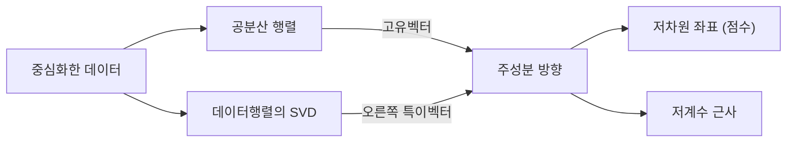

# 주성분 분석

# 개요

주성분 분석(principal component analysis, PCA)은 데이터에서 사영 분산이 큰 방향을 순서대로 뽑는 방법이다. 첫 주성분은 사영 분산을 최대로 만드는 단위벡터이고, 두 번째 주성분은 첫 성분과 직교하는 것 가운데 사영 분산을 최대로 만드는 단위벡터이며, 이 과정을 차원 수만큼 반복한다.

계산 경로는 둘이다. [확률변수](random-variables.md)의 공분산행렬을 대각화하거나 중심화한 데이터행렬의 [특이값 분해](singular-value-decomposition.md)를 구한다. 전자는 최대화 문제를 드러내고 후자는 실제 계산에 쓴다.

분산 최대화와 재구성 오차 최소화는 같은 해를 준다.

# 직관

## 데이터 구름의 주축

평균을 원점으로 옮긴 데이터 구름은 타원체 모양으로 퍼진다. 이 타원체의 가장 긴 축이 첫 주성분이고 그에 직교하는 가장 긴 축이 두 번째 주성분이다. 공분산행렬이 이 타원체의 대수적 표현이고, [스펙트럼 정리](spectral-theorem.md)에 따라 대칭행렬은 직교하는 주축을 가진다. 고윳값이 그 축 방향의 분산이다.

## 사영과 잔차

단위벡터 $u$ 로 사영한 성분과 남는 잔차는 직교하므로 각 점에서 피타고라스 정리가 성립한다.

$$
\lVert z\rVert^2=(u^{\mathsf T}z)^2+\lVert z-(u^{\mathsf T}z)u\rVert^2
$$

왼쪽은 $u$ 와 무관하므로 사영 성분의 평균제곱을 키우는 일과 잔차의 평균제곱을 줄이는 일이 같은 문제다.

# 정의

## 모집단 버전

$p$ 차원 확률벡터 $X$ 의 평균을 $m$ 으로, 공분산행렬을 다음과 같이 두자.

$$
\Sigma=\mathbb{E}\big[(X-m)(X-m)^{\mathsf T}\big]
$$

$\Sigma$ 는 대칭이고 양의 준정부호이므로 직교 고유벡터 $u_1, \dots, u_p$ 와 고윳값 $\lambda_1 \ge \cdots \ge \lambda_p \ge 0$ 을 가진다. $k$ 번째 주성분이 $u_k$ 이고 그 방향의 점수는 $u_k^T (X - m)$ 이며 분산은 $\lambda_k$ 다. 단위벡터에 대한 사영 분산은 Rayleigh 몫이다.

$$
\mathrm{Var}(u^{\mathsf T}X)=u^{\mathsf T}\Sigma u
$$

## 표본 버전과 SVD

$n \times p$ 데이터행렬의 각 열에서 그 열의 평균을 뺀 것을 $Z$ 라 하면 표본공분산은 $S = Z^T Z / (n-1)$ 이다. $Z = U\Sigma_s V^T$ 가 **SVD**(singular value decomposition)이면 다음이 성립한다.

$$
S=V\frac{\Sigma_s^{\mathsf T}\Sigma_s}{n-1}V^{\mathsf T}
$$

$V$ 의 열이 주성분 방향이고 고윳값은 특이값 제곱을 $n-1$ 로 나눈 값이며 점수 행렬은 $ZV = U\Sigma_s$ 다. $Z^T Z$ 를 만들면 조건수가 제곱이 되어 작은 성분이 수치적으로 뭉개지므로 $Z$ 의 SVD 를 직접 쓴다.

## 설명분산비율

$k$ 개 성분까지 남겼을 때 설명되는 분산의 비율은 다음과 같다. 분모는 총분산, 즉 공분산행렬의 대각합이다.

$$
\rho_k=\frac{\lambda_1+\cdots+\lambda_k}{\lambda_1+\cdots+\lambda_p}
$$

# 성질

## 최적성

**분산 최대화.** $\lambda_1 = \max\lbrace\thinspace u^T \Sigma u : \Vert u\Vert = 1 \thinspace\rbrace$ 이고 최대는 $u_1$ 에서 달성된다. 이미 고른 성분들과 직교한다는 제약을 걸고 같은 문제를 풀면 $\lambda_2, \lambda_3, \dots$ 이 차례로 나온다. 이는 Rayleigh 몫의 최대·최소 성질이고, 일반적인 $k$ 번째 값은 Courant–Fischer 최소최대 정리로 서술된다.

**재구성 오차 최소화.** $k$ 차원 부분공간 $W$ 로의 정사영을 $P_W$ 라 하면 다음 최소화 문제의 해가 상위 $k$ 개 주성분이 span 하는 공간이다.

$$
\min_{\dim W=k}\ \frac{1}{n}\sum_{i=1}^{n}\lVert z_i-P_Wz_i\rVert^2
$$

직관 절의 피타고라스 등식을 모든 표본에 대해 더하면 두 문제가 같아진다. 행렬 언어로는 [Eckart–Young–Mirsky 정리](singular-value-decomposition.md)가 같은 내용을 저계수 근사의 최적성으로 진술한다. 남은 오차는 버린 고윳값의 합이다.

$$
\frac{1}{n-1}\min_{\mathrm{rank}B\le k}\lVert Z-B\rVert_F^2=\lambda_{k+1}+\cdots+\lambda_p
$$

## 성분의 무상관성

점수들의 표본공분산은 $V^T S V = \mathrm{diag}(\lambda_1, \dots, \lambda_p)$ 로 대각행렬이다. 원래 변수들이 강하게 상관되어 있어도 주성분 좌표에서는 상관이 사라진다. 각 좌표를 $\sqrt{\lambda_k}$ 로 나누어 공분산을 항등행렬로 만드는 것이 백색화다. 무상관은 독립보다 약하므로 분포가 정규분포가 아니면 성분들이 비선형으로 얽혀 있을 수 있다.

## 스케일 의존성

길이를 미터에서 밀리미터로 바꾸면 그 변수의 분산이 백만 배가 되어 첫 주성분을 독차지한다. 단위가 다른 변수를 섞을 때는 각 변수를 표준편차로 나눈 상관행렬에 대해 PCA 를 한다. 모든 변수가 같은 단위이면 공분산행렬을 그대로 쓴다. 중심화를 건너뛰면 첫 성분이 평균 방향을 가리킨다.

## 성분 개수의 선택

고윳값을 큰 순서로 그린 그래프에서 꺾이는 지점을 택하거나 $\rho_k$ 가 목표치를 넘는 최소 $k$ 를 택한다. 신호가 상위 몇 성분에 몰려 있고 나머지가 잡음이면 고윳값이 완만한 꼬리를 이룬다. 꼬리가 두껍고 평평하면 저차원 구조가 없으므로 차원을 줄이면 정보를 잃는다.

## 한계

- 선형 부분공간만 찾는다. 데이터가 곡면이나 나선 위에 있으면 분산은 커도 구조는 잡히지 않는다.
- 분산이 곧 유용함은 아니다. 분류에 결정적인 방향의 분산이 작으면 PCA 는 그 방향을 먼저 버린다.
- 이상치 하나가 공분산을 지배할 수 있다. 제곱 오차를 쓰기 때문이다.
- 성분은 원래 변수들의 조밀한 선형결합이라 해석이 어렵다. 희소성을 요구하면 다른 방법이 필요하다.

# 활용

## 전처리와 시각화

수백 개 변수를 두세 개 성분으로 줄여 산점도를 그리면 군집, 이상치, 측정 오류가 드러난다. 설명변수들이 강하게 상관되어 [선형회귀](linear-regression.md)의 해가 불안정할 때 주성분 몇 개로 회귀하면 분산이 줄어든다. 대신 편향이 생기고 계수가 원래 변수의 의미를 잃는다.

## 압축과 잡음 제거

신호가 저차원 부분공간 근처에 있고 잡음이 모든 방향에 고르게 퍼져 있으면 상위 성분만 남기는 것이 잡음 제거가 된다. 이미지와 문서의 저차원 표현, 추천 시스템의 잠재요인, 모델 가중치의 저계수 근사가 같은 원리다.

## 확장

내적을 커널로 바꾸면 커널 PCA 가 되고, 사영과 재구성을 신경망으로 바꾸면 오토인코더가 된다. 선형 오토인코더의 최적해는 주성분이 span 하는 공간이다. 관측을 저차원 잠재변수의 선형변환에 등방성 잡음을 더한 것으로 보는 확률적 PCA 의 최대가능도 해도 고전적 PCA 와 일치한다.

# 연관 문서

## 선수지식

- [특이값 분해](singular-value-decomposition.md)
- [확률변수와 기댓값](random-variables.md)

## 더 알아보기

- [Marchenko–Pastur 법칙](marchenko-pastur.md)
- [커널 PCA](kernel-pca.md)
- [확률적 PCA](probabilistic-pca.md)

#linear_algebra #statistics
