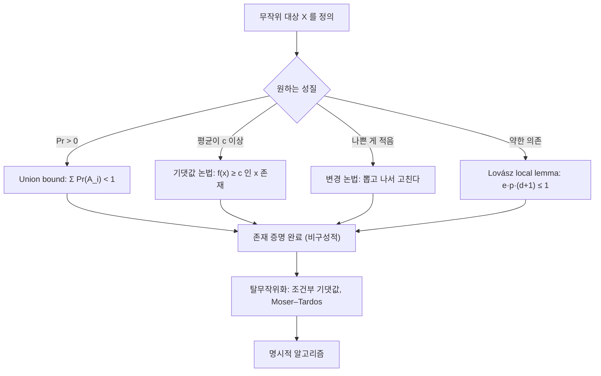

# 확률적 방법

# 개요

확률적 방법(probabilistic method)은 어떤 성질을 가진 대상이 존재함을 보이기 위해, 대상을 무작위로 뽑았을 때 그 성질을 가질 확률이 양수임을 계산하는 증명 기법이다. 확률이 0보다 크면 그런 대상이 적어도 하나는 있어야 한다. 대상을 만들어 보이지는 않지만 존재는 확정된다.

Erdős가 1947년 [Ramsey 이론](ramsey-theory.md)의 하한을 세 문단으로 증명하면서 이 방법이 조합론의 중심 도구가 되었다[^1]. 그 전에는 명시적 구성으로 접근하던 문제들이 확률 계산 몇 줄로 정리되었고, 지금도 명시적 구성이 확률적 논증을 따라잡지 못한 경우가 많다.


# 직관

$n$ 개의 대상에 점수를 매겨 평균이 $\mu$ 이면 점수가 $\mu$ 이상인 대상이 존재한다. [비둘기집 원리](pigeonhole-principle.md)의 평균 판본이고, 확률적 방법의 절반이 이 관찰이다. 기댓값은 선형이라 의존성을 무시하고 항별로 더할 수 있으므로, 무작위 대상의 기댓값 계산이 개별 대상 분석보다 쉬운 경우가 많다.

나머지 절반은 나쁜 사건이 일어날 확률이 1 보다 작다는 형태다. 원하는 성질이 깨지는 방식을 나쁜 사건들 $A_1,\dots,A_m$ 으로 나열하고

$$
\Pr\left[\bigcup_i A_i\right] \le \sum_i \Pr[A_i] < 1
$$

을 보이면 아무 나쁜 사건도 일어나지 않는 결과가 양의 확률로 존재한다. 합집합 상한(union bound) 하나로 고전적 결과의 대부분이 나온다.

나쁜 사건이 너무 많아 union bound 가 실패하면 두 길이 있다. **변경 논법**은 나쁜 사건을 조금 일어나게 두고 사후에 고친다. **Lovász local lemma** 는 나쁜 사건들이 서로 거의 독립이면 각각의 확률이 아주 작지 않아도 모두 피할 수 있다고 말한다.



# 정의

## 기본 원리

유한 [확률 공간](probability.md) $(\Omega, \Pr)$ 과 사건 $A \subseteq \Omega$ 에 대해

$$
\Pr[A] > 0 \ \Longrightarrow\ A \ne \varnothing
$$

이다. 조합론에서 $\Omega$ 는 보통 대상들의 유한 집합(모든 그래프, 모든 색칠, 모든 부분집합)이고 $A$ 는 원하는 성질을 만족하는 것들의 집합이다.

## 기댓값 논법

[확률변수](random-variables.md) $X : \Omega \to \mathbb{R}$ 에 대해

$$
\exists \omega \in \Omega : X(\omega) \ge \mathbb{E}[X], \qquad \exists \omega' \in \Omega : X(\omega') \le \mathbb{E}[X]
$$

가 성립한다. 기댓값의 선형성

$$
\mathbb{E}\left[\sum_{i=1}^{n} X_i\right] = \sum_{i=1}^{n} \mathbb{E}[X_i]
$$

는 $X_i$ 들의 독립성을 전혀 요구하지 않으므로, 서로 복잡하게 얽힌 지표변수들의 합을 다룰 때 결정적이다.

## 무작위 그래프

$G(n,p)$ 는 정점이 $n$ 개이고 각 정점 쌍이 서로 독립적으로 확률 $p$ 로 간선이 되는 무작위 [그래프](graphs.md) 모형이다. $p=1/2$ 는 $n$ 개 정점 위의 모든 라벨 그래프에서 균등하게 하나를 뽑는 것과 같다.

## 의존성 그래프

사건들 $A_1,\dots,A_m$ 에 대한 **의존성 그래프**는 정점이 사건이고, 각 $A_i$ 가 자신과 인접하지 않은 사건들의 모임 전체와 서로 독립이 되도록 만든 그래프다. 이 그래프의 최대차수를 $d$ 라 한다.

# 성질

## Erdős의 Ramsey 하한

Ramsey 수 $R(k,k)$ 는 임의의 2-색 간선 색칠에서 크기 $k$ 의 단색 클리크가 강제되는 최소 정점 수다([Ramsey 이론](ramsey-theory.md)).

**정리 (Erdős, 1947[^1]).** $k \ge 3$ 이고

$$
\binom{n}{k} 2^{1 - \binom{k}{2}} < 1
$$

이면 $R(k,k)>n$ 이다. 따라서

$$
R(k, k) > (1 + o(1)) \frac{k}{e\sqrt{2}} \thinspace 2^{k/2}
$$

**증명.** $K_n$ 의 각 간선을 독립적으로 확률 $1/2$ 로 빨강 또는 파랑으로 칠한다. 고정된 $k$ 개 정점 집합 $S$ 에 대해 $S$ 가 단색 클리크가 될 확률은

$$
\Pr[A_S] = 2 \cdot 2^{-\binom{k}{2}} = 2^{1 - \binom{k}{2}}
$$

이다. 그런 $S$ 는 $\binom{n}{k}$ 개이므로 union bound에 의해 단색 클리크가 하나라도 생길 확률은 $\binom{n}{k} \cdot 2^{1 - \binom{k}{2}}$ 이하다. 이 값이 1보다 작으면 단색 클리크가 전혀 없는 색칠이 양의 확률로 존재한다. $\binom{n}{k} \le n^k / k!$ 와 Stirling 근사를 쓰면 $n = \lfloor 2^{k/2} \rfloor$ 근처에서 조건이 성립한다. ∎

증명은 그래프를 하나도 명시하지 않는다. 70 년 넘게 이 하한을 본질적으로 개선한 명시적 구성이 없고, 상한 쪽은 $R(k,k)\le4^k$ 수준이며 최근에야 지수의 밑이 4 보다 작아졌다.

## 기댓값 논법: 최대 절단

**정리.** 간선이 $m$ 개인 모든 그래프는 크기가 $m/2$ 이상인 절단을 가진다.

**증명.** 각 정점을 독립적으로 확률 $1/2$ 로 $S$ 또는 $T$ 에 넣는다. 간선 $e = uv$ 에 대해 지표변수 $X_e$ 를 $u$ 와 $v$ 가 다른 쪽에 있을 때 1로 두면 $E[X_e] = 1/2$ 다. 절단 크기 $X = \sum_e X_e$ 이고 선형성에 의해 $E[X] = m/2$ 다. 따라서 $X \ge m/2$ 인 분할이 존재한다. ∎

이 논증이 그대로 $1/2$ 근사 알고리즘이고 아래의 탈무작위화로 결정적 알고리즘이 된다. 최대 절단은 [네트워크 흐름](network-flow.md)의 최소 절단과 달리 NP-난해이며([NP-완전성](np-completeness.md)), 알려진 최선의 근사비는 준정부호 계획법으로 얻는 0.878 이다.

## 기댓값 논법: 토너먼트

토너먼트는 완전 그래프의 각 간선에 방향을 준 것이다. 토너먼트가 성질 $S_k$ 를 가진다는 것은, 임의의 $k$ 명 선수 집합에 대해 그들 모두를 이긴 선수가 존재한다는 뜻이다.

**정리 (Erdős).** $\binom nk(1-2^{-k})^{n-k}<1$ 이면 $S_k$ 를 만족하는 $n$ 명 토너먼트가 존재한다.

**증명.** 각 경기 결과를 독립적으로 균등하게 정한다. 고정된 $k$ 집합 $K$ 에 대해 특정한 다른 선수가 $K$ 전체를 이길 확률은 $2^{-k}$ . 남은 $n-k$ 명이 모두 실패할 확률은 $(1-2^{-k})^{n-k}$ 다. union bound를 $K$ 에 대해 적용하면 된다. ∎

$n$ 이 $k^22^k$ 정도면 조건이 만족되므로, 어떤 $k$ 명을 뽑아도 그들을 모두 이긴 선수가 있는 토너먼트가 존재한다.

## 변경 논법: 독립집합

union bound가 통하지 않을 때, 먼저 무작위로 뽑고 나쁜 부분을 잘라내는 전략이다.

**정리 (Turán형 하한).** 정점이 $n$ 개, 간선이 $m$ 개인 그래프는 크기가 $n^2/(2m+n)$ 이상인 독립집합을 가진다. 평균 차수를 $d=2m/n$ 이라 쓰면 크기 $n/(d+1)$ 이상이다.

**증명.** 각 정점을 독립적으로 확률 $p$ 로 뽑아 집합 $S$ 를 만든다. $\mathbb E[|S|]=pn$ 이고, 양 끝이 모두 $S$ 에 든 간선 수의 기댓값은 $p^2m$ 이다. 이제 그런 간선마다 끝점 하나를 **제거**한다. 남은 집합 $S'$ 은 독립집합이고

$$
\mathbb{E}[|S'|] \ge pn - p^2 m
$$

이다. 우변을 $p$ 에 대해 최대화하면 $p = n/(2m)$ 에서 $n^2/(4m)$ 을 얻고, $p \le 1$ 조건을 고려해 정리하면 $n/(d+1)$ 형태가 나온다. ∎

제거 단계가 변경 논법이다. 완벽한 대상을 한 번에 뽑는 대신 결함이 적은 대상을 뽑고 결함 제거 비용을 기댓값으로 계산한다. 같은 기법으로 짧은 사이클이 없고 독립수도 작은 그래프, 곧 국소적으로는 나무처럼 보이되 채색수가 큰 그래프의 존재가 증명된다([그래프 색칠](graph-coloring.md)).

## Lovász local lemma

나쁜 사건이 매우 많아 $\sum \Pr[A_i] \ge 1$ 이 되더라도, 각 사건이 소수의 다른 사건에만 의존한다면 전부 피할 수 있다.

**정리 (대칭형 LLL; Erdős–Lovász, 1975).** 사건 $A_1, \ldots, A_m$ 이 각각 $\Pr[A_i] \le p$ 를 만족하고, 의존성 그래프의 최대차수가 $d$ 이며

$$
e\thinspace p\thinspace (d + 1) \le 1
$$

이면

$$
\Pr\left[\bigcap_{i=1}^{m} \overline{A_i}\right] > 0
$$

이다. 여기서 $e$ 는 자연로그의 밑이다.

**비대칭형.** 실수 $x_i \in (0,1)$ 들이 있어 각 $i$ 에 대해

$$
\Pr[A_i] \le x_i \prod_{j \sim i} (1 - x_j)
$$

이면 같은 결론이 성립한다. 증명은 $Pr[A_i | ∩_{j ∈ J} \overline{A_j}] ≤ x_i$ 를 $|J|$ 에 대한 귀납으로 보이는 것이다.

**응용 1 ($k\text{-SAT}$ ).** 각 절이 정확히 $k$ 개의 리터럴을 갖고, 각 절이 다른 절과 변수를 공유하는 횟수가 $2^k/(ek)$ 이하인 CNF 식은 항상 충족 가능하다. 변수를 독립적으로 균등하게 배정하면 절 하나가 거짓일 확률이 $2^{-k}$ 이고 LLL 조건이 위 형태가 된다.

**응용 2 (초그래프 2-색칠).** 모든 간선의 크기가 $k$ 이고 각 간선이 다른 간선과 $2^{k-1}/e-1$ 개 이하로 만나는 $k$ 균등 초그래프는 2-색칠 가능하다(단색 간선이 없게).

**응용 3 (Ramsey 하한 개선).** LLL을 쓰면 $R(k,k)>ck2^{k/2}$ 로 상수 인자가 개선된다.

원래 증명은 존재만 주장하고 해를 찾아주지 않는다. Moser–Tardos 의 무작위 재배정 알고리즘[^2]이 LLL 조건 아래에서 기댓값 다항 시간에 해를 찾는다. 알고리즘은 위반된 절을 하나 골라 그 절의 변수들만 다시 무작위로 뽑는 것을 반복하고, 분석은 entropy 압축 논법으로 한다.

## 비구성성과 탈무작위화

확률적 방법의 결론은 존재만 주장하고 대상을 지목하지 않는다. 대응은 셋이다.

1. **집중 부등식**: 성질을 만족할 확률이 $1-o(1)$ 이면 무작위 시행 몇 번으로 높은 확률의 해를 얻는다. 확률이 지수적으로 작으면 이 길은 막힌다. 도구는 [집중 부등식](concentration-inequalities.md)이다.
2. **조건부 기댓값 방법**: 무작위 선택을 하나씩 결정하되, 매번 조건부 기댓값을 떨어뜨리지 않는 쪽을 고른다. 최대 절단의 경우 정점을 순서대로 보면서 "지금까지 배치된 이웃 중 반대편이 더 많아지는 쪽"에 넣으면 항상 $m/2$ 이상의 절단을 결정적으로 얻는다. 조건부 기댓값을 다항 시간에 계산할 수 있어야 한다는 것이 제약이다.
3. **표본 공간 축소**: 완전 독립 대신 $k\text{-wise}$ 독립 확률변수를 쓰면 표본 공간이 다항 크기로 줄어 전수 탐색이 가능해진다. 증명이 저차 모멘트만 쓴다면 이 치환이 통한다.

명시적 구성이 확률적 존재 증명을 따라잡지 못한 간극 자체가 연구 주제다. Ramsey 그래프, 확장 그래프(expander), 오류 정정 부호가 그 예이고, 확장 그래프는 Margulis 와 Lubotzky–Phillips–Sarnak 이후 명시적 구성이 확률적 경계에 근접했다.

# 활용

## 최대 절단의 탈무작위화

무작위 논증과 조건부 기댓값 탈무작위화를 나란히 적는다.

```python
import random

def cut_size(edges, side):
    return sum(1 for u, v in edges if side[u] != side[v])

def random_cut(n, edges, trials=1000):
    best = 0
    for _ in range(trials):
        side = [random.getrandbits(1) for _ in range(n)]
        best = max(best, cut_size(edges, side))
    return best

def greedy_cut(n, edges):
    """조건부 기댓값 탈무작위화: 항상 m/2 이상을 결정적으로 보장한다."""
    adj = {i: [] for i in range(n)}
    for u, v in edges:
        adj[u].append(v); adj[v].append(u)
    side = [None] * n
    for v in range(n):
        # 이미 결정된 이웃 기준으로 절단 간선을 더 많이 만드는 쪽을 고른다.
        zero = sum(1 for w in adj[v] if side[w] == 1)
        one = sum(1 for w in adj[v] if side[w] == 0)
        side[v] = 0 if zero >= one else 1
    return cut_size(edges, side)

n = 12
edges = [(i, j) for i in range(n) for j in range(i + 1, n) if (i * j) % 3]
m = len(edges)
print(m, m / 2, greedy_cut(n, edges), random_cut(n, edges))
assert greedy_cut(n, edges) >= m / 2
```

Erdős 의 Ramsey 하한 조건을 계산하면 존재가 보장되는 최대 $n$ 을 얻는다.

```python
from math import comb, log2

def ramsey_lower_bound(k):
    """C(n,k) * 2^(1 - C(k,2)) < 1 을 만족하는 최대 n (그러면 R(k,k) > n)."""
    n = k
    while log2(comb(n + 1, k)) + 1 - comb(k, 2) < 0:
        n += 1
    return n

for k in range(3, 11):
    print(f"k={k}: R(k,k) > {ramsey_lower_bound(k)}  (2^(k/2) = {2 ** (k / 2):.1f})")
```

변경 논법이 주는 독립집합 하한은 탐욕 알고리즘으로 달성된다.

```python
def greedy_independent_set(n, edges):
    """차수가 작은 정점부터 넣는 탐욕. 크기 >= sum 1/(d_v+1) >= n/(d+1)."""
    adj = {i: set() for i in range(n)}
    for u, v in edges:
        adj[u].add(v); adj[v].add(u)
    alive, S = set(range(n)), []
    while alive:
        v = min(alive, key=lambda u: len(adj[u] & alive))
        S.append(v)
        alive -= ({v} | adj[v])
    return S

deg_sum = 2 * len(edges)
bound = n / (deg_sum / n + 1)
S = greedy_independent_set(n, edges)
print(len(S), bound)
assert len(S) >= bound - 1e-9
```

## 다른 분야와의 연결

- **무작위 알고리즘**: 확률적 존재 증명은 그대로 알고리즘의 설계 원리다. 무작위 quicksort, 무작위 반올림(randomized rounding)으로 [선형계획법](linear-programming.md) 완화를 정수해로 바꾸는 근사 알고리즘, 해시 기반 자료구조가 모두 같은 사고방식이다.
- **극값 그래프 이론**: Turán 정리, Ramsey 수, 초그래프 색칠 등 하한의 대부분이 확률적 논증으로 얻어진다. 상한은 보통 세기 논법과 [포함배제 원리](inclusion-exclusion.md)로 얻으므로 두 축이 짝을 이룬다.
- **부호 이론**: Shannon의 채널 부호화 정리는 무작위 부호가 용량을 달성함을 보이는 확률적 방법이며, [Shannon entropy](entropy.md)가 계산의 언어를 제공한다.
- **집중과 고차원**: 기댓값만으로 부족할 때 [집중 부등식](concentration-inequalities.md)(Chernoff, Azuma, Talagrand)이 무작위 변수를 기댓값 근처에 묶어 준다. Azuma 부등식은 [martingale](martingales.md) 구조를 요구하므로, 확률적 방법은 자연스럽게 martingale 이론과 만난다.
- **위상수학과 기하**: 무작위 단체복합체, 무작위 다면체, 고차원 구면 위의 측도 집중 현상은 같은 철학을 다른 무대에서 쓴 것이다.

## 적용 절차

무작위 대상의 분포를 정하고, 실패 사건을 나열해 각각의 확률을 계산한다. union bound 로 충분하지 않으면 기댓값 논법으로 목표를 약화하거나 변경 논법으로 사후 수리를 하고, 의존 구조가 희박하면 LLL 을 쓴다. 구성적 해가 필요하면 조건부 기댓값이나 Moser–Tardos 로 탈무작위화한다.

[^1]: P. Erdős, "Some remarks on the theory of graphs", Bulletin of the American Mathematical Society 53 (1947), https://www.ams.org/journals/bull/1947-53-04/S0002-9904-1947-08785-1/
[^2]: R. A. Moser, G. Tardos, "A constructive proof of the general Lovász Local Lemma", Journal of the ACM 57 (2010), https://doi.org/10.1145/1667053.1667060

# 연관 문서

## 선수지식

- [Ramsey 이론](ramsey-theory.md)
- [유한 확률 공간](probability.md)

## 더 알아보기

아직 연결한 문서가 없다.

#combinatorics #probability
