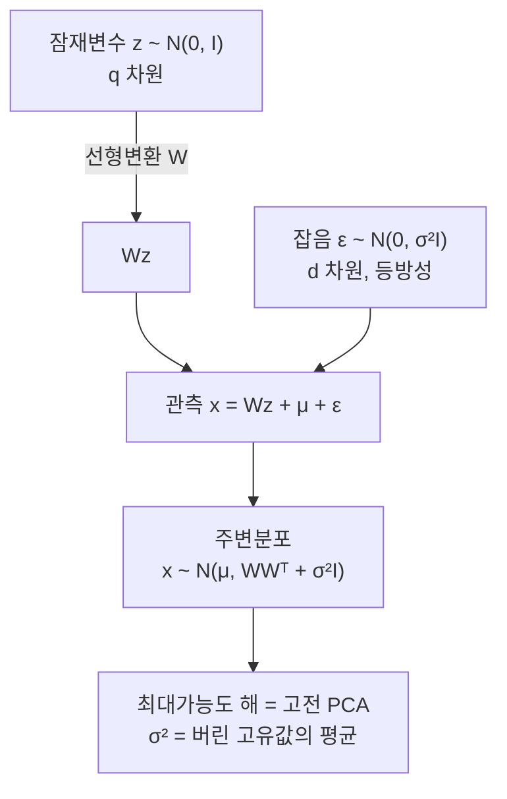

# 확률적 PCA

# 개요

[주성분 분석](principal-component-analysis.md)은 분산을 최대로 담는 부분공간을 찾는 기하적 절차다. 확률모형이 아니므로 답할 수 없는 질문들이 있다. 결측값이 있으면 어떻게 하는가. 성분 개수를 어떻게 고르는가. 새 점이 이 모형에 얼마나 잘 맞는지를 어떻게 재는가.

확률적 PCA 는 같은 답을 주는 생성모형을 세워 이 질문들을 처리 가능하게 만든다. 저차원 잠재변수를 Gauss 분포에서 뽑고, 선형변환한 뒤, 모든 방향에 같은 크기의 등방성 잡음을 더한 것이 관측이라고 본다.

놀라운 점은 이 모형의 최대가능도 해가 고전적 PCA 와 정확히 일치한다는 것이다. 주성분이 주축으로 다시 나오고, 잔차 분산의 평균이 잡음 분산으로 나온다. 기하적 절차에 확률적 해석이 붙으면서 가능도, 사후분포, EM 알고리즘, 베이즈 모형 선택이 전부 따라온다.

# 직관

## 잡음이 등방적이라는 가정이 핵심이다

모형은 "신호는 `q` 차원 부분공간 안에 있고, 잡음은 모든 방향에 똑같이 퍼져 있다" 고 말한다.

그러면 관측의 공분산이 두 부분으로 갈린다. 부분공간 방향으로는 신호와 잡음이 겹쳐 큰 분산을 만들고, 나머지 방향에는 잡음만 남아 모두 같은 분산 `\sigma^2` 를 가진다. 표본 공분산의 고유값을 크기순으로 늘어놓았을 때 큰 것 몇 개와 비슷비슷한 나머지로 나뉘는 모습이 바로 이 그림이다.



## 사영이 아니라 사후평균이다

고전 PCA 에서 점수는 직교사영이다. 확률적 PCA 에서 점수는 잠재변수의 사후평균이고, 이것은 사영보다 원점 쪽으로 조금 당겨진다. 잡음이 있으므로 관측이 보여 주는 것보다 신호가 작을 것이라고 보는 수축이 일어난다.

`\sigma^2 \to 0` 이면 수축이 사라지고 사후평균이 정확히 직교사영이 된다. 고전 PCA 는 확률적 PCA 의 잡음 없는 극한이다.

## 왜 회전이 결정되지 않는가

`z` 의 분포가 `N(0,I)` 여서 회전에 대해 불변이므로, `W` 를 `WR` 로 바꾸고 `z` 를 `R^{\mathsf T}z` 로 바꾸어도 관측의 분포가 같다. 따라서 최대가능도가 결정하는 것은 `W` 가 아니라 `W` 의 열이 span 하는 부분공간이다.

고전 PCA 가 개별 주성분을 특정한 것과 달리, 확률모형은 부분공간까지만 말한다. 개별 축을 원하면 추가 규약을 두어야 한다.

# 정의

## 모형

`z \in \mathbb R^q`, `x \in \mathbb R^d`, `q < d` 로 두고 다음을 가정한다.

$$
z\sim N(0,I_q),\qquad x\mid z\ \sim\ N(Wz+\mu,\ \sigma^2I_d)
$$

Gauss 분포의 주변화가 다시 Gauss 이므로 관측의 주변분포는 다음이다.

$$
x\sim N(\mu,\ C),\qquad C=WW^{\mathsf T}+\sigma^2I_d
$$

모수는 `W \in \mathbb R^{d\times q}`, `\mu`, `\sigma^2` 이며, 자유도는 회전 불변성을 뺀 값이다.

## 사후분포

Gauss 켤레성으로 잠재변수의 사후분포도 Gauss 다. `M = W^{\mathsf T}W+\sigma^2I_q` 라 하면

$$
z\mid x\ \sim\ N\big(M^{-1}W^{\mathsf T}(x-\mu),\ \sigma^2M^{-1}\big)
$$

`q\times q` 행렬만 뒤집으면 되므로 `d` 가 커도 계산이 싸다. 사후평균이 저차원 표현으로 쓰이는 점수다.

## 최대가능도 해

표본 공분산 `S` 의 고유값을 `\lambda_1\ge\cdots\ge\lambda_d`, 대응 고유벡터를 `u_1,\dots,u_d` 라 한다. 최대가능도 해는 다음과 같다[^1].

$$
\hat\mu=\bar x,\qquad
\hat\sigma^2=\frac1{d-q}\sum_{j=q+1}^d\lambda_j,\qquad
\hat W=U_q\big(\Lambda_q-\hat\sigma^2I_q\big)^{1/2}R
$$

`U_q` 는 상위 `q` 개 고유벡터를 열로 가진 행렬, `\Lambda_q` 는 대응 고유값의 대각행렬, `R` 은 임의의 직교행렬이다.

읽는 법이 명확하다. 부분공간은 상위 주성분들이 span 하는 것이고, 잡음 분산은 버린 고유값들의 평균이며, 각 축의 크기는 고유값에서 잡음 분산을 뺀 만큼이다.

# 성질

## 공분산이 정확히 복원된다

최대가능도 해를 넣으면 모형 공분산이 상위 `q` 방향에서 표본 공분산과 정확히 일치한다.

$$
\hat C=U_q\Lambda_qU_q^{\mathsf T}+\hat\sigma^2\Big(I-U_qU_q^{\mathsf T}\Big)
$$

즉 남긴 방향의 분산은 그대로 두고, 버린 방향들의 분산을 전부 그 평균으로 바꾼 것이다. 모형이 `d-q` 개의 서로 다른 고유값을 하나로 뭉갤 수밖에 없으므로, 정보 손실이 정확히 이 자리에서 일어난다.

## 왜 상위 고유값을 남기는가

로그가능도는 `\ln|C| + \mathrm{tr}(C^{-1}S)` 의 부호를 바꾼 것에 상수를 더한 형태다. 어느 `q` 개를 남기든 대각화된 좌표에서 `\mathrm{tr}(C^{-1}S) = d` 로 같으므로, 선택은 `\ln|C|` 만으로 갈린다. 버린 고유값들의 산술평균이 기하평균 이상이라는 사실에서 상위 `q` 개를 남기는 것이 최적임이 나온다.

## 수치로 확인

고유값이 주어졌을 때 어떤 `q` 개를 남길지에 따라 가능도가 어떻게 달라지는지 전부 계산한다.

```python
import math
from itertools import combinations

lam = [6.0, 3.0, 1.2, 0.8, 0.5]     # 표본 공분산의 고유값(내림차순)
d, q = len(lam), 2

def neg_loglik(keep):
    """상수를 뺀 -2/N * 로그가능도 = ln|C| + tr(C^{-1}S)."""
    rest = [lam[i] for i in range(d) if i not in keep]
    s2 = sum(rest) / len(rest)
    logdet = sum(math.log(lam[i]) for i in keep) + len(rest) * math.log(s2)
    trace = len(keep) + sum(r / s2 for r in rest)
    return logdet + trace

best = min(combinations(range(d), q), key=neg_loglik)
for keep in combinations(range(d), q):
    mark = " <-- 최소" if keep == best else ""
    print(keep, round(neg_loglik(keep), 4), mark)

rest = lam[q:]
s2 = sum(rest) / len(rest)
W = [math.sqrt(lam[i] - s2) for i in range(q)]        # 고유기저에서의 W 열벡터 길이
C = [W[i] ** 2 + s2 for i in range(q)] + [s2] * (d - q)
print("sigma^2 =", round(s2, 4))
print("C 대각 =", [round(c, 4) for c in C])
print("S 대각 =", lam)
# (0, 1) 7.3434  <-- 최소
# (0, 2) 8.0541
# (0, 3) 7.9155
# (0, 4) 7.6311
# (1, 2) 8.9487
# (1, 3) 8.7033
# (1, 4) 8.348
# (2, 3) 8.4172
# (2, 4) 8.0405
# (3, 4) 7.755
# sigma^2 = 0.8333
# C 대각 = [6.0, 3.0, 0.8333, 0.8333, 0.8333]
# S 대각 = [6.0, 3.0, 1.2, 0.8, 0.5]
```

상위 두 개를 남길 때 가능도가 최대다. 모형 공분산은 남긴 두 고유값을 정확히 재현하고 버린 셋을 평균 `0.8333` 으로 대체한다. 앞 절의 두 주장이 그대로 확인된다.

## EM 알고리즘

고유분해를 하지 않고도 해를 얻을 수 있다. 잠재변수를 결측으로 보고 EM 을 돌린다.

E 단계에서 각 점의 사후 적률을 계산한다.

$$
\mathbb E[z_i]=M^{-1}W^{\mathsf T}(x_i-\mu),\qquad \mathbb E[z_iz_i^{\mathsf T}]=\sigma^2M^{-1}+\mathbb E[z_i]\mathbb E[z_i]^{\mathsf T}
$$

M 단계에서 `W` 와 `\sigma^2` 를 갱신한다.

$$
W^{\text{new}}=\left(\sum_i(x_i-\mu)\mathbb E[z_i]^{\mathsf T}\right)\left(\sum_i\mathbb E[z_iz_i^{\mathsf T}]\right)^{-1}
$$

한 번 순회의 비용이 `O(ndq)` 로 공분산행렬을 만드는 `O(nd^2)` 보다 싸다. `d` 가 크고 `q` 가 작을 때 실질적 이득이 크며, 표본 공분산을 아예 만들지 않아도 된다.

## 결측값을 다룬다

관측되지 않은 좌표를 잠재변수와 함께 E 단계에서 채우면 결측이 있는 자료에도 그대로 적용된다. 고전 PCA 는 결측 좌표를 어떻게 다룰지에 대한 원칙이 없어 임시방편을 써야 하는데, 확률모형이 그 원칙을 준다. 추천 시스템의 행렬 완성이 같은 구조다.

## 인자분석과의 차이

잡음 공분산을 등방성 `\sigma^2I` 대신 임의의 대각행렬 `\Psi` 로 두면 인자분석이 된다.

| | 확률적 PCA | 인자분석 |
|---|---|---|
| 잡음 | `\sigma^2I` | 대각 `\Psi` |
| 좌표 스케일 | 바꾸면 해가 달라짐 | 스케일 불변 |
| 해 | 닫힌 꼴 | EM 등 반복 필요 |
| 의미 | 신호 부분공간 + 균일 잡음 | 공통인자 + 변수별 고유분산 |

어느 쪽이 맞는지는 자료에 달렸다. 변수들의 단위와 잡음 수준이 크게 다르면 인자분석이 적절하고, 그렇지 않으면 확률적 PCA 의 닫힌 해가 편하다.

## 성분 개수의 선택

가능도가 있으므로 모형 선택 기준을 쓸 수 있다. 베이즈 정보 기준이나 주변가능도로 `q` 를 고르거나, `W` 의 각 열에 사전분포를 두어 필요 없는 열을 자동으로 0 으로 보내는 자동 관련도 결정을 쓴다. 설명분산비율의 꺾은 점을 눈으로 찾던 일이 모형 비교 문제가 된다.

다만 가정이 맞을 때만 유효하다. 잡음이 실제로 등방적이지 않으면 `\hat\sigma^2` 가 큰 잡음 방향에 끌려가 성분 개수를 잘못 고르게 만든다.

## 혼합모형으로의 확장

확률모형이므로 여러 개를 섞을 수 있다. 각 성분이 자기 부분공간을 가지는 혼합 확률적 PCA 는 데이터가 여러 저차원 조각으로 이루어진 경우를 다루며, 비선형 다양체를 국소 선형 조각들로 근사하는 방법이 된다. 고전 PCA 에는 이런 확장 경로가 없다.

# 활용

## 불확실성이 있는 저차원 표현

점수에 사후 공분산 `\sigma^2M^{-1}` 이 딸려 오므로, 각 점의 표현이 얼마나 믿을 만한지를 함께 알 수 있다. 하류 작업에 표현을 넘길 때 이 불확실성을 전파할 수 있다는 것이 고전 PCA 와의 실질적 차이다.

## 이상 탐지

새 점의 주변가능도 `N(x\mid\mu, WW^{\mathsf T}+\sigma^2I)` 를 직접 계산할 수 있다. 값이 낮으면 모형이 설명하지 못하는 점이다. 부분공간까지의 거리만 보는 방식보다 원칙적인데, 부분공간 안에서 너무 멀리 떨어진 점도 잡아내기 때문이다.

## 큰 자료에서의 계산

`d` 가 수만이고 `q` 가 수십인 상황에서 `d\times d` 공분산행렬을 만드는 것은 불가능하다. EM 은 자료를 한 번에 한 묶음씩 보며 `O(ndq)` 로 진행하므로 이런 규모에서 실용적이다. 온라인 갱신과 미니배치 변형도 자연스럽게 나온다.

## 생성모형 계열의 출발점

관측을 잠재변수의 변환에 잡음을 더한 것으로 보는 틀은 그대로 유지하고 선형변환을 신경망으로 바꾸면 변분 오토인코더가 된다. 사후분포가 더 이상 닫힌 꼴이 아니므로 변분 근사가 필요해지는 것이 차이다. 확률적 PCA 는 이 계열에서 모든 계산이 손으로 되는 유일한 경우이며, 그래서 기준점 역할을 한다.

[^1]: Tipping, Bishop, *Probabilistic Principal Component Analysis*, J. R. Statist. Soc. B 61(3), 1999. 최대가능도 해의 닫힌 꼴, 회전 불변성, EM 알고리즘.

# 연관 문서

## 선수지식

- [주성분 분석](principal-component-analysis.md)

## 더 알아보기

아직 연결한 문서가 없다.

#statistics #linear_algebra #machine_learning
