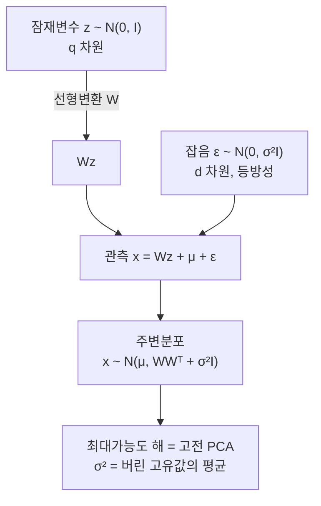

# 확률적 PCA

# 개요

[주성분 분석](principal-component-analysis.md)은 분산을 최대로 담는 부분공간을 찾는 기하적 절차다. 확률모형이 아니므로 결측값 처리, 성분 개수 선택, 새 점의 적합도 측정에 원칙이 없다.

확률적 PCA(principal component analysis)는 같은 답을 주는 생성모형이다. 저차원 잠재변수를 Gauss 분포에서 뽑아 선형변환하고 모든 방향에 같은 크기의 등방성 잡음을 더한 것이 관측이다.

이 모형의 최대가능도 해는 고전적 PCA 와 일치한다. 주성분이 주축으로 나오고 잔차 분산의 평균이 잡음 분산이 된다. 가능도, 사후분포, **EM**(expectation-maximization) 알고리즘, 베이즈 모형 선택이 여기에 따라온다.

# 직관

## 등방성 잡음 가정

모형은 신호가 $q$ 차원 부분공간 안에 있고 잡음이 모든 방향에 똑같이 퍼져 있다고 가정한다.

관측의 공분산이 두 부분으로 갈린다. 부분공간 방향에서는 신호와 잡음이 겹쳐 큰 분산이 되고, 나머지 방향에는 잡음만 남아 분산이 모두 $\sigma^2$ 다. 표본 공분산의 고유값을 크기순으로 늘어놓으면 큰 것 몇 개와 비슷한 크기의 나머지로 나뉜다.

## 사후평균으로서의 점수

고전 PCA 의 점수는 직교사영이다. 확률적 PCA 의 점수는 잠재변수의 사후평균이고 사영보다 원점 쪽으로 당겨진다. 잡음이 있으므로 신호를 관측보다 작게 추정하는 수축이 일어난다.

$\sigma^2 \to 0$ 이면 수축이 사라지고 사후평균이 직교사영이 된다. 고전 PCA 는 확률적 PCA 의 잡음 없는 극한이다.

## 회전 불변성

$z$ 의 분포가 $N(0,I)$ 여서 회전에 대해 불변이므로, $W$ 를 $WR$ 로 바꾸고 $z$ 를 $R^{\mathsf T}z$ 로 바꾸어도 관측의 분포가 같다. 따라서 최대가능도가 결정하는 것은 $W$ 가 아니라 $W$ 의 열이 생성하는 부분공간이다.

고전 PCA 는 개별 주성분을 특정하지만 확률모형은 부분공간까지만 정한다. 개별 축을 원하면 추가 규약이 필요하다.

# 정의

## 모형

$z \in \mathbb R^q$ 와 $x \in \mathbb R^d$ 와 $q \lt d$ 로 두고 다음을 가정한다.

$$
z\sim N(0,I_q),\qquad x\mid z\ \sim\ N(Wz+\mu,\ \sigma^2I_d)
$$

Gauss 분포의 주변화가 다시 Gauss 이므로 관측의 주변분포는 다음이다.

$$
x\sim N(\mu,\ C),\qquad C=WW^{\mathsf T}+\sigma^2I_d
$$

모수는 $W \in \mathbb R^{d\times q}$ 와 $\mu$ 와 $\sigma^2$ 이며, 자유도는 회전 불변성을 뺀 값이다.

## 사후분포

Gauss 켤레성으로 잠재변수의 사후분포도 Gauss 다. $M = W^{\mathsf T}W+\sigma^2I_q$ 라 하면

$$
z\mid x\ \sim\ N\big(M^{-1}W^{\mathsf T}(x-\mu),\ \sigma^2M^{-1}\big)
$$

$q\times q$ 행렬만 뒤집으므로 $d$ 가 커도 계산이 싸다. 사후평균이 저차원 표현으로 쓰이는 점수다.

## 최대가능도 해

표본 공분산 $S$ 의 고유값을 $\lambda_1\ge\cdots\ge\lambda_d$ 로, 대응 고유벡터를 $u_1,\dots,u_d$ 라 한다. 최대가능도 해는 다음과 같다[^1].

$$
\hat\mu=\bar x,\qquad
\hat\sigma^2=\frac1{d-q}\sum_{j=q+1}^d\lambda_j,\qquad
\hat W=U_q\big(\Lambda_q-\hat\sigma^2I_q\big)^{1/2}R
$$

$U_q$ 는 상위 $q$ 개 고유벡터를 열로 가진 행렬, $\Lambda_q$ 는 대응 고유값의 대각행렬, $R$ 은 임의의 직교행렬이다.

부분공간은 상위 주성분들이 생성하는 공간이고, 잡음 분산은 버린 고유값들의 평균이며, 각 축의 크기는 고유값에서 잡음 분산을 뺀 값이다.

# 성질

## 모형 공분산

최대가능도 해를 넣으면 모형 공분산이 상위 $q$ 방향에서 표본 공분산과 일치한다.

$$
\hat C=U_q\Lambda_qU_q^{\mathsf T}+\hat\sigma^2\Big(I-U_qU_q^{\mathsf T}\Big)
$$

남긴 방향의 분산은 그대로 두고 버린 방향들의 분산을 그 평균으로 바꾼 것이다. 모형이 $d-q$ 개의 서로 다른 고유값을 하나로 뭉치므로 정보 손실이 이 자리에서 일어난다.

## 상위 고유값의 최적성

로그가능도는 $\ln|C| + \mathrm{tr}(C^{-1}S)$ 의 부호를 바꾼 것에 상수를 더한 형태다. 어느 $q$ 개를 남기든 대각화된 좌표에서 $\mathrm{tr}(C^{-1}S) = d$ 이므로 선택은 $\ln|C|$ 가 정한다. 버린 고유값들의 산술평균이 기하평균 이상이므로 상위 $q$ 개를 남기는 것이 최적이다.

## EM 알고리즘

잠재변수를 결측으로 보고 EM 을 돌리면 고유분해 없이 해를 얻는다.

E 단계에서 각 점의 사후 적률을 계산한다.

$$
\mathbb E[z_i]=M^{-1}W^{\mathsf T}(x_i-\mu),\qquad \mathbb E[z_iz_i^{\mathsf T}]=\sigma^2M^{-1}+\mathbb E[z_i]\mathbb E[z_i]^{\mathsf T}
$$

M 단계에서 $W$ 와 $\sigma^2$ 를 갱신한다.

$$
W^{\text{new}}=\left(\sum_i(x_i-\mu)\mathbb E[z_i]^{\mathsf T}\right)\left(\sum_i\mathbb E[z_iz_i^{\mathsf T}]\right)^{-1}
$$

한 번 순회의 비용이 $O(ndq)$ 로 공분산행렬을 만드는 $O(nd^2)$ 보다 싸고, 표본 공분산을 만들 필요도 없다. $d$ 가 크고 $q$ 가 작을 때 이득이 크다.

## 결측값 처리

관측되지 않은 좌표를 잠재변수와 함께 E 단계에서 채우면 결측이 있는 자료에도 적용된다. 고전 PCA 에는 결측 좌표를 다루는 원칙이 없다. 추천 시스템의 행렬 완성이 같은 구조다.

## 인자분석과의 차이

잡음 공분산을 등방성 $\sigma^2I$ 대신 임의의 대각행렬 $\Psi$ 로 두면 인자분석이 된다.

| | 확률적 PCA | 인자분석 |
|---|---|---|
| 잡음 | $\sigma^2I$ | 대각 $\Psi$ |
| 좌표 스케일 | 바꾸면 해가 달라짐 | 스케일 불변 |
| 해 | 닫힌 꼴 | EM 등 반복 필요 |
| 의미 | 신호 부분공간 + 균일 잡음 | 공통인자 + 변수별 고유분산 |

변수들의 단위와 잡음 수준이 크게 다르면 인자분석이 적절하고, 그렇지 않으면 확률적 PCA 의 닫힌 해를 쓴다.

## 성분 개수의 선택

가능도가 있으므로 모형 선택 기준을 쓴다. 베이즈 정보 기준이나 주변가능도로 $q$ 를 고르거나, $W$ 의 각 열에 사전분포를 두어 필요 없는 열을 0 으로 보내는 자동 관련도 결정을 쓴다.

잡음이 등방적이지 않으면 $\hat\sigma^2$ 가 큰 잡음 방향에 끌려가 성분 개수를 잘못 고른다.

## 혼합모형으로의 확장

각 성분이 자기 부분공간을 가지는 혼합 확률적 PCA 는 데이터가 여러 저차원 조각으로 이루어진 경우를 다루고, 비선형 다양체를 국소 선형 조각으로 근사한다.

# 활용

## 불확실성이 있는 저차원 표현

점수에 사후 공분산 $\sigma^2M^{-1}$ 이 함께 나오므로 각 점의 표현에 대한 불확실성을 알 수 있고, 하류 작업으로 전파할 수 있다.

## 이상값 탐색

새 점의 주변가능도 $N(x\mid\mu, WW^{\mathsf T}+\sigma^2I)$ 를 직접 계산한다. 값이 낮으면 모형이 설명하지 못하는 점이다. 부분공간까지의 거리만 보는 방식과 달리 부분공간 안에서 멀리 떨어진 점도 잡아낸다.

## 큰 자료에서의 계산

$d$ 가 수만이고 $q$ 가 수십이면 $d\times d$ 공분산행렬을 만들 수 없다. EM 은 자료를 한 묶음씩 보며 $O(ndq)$ 로 진행하므로 이 규모에서 쓸 수 있고, 온라인 갱신과 미니배치 변형이 나온다.

## 생성모형으로의 확장

관측을 잠재변수의 변환에 잡음을 더한 것으로 보는 틀을 유지하고 선형변환을 신경망으로 바꾸면 변분 오토인코더가 된다. 이때 사후분포가 닫힌 꼴이 아니므로 변분 근사가 필요하다. 확률적 PCA 는 이 계열에서 모든 계산이 닫힌 꼴로 되는 경우다.

[^1]: Tipping, Bishop, *Probabilistic Principal Component Analysis*, J. R. Statist. Soc. B 61(3), 1999. 최대가능도 해의 닫힌 꼴, 회전 불변성, EM 알고리즘.

# 연관 문서

## 선수지식

- [주성분 분석](principal-component-analysis.md)
- [통계 개관](statistics-overview.md)

## 더 알아보기

- [변분 오토인코더](variational-autoencoder.md)

#statistics #linear_algebra #machine_learning
