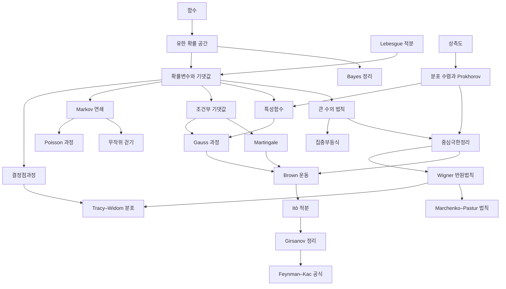

# 확률론 개관

# 개요

확률론은 불확실한 양을 측도로 재고, 많이 모았을 때 나타나는 규칙을 다룬다. 물음은 "무작위한 양의 합이나 극한이 무엇으로 수렴하고 그 요동은 얼마나 큰가" 이고, 답은 세 층위로 나온다. 평균으로 가는 큰 수의 법칙, 요동의 정규분포 근사인 중심극한정리, 그리고 유한 표본에서 벗어날 확률을 재는 집중부등식이다.

확률론의 갈래는 네 줄기다. 유한 확률 공간에서 시작하는 기초와 극한정리, 조건부 기댓값 위에 세운 이산시간 확률과정, Brown 운동과 확률적분의 연속시간 이론, 그리고 고윳값의 극한 법칙을 다루는 무작위 행렬이다. 측도론적 기반은 [측도](measure.md)와 [Lebesgue 적분](lebesgue-integral.md)에, 추론 쪽은 [Bayes 추론](bayesian-inference.md)과 [가설검정](hypothesis-testing.md)에 있다.

시작은 [유한 확률 공간](probability.md)이다. 거기서 [확률변수](random-variables.md)로 넘어가면 [큰 수의 법칙](law-of-large-numbers.md)과 [중심극한정리](central-limit-theorem.md)의 두 극한정리가 나오고, [조건부 기댓값](conditional-expectation.md)에서 [Martingale](martingales.md)을 거쳐 확률과정으로 갈라진다.

# 지도

# 갈래

## 기초와 극한정리

- [유한 확률 공간](probability.md): 표본공간, 사건, 확률측도
- [Bayes 정리](bayes.md): 조건부확률의 역전
- [확률변수](random-variables.md): 가측함수로서의 확률변수와 적분으로서의 기댓값
- [분포 수렴과 Prokhorov 정리](weak-convergence.md): 분포의 수렴과 tightness
- [특성함수와 Lévy 연속성 정리](characteristic-functions.md): Fourier 변환으로 분포 수렴을 판정
- [큰 수의 법칙](law-of-large-numbers.md): 표본평균이 기댓값으로
- [중심극한정리](central-limit-theorem.md): 요동의 정규분포 근사
- [집중부등식](concentration-inequalities.md): 유한 표본에서 평균을 벗어날 확률의 지수적 상한
- [대편차 원리](large-deviations.md): 벗어날 확률의 지수를 결정하는 rate function, Cramér 정리와 Sanov 정리
- [Gauss 과정](gaussian-processes.md): 평균함수와 공분산핵으로 결정되는 과정, 조건부분포의 닫힌 형태

## 조건부 구조와 이산시간 확률과정

- [조건부 기댓값](conditional-expectation.md): 부분 $\sigma$ 대수 위로의 사영
- [Martingale](martingales.md): 공정한 도박의 형식화, 선택적 정지와 수렴정리
- [Markov 연쇄](markov-chains.md): 전이행렬, 정상분포, 수렴정리
- [무작위 걷기](random-walks.md): 재귀성을 유효저항으로 읽는 대응
- [Poisson 과정](poisson-process.md): 독립·정상 증분을 가진 계수과정, 지수 대기시간

## 연속시간 확률과정

- [Brown 운동](brownian-motion.md): 연속시간 Gauss 과정과 경로의 성질
- [Itô 적분](ito-calculus.md): 유계변동이 없는 경로 위의 적분과 Itô 공식
- [Girsanov 정리](girsanov.md): 측도변환으로 표류항을 바꾼다
- [Feynman–Kac 공식](feynman-kac.md): 편미분방정식의 해를 경로 적분의 기댓값으로

## 무작위 행렬과 점과정

- [Wigner 반원법칙](wigner-semicircle.md): 고윳값 분포의 극한
- [Marchenko–Pastur 법칙](marchenko-pastur.md): 표본공분산행렬의 스펙트럼
- [결정점과정](determinantal-point-process.md): 상관함수가 행렬식으로 주어지는 점과정
- [Tracy–Widom 분포와 Airy 핵](tracy-widom.md): 최대 고윳값의 요동

# 연관 문서

## 선수지식

- [집합](sets.md)

## 더 알아보기

- [유한 확률 공간](probability.md)
- [분포 수렴과 Prokhorov 정리](weak-convergence.md)

#probability #measure_theory #statistics #overview
