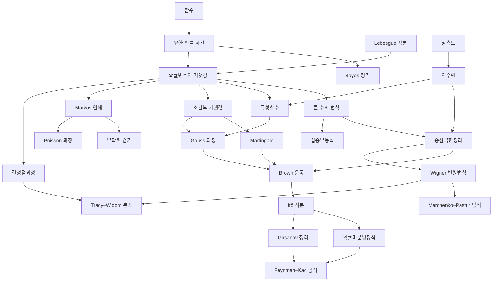

# 확률론 개관

# 개요

확률론은 불확실한 양을 측도로 재고, 많이 모았을 때 나타나는 규칙을 다룬다. 물음은 "무작위한 양의 합이나 극한이 무엇으로 수렴하고 그 요동은 얼마나 큰가" 이고, 답은 세 층위로 나온다. 평균으로 가는 큰 수의 법칙, 요동의 정규분포 근사인 중심극한정리, 그리고 유한 표본에서 벗어날 확률을 재는 집중부등식이다.

확률론의 갈래는 네 줄기다. 유한 확률 공간에서 시작하는 기초와 극한정리, 조건부 기댓값 위에 세운 이산시간 확률과정, Brown 운동과 확률적분의 연속시간 이론, 그리고 고윳값의 극한 법칙을 다루는 무작위 행렬이다. 측도론적 기반은 [측도](measure.md)와 [Lebesgue 적분](lebesgue-integral.md)에, 추론 쪽은 [Bayes 추론](bayesian-inference.md)과 [가설검정](hypothesis-testing.md)에 있다.

시작은 [유한 확률 공간](probability.md)이다. 거기서 [확률변수](random-variables.md)로 넘어가면 [큰 수의 법칙](law-of-large-numbers.md)과 [중심극한정리](central-limit-theorem.md)의 두 극한정리가 나오고, [조건부 기댓값](conditional-expectation.md)에서 [Martingale](martingales.md)을 거쳐 확률과정으로 갈라진다.

# 지도

```mermaid
graph TD
  FN["함수"] --> PR["유한 확률 공간"]
  PR --> BY["Bayes 정리"]
  PR --> RV["확률변수와 기댓값"]
  LI["Lebesgue 적분"] --> RV
  PM["상측도"] --> WC["약수렴"]
  RV --> LLN["큰 수의 법칙"]
  LLN --> CLT["중심극한정리"]
  WC --> CLT
  WC --> CF["특성함수"]
  RV --> CF
  LLN --> CI["집중부등식"]
  RV --> CE["조건부 기댓값"]
  CE --> MG["Martingale"]
  RV --> MC["Markov 연쇄"]
  MC --> RW["무작위 걷기"]
  MC --> PP["Poisson 과정"]
  MG --> BM["Brown 운동"]
  CLT --> BM
  BM --> IT["Itô 적분"]
  IT --> SDE["확률미분방정식"]
  IT --> GS["Girsanov 정리"]
  SDE --> FK["Feynman–Kac 공식"]
  GS --> FK
  CLT --> WS["Wigner 반원법칙"]
  WS --> MP["Marchenko–Pastur 법칙"]
  WS --> TW["Tracy–Widom 분포"]
  RV --> DPP["결정점과정"]
  DPP --> TW
  CF --> GP["Gauss 과정"]
  CE --> GP
  GP --> BM
```

# 갈래

## 확률 공간과 확률변수

- [유한 확률 공간](probability.md): 표본공간, 사건, 확률측도
- [Bayes 정리](bayes.md): 조건부확률의 역전
- [확률변수](random-variables.md): 가측함수로서의 확률변수와 적분으로서의 기댓값
- [확률밀도](probability-density.md): 분포를 기준측도로 적분해 쓴 함수와 밀도가 없는 분포
- [Radically elementary 확률론](radically-elementary-probability.md): 초유한 크기의 유한 확률공간 위에서 측도 없이 세운 Brown 운동과 확률적분

## 극한정리

- [약수렴](weak-convergence.md): 분포의 수렴과 tightness
- [Skorokhod 표현정리](skorokhod-representation.md): 분포 수렴을 거의 확실한 수렴으로 실현하는 결합
- [특성함수](characteristic-functions.md): Fourier 변환으로 분포 수렴을 판정
- [큰 수의 법칙](law-of-large-numbers.md): 표본평균이 기댓값으로
- [중심극한정리](central-limit-theorem.md): 요동의 정규분포 근사

## 편차와 Gauss 구조

- [집중부등식](concentration-inequalities.md): 유한 표본에서 평균을 벗어날 확률의 지수적 상한
- [대편차 원리](large-deviations.md): 벗어날 확률의 지수를 결정하는 rate function, Cramér 정리와 Sanov 정리
- [Gärtner–Ellis 정리](gartner-ellis.md): 독립 없이 쓰는 대편차 원리, 적률생성함수 극한의 미분가능성과 Markov 연쇄의 시간평균
- [Freidlin–Wentzell 이론](freidlin-wentzell.md): 작은 잡음 확률미분방정식의 대편차, 작용범함수와 탈출 시간
- [Gauss 과정](gaussian-processes.md): 평균함수와 공분산핵으로 결정되는 과정, 조건부분포의 닫힌 형태

## 조건부 구조와 이산시간 확률과정

- [조건부 기댓값](conditional-expectation.md): 부분 $\sigma$ 대수 위로의 사영
- [Martingale](martingales.md): 공정한 도박의 형식화, 선택적 정지와 수렴정리
- [Doob 분해](doob-decomposition.md): martingale 과 예측 가능 과정의 합으로의 유일한 분해, 예측 가능 2차 변동
- [Markov 연쇄](markov-chains.md): 전이행렬, 정상분포, 수렴정리
- [무작위 걷기](random-walks.md): 재귀성을 유효저항으로 읽는 대응
- [전변동거리](total-variation-distance.md): 사건 확률의 최대 차, 결합 표현과 Pinsker 부등식
- [결합](coupling.md): 두 분포를 주변분포로 갖는 쌍, 불일치 확률의 최솟값이 전변동거리
- [Markov 연쇄의 혼합시간](mixing-time.md): 전변동거리로 재는 수렴 속도, 결합 상한과 스펙트럼 간격
- [은닉 Markov 모형](hidden-markov-model.md): 관측 뒤에 숨은 상태열, 전향 후향 재귀와 Viterbi 복호
- [Markov 결정 과정](markov-decision-process.md): 행동으로 전이를 고르는 연쇄, Bellman 방정식과 값 반복
- [확률근사](stochastic-approximation.md): 잡음 섞인 관측으로 $f(\theta)=0$ 을 푸는 반복법, Robbins–Monro 보폭 조건
- [최적 정지](optimal-stopping.md): Snell 포락과 문턱 규칙, 비서 문제
- [Gittins 지표](gittins-index.md): 팔마다 따로 계산한 수의 최댓값이 할인 밴딧의 최적 정책이다
- [Poisson 과정](poisson-process.md): 독립·정상 증분을 가진 계수과정, 지수 대기시간
- [분지과정](branching-processes.md): 자손 생성함수의 합성으로 세대를 잇는 과정, 소멸 확률이 생성함수의 고정점
- [침투](percolation.md): 변을 확률 $p$ 로 열어 무한 클러스터가 생기는 임계값, 나무에서는 분지과정과 같은 판정

## 연속시간 확률과정

- [Kolmogorov 확장정리](kolmogorov-extension.md): 정합적 유한차원 분포족에서 확률과정을 세우는 정리
- [Brown 운동](brownian-motion.md): 연속시간 Gauss 과정과 경로의 성질
- [Donsker 불변원리](donsker-invariance-principle.md): 부분합의 꺾은선이 $C\lbrack 0,1\rbrack$ 에서 Brown 운동으로 약수렴
- [Itô 적분](ito-calculus.md): 유계변동이 없는 경로 위의 적분과 Itô 공식
- [확률미분방정식](stochastic-differential-equations.md): 잡음 항이 들어간 미분방정식의 해와 그 밀도
- [Fokker–Planck 방정식](fokker-planck.md): 해의 밀도가 만족하는 편미분방정식, 확률흐름과 정상분포, 세부균형
- [Girsanov 정리](girsanov.md): 측도변환으로 표류항을 바꾼다
- [Feynman–Kac 공식](feynman-kac.md): 편미분방정식의 해를 경로 적분의 기댓값으로
- [Black–Scholes 방정식](black-scholes-equation.md): 복제로 얻는 가격 방정식, 추세의 소거와 열방정식 변환
- [미국형 옵션](american-options.md): 행사 시각을 함께 고르는 가격 문제, 변분 부등식과 행사 경계

## 무작위 행렬과 점과정

- [Wigner 반원법칙](wigner-semicircle.md): 고윳값 분포의 극한
- [Marchenko–Pastur 법칙](marchenko-pastur.md): 표본공분산행렬의 스펙트럼
- [결정점과정](determinantal-point-process.md): 상관함수가 행렬식으로 주어지는 점과정
- [Tracy–Widom 분포](tracy-widom.md): 최대 고윳값의 요동
- [자유확률](free-probability.md): 교환하지 않는 변수의 자유독립, R 변환과 자유 합성곱

# 연관 문서

## 선수지식

- [집합](sets.md)

## 더 알아보기

- [유한 확률 공간](probability.md)
- [약수렴](weak-convergence.md)

#probability #measure_theory #statistics #overview
