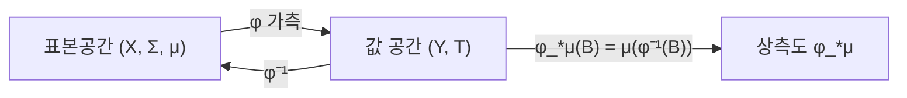

# 상측도와 확률분포

# 개요

주사위를 두 번 던져 눈의 합을 본다고 하자. 원래 확률이 정의된 곳은 36 가지 순서쌍의 공간인데, 우리가 실제로 관심 있는 것은 $2$ 부터 $12$ 까지의 합이다. 합의 분포는 어디서 오는가.

답은 간단하다. "합이 $7$ 일 확률" 은 "합이 $7$ 이 되는 순서쌍들의 확률" 이다. 즉 값 쪽의 집합을 함수로 되돌려 원래 측도를 재면 된다. 이것이 상측도이고, [가측함수](measurable-functions.md)의 정의가 요구하던 것이 정확히 이 되돌리기가 항상 가능하도록 하는 조건이었다.

이 구성이 확률론의 기본 문법이다. [확률변수](random-variables.md)의 분포가 상측도이고, 통계량의 분포도, 좌표변환 후의 분포도 모두 같은 방식으로 정의된다. 원래 표본공간이 무엇이었는지 잊고 분포만 가지고 작업할 수 있게 해 주는 것이 이 개념의 실용적 가치다.

# 직관

## 질량을 옮긴다

측도를 "공간에 흩어져 있는 질량" 으로 생각하면, 상측도는 함수 $\varphi$ 가 각 점의 질량을 $\varphi(x)$ 자리로 실어 나른 결과다. 질량은 사라지지도 생기지도 않으므로 $\mu$ 가 확률측도면 $\varphi_*\mu$ 도 확률측도다.

여러 점이 같은 곳으로 실려 가면 질량이 뭉친다. 주사위 눈의 홀짝을 보면 세 점씩 뭉쳐 $1/2$ 씩이 된다. 정보를 잃는 대신 다루기 쉬워지는 이 뭉침이 요약 통계량의 본질이다.

## 정의는 역상으로, 계산은 순방향으로

정의식에 역상 $\varphi^{-1}(B)$ 가 등장하는 것이 헷갈리는 지점이다. 측도는 함수와 같은 방향으로 밀려가는데 정의는 반대 방향의 역상을 쓴다.

이유는 측도가 집합을 받는 함수이기 때문이다. 집합 자체는 함수를 따라 앞으로 갈 수 없다. $\varphi(A)$ 가 가측이라는 보장이 없기 때문이다. 반면 역상은 여집합과 가산 합집합을 그대로 보존하므로 측도의 구조가 온전히 옮겨진다. 그래서 대상은 앞으로 가고 정의는 뒤로 간다.



# 정의

## 상측도

측도 공간 $(X, \Sigma, \mu)$ 와 가측 공간 $(Y, T)$ , 가측함수 $\varphi : X \to Y$ 에 대해

$$
(\phi_*\mu)(B)=\mu\!\left(\phi^{-1}(B)\right),\qquad B\in\mathcal T
$$

를 상측도라 한다. $\mu$ 가 확률측도이면 $\varphi_*\mu$ 도 확률측도이며, 확률변수 $\varphi$ 의 분포 또는 법칙이라 부른다.

## 측도임의 확인

서로소인 $B_1, B_2, \ldots$ 의 역상은 서로소이고 역상이 가산 합집합을 보존하므로

$$
(\phi_*\mu)\Bigl(\bigsqcup_n B_n\Bigr)=\mu\Bigl(\bigsqcup_n\phi^{-1}(B_n)\Bigr)=\sum_n\mu(\phi^{-1}(B_n))
$$

이다. $\varphi_\ast\mu(\emptyset) = \mu(\emptyset) = 0$ 이므로 $\varphi_*\mu$ 는 측도다. 이 확인이 짧게 끝나는 것이 전적으로 역상의 좋은 성질 덕분이다.

# 성질

## 변수변환 공식

음이 아닌 가측함수 $g : Y \to [0,\infty]$ 에 대해

$$
\int_Y g(y)\,d(\phi_*\mu)(y)=\int_X g(\phi(x))\,d\mu(x)
$$

가 성립한다. 지시함수에서는 정의 그대로이고, 단순함수에서는 선형성으로, 일반적인 음이 아닌 함수에는 [단조수렴 정리](monotone-convergence.md)를 적용한다. 적분 가능한 실수값 함수에는 양의 부분과 음의 부분에 각각 쓴다.

확률의 언어로 옮기면 무의식적 통계학자의 법칙이다.

$$
\mathbb{E}[g(X)]=\int_{\mathbb{R}}g\,dP_X
$$

$g(X)$ 의 기댓값을 구하려고 $g(X)$ 의 분포를 새로 계산할 필요가 없다. $X$ 의 분포만 있으면 된다. 실무에서 기댓값 계산이 간단해지는 것이 대부분 이 공식 덕분이다.

## 합성

또 다른 가측함수 $\psi : Y \to Z$ 에 대해

$$
(\psi\circ\phi)_*\mu=\psi_*(\phi_*\mu)
$$

가 성립한다. 역상이 합성을 뒤집어 보존하기 때문이다. 함자적 성질이라 부를 만하며, 확률변수를 변환할 때마다 표본공간으로 돌아갈 필요가 없다는 뜻이다. $X$ 의 분포를 알면 $g(X)$ 의 분포는 $g$ 만 적용하면 된다.

## 분포가 표본공간을 대체한다

같은 분포를 주는 서로 다른 표본공간이 얼마든지 있다. 동전 던지기를 $\{\text{앞},\text{뒤}\}$ 위에서 모형화하든 $[0,1]$ 위의 균등분포와 $\mathbf 1_{[0,1/2]}$ 로 모형화하든 결과의 분포는 같다.

확률론의 명제 대부분이 분포에만 의존하므로 표본공간의 선택은 편의의 문제다. 실제로 임의의 분포는 $[0,1]$ 위의 균등분포를 밀어서 만들 수 있으며, 누적분포함수의 역함수를 쓰는 이 구성이 역변환 표본추출법이다.

```python
import random

def inverse_transform(cdf_inv, n):
    """균등분포를 밀어 원하는 분포를 얻는다: (F^{-1})_* Uniform = 목표분포."""
    return [cdf_inv(random.random()) for _ in range(n)]


import math
# 지수분포 F(x) = 1 - e^{-x}, F^{-1}(u) = -ln(1-u)
sample = inverse_transform(lambda u: -math.log(1 - u), 200000)
print(sum(sample) / len(sample))            # 평균 ~ 1.0
print(sum(1 for s in sample if s > 1) / len(sample), math.exp(-1))


def pushforward_counts(base, phi):
    """유한 표본공간에서 상측도를 직접 계산한다."""
    out = {}
    for x, p in base.items():
        out[phi(x)] = out.get(phi(x), 0) + p
    return out


die = {i: 1 / 6 for i in range(1, 7)}
print(pushforward_counts(die, lambda i: "홀" if i % 2 else "짝"))
print(pushforward_counts(die, lambda i: min(i, 3)))
```

공정한 주사위에서 홀짝을 보면 각각 $1/2$ 이고, $\min(i,3)$ 으로 뭉개면 $3$ 에 $4/6$ 이 몰린다. 여러 점이 한 점으로 실려 가면 질량이 더해진다는 것이 그대로 보인다.

## 밀도가 있을 때

$Y = \mathbb{R}^n$ 이고 $\varphi$ 가 미분동형이면 상측도의 밀도가 Jacobi 행렬식으로 주어진다.

$$
p_Y(y)=p_X(\phi^{-1}(y))\,\bigl|\det D\phi^{-1}(y)\bigr|
$$

다변수 치환적분이 이 공식의 특수한 경우다. $\varphi$ 가 단사가 아니면 각 역상 가지의 기여를 더해야 하고, 차원을 줄이면 밀도가 아예 존재하지 않을 수 있다. 정규화 흐름 같은 생성 모형이 가역 변환만 쓰는 이유가 이 공식을 쓰기 위해서다.

## 밀도가 없을 수도 있다

상측도는 항상 정의되지만 밀도를 가진다는 보장은 없다. 연속분포를 이산 함수로 밀면 이산분포가 되고, Cantor 함수로 밀면 이산도 연속도 아닌 특이분포가 나온다. 어떤 측도가 다른 측도에 대해 밀도를 갖는 조건이 절대연속성이며, 그것을 다루는 것이 [Radon–Nikodym 정리](radon-nikodym.md)다.

# 활용

## 확률변수와 통계량

고차원 표본을 한 숫자로 요약하는 모든 통계량이 상측도를 만든다. 표본평균의 분포, 검정통계량의 귀무분포, 순서통계량의 분포가 모두 이 방식으로 정의된다. 분포를 계산하기 어려워 근사하거나 재표본추출로 추정하는 경우에도 정의 자체는 항상 상측도다.

## 좌표변환과 시뮬레이션

적분을 편한 좌표계로 옮겨 계산하는 것, 극좌표로 바꿔 Gauss 적분을 구하는 것, 난수 생성기로 원하는 분포를 만드는 것이 모두 측도를 미는 작업이다. Box–Muller 변환은 균등분포 두 개를 밀어 정규분포 두 개를 만드는 구체적인 예다.

## 측도를 바꾸는 다른 방법

상측도는 공간을 바꾸고 측도를 따라 옮긴다. 공간은 그대로 두고 측도만 밀도로 다시 저울질하는 방법도 있으며, 그것이 [측도변환](change-of-measure.md)이다. 두 조작을 구분해야 한다. 전자는 "다른 것을 관측한다" 이고 후자는 "같은 것을 다른 확률로 본다" 이다. 중요도 표본추출, 위험중립 가격결정, 우도비 검정이 후자를 쓴다.[^1]

[^1]: Terence Tao, *245A Notes 3: Integration on abstract measure spaces and the convergence theorems*, Exercise 36. 상측도의 정의와 적분 변환 공식. https://terrytao.wordpress.com/2010/09/25/245a-notes-3-integration-on-abstract-measure-spaces-and-the-convergence-theorems/

# 연관 문서

## 선수지식

- [측도](measure.md)
- [가측함수](measurable-functions.md)

## 더 알아보기

- [확률변수와 기댓값](random-variables.md)
- [측도변환과 우도비](change-of-measure.md)
- [최적 수송과 Wasserstein 거리](optimal-transport.md)
- [분포 수렴과 Prokhorov 정리](weak-convergence.md)

#measure_theory #probability
