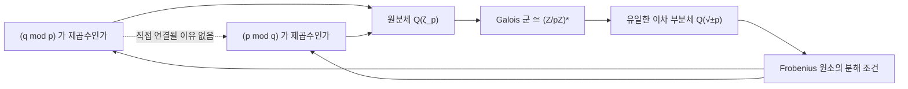

# 이차 상호법칙

# 개요

합동식 $x^2\equiv a\pmod p$ 의 해의 존재는 [Fermat 소정리](fermat-euler-theorem.md)에서 나오는 Euler 판정법이 $a^{(p-1)/2}\bmod p$ 한 번의 계산으로 판정한다.

$p$ 가 법 $q$ 에서 제곱수인지와 $q$ 가 법 $p$ 에서 제곱수인지는 별개의 계산인데 두 답이 서로를 결정한다. 둘 중 하나라도 $4k+1$ 이면 두 답이 같고, 둘 다 $4k+3$ 이면 반대다.

$$
\Big(\frac pq\Big)\Big(\frac qp\Big)=(-1)^{\frac{p-1}2\cdot\frac{q-1}2}
$$

Gauss 는 이 관계에 여덟 가지 증명을 남겼다. 오늘날의 설명은 두 소수가 하나의 더 큰 대상인 원분체의 Galois 군을 통해 서로를 본다는 것이다. 이 관점이 유체론으로 자라고, 아벨이 아닌 경우로 넓히려는 시도가 Langlands 강령이 되었다.

# 직관

## 제곱잉여의 개수

$p$ 가 홀소수면 $(\mathbb Z/p\mathbb Z)^\times$ 는 위수 $p-1$ 인 순환군이다. 제곱 사상 $x\mapsto x^2$ 의 핵이 $\lbrace\pm1\rbrace$ 로 크기 2 이므로 상의 크기는 $(p-1)/2$ 다. 정확히 절반이 제곱잉여다.

제곱잉여 전체가 지표 2 인 부분군이므로, 몫군이 $\lbrace\pm1\rbrace$ 이고 몫사상이 준동형이다. Legendre 기호가 바로 이 준동형이며, "제곱수 곱하기 제곱수는 제곱수, 비제곱수 곱하기 비제곱수는 제곱수" 라는 규칙이 여기서 나온다. 법 $p$ 의 유일한 비자명 실수 [Dirichlet 지표](dirichlet-l-functions.md)이기도 하다.

## 분자와 분모의 비대칭

Legendre 기호 $\left(\frac ap\right)$ 에서 분자와 분모의 역할은 다르다. 위쪽은 $\bmod p$ 로만 의미가 있고 아래쪽은 계산의 무대다.

그런데 $p$ 와 $q$ 를 맞바꾼 두 기호가 서로를 결정하고, 그 규칙이 $p,q$ 를 4 로 나눈 나머지만 쓴다.

## 원분체를 통한 설명

$\mathbb Q(\zeta_p)$ 의 Galois 군이 $(\mathbb Z/p\mathbb Z)^\times$ 이고, 지표 2 인 부분군에 대응하는 이차 부분체가 정확히 하나 있다. 그것이 $p^\ast=(-1)^{(p-1)/2}p$ 에 대한 $\mathbb Q(\sqrt{p^\ast})$ 다.

$q$ 가 이 이차체에서 분해되는지는 $\left(\frac{p^\ast}q\right)$ 가 결정한다. 반면 $q$ 가 $\mathbb Q(\zeta_p)$ 에서 어떻게 분해되는지는 $q \bmod p$ 가 결정한다. 같은 소수 $q$ 의 같은 분해 행동을 두 방식으로 읽은 것이므로 두 답이 일치해야 하고, 그 일치가 상호법칙이다.

두 기호가 서로를 보는 것이 아니라 둘 다 원분체를 보고 있다.

# 정의

## Legendre 기호

홀소수 $p$ 와 정수 $a$ 에 대해

$$
\Big(\frac ap\Big)=\begin{cases}
+1&p\nmid a\ \text{이고}\ x^2\equiv a\ \text{에 해가 있다}\cr
-1&p\nmid a\ \text{이고}\ x^2\equiv a\ \text{에 해가 없다}\cr
0&p\mid a
\end{cases}
$$

해가 있을 때 $a$ 를 법 $p$ 의 제곱잉여라 한다.

## Jacobi 기호

분모를 홀수 합성수로 확장한다. $n=p_1^{e_1}\cdots p_k^{e_k}$ 가 홀수면

$$
\Big(\frac an\Big)=\prod_i\Big(\frac a{p_i}\Big)^{e_i}
$$

$\left(\frac an\right)=1$ 이라고 해서 $a$ 가 법 $n$ 의 제곱잉여라는 보장은 없다. $-1$ 이 두 번 곱해져 상쇄될 수 있기 때문이다. 그럼에도 유용한 이유는 상호법칙이 그대로 성립해, 인수분해 없이 유클리드 알고리즘처럼 계산할 수 있다는 데 있다.

## Gauss 합

$\zeta=e^{2\pi i/p}$ 라 할 때

$$
g=\sum_{a=1}^{p-1}\Big(\frac ap\Big)\zeta^a
$$

Legendre 기호를 가중치로 삼은 $p$ 차 단위근의 합이고, 제곱잉여 쪽과 비제곱잉여 쪽의 치우침을 재는 양이다. 그 제곱이 $\pm p$ 다.

# 성질

## Euler 판정법

$$
\Big(\frac ap\Big)\equiv a^{\frac{p-1}2}\pmod p
$$

$(\mathbb Z/p\mathbb Z)^\times$ 가 순환군이라는 사실에서 바로 나온다. 생성원을 $g$ 라 하고 $a=g^k$ 라 하면 $a^{(p-1)/2}=(-1)^k$ 이고, $a$ 가 제곱수인 것은 $k$ 가 짝수인 것과 같다.

Legendre 기호가 완전 곱셈적이라는 성질도 여기서 따라온다.

$$
\Big(\frac{ab}p\Big)=\Big(\frac ap\Big)\Big(\frac bp\Big)
$$

## 두 보충 법칙

$$
\Big(\frac{-1}p\Big)=(-1)^{\frac{p-1}2},\qquad
\Big(\frac 2p\Big)=(-1)^{\frac{p^2-1}8}
$$

첫째는 Euler 판정법에 $a=-1$ 을 넣은 것이다. 곧 $-1$ 이 제곱수인 것과 $p\equiv1\pmod4$ 인 것이 동치이고, 이 사실이 [Dirichlet L 함수](dirichlet-l-functions.md) 문서에서 본 두 제곱수 정리의 출발점이다.

둘째는 $p\equiv\pm1\pmod8$ 일 때만 2 가 제곱수라는 뜻이다. Gauss 보조정리나 $\mathbb Z[\zeta_8]$ 에서 $(\zeta_8+\zeta_8^{-1})^2=2$ 를 쓰는 증명이 있다.

## 상호법칙

서로 다른 홀소수 $p,q$ 에 대해

$$
\Big(\frac pq\Big)\Big(\frac qp\Big)=(-1)^{\frac{p-1}2\cdot\frac{q-1}2}
$$

지수가 홀수인 것은 $p\equiv q\equiv3\pmod4$ 인 경우뿐이다. 곧 둘 중 하나라도 $1 \bmod 4$ 면 두 기호가 같고, 둘 다 $3 \bmod 4$ 면 부호가 반대다.

## Gauss 합을 쓴 증명

두 단계다. 먼저 $g^2=p^\ast$ 를 보인다. 여기서 $p^\ast=(-1)^{(p-1)/2}p$ 다.

$$
g^2=\sum_{a,b}\Big(\frac{ab}p\Big)\zeta^{a+b}
=\sum_{a,c}\Big(\frac{a^2c}p\Big)\zeta^{a(1+c)}
=\sum_c\Big(\frac cp\Big)\sum_a\zeta^{a(1+c)}
$$

$b=ac$ 로 치환하고 $\left(\frac{a^2}p\right)=1$ 을 썼다. 안쪽 합은 $c\equiv-1$ 이면 $p-1$ 이고 아니면 $-1$ 이므로 정리하면 $g^2=\left(\frac{-1}p\right)p=p^\ast$ 가 나온다.

이제 $\mathbb F_q$ 위에서 같은 계산을 한다. 표수 $q$ 의 체에서 Frobenius 사상 $x\mapsto x^q$ 가 덧셈을 보존하므로

$$
g^q=\sum_a\Big(\frac ap\Big)\zeta^{aq}=\Big(\frac qp\Big)g
$$

$a\mapsto aq$ 로 치환하면서 나온 $\left(\frac qp\right)$ 다. 한편 $g^q=g\cdot(g^2)^{(q-1)/2}=g\cdot(p^\ast)^{(q-1)/2}$ 이고, Euler 판정법으로 이것이 $g\left(\frac{p^\ast}q\right)$ 다. $g\ne0$ 이므로 두 식을 비교하면

$$
\Big(\frac qp\Big)=\Big(\frac{p^*}q\Big)
$$

오른쪽을 보충 법칙으로 풀면 상호법칙이다. 표수가 다른 두 체에서 같은 Gauss 합을 계산한 것이 다리 역할을 했다. $\mathbb Q(\zeta_p)$ 에서의 계산으로 읽으면 앞 절의 Galois 이론 설명과 같은 내용이다.

## Gauss 합의 크기와 부호

$g$ 는 $p\equiv1\pmod4$ 이면 실수 $\sqrt p$ 이고 $p\equiv3\pmod4$ 이면 순허수 $i\sqrt p$ 다. $p-1$ 개의 단위근을 부호만 바꿔 더한 값의 절댓값이 무작위 행보의 규모인 $\sqrt p$ 와 같다.

부호의 결정은 더 어렵고 Gauss 가 답을 추측한 뒤 증명까지 4 년이 걸렸다. $g$ 가 항상 $+\sqrt p$ 또는 $+i\sqrt p$ 라는 것이 그 결론이며, 상호법칙에는 $g^2$ 만 필요하다.

## Jacobi 기호의 계산

상호법칙이 계산 알고리즘을 준다. $\left(\frac an\right)$ 에서 $a$ 를 $n$ 으로 나눈 나머지로 줄이고, 2 의 거듭제곱을 보충 법칙으로 떼어 내고, 상호법칙으로 위아래를 뒤집는다. 이것을 반복하면 [유클리드 알고리즘](euclidean-algorithm.md)과 같은 방식으로 $O(\log^2 n)$ 에 끝난다.

Jacobi 기호가 합성수 분모에서도 상호법칙을 만족하므로 $n$ 을 인수분해하지 않아도 되고, Euler 판정법보다 빠르다.

# 활용

## 소수판정

Euler 판정법은 소수에 대한 진술이다. 뒤집어 쓰면 합성수를 잡는 판정법이 된다. $n$ 이 소수라면 모든 $a$ 에 대해

$$
a^{\frac{n-1}2}\equiv\Big(\frac an\Big)\pmod n
$$

이 성립해야 한다. 왼쪽은 빠른 거듭제곱으로, 오른쪽은 Jacobi 기호로 각각 독립적으로 계산한 뒤 비교한다. 어긋나면 $n$ 은 확실히 합성수다. 이것이 Solovay–Strassen 판정법이고, 합성수가 통과할 확률이 시행마다 $1/2$ 이하다.

Carmichael 수가 Fermat 판정을 통과하는 것과 달리 이 판정을 모든 $a$ 에 대해 통과하는 합성수는 없다. 실무에서는 더 빠르고 오류율이 $1/4$ 인 Miller–Rabin 을 쓴다.

## 암호의 부품

$p\equiv3\pmod4$ 인 소수에서는 제곱근이 $a^{(p+1)/4}$ 한 번으로 계산된다. $\left(\frac ap\right)=1$ 일 때 이 값의 제곱이 $a^{(p+1)/2}=a\cdot a^{(p-1)/2}=a$ 가 되기 때문이다. [타원곡선](elliptic-curves.md) 점의 좌표 압축에서 $x$ 만 저장하고 $y$ 를 복원하는 계산이 정확히 이것이라, 실무의 곡선들이 이런 소수를 쓴다.

Jacobi 기호는 쉽게 계산되지만 제곱잉여 여부는 인수분해 없이 알기 어렵다는 비대칭이 이차 잉여 가정이고, Goldwasser–Micali 암호가 그 위에 세워졌다. 의미론적 안전성을 갖춘 최초의 확률적 공개키 암호이며 $\left(\frac an\right)=1$ 인 비제곱잉여를 잡음으로 써서 비트를 감춘다.

## 판별식과 소수의 분해

이차형식 $ax^2+bxy+cy^2$ 이 어떤 소수를 표현하는지는 판별식 $b^2-4ac$ 의 Legendre 기호로 결정된다. $p=x^2+y^2$ 이 $p\equiv1\pmod4$ 와 동치이고 $p=x^2+2y^2$ 이 $p\equiv1,3\pmod8$ 과 동치인 것이 전부 이 원리다.

같은 말을 대수적 수체의 언어로 하면, 소수 $p$ 가 $\mathbb Q(\sqrt d)$ 에서 분해되는지 관성인지 분기하는지를 $\left(\frac dp\right)$ 가 결정한다는 것이다. 상호법칙은 그 판정이 $p \bmod 4|d|$ 라는 합동조건으로 표현된다는 진술이 된다. 소수의 분해 행동이 유한한 합동조건으로 서술된다는 이 성질이 아벨 확대의 특징이고, 유체론이 그것을 일반화한 결과다.

## 상호법칙들의 계보

세제곱과 네제곱 잉여에 대한 상호법칙이 Eisenstein 과 Gauss 에게서 나왔고, 일반 $n$ 차에 대한 Artin 상호법칙이 아벨 확대의 경우를 완결했다. Artin 의 정리는 Galois 군과 이데알류군 사이의 동형을 주며, 이차 상호법칙이 그 가장 작은 사례다.

아벨이 아닌 확대로 넓히는 것이 Langlands 강령이다. Galois 표현과 자기동형 표현을 대응시키는 이 계획에서도 원분체의 Galois 군이 $(\mathbb Z/p\mathbb Z)^\times$ 라는 사실이 출발점이다.

# 연관 문서

## 선수지식

- [Fermat 소정리와 Euler 정리](fermat-euler-theorem.md)
- [유한체](finite-fields.md)

## 더 알아보기

- [Dirichlet 지표와 L 함수](dirichlet-l-functions.md)
- [유체론](class-field-theory.md)

#number_theory #theorem #field_theory
