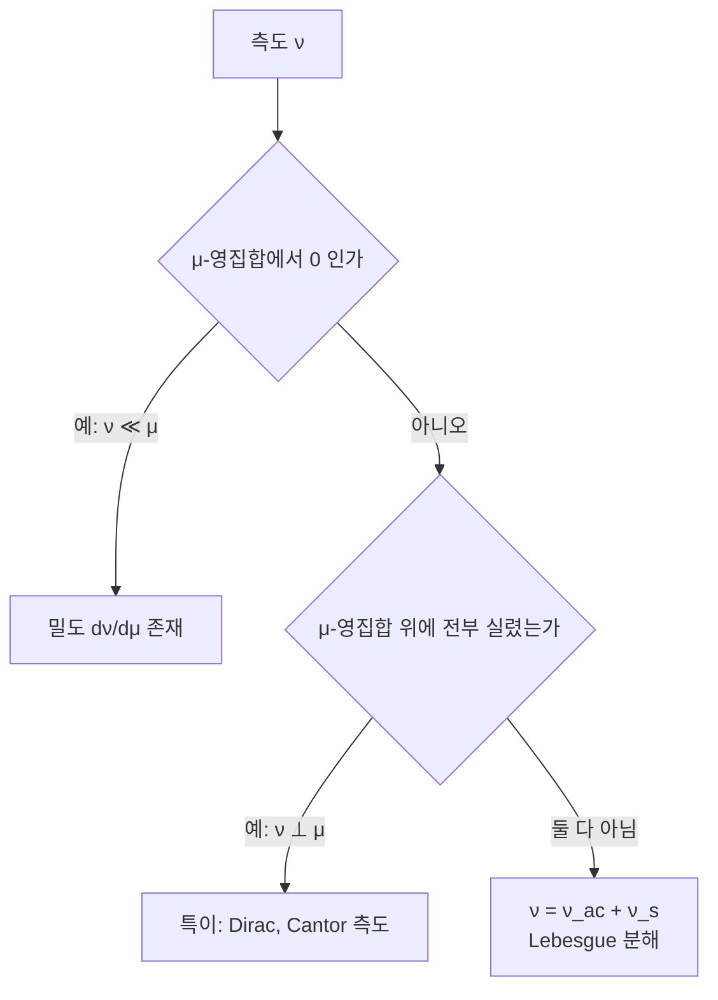

# Radon–Nikodym 정리

# 개요

확률에서 밀도함수는 익숙한 대상이다. 정규분포의 밀도를 적분하면 확률이 나온다. 그런데 밀도란 정확히 무엇인가. 확률측도를 Lebesgue 측도에 대해 "나눈 몫" 이라고 말하고 싶은데, 측도는 집합을 받는 함수라 나눗셈이 정의되어 있지 않다.

Radon–Nikodym 정리는 이 나눗셈을 정당화한다. 두 측도 사이에 "$\mu$ 가 무시하는 집합은 $\nu$ 도 무시한다" 는 관계만 성립하면, $\nu$ 를 $\mu$ 로 적분해 복원하는 함수가 반드시 존재한다고 말한다. 미적분학의 기본 정리가 누적량과 변화율을 이었다면, 이 정리는 측도와 그 밀도를 잇는 측도론판이다.

이 정리가 확률론의 여러 개념에 정의를 공급한다. 확률밀도함수, [조건부 기댓값](conditional-expectation.md), [우도비](change-of-measure.md), 마팅게일의 밀도과정이 모두 Radon–Nikodym 도함수다.

# 직관

## 영집합을 보존하면 밀도가 있다

밀도가 있다는 것은 $\nu$ 가 $\mu$ 를 저울로 삼아 각 지점의 무게를 다시 매긴 것이라는 뜻이다. 그러면 $\mu$ 가 무게 $0$ 이라고 판정한 자리에서 $\nu$ 도 $0$ 이어야 한다. 아무리 큰 밀도를 곱해도 $0$ 은 $0$ 이기 때문이다.

정리의 놀라운 점은 이 명백한 필요조건이 충분조건이기도 하다는 것이다. 영집합만 보존하면 밀도가 반드시 존재한다. 무한히 많은 집합에 대한 조건에서 함수 하나를 끄집어내는 셈이며, 그래서 증명이 간단하지 않다.

## 없을 수도 있는 경우

$0$ 에 질량 $1$ 을 몰아 준 Dirac 측도는 길이측도에 대해 밀도를 갖지 않는다. $\{0\}$ 의 길이가 $0$ 인데 측도가 $1$ 이기 때문이다. "$0$ 에서만 무한대이고 적분하면 $1$ 인 함수" 는 존재하지 않는다. 물리학에서 델타 함수라 부르는 것은 함수가 아니며, 이것이 초함수 이론이 필요한 이유다.

Cantor 함수가 유도하는 측도는 더 미묘하다. 어떤 점에도 질량을 몰아 주지 않는데도 길이 $0$ 인 Cantor 집합 위에 전부 실려 있어 밀도가 없다. 절대연속과 특이의 두 극단 사이에 중간이 없다는 것이 Lebesgue 분해 정리의 내용이다.



# 정의

## 절대연속

같은 가측 공간 위의 측도 $\mu$ 와 $\nu$ 에 대해 $\mu(E) = 0$ 이면 항상 $\nu(E) = 0$ 일 때 $\nu$ 가 $\mu$ 에 대해 절대연속이라 하고

$$
\nu\ll\mu
$$

로 쓴다. $\nu$ 가 유한하면 이 조건은 "임의의 $\varepsilon > 0$ 에 대해 $\delta > 0$ 이 있어 $\mu(E) < \delta$ 이면 $\nu(E) < \varepsilon$ 이다" 와 동치이며, 이 형태가 절대연속이라는 이름의 유래다.

## 정리

$\mu$ 와 $\nu$ 가 σ-유한이고 $\nu \ll \mu$ 이면 음이 아닌 가측함수 $f$ 가 존재해 모든 가측집합 $E$ 에서

$$
\nu(E)=\int_E f\,d\mu
$$

가 성립한다. $f$ 는 $\mu$-거의 모든 곳에서 유일하며 Radon–Nikodym 도함수라 하고

$$
f=\frac{d\nu}{d\mu}
$$

로 쓴다.

σ-유한성은 뺄 수 없다. $\mathbb R$ 의 Borel 집합에 $\mu$ 를 셈측도로, $\nu$ 를 Lebesgue 측도로 두면 $\nu \ll \mu$ 이지만 밀도가 존재하지 않는다. 셈측도가 σ-유한이 아니기 때문이다.

# 성질

## 필요조건과 충분조건

필요조건은 즉시 확인된다. $\mu(E) = 0$ 이면 $E$ 위의 임의의 적분이 $0$ 이므로 $\nu(E) = 0$ 이다. 정리의 내용은 σ-유한성 아래에서 이것이 충분하다는 것이다.

증명은 $\{g \ge 0 : \int_E g \, d\mu \le \nu(E) \text{ for all } E\}$ 라는 함수족을 놓고 그 상한을 취하는 방식이 표준이다. 상한이 실제로 밀도가 됨을 보이는 데 [단조수렴 정리](monotone-convergence.md)가 쓰인다. Hilbert 공간의 사영을 이용한 von Neumann 의 증명도 널리 쓰이며, 조건부 기댓값이 사영이라는 관점과 자연스럽게 이어진다.

## 미분의 성질을 물려받는다

표기가 도함수를 닮은 것은 우연이 아니다.

$$
\frac{d(\nu_1+\nu_2)}{d\mu}=\frac{d\nu_1}{d\mu}+\frac{d\nu_2}{d\mu},\qquad
\frac{d\nu}{d\lambda}=\frac{d\nu}{d\mu}\cdot\frac{d\mu}{d\lambda}
$$

두 번째가 연쇄법칙이고 $\nu \ll \mu \ll \lambda$ 일 때 거의 모든 곳에서 성립한다. $\nu \ll \mu$ 이고 $\mu \ll \nu$ 이면 두 측도가 동치이고

$$
\frac{d\mu}{d\nu}=\left(\frac{d\nu}{d\mu}\right)^{-1}
$$

이다. 적분 공식도 도함수처럼 작동한다. 음이 아닌 가측함수 $g$ 에 대해

$$
\int g\,d\nu=\int g\,\frac{d\nu}{d\mu}\,d\mu
$$

이며, 이것이 측도를 바꾸어 적분을 계산하는 기본 도구다.

## Lebesgue 분해

σ-유한 측도 $\nu$ 는 유일하게

$$
\nu=\nu_{ac}+\nu_s,\qquad \nu_{ac}\ll\mu,\quad \nu_s\perp\mu
$$

로 분해된다. $\nu_s \perp \mu$ 는 두 측도가 서로소인 집합 위에 실려 있다는 뜻이다. 실수 위의 확률분포를 연속 부분, 이산 부분, 특이연속 부분으로 나누는 고전적 분류가 이 정리의 특수한 경우다.

```python
def rn_derivative_finite(nu, mu):
    """유한 집합 위에서 밀도를 직접 계산한다. mu(x)=0 인 곳은 정의되지 않는다."""
    out = {}
    for x in set(nu) | set(mu):
        m = mu.get(x, 0)
        n = nu.get(x, 0)
        if m == 0:
            if n != 0:
                raise ValueError(f"절대연속 아님: mu({x})=0 인데 nu({x})={n}")
            continue                      # mu-영집합: 밀도 값이 임의
        out[x] = n / m
    return out


mu = {"a": 0.5, "b": 0.3, "c": 0.2}
nu = {"a": 0.2, "b": 0.6, "c": 0.2}
f = rn_derivative_finite(nu, mu)
print(f)                                   # 우도비
print(sum(mu[x] * f[x] for x in mu))       # 1.0: ∫ f dmu = nu(전체)

g = {"a": 1.0, "b": 4.0, "c": 9.0}
print(sum(nu[x] * g[x] for x in nu),
      sum(mu[x] * f[x] * g[x] for x in mu))  # 두 방식의 적분이 일치

try:
    rn_derivative_finite({"a": 1.0}, {"b": 1.0})
except ValueError as e:
    print(e)
```

밀도를 곱해 $\mu$ 로 적분한 결과가 $\nu$ 로 적분한 것과 같다는 점이 확인된다. 이 등식이 중요도 표본추출과 우도비 검정의 계산 근거다.

## 조건부 기댓값과의 관계

부분 σ-대수 $\mathcal G \subseteq \mathcal F$ 가 주어졌을 때 $E[X \mid \mathcal G]$ 는 $\mathcal G$ 위에서 정의된 측도 $A \mapsto \int_A X \, dP$ 의 $P\rvert_{\mathcal G}$ 에 대한 Radon–Nikodym 도함수다. 조건부 기댓값이 존재하고 거의 확실히 유일하다는 사실이 이 정리에서 곧바로 나온다.

정의를 이렇게 잡으면 조건부 기댓값이 "특정 값을 관측한 뒤의 평균" 이 아니라 "주어진 정보로 가측인 함수 중 적분이 일치하는 것" 이 된다. 조건이 확률 $0$ 인 사건이어도 정의가 무너지지 않는 이유가 여기 있다.

# 활용

## 확률밀도의 정의

확률분포가 Lebesgue 측도에 대해 절대연속이면 밀도함수가 존재하고, 셈측도에 대해 절대연속이면 확률질량함수가 존재한다. 두 경우를 하나의 정리로 다루므로 이산분포와 연속분포를 따로 취급할 필요가 없다.

통계에서 모형을 밀도로 적는 것은 기준측도를 암묵적으로 고정한다는 뜻이다. 기준측도를 바꾸면 밀도의 형태가 달라지고, [지수족](exponential-families.md)의 표현이 기준측도에 의존하는 것도 그 때문이다.

## 측도변환

확률측도 $Q$ 가 $P$ 에 대해 절대연속이면 $dQ/dP$ 가 우도비이고

$$
\mathbb{E}_Q[X]=\mathbb{E}_P\!\left[X\frac{dQ}{dP}\right]
$$

가 성립한다. 이 항등식 하나가 중요도 표본추출, 우도비 검정, 금융의 위험중립 가격결정, 확률미분방정식의 Girsanov 정리를 떠받친다. 어느 경우에도 두 측도가 서로 절대연속인지를 먼저 확인해야 하며, 그 조건이 깨지면 변환 자체가 정의되지 않는다.

## 미분과의 관계

$\mathbb R^n$ 에서 $\nu \ll \lambda$ 일 때 도함수는 작은 공에서의 비율의 극한

$$
\frac{d\nu}{d\lambda}(x)=\lim_{r\to0}\frac{\nu(B(x,r))}{\lambda(B(x,r))}
$$

으로 거의 모든 점에서 복원된다. 이것이 Lebesgue 미분 정리이며, 추상적인 Radon–Nikodym 도함수가 실제로 "국소적인 밀도" 라는 직관과 일치함을 보여 준다. [미적분학의 기본 정리](fundamental-calculus.md)의 가장 일반적인 형태이기도 하다.[^1]

[^1]: Terence Tao, *245B Notes 1: Signed measures and the Radon–Nikodym–Lebesgue theorem*. 절대연속, Radon–Nikodym 도함수와 Lebesgue 분해. https://terrytao.wordpress.com/2009/01/04/245b-notes-1-signed-measures-and-the-radon-nikodym-lebesgue-theorem/

# 연관 문서

## 선수지식

- [측도](measure.md)
- [Lebesgue 적분](lebesgue-integral.md)

## 더 알아보기

- [측도변환과 우도비](change-of-measure.md)
- [조건부 기댓값](conditional-expectation.md)

#measure_theory #theorem
