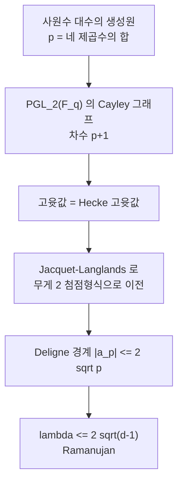

# Ramanujan 그래프의 명시적 구성

# 개요

[Expander 그래프](expander-graphs.md)에서 스펙트럼 간극이 클수록 그래프가 잘 섞인다는 것을 보았다. 그렇다면 간극은 얼마나 커질 수 있는가. Alon–Boppana 정리가 한계를 정한다. $d$ 정규 그래프의 두 번째 절댓값 고윳값 $\lambda$ 는 정점 수가 커질 때

$$
\lambda\ \ge\ 2\sqrt{d-1}-o(1)
$$

을 넘을 수 없이 작아진다. 이 하한을 실제로 달성하는 그래프, 곧

$$
\lambda(G)\ \le\ 2\sqrt{d-1}
$$

를 만족하는 $d$ 정규 그래프를 **Ramanujan 그래프**라 한다. 최적의 확장자다.

존재를 아는 것과 만드는 것은 다른 문제다. Lubotzky, Phillips, Sarnak 과 독립적으로 Margulis 가 1988 년에 명시적 구성을 주었는데, 그 증명이 **Deligne 의 Ramanujan 추측 증명**에 의존한다. 그래프의 고윳값 경계가 자기동형 형식 계수의 경계에서 나오고, 이름도 거기서 왔다. 조합적 대상의 최적성을 정수론의 깊은 정리가 보증하는 드문 구조다.

# 직관

## 왜 $2\sqrt{d-1}$ 인가

$d$ 정규 **무한 나무** $T_d$ 를 생각한다. 그 인접작용소의 스펙트럼 반지름이 정확히 $2\sqrt{d-1}$ 이다. 유한 $d$ 정규 그래프는 국소적으로 나무처럼 보이므로, 정점 수가 커지면 나무의 스펙트럼을 흉내 내야 한다. 나무의 스펙트럼 반지름보다 더 작은 $\lambda$ 는 불가능하다는 것이 Alon–Boppana 의 내용이다.

$$
2\sqrt{d-1}=\text{무한 }d\text{ 정규 나무의 스펙트럼 반지름}
$$

Ramanujan 그래프는 **유한한데도 무한 나무만큼 잘 섞이는** 그래프다. 작은 예들에서 조건을 확인해 보자.

```python
from math import sqrt
graphs = [
    ('K_4',                  3, [3,-1,-1,-1]),
    ('Petersen',             3, [3]+[1]*5+[-2]*4),
    ('K_{3,3}',              3, [3]+[0]*4+[-3]),
    ('Heawood',              3, [3]+[sqrt(2)]*6+[-sqrt(2)]*6+[-3]),
    ('Hoffman-Singleton',    7, [7]+[2]*28+[-3]*21),
]

print('그래프                 d   lambda    2*sqrt(d-1)   Ramanujan')
for name, d, spec in graphs:
    rest = [m for m in spec if abs(abs(m) - d) > 1e-9]   # +-d 는 제외
    lam = max(abs(m) for m in rest)
    b = 2 * sqrt(d - 1)
    print(f'{name:20s} {d:2d}   {lam:6.4f}   {b:8.4f}      {"예" if lam <= b + 1e-9 else "아니오"}')
```

```
그래프                 d   lambda    2*sqrt(d-1)   Ramanujan
K_4                   3   1.0000     2.8284      예
Petersen              3   2.0000     2.8284      예
K_{3,3}               3   0.0000     2.8284      예
Heawood               3   1.4142     2.8284      예
Hoffman-Singleton     7   3.0000     4.8990      예
```

작고 대칭성이 높은 그래프는 대개 Ramanujan 이다. 어려운 것은 **정점 수를 무한히 키우면서** 조건을 유지하는 무한 족을 만드는 일이다. 정점이 많아질수록 $\lambda$ 가 $2\sqrt{d-1}$ 쪽으로 밀려 올라가기 때문이다.

## 정수론이 들어오는 자리

LPS 구성은 그래프를 군의 Cayley 그래프로 만든다. 소수 $p,q$ 를 잡고

$$
G=\mathrm{PGL}_2(\mathbb F_q)\ \text{또는}\ \mathrm{PSL}_2(\mathbb F_q),
\qquad
S=\lbrace p+1\ \text{개의 생성원}\rbrace
$$

으로 두는데, 생성원을 **사원수 대수에서** 가져온다. $p$ 를 네 제곱수의 합으로 쓰는 방법의 개수가 $8(p+1)$ 이라는 Jacobi 의 고전 정리가 정확히 $p+1$ 개의 생성원을 준다.

이 Cayley 그래프의 고윳값은 군의 표현론으로 계산되고, 그 값이 사원수 대수 위 자기동형 형식의 Hecke 고윳값이 된다. Jacquet–Langlands 대응으로 이를 무게 2 첨점형식의 계수로 옮기면 Deligne 의 경계

$$
|a_p|\le 2\sqrt p
$$

가 적용된다. 이 부등식이 그래프 쪽에서 $\lambda\le2\sqrt{d-1}$ 로 읽힌다. $d=p+1$ 이므로 $d-1=p$ 다.



# 정의

## Ramanujan 그래프

연결된 $d$ 정규 그래프 $G$ 의 인접행렬 고윳값을 $d=\mu_1\ge\mu_2\ge\cdots\ge\mu_n$ 이라 하고

$$
\lambda(G)=\max\lbrace|\mu_i|:\ |\mu_i|\ne d\rbrace
$$

라 하자. $\lambda(G)\le2\sqrt{d-1}$ 이면 $G$ 를 **Ramanujan 그래프**라 한다. 이분 그래프에서는 $\mu_n=-d$ 가 자동이므로 이를 제외한다.

## LPS 구성

$p,q$ 를 $4$ 로 나눈 나머지가 1 인 서로 다른 소수라 하자. $p$ 가 $\mathbb F_q$ 에서 제곱잉여인지에 따라 $\mathrm{PSL}_2(\mathbb F_q)$ 또는 $\mathrm{PGL}_2(\mathbb F_q)$ 를 택하고, $x_0^2+x_1^2+x_2^2+x_3^2=p$ 의 해에서 만든 $p+1$ 개의 원소를 생성집합으로 하는 Cayley 그래프 $X^{p,q}$ 를 만든다. 이 그래프는 $(p+1)$ 정규이고 Ramanujan 이다.

# 성질

## 차수가 제한된다

LPS 구성은 $d=p+1$ 이고 곧 **소수에 1 을 더한 차수**에서만 작동한다. 이후 확장으로 소수 거듭제곱에 1 을 더한 차수까지 넓어졌지만, 임의의 $d$ 에 대한 명시적 Ramanujan 족은 오랫동안 미해결이었다.

## Marcus–Spielman–Srivastava

2015 년에 이 제약이 이분 그래프 쪽에서 해결되었다. 모든 $d\ge3$ 에 대해 $d$ 정규 **이분** Ramanujan 그래프의 무한 족이 존재한다.

증명의 방식이 전혀 다르다. 주어진 그래프의 2 겹 덮개를 잘 고르면 $\lambda$ 가 늘지 않음을 보이는데, 가능한 덮개들에 걸친 특성다항식의 평균, 곧 **교대 특성다항식**을 보고 그 근의 최대값이 개별 다항식 가운데 하나의 근보다 크거나 같음을 쓴다. 이를 위해 도입된 것이 **교대 족(interlacing family)** 개념이고, 같은 기법이 Kadison–Singer 문제 해결에도 쓰였다.

결과는 존재성이라 명시적이지 않다. 다항 시간 구성은 이후 연구에서 부분적으로 얻어졌다.

## 무작위 그래프는 거의 Ramanujan 이다

Friedman 의 정리는 무작위 $d$ 정규 그래프가 높은 확률로 $\lambda\le2\sqrt{d-1}+\varepsilon$ 을 만족한다고 말한다. $\varepsilon$ 이 붙는다는 차이가 결정적이다. 무작위로는 **거의** 최적에 닿을 뿐 정확히 최적인 그래프를 얻지는 못하고, 얻었는지 확인할 방법도 없다. 명시적 구성이 필요한 이유다.

# 활용

## 오류정정부호와 통신망

확장성이 좋은 그래프는 지름이 작고 연결이 강하다. 부호 이론의 확장자 부호, 결함에 강한 통신망 설계, 분산 계산의 통신 패턴이 모두 Ramanujan 그래프를 이상적 목표로 삼는다. 간극이 최적이면 같은 차수에서 최선의 견고함을 얻는다.

## 무작위성 추출과 복잡도

확장자 그래프 위의 random walk 는 짧은 시간에 균등분포에 가까워지고, 이 성질이 무작위성을 아끼는 알고리즘의 기반이다. 확장자 걷기 보조정리, 결정론적 증폭, $\mathrm{SL}=\mathrm L$ 정리가 모두 확장성의 정량적 경계를 쓴다. 최적 확장자는 이 경계들의 상수를 최선으로 만든다.

## 암호 해시

초특이 동종사상 그래프도 Ramanujan 이고, 같은 이유로 그렇다. 그 그래프의 인접행렬이 Brandt 행렬이며 고윳값이 Hecke 고윳값이라 Deligne 경계가 적용된다. 거기서는 빠른 섞임이 **경로를 찾기 어렵다**는 암호적 가정으로 쓰인다. 같은 정리가 한쪽에서는 효율의 근거, 다른 쪽에서는 안전성의 근거가 된다.

[^1]: A. Lubotzky, R. Phillips, P. Sarnak, *Ramanujan graphs*, Combinatorica **8** (1988), 261–277. 독립 구성은 G. Margulis (1988). Alon–Boppana 경계는 N. Alon, *Eigenvalues and expanders*, Combinatorica **6** (1986). 교과서는 A. Lubotzky, *Discrete Groups, Expanding Graphs and Invariant Measures* (1994), 그리고 G. Davidoff, P. Sarnak, A. Valette, *Elementary Number Theory, Group Theory and Ramanujan Graphs* (2003). 이분 판본은 A. Marcus, D. Spielman, N. Srivastava, *Interlacing families I*, Ann. of Math. **182** (2015). 무작위 그래프 쪽은 J. Friedman, *A proof of Alon's second eigenvalue conjecture*, Mem. Amer. Math. Soc. (2008). 본문의 스펙트럼 판정은 직접 한 것이다.

# 연관 문서

## 선수지식

- [Expander 그래프와 스펙트럼 간극](expander-graphs.md)

## 더 알아보기

아직 연결한 문서가 없다.

#graph_theory #number_theory #construction
