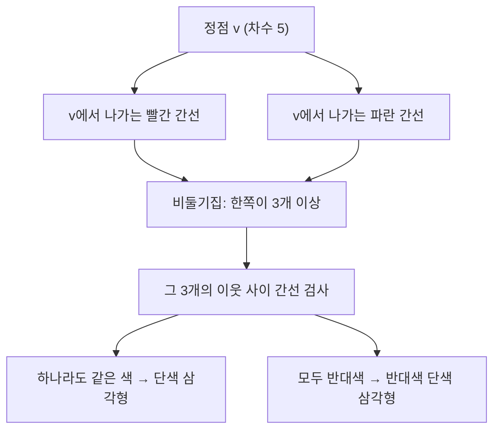

# Ramsey 이론

# 개요

Ramsey 이론은 "충분히 큰 구조는 완전한 무질서일 수 없다"는 명제를 정리들로 구체화한 분야다. 대표적인 진술은 다음이다. 완전그래프의 간선을 두 색으로 아무렇게나 칠해도, 정점 수가 충분히 크면 한 색으로만 칠해진 완전부분그래프가 반드시 생긴다.

[비둘기집 원리](pigeonhole-principle.md)가 "정점을 색칠하면 같은 색 정점이 여럿 있다"는 진술이라면, Ramsey 정리는 이를 간선, 나아가 k원소 부분집합의 색칠로 올린 것이다. 대가는 크기의 폭발이다. 존재를 보장하는 문턱값(Ramsey 수)은 지수적으로 커지며, 작은 값조차 거의 알려져 있지 않다.

이 분야는 Erdős의 확률적 방법(probabilistic method)이 탄생한 무대다. 무작위 색칠이 좋은 부분구조를 피할 확률을 셈으로 눌러 하한을 얻는 기법은 이후 조합론 전반의 표준이 되었다.

# 직관

여섯 사람이 모이면 서로 아는 세 사람 또는 서로 모르는 세 사람이 반드시 있다. 다섯 사람으로는 반례가 있다. 다섯 정점을 오각형으로 놓고 변을 빨강, 대각선을 파랑으로 칠하면 두 색 모두 오각형과 오각별이라 삼각형이 없다.



여섯 명일 때 한 사람 v를 고정하면 v가 그은 간선이 다섯 개다. 두 색이므로 어느 한 색이 세 개 이상이다. 그 세 사람 사이의 세 간선 중 하나라도 그 색이면 v와 함께 단색 삼각형이 되고, 셋 다 다른 색이면 그 세 사람 자체가 단색 삼각형이다. 어느 쪽이든 끝난다.

# 정의

완전그래프 K_n의 간선 집합을 r개의 색으로 칠하는 것을 다음과 같이 쓴다. [그래프](graphs.md)의 간선 집합은 정점의 2원소 부분집합의 집합이다.

$$
c:\binom{V}{2}\longrightarrow\{1,\dots,r\},\qquad |V|=n
$$

부분집합 S가 색 i에 대해 단색(monochromatic)이라는 것은 S 안의 모든 간선이 색 i라는 뜻이다.

## Ramsey 수

$$
R(s_1,\dots,s_r)=\min\Bigl\{\,n\ \Bigm|\ \forall c:\binom{[n]}{2}\to[r],\ \exists\, i,\ \exists\, S,\ |S|=s_i,\ S\text{가 색 }i\text{로 단색}\Bigr\}
$$

두 색 대각선 경우 R(k) = R(k,k)로 줄여 쓴다. 하이퍼그래프 버전은 2원소 부분집합을 k원소 부분집합으로 바꾼 것이다.

$$
R^{(k)}(s_1,\dots,s_r):\quad c:\binom{[n]}{k}\to[r]
$$

## 무한 Ramsey 정리

가산 무한집합의 k원소 부분집합을 유한 개의 색으로 칠하면, 모든 k원소 부분집합이 같은 색인 무한 부분집합이 존재한다[^1].

$$
c:\binom{\mathbb{N}}{k}\to[r]\ \Longrightarrow\ \exists\, M\subseteq\mathbb{N}\ \text{무한},\ c\bigl|_{\binom{M}{k}}\ \text{상수}
$$

# 성질

## R(3,3) = 6

상한은 직관 절의 논증이고, 하한은 K_5의 5-순환 색칠이 반례라는 것이다. 따라서 R(3,3) = 6이다.

## 유한 Ramsey 정리와 점화 상한

Erdős와 Szekeres의 증명이 상한 점화식을 준다.

$$
R(s,t)\ \le\ R(s-1,t)+R(s,t-1)
$$

증명: n = R(s-1,t) + R(s,t-1)개 정점에서 v를 고정한다. 남은 n-1개 정점을 v와의 간선 색에 따라 A(빨강)와 B(파랑)로 나누면 다음이 성립한다.

$$
|A|+|B|=R(s-1,t)+R(s,t-1)-1\ \Longrightarrow\ |A|\ge R(s-1,t)\ \text{또는}\ |B|\ge R(s,t-1)
$$

전자면 A 안에서 크기 s-1의 빨간 단색집합(v를 더해 s개)이나 크기 t의 파란 단색집합이 나온다. 후자는 대칭이다. 양변이 모두 짝수일 때는 부등식을 1만큼 개선할 수 있다.

점화식과 R(s,1) = 1을 이항계수로 풀면 다음 상한을 얻는다.

$$
R(s,t)\le\binom{s+t-2}{s-1},\qquad\text{특히}\quad R(k,k)\le\binom{2k-2}{k-1}\le 4^{k}
$$

## 확률적 하한

Erdős(1947)의 논증이다. K_n의 각 간선을 독립적으로 확률 1/2로 빨강 또는 파랑으로 칠한다. 고정된 k원소 집합이 단색일 확률은 다음과 같다.

$$
P\bigl[S\text{가 단색}\bigr]=2\cdot 2^{-\binom{k}{2}}=2^{1-\binom{k}{2}}
$$

union bound로 단색 k집합이 하나라도 존재할 확률을 누른다.

$$
P\bigl[\exists\text{ 단색 }k\text{집합}\bigr]\ \le\ \binom{n}{k}2^{1-\binom{k}{2}}
$$

이 값이 1보다 작으면 단색 k집합이 없는 색칠이 존재하므로 R(k) > n이다. 계산하면 다음 하한이 나온다[^2].

$$
R(k)\ >\ 2^{k/2}\qquad (k\ge 3)
$$

증명은 그런 색칠을 하나도 제시하지 않는다. 존재만 안다. 같은 품질의 하한을 주는 명시적 구성은 여전히 알려져 있지 않으며, 이 간극이 확률적 방법의 위력과 한계를 동시에 보여준다.

## 알려진 값과 간극

$$
R(3,3)=6,\quad R(3,4)=9,\quad R(3,5)=14,\quad R(4,4)=18,\quad R(3,6)=18,\quad R(4,5)=25
$$

R(5,5)는 미해결이다. 2026년 9월 기준 최선의 범위는 다음과 같다[^3].

$$
43\ \le\ R(5,5)\ \le\ 46
$$

하한 43은 Exoo(1989), 상한 46은 Angeltveit와 McKay다. 대각선 상한은 1935년부터 4^k 형태에 머물렀으나 2023년 Campos, Griffiths, Morris, Sahasrabudhe가 처음으로 지수적 개선을 얻었다[^4].

$$
R(k)\ \le\ (4-\varepsilon)^{k}\quad(\exists\,\varepsilon>0)
$$

파라미터를 최적화하면 3.8^{k+o(k)}까지 내려간다. 하한 쪽도 2^{k/2}의 상수배 개선에 머물러 있어, 성장률의 정확한 지수는 여전히 열려 있다. Erdős의 유명한 일화는 외계인이 R(5,5)를 요구하면 온 인류가 계산해 답할 수 있겠지만 R(6,6)을 요구하면 외계인을 공격하는 편이 낫다는 것이다.

## Schur 정리

양의 정수를 유한 개의 색으로 칠하면 x + y = z를 만족하는 단색 삼중쌍이 존재한다[^5]. 정확히는 임의의 r에 대해 다음 수가 존재한다.

$$
S(r)=\min\bigl\{N\ \bigm|\ \forall c:[N]\to[r],\ \exists\, x,y,z\ \text{같은 색},\ x+y=z\bigr\}
$$

증명은 Ramsey 정리로 환원한다. N = R_r(3) - 1(r색 삼각형 Ramsey 수)이라 하고 색칠 c가 주어지면, 완전그래프 K_{N+1}의 간선 {i, j}에 색 c(|i - j|)를 부여한다. Ramsey 정리로 단색 삼각형 {i < j < k}가 있으니 x = j - i, y = k - j, z = k - i로 두면 x + y = z이고 세 수의 색이 같다. 알려진 Schur 수는 S(1) = 2, S(2) = 5, S(3) = 14, S(4) = 45이고 S(5) = 161은 2017년에 SAT 풀이기로 확정되었다.

Schur 정리는 van der Waerden 정리(색칠하면 단색 등차수열이 생긴다)와 함께 산술적 Ramsey 이론을 이루고, 둘을 포괄하는 Rado 정리가 어떤 선형 방정식계가 "분할 정칙적(partition regular)"인지 완전히 판정한다.

## 무한과 유한의 관계

무한 Ramsey 정리에서 compactness 논증으로 유한 버전을 얻을 수 있다. 반대로 유한 버전들의 모음에서 무한 버전을 얻는 것은 자동이 아니다. Paris–Harrington 정리는 유한 Ramsey 정리의 어떤 강화가 Peano 산술에서 증명 불가능함을 보였고, 이는 [Gödel 불완전성](godel-incompleteness.md)의 자연스러운 구체적 예로 자주 인용된다.

# 활용

## 반례 탐색과 계산

Ramsey 수의 하한은 단색 부분그래프가 없는 명시적 색칠(Ramsey 그래프)을 찾는 문제로, 대칭성을 이용한 순환 그래프 탐색과 SAT 풀이기가 쓰인다. 탐색 공간이 2^(n choose 2)이므로 대칭 축약이 필수다.

```python
from itertools import combinations

def has_mono_clique(n, color, k):
    """모든 k원소 집합을 검사한다. color(i, j) -> 0/1"""
    for S in combinations(range(n), k):
        for c in (0, 1):
            if all(color(i, j) == c for i, j in combinations(S, 2)):
                return True
    return False

# K_5의 5-순환 색칠: 변은 색 0, 대각선은 색 1
def pentagon(i, j):
    return 0 if (i - j) % 5 in (1, 4) else 1

assert not has_mono_clique(5, pentagon, 3)          # R(3,3) > 5
assert all(has_mono_clique(6, c, 3)                 # 6에서는 어떤 색칠도 실패
           for c in [lambda i, j: (i * j) % 2,
                     lambda i, j: (i + j) % 2,
                     lambda i, j: 1 if i + j > 5 else 0])
```

## 다른 분야에서

계산 복잡도에서 Ramsey류 정리는 결정 트리와 통신 복잡도의 하한 논증에 쓰인다. [P 대 NP 문제](p-np.md)와 직접 연결되지는 않지만, 단색 구조를 피하는 구성의 어려움이 명시적 구성 대 무작위 구성의 간극을 보여주는 표준 예다. 기하에서는 Erdős–Szekeres의 볼록 다각형 문제(일반 위치의 점 집합이 충분히 많으면 볼록 n각형을 이루는 n개의 점이 있다)가 하이퍼그래프 Ramsey 정리의 응용이다. 위상적 동역학에서는 무한 Ramsey 정리가 극소 동역학계의 구조 정리로 다시 나타난다.

## 확률적 방법의 유산

union bound로 존재를 증명하는 기법은 [포함배제 원리](inclusion-exclusion.md)의 절단 부등식을 한 줄 쓴 것에 불과하지만, 결정론적 셈으로는 얻기 어려운 결과를 준다. 이 아이디어는 Lovász 국소 보조정리, 알고리즘적 무작위화, 그래프의 확장성(expander) 존재 증명으로 이어지며, [그래프 Laplacian](graph-laplacian.md)과 [Spectral sparsification](spectral-sparsification.md)의 무작위 표본 논증도 같은 계보다.

[^1]: F. P. Ramsey, "On a problem of formal logic", Proc. London Math. Soc. 30 (1930), 264–286. 진술 정리: https://en.wikipedia.org/wiki/Ramsey%27s_theorem
[^2]: P. Erdős, "Some remarks on the theory of graphs", Bull. Amer. Math. Soc. 53 (1947), 292–294.
[^3]: V. Angeltveit and B. D. McKay, "R(5,5) ≤ 46", arXiv:2409.15709. 하한 43은 G. Exoo (1989). 2026년 9월 확인. https://arxiv.org/abs/2409.15709
[^4]: M. Campos, S. Griffiths, R. Morris, J. Sahasrabudhe, "An exponential improvement for diagonal Ramsey", Annals of Mathematics 203 (2026), 869–932. arXiv:2303.09521. https://arxiv.org/abs/2303.09521
[^5]: Schur's theorem (1916)과 Schur 수: https://en.wikipedia.org/wiki/Schur%27s_theorem

# 연관 문서

## 선수지식

- [비둘기집 원리](pigeonhole-principle.md)
- [그래프](graphs.md)

## 더 알아보기

- [확률적 방법](probabilistic-method.md)
