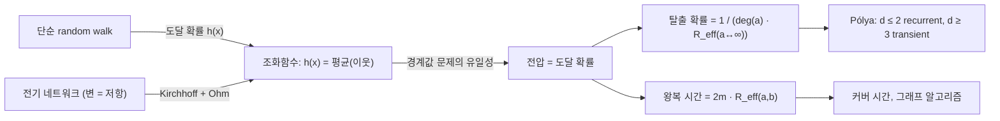

# Random walk와 전기 네트워크

# 개요

정수 격자 위의 단순 random walk 는 매 시각 이웃 중 하나를 균등하게 골라 이동하는 [Markov 연쇄](markov-chains.md)다. 가장 유명한 결과는 Pólya 의 정리다. 1차원과 2차원 격자에서는 걷는 사람이 출발점으로 거의 확실하게 돌아오지만(recurrent), 3차원 이상에서는 양의 확률로 영영 돌아오지 않는다(transient).

이 사실을 계산이 아니라 이해의 대상으로 바꾸는 것이 전기 네트워크 대응이다. 그래프의 각 변을 저항으로 바꾸면, random walk 의 도달 확률은 회로의 전압이 되고 탈출 확률과 기대 왕복 시간은 [유효저항](effective-resistance.md)으로 표현된다. 그러면 recurrence 여부는 "무한 네트워크의 유효저항이 발산하는가"라는 질문이 되고, 저항의 직렬·병렬 법칙과 Rayleigh 단조성 같은 물리적으로 자명한 규칙이 확률 명제의 증명이 된다. Doyle 과 Snell 의 고전적인 서술이 이 관점을 대중화했다[^1].

핵심 다리는 한 문장이다. **도달 확률은 조화함수이고, 회로의 전압도 조화함수이며, 경계값이 같은 조화함수는 유일하다.**

# 직관

1차원에서 시작하자. 대칭 걷기에서 위치 $S_n$ 은 [Martingale](martingales.md)이고, 전형적인 변위는 $\sqrt{n}$ 규모다. 시간이 지나면서 변위는 커지지만 방문할 수 있는 점의 개수는 $\sqrt{n}$ 정도뿐이므로, 걷기는 같은 자리를 반복해서 밟는다. 차원이 올라가면 시각 $n$ 까지 퍼지는 영역의 부피가 $n^{d/2}$ 로 커져, $d \ge 3$ 에서는 걷기가 자기 과거를 만날 여유가 없다. Pólya 정리의 감각적 설명이다. 흔한 표현으로 "취객은 집에 돌아오지만 취한 새는 영영 길을 잃는다".

전기적 직관은 다른 방향에서 같은 결론을 준다. 원점에서 무한대까지의 유효저항이 유한하면 전류가 흐를 수 있고, 걷는 사람도 "무한대로 탈출"할 수 있다. 1차원 격자는 저항이 직렬로 무한히 이어지므로 총 저항이 발산한다. 2차원에서는 원점에서 거리 $n$ 인 껍질까지의 저항이 $\log n$ 규모로 느리게 발산하고, 3차원에서는 병렬 경로가 너무 많아 총 저항이 유한하게 수렴한다. 발산이 recurrence, 수렴이 transience 다.

왜 도달 확률이 전압인가는 평균값 성질로 설명된다. 걷는 사람이 점 $x$ 에 있을 때 목표에 도달할 확률은 이웃들에서의 도달 확률의 평균이다. 전압도 같은 규칙을 따른다(Kirchhoff 법칙에서 유도되는 이산 Laplace 방정식). 두 함수가 같은 경계 조건에서 같은 방정식을 만족하면 최대원리에 의해 같은 함수다.

# 정의

## 격자 위 단순 random walk

$d$ 차원 정수 격자 $\mathbb{Z}^d$ 에서 매 단계 $2d$ 개의 이웃 중 하나를 균등한 확률로 골라 이동하는 과정을 단순 대칭 random walk 라 한다. 독립 증분 $\xi_1, \xi_2, \dots$ 의 합으로

$$
S_n \thickspace=\thickspace S_0 + \sum_{k=1}^{n} \xi_k, \qquad
P(\xi_k = \pm e_i) = \frac{1}{2d} \ \ (i = 1, \dots, d)
$$

로 쓴다. 좌표별 대칭성 때문에 $\mathbb{E}[\xi_k] = 0$ 이고, 따라서 각 좌표는 [Martingale](martingales.md)이다. 일반 그래프 $G = (V, E)$ 위의 단순 random walk 는 현재 정점의 이웃 중 하나를 균등하게 고르는 연쇄이며, 전이확률은 $xy \in E$ 일 때 $P(x, y) = 1/\deg(x)$ 다. 가중 그래프에서는 변 $xy$ 의 컨덕턴스 $c(xy) \gt 0$ 에 비례해 고른다.

$$
P(x, y) \thickspace=\thickspace \frac{c(xy)}{c(x)}, \qquad c(x) = \sum_{y \sim x} c(xy).
$$

이 연쇄는 가역적이며 정지분포는 $\pi(x) \propto c(x)$ 다. 역으로 모든 가역 Markov 연쇄는 어떤 가중 그래프 위의 random walk 로 표현된다. 이것이 전기 네트워크 관점의 적용 범위가 넓은 이유다.

## 재귀성과 일시성

원점으로의 첫 복귀 시각을 $T = \inf\lbrace n \ge 1 : S_n = S_0\rbrace$ 이라 할 때, $P(T \lt\infty) = 1$ 이면 재귀적(recurrent), $P(T \lt\infty) \lt 1$ 이면 일시적(transient)이라 한다. 표준적인 판정 기준은 Green 함수의 발산 여부다.

$$
G(0,0) \thickspace=\thickspace \sum_{n=0}^{\infty} P(S_n = 0 \mid S_0 = 0) \thickspace=\thickspace \frac{1}{1 - P(T \lt\infty)} .
$$

좌변이 발산하면 재귀적, 수렴하면 일시적이다. 재귀 사건의 횟수가 기하분포를 따른다는 사실에서 나온다.

## 조화함수와 경계값 문제

함수 $h : V \to \mathbb{R}$ 가 정점 $x$ 에서

$$
h(x) \thickspace=\thickspace \sum_{y \sim x} P(x, y)\thinspace h(y)
$$

를 만족하면 $x$ 에서 조화적이라 한다. $(P - I)h = 0$ 은 이산 Laplace 방정식이며 연산자 $I - P$ 는 [그래프 Laplacian](graph-laplacian.md)의 정규화된 형태다. 유한 그래프에서 경계집합 $B \subseteq V$ 위의 값이 주어지면, $V \setminus B$ 에서 조화적이고 $B$ 에서 주어진 값을 갖는 함수가 유일하게 존재한다. 유일성은 최대원리에서 나온다. 두 해의 차는 $V \setminus B$ 에서 조화적이고 경계에서 0 인데, 조화함수는 내부에서 최대·최소를 가질 수 없으므로 항등적으로 0 이다.

**핵심 사실.** 서로 다른 두 목표 집합 $A$ , $\mathbb Z$ 에 대해 도달 확률

$$
h(x) \thickspace=\thickspace P_x\big(\text{walk hits } A \text{ before } Z\big)
$$

는 $A$ 에서 1, $\mathbb Z$ 에서 0 의 경계값을 갖고 그 밖에서 조화적이다. 첫 걸음에 따라 조건화하면 곧바로 평균값 성질이 나오기 때문이다.

## 전기 네트워크 사전

변 $xy$ 에 저항 $r(xy)=1/c(xy)$ 를 배치한 회로를 생각한다. 전압 $v$ 와 전류 $i$ 는 Ohm 법칙과 Kirchhoff 전류 법칙을 따른다.

$$
i(xy) \thickspace=\thickspace \frac{v(x) - v(y)}{r(xy)}, \qquad
\sum_{y \sim x} i(xy) \thickspace=\thickspace 0 \quad (x \notin \lbrace a, z\rbrace).
$$

두 법칙을 합치면 전압이 전류원·배출점 밖에서 조화적임이 나온다. 그러므로 $v(a)=1$ , $v(z)=0$ 인 전압은 곧 $a$ 를 $z$ 보다 먼저 방문할 확률이다. 유효저항은 단자 사이 전압차를 총 전류로 나눈 값이다.

$$
R_{\mathrm{eff}}(a, z) \thickspace=\thickspace \frac{v(a) - v(z)}{\sum_{y \sim a} i(ay)} .
$$

직렬 연결에서 저항이 더해지고 병렬 연결에서 컨덕턴스가 더해진다는 규칙, 그리고 변의 저항을 키우면 유효저항이 줄지 않는다는 Rayleigh 단조성이 계산의 전부다. 자세한 변분적 성격(Thomson 원리, Dirichlet 원리)은 [유효저항](effective-resistance.md)에서 다룬다.

# 성질

## 탈출 확률과 유효저항

**정리.** 정점 $a$ 에서 출발한 walk 가 $a$ 로 돌아오기 전에 집합 $\mathbb Z$ 에 도달할 확률은

$$
P_a(\tau_Z \lt\tau_a^+) \thickspace=\thickspace \frac{1}{c(a) \thinspace R_{\mathrm{eff}}(a, Z)} .
$$

*증명 스케치.* $v(a) = 1$ 이고 $v|_Z = 0$ 인 전압을 잡는다. $a$ 에서 흘러 나가는 총 전류는 $\sum_y c(ay)(1 - v(y))$ 이고, 확률적으로 이는 첫 걸음 뒤 $a$ 로 돌아오기 전에 $Z$ 에 도달할 확률을 $c(a)$ 에 곱한 값과 같다. 유효저항의 정의에 대입하면 등식이 된다.

무한 그래프에서는 $Z$ 를 원점에서 거리 $n$ 인 껍질로 잡고 $n \to \infty$ 극한을 취해 $R_{\mathrm{eff}}(a, \infty)$ 를 정의한다. 위 식에서 즉시 다음 판정이 나온다.

$$
\text{walk 가 recurrent} \iff R_{\mathrm{eff}}(a, \infty) = \infty .
$$

## Pólya 정리

**정리 (Pólya, 1921).** $\mathbb{Z}^d$ 의 단순 대칭 random walk 는 $d = 1, 2$ 에서 recurrent 이고 $d \ge 3$ 에서 transient 다.

*해석적 증명 스케치.* 국소 중심극한정리에 의해 $P(S_{2n} = 0) \asymp c_d n^{-d/2}$ 이므로 Green 함수 $\sum_n P(S_{2n} = 0)$ 은 $d \le 2$ 에서 발산하고 $d \ge 3$ 에서 수렴한다. [중심극한정리](central-limit-theorem.md)가 주는 $\sqrt{n}$ 규모의 확산이 그대로 지수 $d/2$ 로 나타난다.

*전기적 증명 스케치.* 단조성 논증 두 개면 충분하다.

- $d = 2$ 인 경우. 원점 중심의 정사각형 껍질 위의 정점들을 단락(short-circuit)시켜도 Rayleigh 단조성에 의해 유효저항은 줄어들 뿐이다. 껍질 $n$ 과 $n+1$ 사이에는 약 $8n$ 개의 변이 병렬로 있으므로 저항이 $\asymp 1/n$ 이고, 총합 $\sum 1/n$ 은 발산한다. 따라서 원래 네트워크의 저항도 발산하고 recurrent 다.
- $d = 3$ 인 경우. 격자 안에 서로 변을 공유하지 않는 무한 경로들의 다발(Nash-Williams 의 쌍대인 흐름 구성)을 심는다. 변을 지우면 저항이 커질 뿐이므로, 저항이 유한한 부분 네트워크를 하나라도 찾으면 원래 네트워크의 저항도 유한하다. 3차원에서는 유한 에너지 흐름이 존재해 $R_{\mathrm{eff}}(0, \infty) \lt\infty$ 이고 transient 다.

전기적 증명의 장점은 격자 구조에 거의 의존하지 않는다는 점이다. 예컨대 $\mathbb Z^3$ 의 임의의 부분그래프가 $\mathbb Z^3$ 전체를 포함하면 여전히 transient 이고, $\mathbb Z^2$ 를 포함하는 평면 격자는 recurrent 하다. 이런 비교 정리는 해석적 계산으로는 얻기 어렵다[^2].

## 왕복 시간 공식

유한 연결 그래프에서 $a$ 에서 $b$ 로 갔다가 돌아오는 기대 시간(commute time)은 유효저항에 정비례한다.

$$
\mathbb{E}_a[\tau_b] + \mathbb{E}_b[\tau_a] \thickspace=\thickspace 2 |E| \cdot R_{\mathrm{eff}}(a, b)
$$

(가중 그래프에서는 $2\lvert E \rvert$ 자리에 총 컨덕턴스 $\sum_x c(x)$ 가 들어간다). 증명은 도달 시간을 조화함수 방정식의 해로 쓰고 정지분포에 대한 가역성을 이용한다. 이 항등식은 세 가지 이유로 유용하다. 첫째, 저항은 직렬·병렬 규칙으로 계산할 수 있으므로 도달 시간 계산이 회로 계산으로 바뀐다. 둘째, 저항은 거리 함수(resistance metric)이므로 도달 시간에 삼각부등식 같은 구조가 생긴다. 셋째, 커버 시간(모든 정점을 방문하는 기대 시간)이 $R_{\mathrm{eff}}$ 의 최대값과 $\lvert E \rvert$ 로 위아래에서 묶인다.

예로 $n$ 개 정점의 경로 그래프에서 양 끝점 사이의 저항은 $n - 1$ 이고 변의 개수는 $n - 1$ 이므로 왕복 시간은 $2(n-1)^2$ 다. 완전그래프 $K_n$ 에서는 저항이 $2/n$ 이고 변이 $n(n-1)/2$ 개이므로 왕복 시간이 대략 $2n$ 이다. 1차원 걷기가 느리고 완전그래프 걷기가 빠르다는 직관과 일치한다.

## 관련 구조

- 도달 확률이 조화함수라는 사실은 연속 세계의 Brownian motion 과 Laplace 방정식의 관계(Dirichlet 문제의 확률적 해법)의 이산판이다.
- $h(X_n)$ 이 martingale 이라는 관찰과 선택적 정지 정리를 쓰면 도달 확률 공식이 즉시 나온다. [Martingale](martingales.md)과 이 문서는 같은 원리를 서로 다른 언어로 쓴 것이다.
- 유효저항은 [그래프 Laplacian](graph-laplacian.md)의 유사역행렬로 표현되므로, 스펙트럼 이론과 확률 이론이 만나는 지점이기도 하다.

# 활용

## 알고리즘과 그래프 이론

- **연결성 판정.** 무향 그래프의 $s\text{-}t$ 연결성은 random walk 를 $O(n^3)$ 단계 돌리는 것으로 로그 공간에서 판정할 수 있다(Aleliunas 등의 커버 시간 경계). 커버 시간의 상한이 유효저항으로 표현되므로 분석이 회로 계산이 된다.
- **희소화와 표본추출.** 변을 유효저항에 비례한 확률로 뽑으면 스펙트럼적으로 동등한 희소 그래프를 얻는다. 이 결과의 오차 분석에는 [집중부등식](concentration-inequalities.md)의 행렬 버전이 쓰인다.
- **추천과 클러스터링.** commute time 을 정점 사이 유사도로 쓰는 방법은 위 항등식에 근거한다. 다만 큰 그래프에서는 commute time 이 차수에만 의존하는 값으로 퇴화하는 현상이 알려져 있어 보정이 필요하다.
- **MCMC.** 가역 연쇄의 혼합 속도 분석에서 전기적 양(저항, 흐름)은 conductance 경계와 함께 표준 도구다.

[^1]: Peter G. Doyle and J. Laurie Snell, Random Walks and Electric Networks, https://arxiv.org/abs/math/0001057

[^2]: Russell Lyons and Yuval Peres, Probability on Trees and Networks, Chapters 2 and 9, https://rdlyons.pages.iu.edu/prbtree/book.pdf

# 연관 문서

## 선수지식

- [Markov 연쇄](markov-chains.md)
- [유효저항](effective-resistance.md)

## 더 알아보기

- [초특이 동종사상 그래프와 SIDH](supersingular-isogeny-graphs.md)

#probability #graph_theory
