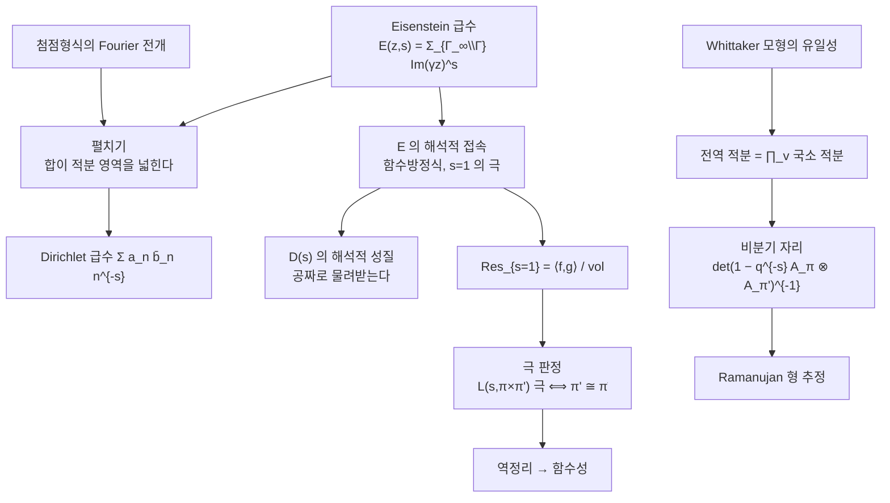

# Rankin–Selberg 적분

# 개요

[Godement–Jacquet](godement-jacquet.md)이 `\mathrm{GL}_n` 의 표준 `L` 함수를 다룰 수 있었던 것은 `\mathrm{GL}_n` 을 담는 벡터공간 `M_n` 이 있었기 때문이다. 그런데 두 자기동형 표현의 곱

$$
L(s,\pi\times\pi'),\qquad \pi \text{ 는 } \mathrm{GL}_n,\quad \pi' \text{ 는 } \mathrm{GL}_m
$$

에는 그런 벡터공간이 없다. 차수가 `nm` 인 이 `L` 함수는 Langlands 강령에서 가장 자주 쓰이는 도구인데, 정의만 해서는 해석적 성질을 하나도 모른다.

Rankin 과 Selberg 가 1939–40 년에 각각 발견한 방법은 전혀 다른 착상을 쓴다. 두 첨점형식의 곱에 **Eisenstein 급수**를 곱해 적분하는 것이다.

$$
I(s)=\int_{\mathrm{SL}_2(\mathbb Z)\backslash\mathbb H}
f(z)\,\overline{g(z)}\,y^{k}\,E(z,s)\,\frac{dx\,dy}{y^2}
$$

`E(z,s)=\sum_{\Gamma_\infty\backslash\Gamma}\mathrm{Im}(\gamma z)^s` 는 잉여류에 대한 합이다. 이 합을 적분 영역으로 흡수하면 — 이것을 **펼치기**(unfolding)라 한다 — 기본영역 위의 적분이 띠 `\Gamma_\infty\backslash\mathbb H` 위의 적분이 되고, Fourier 전개를 넣으면 Dirichlet 급수가 그대로 떨어진다.

$$
I(s)\;=\;(\Gamma \text{ 인자})\cdot\sum_{n\ge1}\frac{a_n\overline{b_n}}{n^{s+k-1}}
$$

이 등식의 값은 오른쪽이 아니라 왼쪽에 있다. 왼쪽은 `E(z,s)` 의 해석적 접속과 함수방정식을 그대로 물려받는다. Eisenstein 급수의 해석적 성질은 이미 알려져 있으므로, 아무것도 모르던 Dirichlet 급수가 공짜로 해석적 접속과 함수방정식과 극의 위치를 얻는다.

Jacquet–Piatetski-Shapiro–Shalika 가 1983 년에 이것을 `\mathrm{GL}_n\times\mathrm{GL}_m` 으로 올렸다. 고전적 Fourier 계수 자리에는 **Whittaker 함수**가 들어가고, 그 유일성이 전역 적분을 국소 적분의 곱으로 쪼갠다. 비분기 자리의 국소 적분을 [Satake 매개변수](satake-isomorphism.md)로 계산하면 정확히

$$
L(s,\pi_v\times\pi'_v)=\det\bigl(1-q^{-s}A_{\pi_v}\otimes A_{\pi'_v}\bigr)^{-1}
=\prod_{i=1}^{n}\prod_{j=1}^{m}\bigl(1-\alpha_i\beta_j\,q^{-s}\bigr)^{-1}
$$

가 나온다. 쌍대군의 텐서곱 표현에 붙은 `L` 함수가 적분 하나에서 나오는 것이다.

# 직관

## 펼치기라는 한 수

`E(z,s)` 의 정의가 `\Gamma_\infty\backslash\Gamma` 위의 합이라는 점이 전부다. 피적분함수의 나머지 부분 `f\bar gy^k` 는 `\Gamma` 불변이므로

$$
\int_{\Gamma\backslash\mathbb H}F(z)\sum_{\gamma\in\Gamma_\infty\backslash\Gamma}
\mathrm{Im}(\gamma z)^s\,d\mu
=\int_{\Gamma_\infty\backslash\mathbb H}F(z)\,y^s\,d\mu
$$

가 된다. 합이 영역을 넓히는 데 쓰이고 사라진다. `\Gamma_\infty` 는 `z\mapsto z+1` 이 생성하므로 오른쪽 영역은 그냥 띠 `0\le x<1`, `y>0` 이고, `x` 적분은 Fourier 계수의 직교성

$$
\int_0^1e^{2\pi i(n-m)x}\,dx=\delta_{nm}
$$

을 쓴다. 남는 것은 `\sum_n a_n\overline{b_n}` 에 `\int_0^\infty y^{s+k-2}e^{-4\pi ny}dy` 를 곱한 것, 곧 Dirichlet 급수와 감마 인자다.

`L` 함수를 직접 다루는 대신 그 `L` 함수를 값으로 갖는 적분을 만들고, 적분의 다른 표현에서 성질을 읽는다. 이 전략은 [Tate 의 논문](tate-thesis.md)과 Godement–Jacquet 에서도 같다. 다른 점은 대칭성의 출처다. Tate 와 Godement–Jacquet 에서는 Poisson 합공식이 함수방정식을 주고, 여기서는 Eisenstein 급수가 준다.

## 극이 내적을 본다

`E(z,s)` 는 `s=1` 에서 단순극을 갖고 유수가 상수 `3/\pi=1/\mathrm{vol}(\Gamma\backslash\mathbb H)` 다. 그러므로 `I(s)` 의 `s=1` 에서의 유수는

$$
\mathrm{Res}_{s=1}I(s)=\frac1{\mathrm{vol}}\int_{\Gamma\backslash\mathbb H}f\bar gy^k\,d\mu
=\frac{\langle f,g\rangle}{\mathrm{vol}}
$$

곧 **Petersson 내적**이다. `f=g` 면 양수라 극이 실제로 있고, `f\perp g` 면 극이 사라진다.

아델판에서 이 관찰은 다음이 된다.

> `L(s,\pi\times\pi')` 가 `s=1` 에서 극을 가진다 `\iff` `\pi'\cong\tilde\pi`

이 한 줄이 방법의 가장 쓸모 있는 산물이다. 해석적 성질(극의 유무)이 표현론적 성질(동형 여부)을 판정한다. 강한 중복도 1, `L` 함수의 `\mathrm{Re}(s)=1` 비소멸, 역정리의 증명이 모두 이 판정에 기댄다.

## GL_n 에는 Fourier 계수가 없다

`n\ge3` 에서 첨점형식의 Fourier 전개는 수열 `\{a_n\}` 이 아니다. 극대 멱단근 `N` 이 아벨군이 아니라서, 전개의 계수 자리에 수가 아니라 함수가 온다. 그 함수가 **Whittaker 함수**다.

$$
W_\varphi(g)=\int_{N(\mathbb Q)\backslash N(\mathbb A)}\varphi(ng)\,\psi^{-1}(n)\,dn
$$

그리고 첨점형식의 전개는 `\mathrm{GL}_{n-1}` 의 유리점에 대한 합이 된다.

$$
\varphi(g)=\sum_{\gamma\in N_{n-1}(\mathbb Q)\backslash\mathrm{GL}_{n-1}(\mathbb Q)}
W_\varphi\!\left(\begin{pmatrix}\gamma&\\&1\end{pmatrix}g\right)
$$

이 합이 펼치기의 재료다. `\mathrm{GL}_{n-1}` 위의 합이 있으므로 적분 영역이 `\mathrm{GL}_{n-1}` 전체로 펼쳐지고, 남은 것이 Whittaker 함수 두 개의 곱의 적분이다.

## 왜 Euler 곱으로 쪼개지는가

전역 적분이 국소 적분의 곱이 되는 이유는 오직 하나, **Whittaker 모형의 유일성**이다.

국소적으로 `\mathrm{Hom}_{N}(\pi_v,\psi_v)` 가 많아야 1 차원이라는 정리(Shalika, Gelfand–Kazhdan)가 있다. 그래서 전역 Whittaker 함수가 국소 Whittaker 함수들의 곱으로 쪼개진다.

$$
W_\varphi(g)=\prod_v W_v(g_v)
$$

적분의 피적분함수가 곱이고 측도가 곱이므로 적분도 곱이다. 반대로 Whittaker 모형이 유일하지 않은 군에서는 적분이 Euler 곱이 되지 않고, 이 방법이 통하지 않는다. `\mathrm{GL}_n` 에서 Rankin–Selberg 가 그토록 잘 작동하는 이유가 이 유일성이다.



# 정의

## 고전적 적분

`f\in S_k(\mathrm{SL}_2(\mathbb Z))`, `g\in S_l(\mathrm{SL}_2(\mathbb Z))` 의 Fourier 전개를 `f=\sum a_nq^n`, `g=\sum b_nq^n` 이라 하자. 실해석적 Eisenstein 급수는

$$
E(z,s)=\sum_{\gamma\in\Gamma_\infty\backslash\mathrm{SL}_2(\mathbb Z)}\mathrm{Im}(\gamma z)^s
=\tfrac12\sum_{\gcd(c,d)=1}\frac{y^s}{\lvert cz+d\rvert^{2s}}
$$

이고 `\mathrm{Re}(s)>1` 에서 수렴한다. `k=l` 일 때 **Rankin–Selberg 적분**은

$$
I(s)=\int_{\mathrm{SL}_2(\mathbb Z)\backslash\mathbb H}f(z)\overline{g(z)}\,y^{k}E(z,s)\,\frac{dx\,dy}{y^2}
=\frac{\Gamma(s+k-1)}{(4\pi)^{s+k-1}}\sum_{n\ge1}\frac{a_n\overline{b_n}}{n^{s+k-1}}
$$

다. `E(z,s)` 는 `s\in\mathbb C` 전체로 유리형 접속되고 `\xi(2s)E(z,s)` 가 `s\mapsto1-s` 에서 함수방정식을 가지며, `s=0,1` 에서만 단순극을 갖는다.

## Whittaker 함수

`\psi:\mathbb Q\backslash\mathbb A\to\mathbb C^\times` 를 자명하지 않은 가법 지표, `N_n` 을 `\mathrm{GL}_n` 의 상삼각 멱단군이라 하고

$$
\psi_N(n)=\psi\Bigl(\sum_{i=1}^{n-1}n_{i,i+1}\Bigr)
$$

로 둔다. 첨점형식 `\varphi` 의 Whittaker 함수는 위 개요의 적분이다. `\pi=\otimes_v\pi_v` 가 첨점 표현이면 각 자리에서 `\psi_v` 형 Whittaker 모형이 유일하게 존재하고, `W_\varphi=\prod_vW_v` 로 분해된다.

## GL_n × GL_m 적분

`m<n` 이고 `\pi`, `\pi'` 가 각각 `\mathrm{GL}_n(\mathbb A)`, `\mathrm{GL}_m(\mathbb A)` 의 첨점 표현이라 하자. `m=n-1` 이면

$$
\Psi(s,W,W')=\int_{N_m(\mathbb A)\backslash\mathrm{GL}_m(\mathbb A)}
W\!\left(\begin{pmatrix}g&\\&1\end{pmatrix}\right)W'(g)\,
\lvert\det g\rvert^{\,s-\frac12}\,dg
$$

이고 `m<n-1` 이면 가운데에 멱단 적분이 더 붙는다.

`m=n` 일 때는 Eisenstein 급수가 필요하다. Schwartz 함수 `\Phi\in\mathcal S(\mathbb A^n)` 에서 만든 Eisenstein 급수 `E(g,s;\Phi)` 에 대해

$$
I(s,\varphi,\varphi',\Phi)=\int_{Z(\mathbb A)\mathrm{GL}_n(\mathbb Q)\backslash\mathrm{GL}_n(\mathbb A)}
\varphi(g)\,\varphi'(g)\,E(g,s;\Phi)\,dg
$$

다. 고전적 적분의 `E(z,s)` 가 그대로 이 자리에 있다.

## 국소 인자와 전역 L 함수

각 자리에서 `\Psi_v(s,W_v,W'_v)` 는 `q_v^{-s}` 의 유리함수이고, 이들이 생성하는 분수 아이디얼의 생성원으로 국소 `L` 인자 `L(s,\pi_v\times\pi'_v)` 를 정의한다. 비분기 자리에서는 Satake 매개변수 `(\alpha_i)`, `(\beta_j)` 로

$$
L(s,\pi_v\times\pi'_v)=\prod_{i,j}\bigl(1-\alpha_i\beta_jq_v^{-s}\bigr)^{-1}
$$

이고, 전역 `L` 함수는 이들의 곱 `L(s,\pi\times\pi')=\prod_vL(s,\pi_v\times\pi'_v)` 다.

# 성질

> **정리 (Jacquet–Piatetski-Shapiro–Shalika, 1983).** `\pi`, `\pi'` 가 `\mathrm{GL}_n`, `\mathrm{GL}_m` 의 첨점 자기동형 표현이면 `L(s,\pi\times\pi')` 는 `\mathbb C` 전체로 유리형 접속되고, 완비 `L` 함수가
> $$
> \Lambda(s,\pi\times\pi')=\varepsilon(s,\pi\times\pi')\,\Lambda(1-s,\tilde\pi\times\tilde\pi')
> $$
> 를 만족한다. `\pi'\not\cong\tilde\pi\otimes\lvert\cdot\rvert^{it}` 이면 정함수이고, `\pi'\cong\tilde\pi` 인 경우에만 `s=0,1` 에 단순극이 있다.[^1]

## 극 판정과 그 따름정리

극 판정에서 바로 나오는 것들이다.

- **강한 중복도 1.** 거의 모든 자리에서 `\pi_v\cong\pi'_v` 이면 `\pi\cong\pi'` 다. `L(s,\pi\times\tilde\pi')` 의 극을 보면 된다.
- **`\mathrm{Re}(s)=1` 비소멸.** `L(1+it,\pi)\ne0` 이다. `\pi\times\tilde\pi` 의 `L` 함수가 계수가 음이 아니고 `s=1` 에 극을 가진다는 사실을 [소수 정리](prime-number-theorem.md)의 `\zeta` 논법과 똑같이 쓴다.
- **Ramanujan 형 추정.** `L(s,\pi\times\tilde\pi)` 가 `\mathrm{Re}(s)>1` 에서 수렴한다는 것만으로 Satake 매개변수가 `\lvert\alpha_i\rvert<q^{1/2}` 로 갇힌다(Jacquet–Shalika). 더 정교한 논법이 `\lvert\alpha_i\rvert\le q^{1/2-1/(n^2+1)}` 를 준다(Luo–Rudnick–Sarnak). 추측이 요구하는 `\lvert\alpha_i\rvert=1` 에는 못 미치지만, `L` 함수를 다루는 데 필요한 대부분의 상황에서 충분하다.

## 나이브한 합과 진짜 L 함수의 차이

고전적 적분이 준 것은 `\sum_na_n\overline{b_n}n^{-s}` 인데, 이것은 Euler 곱이 아니다. Hecke 고유형식의 계수가 곱셈적이어도 `a_nb_n` 의 국소 인자가 2 차가 아니기 때문이다. 국소 수준에서 정확한 관계는 다음 항등식이다.

$$
\sum_{m\ge0}h_m(\alpha,\beta)\,h_m(\alpha',\beta')\,x^m
=\frac{1-\alpha\beta\alpha'\beta'x^2}{\prod_{i,j}(1-\alpha_i\alpha'_jx)}
$$

`h_m` 은 완전 동차 대칭 다항식이고 `h_m(\alpha,\beta)` 가 정규화된 `a_{p^m}` 이다. 분자의 `x^2` 항이 보정이고, 전역적으로는 `\zeta(2s)` 의 역수로 나타난다.

```python
import random

def h(m, a, b):
    return sum(a**k * b**(m-k) for k in range(m+1))

random.seed(11)
for trial in range(3):
    rc = lambda: complex(random.uniform(-1, 1), random.uniform(-1, 1))
    al, be, ap, bp = rc(), rc(), rc(), rc()
    x = 0.13
    lhs = sum(h(m, al, be) * h(m, ap, bp) * x**m for m in range(400))
    rhs = (1 - al*be*ap*bp*x*x) / ((1-al*ap*x)*(1-al*bp*x)*(1-be*ap*x)*(1-be*bp*x))
    print(f"trial {trial}: |LHS-RHS| = {abs(lhs-rhs):.3e}")

# trial 0: |LHS-RHS| = 5.204e-18
# trial 1: |LHS-RHS| = 6.072e-18
# trial 2: |LHS-RHS| = 2.289e-16
```

`\Delta` 두 개를 곱한 경우 `\alpha\beta=\alpha'\beta'=1` 이므로 보정이 `1-x^2` 이고, `\mathrm{GL}_2\times\mathrm{GL}_2` 의 `L` 함수가 `\zeta\cdot L(\mathrm{Sym}^2)` 으로 쪼개지므로 다음 고전적 항등식이 된다.

$$
\sum_{n\ge1}\frac{\tau(n)^2}{n^{s}}
=\frac{\zeta(s-11)\,L(s,\mathrm{Sym}^2\Delta)}{\zeta(2s-22)}
$$

여기서 `L(s,\mathrm{Sym}^2\Delta)` 의 국소 인자는 `\alpha_p^2,\;1,\;\beta_p^2` 에서 오는 3 차식이고, `\alpha_p^2+\beta_p^2=\tau(p)^2/p^{11}-2` 이므로 계수가 전부 정수다.

$$
L_p(s,\mathrm{Sym}^2\Delta)^{-1}
=(1-p^{11}x)\bigl(1-(\tau(p)^2-2p^{11})x+p^{22}x^2\bigr),\qquad x=p^{-s}
$$

계수가 정수이므로 항등식을 Dirichlet 계수 수준에서 **정확히** 확인할 수 있다.

```python
N = 3000
c = [0]*(N+1); c[0] = 1                      # Δ = q ∏ (1-q^n)^24
for n in range(1, N+1):
    for _ in range(24):
        new = c[:]
        for k in range(n, N+1): new[k] -= c[k-n]
        c = new
tau = [0]*(N+1)
for k in range(N): tau[k+1] = c[k]

sieve = [True]*(N+1); sieve[0] = sieve[1] = False
for i in range(2, int(N**.5)+1):
    if sieve[i]:
        for j in range(i*i, N+1, i): sieve[j] = False
PR = [i for i in range(N+1) if sieve[i]]

def dmul(a, b):                              # Dirichlet 급수의 곱
    r = [0]*(N+1)
    for i in range(1, N+1):
        if a[i] == 0: continue
        for j in range(1, N//i + 1):
            if b[j]: r[i*j] += a[i]*b[j]
    return r

sym2 = [0]*(N+1); sym2[1] = 1                # L(s, Sym^2 Δ) 의 Euler 곱
for p in PR:
    A, B, C = p**11, tau[p]**2 - 2*p**11, p**22
    d = [1, -(A+B), C + A*B, -A*C]           # 국소 분모 다항식
    lim, pk = 0, 1
    while pk*p <= N: pk *= p; lim += 1
    co = [0]*(lim+1); co[0] = 1
    for m in range(1, lim+1):                # 1/d 의 계수 점화식
        co[m] = -sum(d[j]*co[m-j] for j in range(1, min(3, m)+1))
    loc, pk = [0]*(N+1), 1
    for m in range(lim+1): loc[pk] = co[m]; pk *= p
    sym2 = dmul(sym2, loc)

z11 = [n**11 for n in range(N+1)]; z11[0] = 0           # ζ(s-11)
mu = [1]*(N+1)
for p in PR:
    for j in range(p, N+1, p): mu[j] *= -1
    for j in range(p*p, N+1, p*p): mu[j] = 0
iz = [0]*(N+1); k = 1                                    # 1/ζ(2s-22)
while k*k <= N: iz[k*k] = mu[k]*k**22; k += 1

rhs = dmul(dmul(z11, sym2), iz)
bad = [n for n in range(1, N+1) if rhs[n] != tau[n]**2]
print(f"Dirichlet 계수 일치 n<={N} : {not bad}  (불일치 {len(bad)} 개)")
print("n=1..6 :", [(n, tau[n]**2, rhs[n]) for n in range(1, 7)])

# Dirichlet 계수 일치 n<=3000 : True  (불일치 0 개)
# n=1..6 : [(1, 1, 1), (2, 576, 576), (3, 63504, 63504), (4, 2166784, 2166784), (5, 23328900, 23328900), (6, 36578304, 36578304)]
```

정수 연산만으로 3000 개 계수가 전부 맞는다. Rankin 이 1939 년에 이 항등식에서 `\tau(n)=O(n^{29/5})` 를 얻었다. Hecke 의 자명한 추정 `O(n^6)` 을 처음으로 넘은 결과이고, Deligne 이 1974 년에 `O(n^{11/2+\epsilon})` 로 끝내기 전까지의 기록 경쟁이 전부 이 `L` 함수의 해석적 성질을 개선하는 일이었다.

## 두 가지 방법의 비교

자기동형 `L` 함수의 해석적 성질을 얻는 길은 현재 두 갈래다.

| | 적분 표현 | Langlands–Shahidi |
|---|---|---|
| 대상 | `\mathrm{GL}_n` 표준, `\mathrm{GL}_n\times\mathrm{GL}_m` | 포물 부분군의 Levi 에서 나오는 `L` 함수 |
| 원리 | 펼치기, Whittaker 유일성 | Eisenstein 급수의 상수항과 얽힘 작용소 |
| 강점 | 무조건적, 국소 인자가 명시적 | 다루는 `L` 함수의 범위가 넓다 |
| 약점 | 적절한 적분을 찾아야 한다 | 얽힘 작용소의 정규화가 어렵다 |

두 방법이 같은 `L` 함수를 다룰 때 결과가 일치한다는 것(국소 인자의 일치)은 그 자체로 정리다.

# 활용

## 역정리와 함수성

**역정리**(converse theorem)는 Hecke 의 고전적 역정리를 `\mathrm{GL}_n` 으로 올린 것이다.

> `\Pi=\otimes\Pi_v` 가 `\mathrm{GL}_n(\mathbb A)` 의 기약 허용 표현이고, `m\le n-2` 인 모든 `\mathrm{GL}_m` 첨점 표현 `\tau` 에 대해 `L(s,\Pi\times\tau)` 가 "좋으면"(정함수, 수직 띠에서 유계, 함수방정식) `\Pi` 는 자기동형이다.[^2]

이것이 함수성을 증명하는 표준 전략이다. 올리려는 표현 `\Pi` 를 자리마다 국소적으로 정의해 놓고, 그것이 전역적으로 자기동형이라는 것을 직접 보이는 대신 **모든 꼬임 `L` 함수가 좋다**는 것만 보인다. 꼬임 `L` 함수의 해석적 성질은 Rankin–Selberg 나 Langlands–Shahidi 로 얻는다.

실제 성과가 `\mathrm{GL}_2` 의 대칭 거듭제곱 올림이다.

$$
\mathrm{Sym}^3:\mathrm{GL}_2(\mathbb C)\to\mathrm{GL}_4(\mathbb C),
\qquad
\mathrm{Sym}^4:\mathrm{GL}_2(\mathbb C)\to\mathrm{GL}_5(\mathbb C)
$$

Kim 과 Shahidi 가 2002 년에 `\mathrm{Sym}^3`, Kim 이 `\mathrm{Sym}^4` 의 자기동형성을 역정리로 증명했다. [Sato–Tate](sato-tate.md)의 초기 부분 결과와 Ramanujan 추측을 향한 최선의 추정 `\lvert\alpha_p\rvert\le p^{7/64}` 가 여기서 나온다. 모든 `m` 에 대한 `\mathrm{Sym}^m` 은 훨씬 뒤에 Newton–Thorne 이 전혀 다른 방법(모듈러성 올리기)으로 해결했다.

## 해석적 정수론의 도구

`\mathrm{GL}_n\times\mathrm{GL}_m` 의 `L` 함수는 자기동형 형식의 해석적 연구에서 기본 재료다.

- **적률 계산.** `\sum_{n\le X}\lvert a_n\rvert^2` 의 점근이 `L(s,\pi\times\tilde\pi)` 의 `s=1` 극에서 나온다. 계수의 평균 크기를 아는 유일한 일반적 수단이다.
- **부볼록 추정.** `L(1/2+it,\pi)` 의 크기를 볼록성 한계보다 좋게 잡는 문제에서 amplification 기법이 `\pi\times\tilde\pi` 의 `L` 함수를 증폭기로 쓴다.
- **양자 유일 에르고딕성.** Lindenstrauss 와 Soundararajan–Holowinsky 의 증명에서 `L(s,\mathrm{Sym}^2\pi)` 의 `s=1` 근처 행동이 핵심 입력이다.

## 어디로 이어지는가

- **Langlands 함수성.** 역정리의 입력이 Rankin–Selberg 적분이고, 함수성의 사례 증명은 거의 전부 이 구조다.
- **더 일반적인 군.** `\mathrm{GL}_n` 바깥에서는 Whittaker 모형의 유일성이 깨지기도 하고 적절한 적분을 찾는 것 자체가 연구 주제다. Bump–Friedberg, Ginzburg–Rallis–Soudry 의 적분들이 고전군의 `L` 함수와 내림 사상을 다룬다.
- **주기와 특수값.** 적분이 주는 것은 `L` 함수뿐 아니라 특수값의 주기 해석이다. Deligne 추측과 Beilinson 추측이 이 값들의 초월성을 예측한다.

[^1]: H. Jacquet, I. I. Piatetski-Shapiro, J. A. Shalika, *Rankin–Selberg convolutions*, Amer. J. Math. **105** (1983), 367–464. 고전적 원형은 R. A. Rankin, *Contributions to the theory of Ramanujan's function `\tau(n)`*, Proc. Cambridge Philos. Soc. **35** (1939), 351–372 와 A. Selberg, *Bemerkungen über eine Dirichletsche Reihe*, Arch. Math. Naturvid. **43** (1940). Whittaker 모형의 유일성은 J. Shalika, *The multiplicity one theorem for `\mathrm{GL}_n`*, Ann. of Math. **100** (1974). 해설로는 J. Cogdell, *`L`-functions and converse theorems for `\mathrm{GL}_n`*, IAS/Park City 강의록 (2002). 본문의 두 계산은 직접 한 것이다.

[^2]: J. Cogdell, I. I. Piatetski-Shapiro, *Converse theorems for `\mathrm{GL}_n`*, Publ. Math. IHÉS **79** (1994), 157–214. `\mathrm{Sym}^3`, `\mathrm{Sym}^4` 올림은 H. Kim, F. Shahidi, *Functorial products for `\mathrm{GL}_2\times\mathrm{GL}_3`*, Ann. of Math. **155** (2002) 와 H. Kim, *Functoriality for the exterior square of `\mathrm{GL}_4`*, J. Amer. Math. Soc. **16** (2003).

# 연관 문서

## 선수지식

- [Godement–Jacquet 적분](godement-jacquet.md)
- [Satake 동형과 비분기 Hecke 대수](satake-isomorphism.md)
- [Eisenstein 급수와 스펙트럼 분해](eisenstein-series.md)

## 더 알아보기

아직 연결한 문서가 없다.

#number_theory #analysis #group_theory #computation
