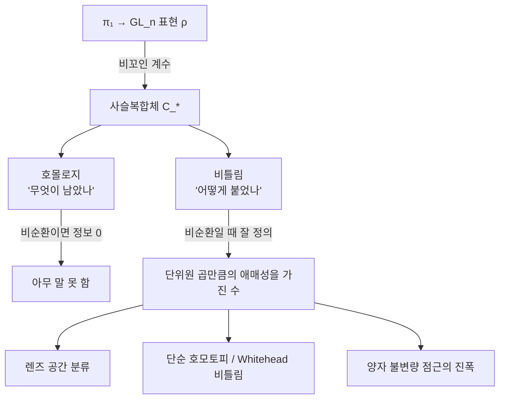

# Reidemeister 비틀림과 렌즈 공간

# 개요

[호몰로지](homology.md)는 강력하지만 많은 것을 버린다. 사슬복합체

$$
\cdots\to C_2\xrightarrow{\partial_2}C_1\xrightarrow{\partial_1}C_0
$$

에서 호몰로지는 $\ker\partial/\operatorname{im}\partial$ 만 본다. 곧 **무엇이 남았는지**만 기록하고 **어떻게 붙었는지**는 잊는다. 극단적인 경우로 복합체가 비순환이면(호몰로지가 전부 0) 호몰로지는 아무 말도 하지 않는다. 그러나 그런 복합체도 다 같지는 않다. 경계사상들이 서로 어떻게 맞물리는지가 남아 있다.

Reidemeister 비틀림은 그 남은 정보를 [행렬식](determinants.md)으로 끄집어낸다. 비순환 복합체를 조각으로 잘라 각 조각의 기저 변환 행렬의 행렬식을 교대로 곱하면, 자른 방법에 의존하지 않는 수 하나가 나온다. 호몰로지가 0 이라 아무것도 없어 보이던 자리에서 불변량이 나오는 것이다.

이것이 실제로 무엇을 하는지는 렌즈 공간이 보여 준다. $L(7,1)$ 과 $L(7,2)$ 는

- 기본군이 둘 다 $\mathbb Z/7$ 이고,
- 모든 호몰로지군이 같고,
- 실제로 **호모토피 동치**이지만,
- **위상동형이 아니다.**

호모토피 불변량은 원리적으로 이 둘을 구별할 수 없다. 비틀림은 구별한다. 비틀림이 호모토피 불변량이 아니라 **단순 호모토피 불변량**이기 때문이다. 대수적 위상수학에서 호모토피형보다 섬세한 불변량이 실제로 필요하다는 것을 보인 첫 사례다.

# 직관

## 호몰로지가 버리는 것

유한차원 벡터공간의 짧은 완전열 $0\to A\to B\to C\to0$ 을 생각하자. 차원은 $\dim B=\dim A+\dim C$ 로 결정된다. 그런데 $A,B,C$ 에 기저가 주어져 있다면 정보가 더 있다. $A$ 의 기저와 $C$ 의 들림을 합쳐 $B$ 의 기저를 만들 수 있고, 그것이 원래 $B$ 의 기저와 얼마나 다른지가 **행렬식 하나**로 잰다.

차원만 보면 이 수가 보이지 않는다. 호몰로지가 차원 계산에 해당하고, 비틀림이 이 행렬식에 해당한다.

비순환 복합체 $C_*$ 에서는 $\ker\partial_i=\operatorname{im}\partial_{i+1}$ 이므로 각 $C_i$ 가 두 조각으로 쪼개진다. 쪼갠 뒤 기저를 비교해 나온 행렬식들을 교대로 곱한 것이 비틀림이다.

$$
\tau(C_*)=\prod_i\big[\det(\cdots)\big]^{(-1)^i}
$$

교대곱인 이유는 Euler 지표가 교대합인 이유와 같다. 조각을 다르게 잘라도 이웃한 항에서 같은 인자가 한 번은 분자로 한 번은 분모로 들어와 상쇄된다.

## 왜 계수를 비꼬아야 하는가

여기 문제가 있다. $M$ 이 닫힌 다양체이면 보통 계수의 사슬복합체는 비순환이 아니다. $H_0\ne0$ 이니 비틀림을 정의할 수 없다.

해법은 **비꼬인 계수**다. 표현 $\rho:\pi_1(M)\to\mathrm{GL}_n(\mathbb C)$ 를 골라 보편덮개의 사슬복합체에 $\rho$ 로 비꾼 계수를 준다. $\rho$ 가 적절하면 비꼬인 호몰로지가 전부 0 이 되어 비틀림이 정의된다.

$\pi_1$ 의 표현을 고른다는 조작이 여기서 필수적이다. 비틀림은 **다양체 하나의 수가 아니라 다양체와 그 기본군 표현의 쌍에 붙는 수**다. 이 구조가 [Chern–Simons 이론](chern-simons.md)에서 평탄 접속이 $\pi_1$ 의 표현인 것과 정확히 맞물린다. 안장점 근사의 진폭에 비틀림이 나타나는 까닭이다.



## 애매성

비틀림은 수 하나로 딱 떨어지지 않는다. 사슬의 기저를 고르는 방법(세포의 순서, 방향, 각 세포에 붙일 덮개의 들림)에 따라 $\pm\rho(g)$ 꼴의 행렬식만큼 달라진다. 그래서 비틀림은

$$
\tau\in\mathbb C^\times/\{\pm\det\rho(g):g\in\pi_1\}
$$

의 원소다. 불변량으로 쓰려면 이 애매성을 없애야 하고, 가장 값싼 방법이 **절댓값만 보는 것**이다. $\rho$ 가 유니터리면 $|\det\rho(g)|=1$ 이라 $|\tau|$ 가 잘 정의된다. 아래 계산은 이 방법을 쓴다.

# 정의

## 비순환 복합체의 비틀림

$C_*$ 를 기저가 주어진 유한 복합체, $H_*(C)=0$ 이라 하자. 각 $i$ 에서 $B_i=\operatorname{im}\partial_{i+1}=\ker\partial_i$ 의 기저 $b_i$ 를 고른다. 비순환성에서 $b_i$ 를 $\partial$ 로 들어 올린 것과 $b_{i-1}$ 을 합치면 $C_i$ 의 기저가 되고, 그것을 주어진 기저 $c_i$ 와 비교한 변환행렬의 행렬식을 $[\,\widetilde b_i b_{i-1}/c_i\,]$ 라 쓴다.

> **정의.** $\tau(C_*)=\displaystyle\prod_i\big[\widetilde b_ib_{i-1}/c_i\big]^{(-1)^{i+1}}$

$b_i$ 의 선택에 의존하지 않음을 확인하는 것이 유일한 손볼 곳이고, 교대곱에서 상쇄가 일어나 그렇게 된다.

## 다양체의 비틀림

$M$ 을 유한 CW 복합체, $\rho:\pi_1(M)\to\mathrm{GL}_n(\mathbb C)$ 를 표현이라 하자. 보편덮개 $\widetilde M$ 의 세포 사슬복합체 $C_*(\widetilde M)$ 은 $\mathbb Z[\pi_1]$ 가군이고, 여기에 $\rho$ 를 먹여

$$
C_*^\rho(M)=\mathbb C^n\otimes_{\rho}C_*(\widetilde M)
$$

를 만든다. 이것이 비순환이면 $\rho$ 를 **비순환 표현**이라 하고, 그때 $\tau_\rho(M)$ 이 정의된다.

> **정리 (Reidemeister, Franz, de Rham).** $\tau_\rho(M)$ 은 $M$ 의 CW 구조에 의존하지 않고, 세포 분할의 세분에도 불변이다. 곧 $M$ 의 (그리고 $\rho$ 의) 불변량이다.

호모토피 동치에서 불변이 아니라는 점이 요점이다. 불변인 것은 **단순 호모토피 동치**, 곧 세포를 붙였다 떼는 기본 조작만으로 이어지는 동치다.

## 렌즈 공간

$L(p,q)$ 의 표준 CW 구조에서 계산이 끝까지 된다. $\pi_1=\mathbb Z/p$ 의 생성원을 $\zeta=e^{2\pi ij/p}$ 로 보내는 1 차원 표현 $\rho_j$ 를 쓰면, $qq^*\equiv1\pmod p$ 인 $q^*$ 에 대해

$$
\tau_{\rho_j}(L(p,q))=(\zeta^j-1)(\zeta^{jq^*}-1)
$$

이다(단위원 곱만큼의 애매성을 제외하고). $q$ 가 이 식에 $q^*$ 를 통해 들어오는 것이 핵심이다. **$p$ 만이 아니라 $q$ 가 답에 남는다.** 호몰로지는 $p$ 만 보고 $q$ 를 못 본다.

# 성질

## 렌즈 공간의 분류

두 판정이 서로 다르다는 것이 이 이론의 고전적 결론이다.

> **정리.** $L(p,q)$ 와 $L(p,q')$ 는
> - **호모토피 동치**일 필요충분조건이 $qq'\equiv\pm n^2\pmod p$ 인 $n$ 이 존재하는 것,
> - **위상동형**일 필요충분조건이 $q'\equiv\pm q^{\pm1}\pmod p$ 인 것이다.

앞의 것은 호몰로지와 기본군, 연결 합의 불변량으로 판정되지만 뒤의 것은 그렇지 않다. 뒤의 판정을 실제로 해내는 것이 비틀림이다. $p=7$, $q=1$, $q'=2$ 에서 $1\cdot2=2\equiv3^2\pmod7$ 이므로 호모토피 동치이고, 한편 $\pm1^{\pm1}=\{1,6\}$ 에 $2$ 가 없으므로 동형이 아니다.

## 단순 호모토피와 Whitehead 비틀림

왜 비틀림이 호모토피 불변량이 아닌지는 Whitehead 의 틀에서 설명된다. 호모토피 동치 $f:X\to Y$ 마다 Whitehead 군 $\mathrm{Wh}(\pi_1)$ 의 원소 $\tau(f)$ 가 붙고, $\tau(f)=0$ 인 것이 단순 호모토피 동치다. Reidemeister 비틀림은 이 $\tau(f)$ 를 표현 $\rho$ 로 내려 본 것이다.

$\mathrm{Wh}(\mathbb Z/p)$ 가 자명하지 않기 때문에 렌즈 공간에서 두 개념이 갈린다. $\mathrm{Wh}$ 가 자명한 군(예를 들어 자유군)에서는 두 개념이 일치해 비틀림이 새 정보를 주지 않는다.

이 갈림은 고차원 다양체 분류의 중심에 있다. **s-코보디즘 정리**가 코보디즘이 곱과 동형일 조건으로 Whitehead 비틀림의 소멸을 요구하고, 차원 $\ge5$ 에서 Poincaré 추측이 그 위에서 증명된다.

## 다른 얼굴들

- **Alexander 다항식.** 매듭 여집합의 비틀림이 Alexander 다항식이다(Milnor). 조합적으로 정의된 매듭 다항식이 사실은 비틀림이라는 뜻이다.
- **해석적 비틀림.** Ray–Singer 가 Laplace 작용소의 행렬식으로 같은 양을 정의했고, Cheeger 와 Müller 가 둘이 일치함을 증명했다. 조합적 양과 스펙트럼 양이 같다는 정리다.
- **점근의 진폭.** [Witten 점근 추측](witten-asymptotics.md)에서 각 평탄 접속의 기여 크기가 $\sqrt{T_\alpha}$ 인데, 그 $T_\alpha$ 가 이 비틀림이다. 경로적분의 2 차 변분 행렬식이 정규화되면 비틀림이 된다는 것이 Ray–Singer 판의 의미다.

# 활용

## 호모토피 동치인 두 공간을 구별한다

렌즈 공간의 비틀림을 표현 $\rho_j$ 마다 계산한다. 애매성을 없애기 위해 절댓값을 보고, $j$ 를 전부 돌려 얻은 값의 다중집합을 비교한다.

```python
from cmath import exp, pi

def torsion_abs(p, q):
    """|tau_{rho_j}(L(p,q))| = |zeta^j - 1| |zeta^{j q*} - 1|,  q q* = 1 mod p"""
    qs = next(x for x in range(1, p) if (q*x) % p == 1)
    vals = []
    for j in range(1, p):
        z = exp(2j*pi*j/p)
        vals.append(abs(z - 1) * abs(z**qs - 1))
    return sorted(round(v, 9) for v in vals)

def homotopy_equiv(p, q, qp):
    """q q' = ±n^2 mod p"""
    squares = {(n*n) % p for n in range(1, p)}
    return (q*qp) % p in squares or (-q*qp) % p in squares

def homeomorphic(p, q, qp):
    """q' = ±q^{±1} mod p"""
    qi = next(x for x in range(1, p) if (q*x) % p == 1)
    return qp % p in {(s*x) % p for s in (1, -1) for x in (q, qi)}

for (p, q, qp) in [(7,1,2), (7,1,6), (15,1,4), (5,1,2), (13,1,5)]:
    t1, t2 = torsion_abs(p, q), torsion_abs(p, qp)
    print(f"L({p},{q}) vs L({p},{qp}):  호모토피동치={homotopy_equiv(p,q,qp)!s:5s}"
          f"  동형={homeomorphic(p,q,qp)!s:5s}  비틀림 일치={t1==t2}")

print()
print("L(7,1) 비틀림 절댓값:", [f"{v:.4f}" for v in torsion_abs(7,1)])
print("L(7,2) 비틀림 절댓값:", [f"{v:.4f}" for v in torsion_abs(7,2)])

# L(7,1) vs L(7,2):  호모토피동치=True   동형=False  비틀림 일치=False
# L(7,1) vs L(7,6):  호모토피동치=True   동형=True   비틀림 일치=True
# L(15,1) vs L(15,4):  호모토피동치=True   동형=False  비틀림 일치=False
# L(5,1) vs L(5,2):  호모토피동치=False  동형=False  비틀림 일치=False
# L(13,1) vs L(13,5):  호모토피동치=False  동형=False  비틀림 일치=False
#
# L(7,1) 비틀림 절댓값: ['0.7530', '0.7530', '2.4450', '2.4450', '3.8019', '3.8019']
# L(7,2) 비틀림 절댓값: ['1.3569', '1.3569', '1.6920', '1.6920', '3.0489', '3.0489']
```

**둘째 열과 넷째 열을 나란히 읽는 것이 이 표의 전부다.** 비틀림이 일치하는 경우와 동형인 경우가 다섯 줄 모두에서 정확히 같다. 호모토피 동치 여부와는 두 줄에서 어긋난다. 비틀림이 재는 것이 호모토피형이 아니라 그보다 섬세한 무엇이라는 말이 이 어긋남이다.

첫 줄이 고전적인 예다. $L(7,1)$ 과 $L(7,2)$ 는 호모토피 동치라 호몰로지, 코호몰로지 환, 기본군, 고차 호모토피군이 전부 같다. 그런데 비틀림 값의 다중집합이 $\{0.75,2.45,3.80\}$ 대 $\{1.36,1.69,3.05\}$ 로 겹치지 않는다. 겹치는 값이 하나도 없으므로 기저 선택의 애매성을 아무리 써도 맞출 수 없다.

둘째 줄은 반대 방향의 점검이다. $L(7,6)$ 은 $q'=6\equiv-1$ 이라 $L(7,1)$ 과 동형이고(방향만 뒤집은 것), 비틀림도 정확히 일치한다. 불변량이 구별해서는 안 되는 것을 구별하지 않는다.

**$L(7,1)$ 의 값 $0.7530,\,2.4450,\,3.8019$ 를 기억해 둘 만하다.** 이 셋은 $4\sin^2(2\pi b/7)$ 을 $b=1,2,3$ 에서 계산한 값과 같다. Witten 점근 추측 쪽에서 렌즈 공간의 RT 불변량을 Gauss 합 상호법칙으로 분해했을 때 각 평탄 접속의 진폭으로 나온 바로 그 수들이다. 한쪽은 세포 사슬복합체의 행렬식이고 다른 쪽은 1 의 거듭제곱근들의 유한합을 상호법칙으로 변형한 결과인데, 같은 수가 나온다. **점근의 진폭이 비틀림이라는 진술이 이 일치다.**

## 어디에 쓰는가

- **분류 문제.** 호모토피형이 같은 다양체를 구별해야 할 때 가장 먼저 꺼내는 도구다. 렌즈 공간이 표준 예이고, 고차원에서는 s-코보디즘 정리를 통해 분류 이론 전체에 들어간다.
- **매듭 이론.** Alexander 다항식이 비틀림이라는 사실이 그 다항식의 여러 성질(대칭성, Seifert 행렬과의 관계)에 구조적인 설명을 준다.
- **양자 불변량.** 평탄 접속마다 비틀림이 붙고, 그것이 양자 불변량 점근의 진폭으로 나타난다. 조합적으로 계산되는 양이 해석적 점근에 나온다는 점이 이 대응을 유용하게 만든다.

[^1]: 원전은 K. Reidemeister, *Homotopieringe und Linsenräume*, Abh. Math. Sem. Univ. Hamburg 11 (1935) 와 W. Franz, *Über die Torsion einer Überdeckung*, J. Reine Angew. Math. 173 (1935). 표준적인 현대적 서술은 J. Milnor, *Whitehead torsion*, Bull. AMS 72 (1966).
[^2]: 해석적 비틀림과의 일치는 J. Cheeger, Ann. of Math. 109 (1979) 와 W. Müller, Adv. Math. 28 (1978). 매듭 여집합의 비틀림이 Alexander 다항식이라는 것은 J. Milnor, *A duality theorem for Reidemeister torsion*, Ann. of Math. 76 (1962). 본문의 수치 계산은 직접 한 것이다.

# 연관 문서

## 선수지식

- [단체 호몰로지](homology.md)
- [행렬식](determinants.md)

## 더 알아보기

- [s-코보디즘 정리와 고차원 Poincaré 추측](s-cobordism.md)

#algebraic_topology #topology #linear_algebra
