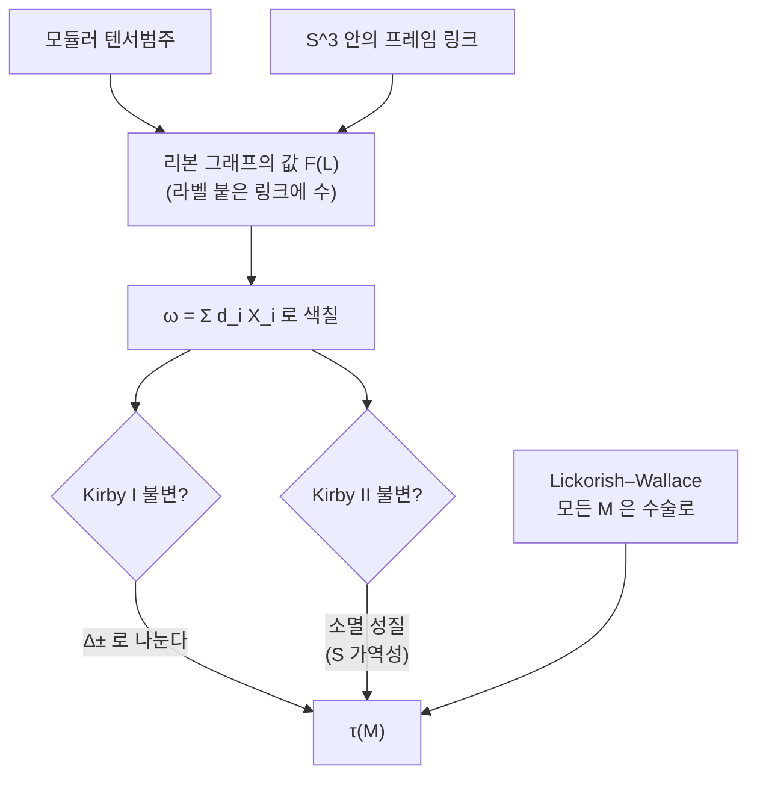

# Reshetikhin–Turaev 불변량

# 개요

[모듈러 텐서범주](modular-tensor-categories.md) 문서에서 "MTC 하나가 3 차원 TQFT 하나와 같다" 는 주장을 보았다. 그 주장의 한쪽 방향, 곧 **대수에서 위상으로 가는 실제 구성**이 Reshetikhin–Turaev 구성이다. 입력은 MTC 하나이고, 출력은 다음 두 가지다.

- 닫힌 3 차원 다양체 $M$ 에 붙는 수 $\tau(M)\in\mathbb C$ 가 있다.
- $M$ 안에 놓인 라벨 붙은 매듭이나 링크에 붙는 수.

[매듭 불변량](knot-invariants.md) 문서에서 Jones 다항식을 Kauffman 괄호로 만들었다. 그때 쓴 방법은 도식을 골라 상태합을 계산하고 Reidemeister 이동에 불변임을 확인하는 것이었다. 여기서 하는 일은 구조가 똑같되 한 차원 위다.

| | Jones 다항식 | Reshetikhin–Turaev |
|---|---|---|
| 대상 | $S^3$ 안의 매듭 | 닫힌 3 차원 다양체 |
| 표현 | 평면 도식 | $S^3$ 안의 프레임 링크 위 수술 |
| 표현의 모호성 | Reidemeister 이동 | Kirby 이동 |
| 불변임을 보이는 방법 | 상태합이 이동에 안 변함 | 색칠 합이 이동에 안 변함 |

두 부모가 모두 필요한 이유가 여기 있다. MTC 는 각 교차점과 각 고리에 무엇을 대응시킬지를 주는 **재료**이고, 매듭 도식과 Reidemeister 이동의 논리는 이 구성 전체가 따르는 **틀**이다.

구성의 핵심은 한 줄로 요약된다. 모든 단순대상을 자기 양자차원만큼의 무게로 섞은 형식합

$$
\omega=\sum_id_iX_i
$$

으로 수술 링크를 색칠하면, 그 값이 Kirby 이동에 불변이 된다. 그리고 그렇게 되는 이유가 정확히 $S$ 행렬의 가역성, 곧 모듈러 조건이다.

# 직관

## 왜 수술인가

3 차원 다양체를 손에 쥐는 방법이 필요하다. Lickorish–Wallace 정리가 그것을 준다.

> 모든 닫힌 유향 3 차원 다양체는 $S^3$ 안의 프레임 링크를 따라 수술해서 얻어진다.

수술이란 링크의 각 성분을 둘러싼 고체원환을 도려내고, 프레이밍이 지정한 방식으로 다시 붙이는 조작이다. 프레이밍은 각 성분에 붙는 정수 하나다. 그래서 3 차원 다양체라는 만지기 어려운 대상이 **평면에 그릴 수 있는 그림 하나**, 곧 정수가 적힌 링크 도식으로 내려온다.

이것이 매듭 도식과 같은 상황이다. 매듭을 다루려면 도식을 골라야 하고, 도식을 고르면 선택의 모호성이 생긴다.

## Kirby 이동이라는 모호성

같은 3 차원 다양체를 주는 링크는 여럿이다. Kirby 정리가 그 모호성의 전부를 두 가지 이동으로 정리한다.

- **Kirby I (안정화).** 다른 성분과 떨어진 $\pm1$ 프레임 풀린 고리 하나를 더하거나 뺀다.
- **Kirby II (손잡이 미끄러짐).** 한 성분을 다른 성분을 따라 미끄러뜨린다.



Reidemeister 이동을 다룰 때 했던 일을 그대로 하면 된다. 링크에 값을 매기는 규칙을 만들고, 두 이동에 그 값이 안 변함을 확인한다. 그런데 라벨 하나를 고정해서는 안 된다. 미끄러뜨리면 라벨이 섞이기 때문이다. **그래서 모든 라벨을 한꺼번에 쓴다.**

## 소멸 성질

$\omega=\sum_id_iX_i$ 로 색칠한 고리가 하는 일이 무엇인지가 이 구성 전체의 심장이다. $\omega$ 고리와 라벨 $j$ 고리를 한 번 걸어 놓으면(Hopf 고리), 그 값이 이렇게 된다.

$$
\sum_id_i\cdot\frac{S_{ij}}{S_{00}}=\frac{(S^2)_{0j}}{S_{00}^2}=\mathcal D^2\,\delta_{j0}
$$

곧 **$j\neq0$ 이면 값이 0 이다.** $\omega$ 고리는 자기를 통과하는 모든 비자명한 라벨을 죽인다. 손잡이 미끄러짐이 만드는 차이가 정확히 이런 통과항으로 나타나므로, 그 항들이 전부 소멸해서 Kirby II 불변성이 나온다.

$(S^2)_{0j}=\delta_{j0}$ 을 쓴 곳이 모듈러 조건이 들어가는 자리다. $S$ 가 가역이 아니면 $S^2$ 가 전하켤레 치환이 되지 못하고, 소멸이 일어나지 않아 Kirby II 가 깨진다. MTC 문서 끝에서 "모듈러 조건이 없으면 매듭 불변량은 만들어도 3 차원 다양체 불변량으로 올라가지 못한다" 고 한 것의 정확한 내용이 이것이다.

## 프레이밍은 왜 남는가

Kirby I 은 그냥 통과하지 않는다. 떨어진 $\pm1$ 고리 하나를 $\omega$ 로 색칠하면 값이 다음 수만큼 곱해진다.

$$
\Delta_\pm=\sum_id_i^2\theta_i^{\pm1}
$$

이 인자는 사라지지 않으므로 나눠 주어야 한다. 몇 번 나눌지는 링크의 이음수 행렬의 부호수 $\sigma(L)$ 가 정한다. 곧 **정규화 자체가 링크의 자료를 기억한다.**

여기가 미묘한 지점이다. $\sigma(L)$ 은 3 차원 다양체만으로 정해지지 않고 수술 표현에 딸린 4 차원 자료다. 뒤에서 보겠지만 $\Delta_+/\mathcal D$ 가 순수한 위상인자 $e^{2\pi ic/8}$ 로 나오고, 그 $c$ 가 등각장론의 중심 전하다. 이 여분의 위상이 **프레이밍 변칙**(framing anomaly)이라 불리는 것이고, 제대로 다루려면 3 차원 다양체에 2-프레이밍이라는 추가 구조를 얹어야 한다. 대수가 위상에 남기는 흔적 가운데 가장 물리적인 것이다.

# 정의

## 리본 그래프에 값을 매기기

MTC $\mathcal C$ 에서 출발한다. 각 성분에 단순대상 라벨이 붙은 $S^3$ 안의 프레임 링크 $L$ 에 대해 값 $F(L)\in\mathbb C$ 를 다음 규칙으로 정한다.

- 라벨 $i$ 인 풀린 고리 하나는 $F=d_i$ 다.
- 교차점: 꼬임 $c_{X,Y}$ 를 대응시킨다.
- 성분의 비틀림(프레이밍) 한 번: $\theta_i$ 를 곱한다.
- 전체는 라벨 붙은 도식을 사상들의 합성으로 읽고 그 자취를 취한 값이다.

사영이나 자취가 잘 정의되는 이유는 리본 구조(쌍대성 + 비틀림)가 그것을 보장하기 때문이다. $F$ 는 Reidemeister II, III 에 불변이고 I 에 대해서는 $\theta_i$ 만큼 달라진다. 프레임 링크를 쓰는 이유가 그것이다. $\mathrm{SU}(2)_k$ 에서 라벨을 전부 1 로 두면 $F$ 가 곧 Kauffman 괄호의 1 의 거듭제곱근 특수화다.

## 수술 공식

라벨을 고정하지 않고 $\omega$ 로 색칠한다. 성분이 $m$ 개인 링크 $L$ 에 대해

$$
F(L_\omega)=\sum_{i_1,\dots,i_m}d_{i_1}\cdots d_{i_m}F(L;i_1,\dots,i_m)
$$

로 두고, 이음수 행렬의 부호수를 $\sigma(L)$ 이라 하자. 수술로 얻은 다양체를 $M_L$ 이라 하면 다음이 불변량이다.

> **정의 (Reshetikhin–Turaev 불변량).**
> $$
> \tau(M_L)=F(L_\omega)\cdot\mathcal D^{-m-1}\cdot\Big(\frac{\Delta_+}{\mathcal D}\Big)^{-\sigma(L)}
> $$

$\mathcal D=\sqrt{\sum_id_i^2}$ 는 MTC 의 전체 차원이다. 빈 링크 곧 $M=S^3$ 을 넣으면 $\tau(S^3)=\mathcal D^{-1}=S_{00}$ 이 나온다. $\tau(S^3)$ 이 1 이 아니라는 점이 이 규약의 특징이고, 뒤의 곱셈 공식이 깔끔해지는 대가다.

> **정리 (Reshetikhin–Turaev 1991).** $\tau(M_L)$ 은 $M_L$ 의 수술 표현에 의존하지 않는다. 곧 닫힌 유향 3 차원 다양체의 불변량이다.

증명은 Kirby I, II 에 대한 불변성 확인이고, 그 재료가 앞 절의 소멸 성질과 $\Delta_\pm$ 의 상쇄다.

## TQFT 로의 확장

경계가 있는 다양체까지 확장하면 곡면 $\Sigma$ 마다 벡터공간 $Z(\Sigma)$ 가 생기고 다음 공리를 만족한다.

$$
Z(\Sigma_1\sqcup\Sigma_2)=Z(\Sigma_1)\otimes Z(\Sigma_2),\qquad
Z(M_1\cup_\Sigma M_2)=\langle Z(M_1),Z(M_2)\rangle
$$

원환면에서는 $\dim Z(T^2)$ 가 단순대상 개수와 같고, 사상류군 $\mathrm{SL}_2(\mathbb Z)$ 가 $S,T$ 행렬로 작용한다. MTC 문서에서 말한 원환면 이야기의 구성이 이것이다.

# 성질

## 프레이밍 변칙과 중심 전하

$\Delta_\pm$ 두 수가 만족하는 관계가 이 이론의 가장 예상 밖의 사실이다.

$$
\Delta_+\Delta_-=\mathcal D^2,\qquad \frac{\Delta_+}{\mathcal D}=e^{2\pi ic/8}
$$

첫 식은 $\Delta_+/\mathcal D$ 가 절댓값 1 임을 뜻하고, 둘째 식이 그 위상각의 정체를 밝힌다. $c$ 는 순수하게 범주에서 정의되는 유리수인데, 그 범주가 정점작용소대수에서 왔다면 $c$ 가 그 VOA 의 중심 전하와 일치한다. $\mathrm{SU}(2)_k$ 라면

$$
c=\frac{3k}{k+2}
$$

이다. 대수적 자료만으로 정의된 수 하나가 등각장론의 중심 전하를 알고 있다. $\Delta_\pm$ 는 링크를 안정화할 때 나오는 순수한 조합 자료이므로, 위상수학의 정규화 인자가 물리의 중심 전하를 담고 있는 셈이다.

## $\mathrm{SL}_2(\mathbb Z)$ 사영표현

$T_{ij}=\delta_{ij}\theta_i$ 로 두면 $S,T$ 가 다음을 만족한다.

$$
S^4=\mathrm{id},\qquad (ST)^3=\frac{\Delta_+}{\mathcal D}\,S^2
$$

$\mathrm{SL}_2(\mathbb Z)$ 의 표시가 $(ST)^3=S^2$ 와 $S^4=1$ 이므로 위 식은 $S,T$ 가 **사영표현**을 준다는 뜻이고, 그 사영 인자가 정확히 프레이밍 변칙과 같은 수다. 곧 사상류군 표현이 진짜 표현이 되지 못하는 이유와 $\tau$ 가 프레이밍에 의존하는 이유가 같은 하나다.

## 예: 렌즈 공간

프레이밍 $p$ 인 풀린 고리 하나를 수술하면 렌즈 공간 $L(p,1)$ 이 나온다. 성분이 하나이므로 $m=1$ 이고 $\sigma=\mathrm{sgn}(p)$ 이며

$$
\tau(L(p,1))=\Big(\sum_id_i^2\theta_i^{\,p}\Big)\mathcal D^{-2}\Big(\frac{\Delta_+}{\mathcal D}\Big)^{-\mathrm{sgn}(p)}
$$

이 된다. $p=\pm1$ 은 $S^3$ 을, $p=0$ 은 $S^1\times S^2$ 를 준다. 이 세 값을 공식이 제대로 재현하는지가 좋은 점검이다.

## 무엇을 구별하고 무엇을 놓치는가

$\tau$ 는 완전 불변량이 아니다. 한 레벨의 $\mathrm{SU}(2)_k$ 만으로는 구별하지 못하는 다양체 쌍이 있고, 값이 0 이 되어 아무 정보도 주지 않는 경우도 있다. 그러나 모든 $k$ 를 한꺼번에 보면 사정이 달라진다. $k\to\infty$ 에서의 점근 거동과, $q$ 를 형식 변수로 보는 Ohtsuki 급수가 고전적 불변량과 이어진다.

> **Witten 점근 추측.** $k\to\infty$ 에서 $\tau_k(M)$ 의 점근전개의 선행항이 $M$ 위의 평탄 $\mathrm{SU}(2)$ 접속들의 기여 합으로 주어지고, 각 기여의 위상이 Chern–Simons 작용값, 진폭이 Reidemeister 비틀림으로 나온다.

이 추측은 여러 다양체족에서 증명되었고, 1 차 보정항에서 Casson 불변량이 나온다. 양자 불변량이 고전 위상수학의 양들을 어떻게 담고 있는지에 대한 현재까지의 가장 좋은 답이다.

# 활용

## 항등식을 직접 확인한다

$\mathrm{SU}(2)_k$ 자료로 위의 주장들을 수치로 확인한다. $S$ 행렬과 비틀림은 다음과 같다.

$$
S_{ij}=\sqrt{\frac2{k+2}}\sin\frac{\pi(i+1)(j+1)}{k+2},\qquad
\theta_i=\exp\Big(2\pi i\cdot\frac{i(i+2)}{4(k+2)}\Big)
$$

```python
from cmath import exp, pi
from math import sin, sqrt

def su2(k):
    """SU(2)_k 의 S 행렬, 양자차원, 비틀림, 전체차원"""
    n = k + 2
    S = [[sqrt(2/n)*sin(pi*(i+1)*(j+1)/n) for j in range(k+1)] for i in range(k+1)]
    d = [S[i][0]/S[0][0] for i in range(k+1)]
    th = [exp(2j*pi*i*(i+2)/(4*n)) for i in range(k+1)]
    return S, d, th, 1/S[0][0]

def mul(A, B):
    n = len(A)
    return [[sum(A[i][m]*B[m][j] for m in range(n)) for j in range(n)] for i in range(n)]

def tau_lens(k, p):
    """p-프레임 풀린 고리 수술 = L(p,1). p=±1 이면 S^3, p=0 이면 S^1 x S^2"""
    S, d, th, D = su2(k)
    F = sum(d[i]**2 * th[i]**p for i in range(k+1))          # F(L_omega)
    dplus = sum(d[i]**2 * th[i] for i in range(k+1))         # Delta_+
    sigma = (p > 0) - (p < 0)
    return F * D**-2 * (dplus/D)**(-sigma)

for k in [1, 2, 3, 5, 8]:
    S, d, th, D = su2(k)
    n = k + 1
    # (1) 소멸 성질: omega 를 통과하는 라벨 j 는 j=0 이 아니면 죽는다
    kill = max(abs(sum(d[i]*S[i][j] for i in range(n)) - (D if j == 0 else 0))
               for j in range(n))
    # (2) 프레이밍 변칙이 중심 전하를 안다
    dplus = sum(d[i]**2*th[i] for i in range(n))
    dminus = sum(d[i]**2/th[i] for i in range(n))
    c = 3*k/(k+2)
    # (3) SL_2(Z) 사영표현
    T = [[th[i] if i == j else 0 for j in range(n)] for i in range(n)]
    ST = mul(S, T)
    ST3, S2 = mul(mul(ST, ST), ST), mul(S, S)
    lam = ST3[0][0]/S2[0][0]
    proj = max(abs(ST3[i][j] - lam*S2[i][j]) for i in range(n) for j in range(n))
    S4 = mul(S2, S2)
    s4 = max(abs(S4[i][j] - (1 if i == j else 0)) for i in range(n) for j in range(n))
    print(f"k={k}  소멸 오차 {kill:.0e}   D+D- - D^2 = {abs(dplus*dminus - D**2):.0e}")
    print(f"      D+/D = {dplus/D:+.4f}   e^(2pi i c/8) = {exp(2j*pi*c/8):+.4f}   (c = {c:.4f})")
    print(f"      (ST)^3 = lam S^2 오차 {proj:.0e}  lam = {lam:+.4f}   S^4 = I 오차 {s4:.0e}")

print()
for k in [2, 3]:
    D = su2(k)[3]
    print(f"SU(2)_{k}:  tau(S^3) = {1/D:.6f}")
    print(f"   tau(L(1,1))  = {tau_lens(k, 1):+.6f}   <- S^3 과 같아야")
    print(f"   tau(S^1xS^2) = {tau_lens(k, 0):+.6f}   <- 1 이어야")
    print(f"   tau(L(p,1)), p=2..5: " +
          ", ".join(f"{tau_lens(k, p):+.4f}" for p in range(2, 6)))

# k=1  소멸 오차 1e-16   D+D- - D^2 = 4e-16
#       D+/D = +0.7071+0.7071j   e^(2pi i c/8) = +0.7071+0.7071j   (c = 1.0000)
#       (ST)^3 = lam S^2 오차 3e-16  lam = +0.7071+0.7071j   S^4 = I 오차 2e-16
# k=2  소멸 오차 4e-16   D+D- - D^2 = 3e-15
#       D+/D = +0.3827+0.9239j   e^(2pi i c/8) = +0.3827+0.9239j   (c = 1.5000)
#       (ST)^3 = lam S^2 오차 5e-16  lam = +0.3827+0.9239j   S^4 = I 오차 4e-16
# k=3  소멸 오차 4e-16   D+D- - D^2 = 3e-15
#       D+/D = +0.1564+0.9877j   e^(2pi i c/8) = +0.1564+0.9877j   (c = 1.8000)
#       (ST)^3 = lam S^2 오차 5e-16  lam = +0.1564+0.9877j   S^4 = I 오차 4e-16
# k=5  소멸 오차 2e-15   D+D- - D^2 = 1e-14
#       D+/D = -0.1120+0.9937j   e^(2pi i c/8) = -0.1120+0.9937j   (c = 2.1429)
#       (ST)^3 = lam S^2 오차 2e-15  lam = -0.1120+0.9937j   S^4 = I 오차 1e-15
# k=8  소멸 오차 2e-15   D+D- - D^2 = 1e-13
#       D+/D = -0.3090+0.9511j   e^(2pi i c/8) = -0.3090+0.9511j   (c = 2.4000)
#       (ST)^3 = lam S^2 오차 1e-15  lam = -0.3090+0.9511j   S^4 = I 오차 1e-15
#
# SU(2)_2:  tau(S^3) = 0.500000
#    tau(L(1,1))  = +0.500000+0.000000j   <- S^3 과 같아야
#    tau(S^1xS^2) = +1.000000+0.000000j   <- 1 이어야
#    tau(L(p,1)), p=2..5: +0.3827-0.0000j, -0.3536+0.3536j, -0.2706-0.6533j, -0.0000-0.5000j
# SU(2)_3:  tau(S^3) = 0.371748
#    tau(L(1,1))  = +0.371748+0.000000j   <- S^3 과 같아야
#    tau(S^1xS^2) = +1.000000+0.000000j   <- 1 이어야
#    tau(L(p,1)), p=2..5: -0.0000+0.0000j, +0.5721+0.1859j, -0.4684+0.2387j, -0.4156-0.5721j
```

세 줄 모두 읽을 것이 있다.

**소멸 오차**가 기계정밀도라는 것은 사인 값들의 가중합이 $j\neq0$ 에서 정확히 0 이라는 뜻이다. 삼각함수 항등식으로 보면 그저 $S^2$ 가 치환행렬이라는 사실이지만, 위상수학에서는 이것이 손잡이 미끄러짐이 값을 안 바꾸는 이유다. 한 줄의 선형대수 사실이 Kirby II 불변성을 통째로 떠받친다.

$\Delta_+/\mathcal D$ 가 다섯 레벨 모두에서 $e^{2\pi ic/8}$ 와 소수점 넷째 자리까지 일치한다. $\Delta_+$ 는 $d_i,\theta_i$ 의 유한합일 뿐인데 그 위상각이 $3k/(k+2)$ 라는 특정 유리수로 나온다. $k=1$ 이면 $c=1$ 이라 위상이 $e^{i\pi/4}$ 이고, $k\to\infty$ 에서 $c\to3$ 으로 올라간다. 범주에서 계산한 수가 등각장론의 중심 전하와 같다는 진술이 이 한 줄이다.

$(ST)^3$ 의 비례상수 $\lambda$ 가 바로 위의 $\Delta_+/\mathcal D$ 와 같은 수로 나왔다. 서로 다른 두 계산 — 안정화 인자와 사상류군 관계식 — 이 같은 값을 준다. 프레이밍 변칙이 곧 사영성이라는 말이 여기서 눈에 보인다.

렌즈 공간 쪽에서는 $\tau(L(1,1))=\tau(S^3)$ 과 $\tau(S^1\times S^2)=1$ 이 공식에서 자동으로 나온다. 앞의 것은 $+1$ 프레임 풀린 고리 수술이 $S^3$ 을 되돌려 주기 때문이고, $\Delta_+$ 가 분자와 분모에서 상쇄되어 맞아떨어진다. 뒤의 것은 $\theta_i^0=1$ 이라 합이 $\mathcal D^2$ 가 되기 때문이다. 규약이 자기일관적임을 확인하는 가장 싼 검산이고, 정규화 지수 $-m-1$ 과 $-\sigma$ 중 하나만 틀려도 즉시 깨진다.

한 값이 눈에 띈다. $\mathrm{SU}(2)_3$ 에서 $\tau(L(2,1))=\tau(\mathbb{RP}^3)$ 이 0 이다. 불변량이 소멸했으므로 이 레벨은 $\mathbb{RP}^3$ 에 대해 아무 말도 하지 않는다. 한 레벨만 보아서는 안 되고 $k$ 를 모두 걸쳐 보아야 한다는 앞 절의 말이 이렇게 구체적으로 나타난다. 같은 다양체를 $\mathrm{SU}(2)_2$ 에서 보면 $0.3827$ 로 0 이 아니다.

## Jones 다항식 되찾기

$\mathrm{SU}(2)_k$ 에서 모든 성분에 라벨 1 곧 스핀 $1/2$ 를 달고 $S^3$ 안의 매듭을 보면, $F$ 의 정의가 Kauffman 괄호의 skein 관계와 그대로 일치한다. 변수 대응은

$$
q=e^{2\pi i/(k+2)},\qquad A=q^{-1/4}
$$

이고, 그 결과 $S^3$ 안의 매듭 $K$ 에 대한 라벨 1 불변량이 Jones 다항식 $V_K(t)$ 를 $t=q$ 에서 평가한 값이 된다. [매듭 불변량](knot-invariants.md) 문서에서 상태합으로 구한 삼엽매듭의 $V(t)=-t^{-4}+t^{-3}+t^{-1}$ 을 이 1 의 거듭제곱근에서 평가한 수가 곧 $\mathrm{SU}(2)_k$ 의 불변량이다.

라벨을 $n$ 으로 올리면 색 Jones 다항식이 나오고, $\mathfrak{sl}_N$ 을 쓰면 HOMFLY, 직교·심플렉틱 계열에서는 Kauffman 다항식이 나온다. Jones 가 작용소대수에서 우연히 발견한 다항식이 왜 하필 그런 형태인지에 대한 답이 이 사전이다. **Jones 다항식은 $\mathrm{SU}(2)_1$ 에서 뽑은 하나의 열이고, 3 차원 다양체 불변량은 같은 기계를 수술까지 밀어 올린 결과다.**

## 계산 복잡도

$\tau$ 를 정확히 계산하는 것은 어렵다. $\mathrm{SU}(2)_k$ 에서 $k=3$ 혹은 $k\ge5$ 이면 매듭의 Jones 값을 1 의 $(k+2)$ 제곱근에서 정확히 계산하는 문제가 $\#\mathsf P$ 어려움이고, 반면 **덧셈 오차 안에서 근사**하는 문제는 $\mathsf{BQP}$ 완전이다. 후자가 위상적 양자계산이 설계되는 근거다. 애니온을 땋는 물리적 과정이 곧 $F$ 를 계산하는 회로이므로, 양자컴퓨터가 잘하는 일과 이 불변량의 근사가 같은 문제다.

빠져 있는 $k=1,2,4$ 는 각각 자명하거나 자유 페르미온이거나 Clifford 군만 주어 고전적으로 계산된다. MTC 문서의 "Fibonacci 는 보편적, Ising 은 아니다" 와 정확히 같은 갈림이다.

## 그 다음

- **Ohtsuki 급수**: $q=e^{h}$ 로 두고 $h$ 에 대해 전개하면 유한형 불변량(Vassiliev 이론의 3 차원판)의 생성함수가 나온다. 1 차항이 [Casson 불변량](casson-invariant.md)이다.
- **범주화**: Khovanov 호몰로지가 Jones 다항식을 사슬복합체의 Euler 지표로 올려놓듯, $\tau$ 를 범주화하는 시도가 이어지고 있다.
- **기하학적 대응**: 점근에서 나타나는 평탄 접속의 모듈라이가 [기하학적 Langlands](geometric-langlands.md) 쪽 이야기와 같은 재료를 쓴다.

[^1]: 원전은 N. Reshetikhin–V. Turaev, *Invariants of 3-manifolds via link polynomials and quantum groups*, Invent. Math. 103 (1991). 체계적 서술은 V. Turaev, *Quantum Invariants of Knots and 3-Manifolds* (1994), 특히 II 장의 수술 공식과 프레이밍 변칙. 본문의 규약은 이 책을 따랐다.
[^2]: 물리적 기원은 E. Witten, *Quantum field theory and the Jones polynomial*, Comm. Math. Phys. 121 (1989). 점근 추측과 그 이후는 L. Rozansky, *A large k asymptotics of Witten's invariant of Seifert manifolds*, Comm. Math. Phys. 171 (1995) 및 이후의 여러 검증.
[^3]: 복잡도 결과는 D. Aharonov–V. Jones–Z. Landau, *A polynomial quantum algorithm for approximating the Jones polynomial*, Algorithmica 55 (2009) 와 M. Freedman–A. Kitaev–Z. Wang 의 위상적 양자계산 계열 논문. 본문의 수치 계산은 직접 한 것이다.

# 연관 문서

## 선수지식

- [모듈러 텐서범주와 3 차원 TQFT](modular-tensor-categories.md)
- [매듭 불변량과 Jones 다항식](knot-invariants.md)

## 더 알아보기

- [Witten 점근 추측과 Ohtsuki 급수](witten-asymptotics.md)

#topology #algebraic_topology #category_theory #construction
