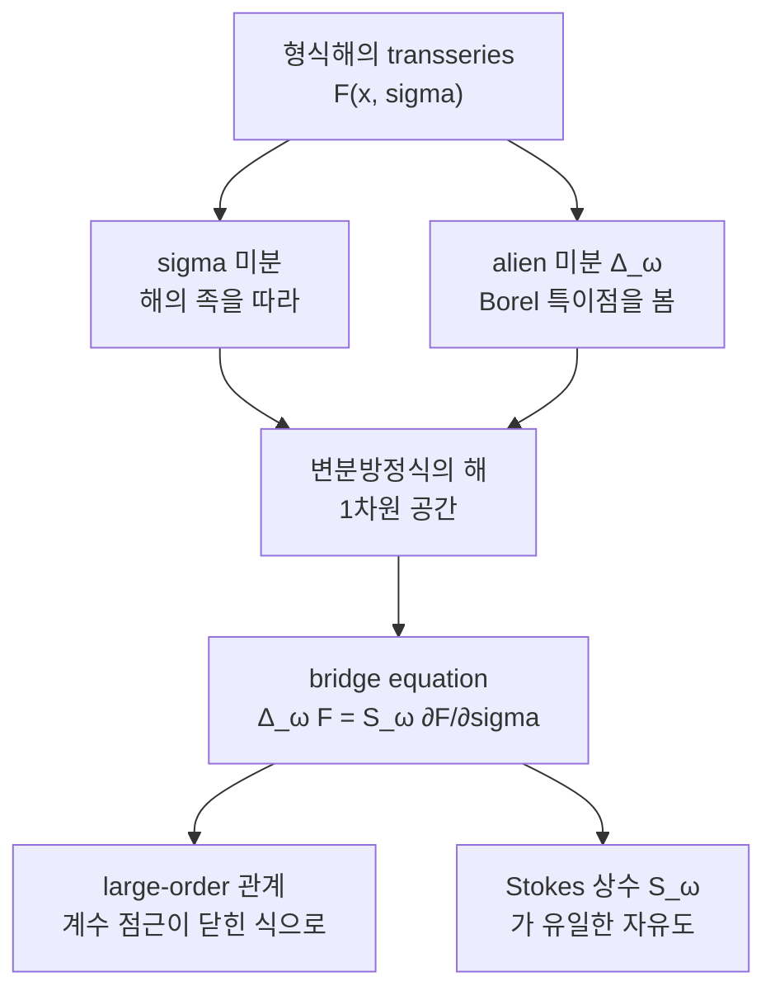

# Resurgence 와 alien 미분

# 개요

[Stokes 현상](stokes-phenomenon.md)은 점근급수 하나가 함수를 결정하지 못하고, 빠진 정보가 지수적으로 작은 항에 들어 있음을 보였다. 그리고 그 급수의 계수가 $n!$ 규모로 발산한다는 사실 자체가 빠진 항의 크기를 알려 준다고도 했다. 이 관찰을 **연산**으로 만든 것이 Écalle 의 resurgence 이론이다.

핵심은 하나의 미분이다. Borel 평면의 특이점 $\omega$ 마다 **alien 미분** $\Delta_\omega$ 를 정의하는데, 이것이 곱셈에 대해 Leibniz 법칙을 만족하고 보통의 미분 $\partial_x$ 와 교환한다. 그러면 "지수적으로 작은 항이 켜진다" 는 현상이 $\exp\bigl(\sum_\omega \dot\Delta_\omega\bigr)$ 라는 자동사상으로 쓰이고, 미분방정식이 주는 제약이 **bridge equation** 이라는 한 줄로 압축된다. 그 한 줄에서 점근급수 계수의 정확한 큰 $n$ 점근이 기계적으로 따라 나온다.

"resurgence" 는 되살아남이다. 급수 하나의 계수를 아주 멀리까지 따라가면 그 안에서 다른 급수 전체가 다시 떠오른다. 아래 [Airy 함수](airy-functions.md)의 예에서 이 되살아남을 소수점 일곱 자리까지 확인한다.

# 직관

## 특이점 목록이 함수의 유전자다

발산급수 $\tilde f$ 를 Borel 변환하면 수렴 반경이 유한한 함수 $\hat f(\zeta)$ 가 되고, 이 함수는 $\zeta$ 평면 위에 특이점들을 가진다. 두 번째 안장점이 $\zeta = A$ 에, 세 번째가 $\zeta = 2A$ 에 있는 식이다. 함수에 대해 알아야 할 것이 전부 이 특이점 목록과 각 특이점 주변의 국소 거동에 담긴다.

alien 미분 $\Delta_\omega \tilde f$ 는 "$\zeta = \omega$ 에서 $\hat f$ 가 어떻게 특이한가" 를 다시 $x$ 공간의 급수로 옮겨 적은 것이다. 특이점이 없으면 0 이고, 있으면 그 특이점 주변의 전개 계수를 통째로 내놓는다. **resurgent 함수**란 이 목록이 유한하거나 규칙적인 격자를 이루고, $\Delta_\omega\tilde f$ 가 다시 같은 종류의 대상이 되는 함수를 말한다. 닫혀 있어야 계산이 반복 가능하다.

## 왜 하필 미분인가

$\Delta_\omega$ 가 미분처럼 보이는 이유는 Borel 평면에서 곱이 합성곱이 되기 때문이다.

$$
\widehat{fg}(\zeta) = \int_0^{\zeta}\hat f(\eta)\,\hat g(\zeta - \eta)\,d\eta
$$

이 적분이 $\zeta = \omega$ 에서 특이해지는 경로는 두 가지뿐이다. $\hat f$ 가 $\omega$ 에서 특이하고 $\hat g$ 는 원점 근처에서 정칙이거나, 그 반대다. 두 특이점이 동시에 걸리는 상황은 한 차수 더 작다. 그래서

$$
\Delta_\omega(\tilde f\tilde g) = (\Delta_\omega \tilde f)\,\tilde g + \tilde f\,(\Delta_\omega \tilde g)
$$

가 나온다. Leibniz 법칙은 합성곱의 기하에서 저절로 따라오는 것이지 정의로 강요한 것이 아니다.

## 다리

미분방정식의 해를 transseries로 쓰면 적분상수 역할을 하는 매개변수 $\sigma$ 가 붙는다. 이때 $\sigma$ 로 미분하는 것과 alien 미분을 하는 것은 원리적으로 전혀 다른 연산이다. 앞은 해의 족 안에서 옆으로 움직이는 것이고, 뒤는 Borel 평면의 특이점을 들여다보는 것이다.

Bridge equation 은 이 둘이 상수배만큼만 다르다고 말한다. 두 연산 모두 원래 방정식을 선형화한 **변분방정식**의 해를 내놓는데 그 해공간이 1차원이기 때문이다. 서로 무관해 보이는 두 세계를 잇는다는 뜻에서 다리다. 이 다리 하나가 resurgence 를 추상적 구조에서 계산 도구로 바꾼다.

# 정의

## Transseries 대수

지수와 거듭제곱을 함께 허용한 형식 표현

$$
F(x,\sigma) = \sum_{k \ge 0}\sigma^{k}\,e^{-kAx}\,x^{-kb}\,\tilde\Phi_k(x),
\qquad
\tilde\Phi_k(x) = \sum_{n\ge0}a_{n}^{(k)}x^{-n}
$$

들의 집합은 덧셈, 곱셈, $\partial_x$ 에 대해 닫혀 있다. 곱하면 지수가 더해지고, 미분하면 같은 형태가 유지된다. 이 구조를 **transseries 미분대수**라 한다. 각 $k$ 를 **sector** 라 부르며, $k=0$ 이 보통의 점근급수, $k \ge 1$ 이 비섭동 sector 다. 형식적인 대상이지만 대수 구조가 온전하므로, 미분방정식을 여기에 대입해 계수를 결정하는 일이 의미를 가진다.

## 측면 합과 Stokes 자동사상

특이 방향 $\theta$ 의 양옆에서 Borel 합을 취한 것을 **측면 합** $\mathcal S_{\theta^+}$ 와 $\mathcal S_{\theta^-}$ 라 한다. 둘은 서로 다른 해석함수를 주며, 그 차이를 형식적 대상으로 되돌린 것이 **Stokes 자동사상** $\mathfrak S_\theta$ 다.

$$
\mathcal S_{\theta^+} = \mathcal S_{\theta^-}\circ\,\mathfrak S_\theta
$$

$\mathfrak S_\theta$ 는 transseries 대수의 대수적 자기동형이고 $\partial_x$ 와 교환한다. 곱과 미분을 보존하는 자동사상이므로 그 로그가 미분이어야 하는데, 그 로그가 정확히 alien 미분들의 합이다.

## Alien 미분

$\hat f$ 를 $\zeta = \omega$ 까지 해석적으로 연장한 뒤, 도중의 특이점들을 위쪽 $+$ 나 아래쪽 $-$ 로 우회하는 모든 경로를 고려한다. $\omega$ 방향의 특이점이 $\omega_1, \dots, \omega_r$ 로 늘어서 있을 때

$$
\Delta_\omega \tilde f = \sum_{\epsilon \in \{\pm\}^{r-1}} \frac{p(\epsilon)!\,q(\epsilon)!}{r!}\;\operatorname{sing}_{\omega}\bigl(\text{경로 } \epsilon \text{ 를 따른 연장}\bigr)
$$

으로 정의한다. $p, q$ 는 $\epsilon$ 안의 $+$ 와 $-$ 의 개수다. 가중평균을 쓰는 이유는 이렇게 해야 Leibniz 법칙이 정확히 성립하기 때문이다. 특이점이 하나뿐이면 합이 한 항으로 줄어 "특이점을 돌 때 생기는 불연속" 이라는 소박한 정의와 일치한다.

**점찍은 alien 미분**을 $\dot\Delta_\omega = e^{-\omega x}\Delta_\omega$ 로 두면 $\partial_x$ 와 교환한다. 이 형태로 Stokes 자동사상이

$$
\mathfrak S_\theta = \exp\left(\sum_{\omega \in \theta}\dot\Delta_\omega\right)
$$

로 쓰인다. 특이 방향에 특이점이 하나면 지수함수가 두 항에서 끊기고, 격자 $\lbrace A, 2A, 3A, \dots\rbrace$ 이면 모든 항이 살아 무한급수가 된다.

# 성질

## Bridge equation

$F(x,\sigma)$ 가 비선형 상미분방정식의 1-매개변수 transseries 해이면

$$
\dot\Delta_{mA}F = S_m\,\sigma^{\,m+1}\frac{\partial F}{\partial\sigma}, \qquad m \ge -1
$$

가 성립한다. 상수 $S_m$ 이 **Stokes 상수**이며, 방정식이 결정하지 못하고 대역적 해석성이 결정하는 유일한 자료다. 유도는 짧다. $F$ 가 방정식을 만족하므로 양변에 $\dot\Delta$ 를 적용하면 $\dot\Delta F$ 가 변분방정식을 만족하고, $\partial_\sigma F$ 도 같은 방정식을 만족한다. 해공간이 1차원이므로 둘은 비례한다. 지수 차수를 맞추면 $\sigma^{m+1}$ 이 붙는다.

$m = -1$ 항이 특히 중요하다. $\dot\Delta_{-A}F = S_{-1}\partial_\sigma F$ 는 비섭동 sector 에서 섭동 sector 로 되돌아오는 방향이고, 이것이 있어야 구조가 닫힌다.

## Large-order 관계

Bridge equation 을 $\sigma$ 의 거듭제곱으로 전개하고 $\Delta$ 의 정의를 되돌리면, $k=0$ sector 계수의 큰 $n$ 점근이 $k=1$ sector 계수로 쓰인다.

$$
a_n^{(0)} \;\sim\; \frac{S_1}{2\pi i}\sum_{m\ge0}\frac{\Gamma(n-m-b)}{A^{\,n-m-b}}\;a_m^{(1)}
$$

주도항 $\Gamma(n)/A^n$ 이 [Stokes 현상](stokes-phenomenon.md)에서 본 계수 성장이고, $1/n$ 보정들이 두 번째 sector 의 급수를 차례로 꺼내 온다. 한 sector 를 충분히 많이 계산하면 다른 sector 전체와 Stokes 상수를 수치로 읽을 수 있다는 뜻이다. 실제 계산에서 resurgence 가 쓰이는 방식이 대개 이것이다.

## 실수성과 중앙 합

측면 합 $\mathcal S_{\theta^\pm}$ 는 실수 문제에서도 허수부를 가진다. 두 값의 평균에 해당하는 **중앙 합**(median summation)

$$
\mathcal S_{\mathrm{med}} = \mathcal S_{\theta^-}\circ\,\mathfrak S_\theta^{1/2}
$$

은 실숫값을 준다. 물리에서 "섭동급수의 허수 애매성이 instanton 기여의 허수부와 상쇄된다" 고 말하는 상황이 이것의 다른 표현이다. 애매성이 사라지는 것이 아니라, transseries 의 모든 sector 를 함께 셈할 때 서로 정확히 지워진다.

## 어디까지 일반적인가

alien 미분들은 자유 Lie 대수를 이루고, 그 지수사상이 Stokes 자동사상들의 군을 준다. 비선형 미분방정식의 국소 해석적 분류(Écalle–Voronin)에서 이 자료가 완전 불변량이 된다는 것이 이론의 종착점 가운데 하나다. 형식적 변환으로 표준형까지 갈 수 있지만 그 변환이 발산하고, 발산의 정도가 곧 Stokes 자료이며, 그것이 해석적 동치류를 결정한다.[^1]

# 활용

## 섭동론의 비섭동 효과

양자역학의 이중우물에서 섭동급수는 발산하고, 그 발산률이 instanton 작용 $S_I$ 를 가리킨다. Bridge equation 은 섭동 sector 와 instanton sector, instanton–반instanton sector 사이의 관계를 전부 고정하며, 각 sector 의 허수 애매성이 상쇄되어 에너지 준위가 실수로 잘 정의됨을 보인다. 계수 몇십 개를 계산해 instanton 기여의 계수를 예측하고 독립 계산과 맞춰 보는 것이 이 분야의 표준 검산이다.

## 정확한 WKB

[WKB 근사](wkb-approximation.md)의 급수를 자르지 않고 Borel 합으로 다루는 이론을 exact WKB 라 한다. Voros 기호와 그 Stokes 자동사상 아래에서의 변환이 resurgence 구조 그 자체이고, 연결 공식은 특정 Stokes 자동사상을 적어 놓은 것에 지나지 않게 된다. 근사로 출발한 계산이 완전한 이론으로 승격되는 자리다.

## 매개변수 없는 예측

행렬모형, 위상적 끈, Chern–Simons 이론의 자유에너지에서도 같은 구조가 관찰된다. 섭동 전개의 계수를 계산해 Stokes 상수를 읽고, 그 값이 독립적으로 계산된 비섭동 대상(막 instanton, 복소 안장점)의 작용과 일치하는지 확인한다. 발산하는 급수가 오히려 다른 물리량을 예측하는 도구가 되는 것이 resurgence 가 준 관점의 전환이다.

[^1]: Inês Aniceto, Gökçe Başar, Ricardo Schiappa, *A Primer on Resurgent Transseries and Their Asymptotics*, Physics Reports 809 (2019), §§2–4. transseries 대수, alien 미분의 정의와 Leibniz 법칙, bridge equation 의 유도와 large-order 관계의 도출.

# 연관 문서

## 선수지식

- [Stokes 현상과 재합산](stokes-phenomenon.md)

## 더 알아보기

- [정확한 WKB 와 Voros 기호](exact-wkb.md)

#analysis #complex_analysis #computation
