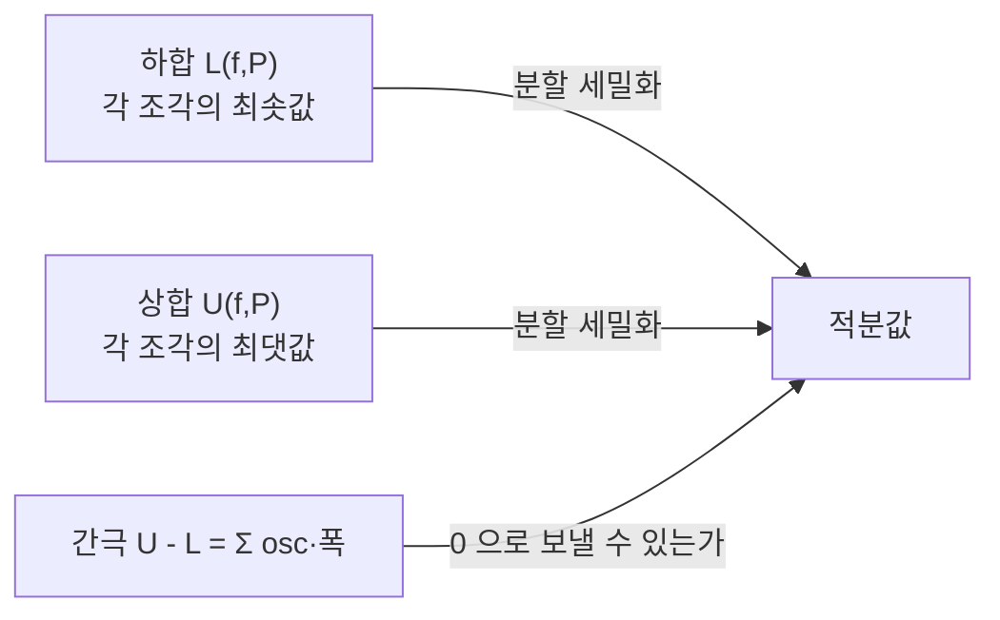

# Riemann 적분

# 개요

넓이나 누적량을 구하는 문제에서 답은 늘 같은 형태의 근사로 시작한다. 구간을 잘게 쪼개고, 각 조각에서 함수를 상수로 취급해 직사각형 넓이를 더한 뒤, 조각을 무한히 가늘게 만든다. Riemann 적분은 이 절차를 극한의 언어로 정확하게 옮긴 것이다.

정의가 요구하는 것은 하나다. 어떻게 쪼개고 어디서 표본을 뽑든 같은 값에 수렴해야 한다. 이 "모든 선택에 대해" 라는 요구가 적분 가능성이라는 조건의 내용 전부이며, 그것이 깨지는 지점에서 Riemann 적분의 한계와 [Lebesgue 적분](lebesgue-integral.md)의 필요성이 동시에 드러난다. [연속함수](continuity.md)의 균등연속성이 적분 가능성의 충분조건을 주므로 이 문서는 그 위에 선다.

# 직관

## 가로로 자르느냐 세로로 자르느냐

Riemann 적분은 정의역을 자른다. `x` 축을 조각내고 각 조각 위에서 함수값이 거의 일정하기를 기대한다. 이 기대는 함수가 가로로 완만할 때 잘 맞는다.

그래서 함수가 아무리 심하게 진동해도 진동의 폭이 좁은 구간에 갇혀 있으면 문제가 없지만, 모든 구간에서 위아래로 요동치면 실패한다. Dirichlet 함수가 그렇다. 이 실패를 고치는 방법이 자르는 방향을 바꾸는 것이다. 치역을 잘라 "함수값이 이 정도인 점들의 집합" 의 크기를 재면 진동이 문제가 되지 않고, 그러려면 임의의 집합의 크기를 재는 [측도](measure.md)가 필요해진다.

## 위와 아래에서 조여 오기

표본점을 자유롭게 고르는 정의는 다루기 불편하다. 대신 각 조각에서 가능한 가장 큰 값과 가장 작은 값을 써서 상합과 하합을 만들면, 분할을 세밀하게 할수록 상합은 줄고 하합은 늘어 서로 조여든다. 둘이 만나면 적분 가능하고 벌어진 채 남으면 아니다.



간극은 각 조각에서의 진동 폭에 조각 길이를 곱한 합이다. 따라서 적분 가능성의 본질은 "진동이 큰 곳이 얼마나 좁은가" 이고, 이 관찰을 끝까지 밀면 Lebesgue 판정법이 나온다.

# 정의

## Riemann 합

실수 $a < b$ 에 대해 $f$ 를 $[a,b]$ 위의 유계 실함수라 하자. 분할 $P$ 와 표본점 $\xi$ 를 다음처럼 정한다.

$$
a=x_0<x_1<\cdots<x_n=b,\qquad
\xi_i\in[x_{i-1},x_i]
$$

Riemann 합과 분할의 최대 폭은

$$
S(f,P,\xi)=\sum_{i=1}^n f(\xi_i)(x_i-x_{i-1}),\qquad
\|P\|=\max_i(x_i-x_{i-1})
$$

이다. 임의의 $\varepsilon > 0$ 에 대해 $\delta > 0$ 이 있어 $\|P\| < \delta$ 인 모든 분할과 모든 표본점 선택에서 $|S(f,P,\xi) - I| < \varepsilon$ 이면 $f$ 는 Riemann 적분 가능하고

$$
I=\int_a^b f(x)\,dx
$$

로 쓴다. 등분할로 한정하지 않고 모든 분할과 모든 표본점을 요구한다는 점이 중요하다.

## 상합, 하합, Darboux 적분

$$
M_i=\sup_{[x_{i-1},x_i]}f,\qquad m_i=\inf_{[x_{i-1},x_i]}f
$$

$$
U(f,P)=\sum M_i\,\Delta x_i,\qquad L(f,P)=\sum m_i\,\Delta x_i
$$

상적분을 `inf_P U(f,P)`, 하적분을 `sup_P L(f,P)` 라 하고 둘이 같으면 Darboux 적분 가능이라 한다. 유계함수에 대해 Darboux 적분 가능과 Riemann 적분 가능은 동치이며, 값도 같다. 실제 증명에서는 거의 언제나 Darboux 쪽을 쓴다.

## Riemann 판정법

`f` 가 적분 가능한 것과 다음이 동치다.

$$
\forall\varepsilon>0\ \exists P:\quad U(f,P)-L(f,P)<\varepsilon
$$

즉 상합과 하합의 간극을 원하는 만큼 줄일 수 있는 분할 하나만 찾으면 된다.

# 성질

## 적분 가능한 함수들

- $[a,b]$ 에서 연속인 함수는 적분 가능하다. 닫힌 유계 구간에서 연속이면 균등연속이므로, $\|P\|$ 를 작게 잡으면 모든 조각에서 진동을 $\varepsilon/(b-a)$ 이하로 만들 수 있고 간극이 $\varepsilon$ 미만이 된다.
- 단조함수는 적분 가능하다. 등분할을 쓰면 간극이 $(f(b)-f(a)) \cdot \|P\|$ 로 억눌린다. 불연속점이 가산 개 있어도 상관없다.
- 유계이고 불연속점이 유한 개면 적분 가능하다. 각 불연속점을 아주 좁은 구간으로 덮으면 된다.

적분은 선형이고 단조이며 구간에 대해 가법적이다. `f` 가 적분 가능하면 `|f|` 도 적분 가능하고 삼각부등식이 성립한다.

## 유계성만으로는 부족하다

`[0,1]` 에서 유리수에 `1`, 무리수에 `0` 을 주는 Dirichlet 함수를 보자. 모든 조각이 유리수와 무리수를 둘 다 포함하므로 항상 `M_i = 1`, `m_i = 0` 이고

$$
U(f,P)=1,\qquad L(f,P)=0
$$

이다. 분할을 아무리 세밀하게 해도 간극이 `1` 로 남는다. 표본점을 유리수로만 고르면 합이 `1`, 무리수로만 고르면 `0` 이므로 단일한 극한이 없다. 이 함수는 Lebesgue 적분에서는 값 `0` 으로 깔끔하게 적분된다.

## Lebesgue 판정법

유계함수 `f` 가 `[a,b]` 에서 Riemann 적분 가능한 것은 `f` 의 불연속점 집합이 측도 `0` 인 것과 동치다.

이 정리가 앞의 사실들을 하나로 묶는다. 연속함수는 불연속점이 없고, 단조함수는 불연속점이 가산 개이며, Dirichlet 함수는 모든 점에서 불연속이라 실패한다. 진술 자체에 측도가 등장한다는 점에서, Riemann 적분의 범위를 정확히 기술하려면 이미 Lebesgue 의 언어가 필요하다는 사실이 드러난다.

## 극한과의 교환은 취약하다

$f_n \to f$ 여도 $\int f_n \to \int f$ 는 일반적으로 성립하지 않는다. [균등수렴](uniform-convergence.md)을 가정하면 성립하지만 이는 강한 조건이다. 더 나쁜 것은 적분 가능한 함수들의 점별 극한이 적분 가능하지조차 않을 수 있다는 점이다. $[0,1]$ 의 유리수를 $q_1, q_2, \ldots$ 로 나열하고 $f_n$ 을 $\{q_1,\ldots,q_n\}$ 의 지시함수로 두면 각 $f_n$ 은 적분 가능하지만 극한은 Dirichlet 함수다.

이 결함이 결정적이다. [Lebesgue 적분](lebesgue-integral.md)은 [단조수렴](monotone-convergence.md)과 [지배수렴](dominated-convergence.md) 정리로 훨씬 약한 가정에서 교환을 허용하고, 그래서 함수공간이 완비가 된다. Riemann 적분으로 정의한 함수공간은 완비가 아니다.

## 수치 적분

정의를 그대로 구현하면 사각형 합이고, 조각 위에서 함수를 일차·이차로 근사하면 사다리꼴 법칙과 Simpson 법칙이 된다.

```python
def riemann(f, a, b, n, rule="mid"):
    h = (b - a) / n
    if rule == "mid":
        return h * sum(f(a + (i + 0.5) * h) for i in range(n))
    if rule == "trap":
        return h * (f(a) / 2 + sum(f(a + i * h) for i in range(1, n)) + f(b) / 2)
    raise ValueError(rule)


f = lambda x: x * x
exact = 1 / 3
for n in (10, 100, 1000):
    print(n, abs(riemann(f, 0, 1, n, "mid") - exact),
             abs(riemann(f, 0, 1, n, "trap") - exact))
```

오차가 $n$ 이 10 배가 될 때마다 100 배씩 줄어든다. 매끄러운 함수에서 두 법칙의 오차가 $O(h^2)$ 이기 때문이며, 이 차수는 Taylor 전개로 설명된다. 반면 진동이 심하거나 미분 불가능한 함수에서는 이 차수가 무너지므로, 수치 적분에서 함수의 매끄러움을 먼저 확인해야 한다.

# 활용

## 누적량

변하는 속도의 누적 변위, 밀도의 총질량, 확률밀도의 누적확률, 일과 에너지가 모두 적분이다. 부호 있는 값을 그대로 더하므로 `f` 가 음수인 구간은 음으로 기여한다. 적분값을 곧바로 도형의 넓이로 읽으면 안 되고, 넓이를 원하면 `|f|` 를 적분해야 한다.

## 미분과의 관계

[미적분학의 기본 정리](fundamental-calculus.md)는 적분을 원시함수의 차로 계산할 수 있게 해 준다. 이 정리 덕분에 정의의 극한 절차를 매번 수행하지 않아도 되고, 미분과 적분이 서로의 역연산으로 연결된다. 다만 원시함수를 초등함수로 쓸 수 없는 경우가 흔하므로 수치 적분은 여전히 필요하다.

## 급수와 변환

[Fourier 급수](fourier-series.md)의 계수는 적분으로 정의되고, 계수를 다루려면 적분과 무한합의 교환을 다뤄야 한다. 여기서 Riemann 적분의 극한 취약성이 곧바로 불편해지며, 수렴 이론을 제대로 세우려면 $L^2$ 공간이 필요하다. 해석학이 측도론으로 넘어가는 가장 흔한 동기가 이 지점이다.[^1]

[^1]: OpenStax, *Calculus Volume 1*, The Definite Integral. Riemann 합, 정적분의 정의, 연속함수의 적분 가능성. https://openstax.org/books/calculus-volume-1/pages/5-2-the-definite-integral

# 연관 문서

## 선수지식

- [연속함수](continuity.md)

## 더 알아보기

- [미적분학의 기본 정리](fundamental-calculus.md)
- [Lebesgue 적분](lebesgue-integral.md)
- [Fourier 급수](fourier-series.md)

#analysis
