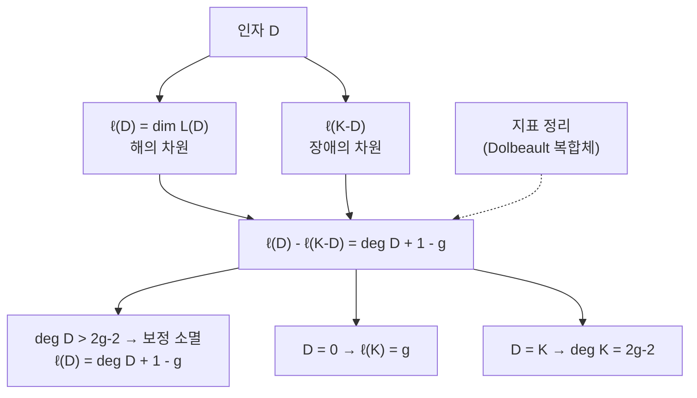

# Riemann–Roch 정리

# 개요

곡선 위에서 극이 정해진 곳에만, 정해진 차수 이하로 나타나는 유리함수는 몇 차원만큼 있는가. 이 질문의 답이 Riemann–Roch 정리다.

인자 $D=\sum n_PP$ 를 정해 놓고

$$
L(D)=\lbrace f : \mathrm{div}(f)+D\ge0\rbrace\cup\lbrace 0\rbrace
$$

의 차원을 $\ell(D)$ 라 하자. 직관적으로는 $n_P>0$ 인 곳에서 극을 그만큼 허용하고 $n_P<0$ 인 곳에서는 영점을 강제한다. 조건을 세어 보면 $\ell(D)\ge\deg D+1-g$ 정도가 기대되는데, 실제로는 보정항이 붙는다.

$$
\ell(D)-\ell(K-D)=\deg D+1-g
$$

$K$ 는 표준인자이고 $g$ 는 종수다. 좌변은 두 해공간의 차원 차이, 곧 **지표**의 모양이다. 실제로 이 등식은 Dolbeault 복합체에 대한 [지표 정리](index-theorem.md)의 1 차원 복소 사례이고, $\ell(K-D)$ 는 $H^1$ 의 차원으로 해석된다.

$$
\ell(D)=h^0(\mathcal O(D)),\qquad \ell(K-D)=h^1(\mathcal O(D))
$$

곧 "해의 개수에서 장애의 개수를 뺀 값이 위상으로 정해진다" 는 진술이며, 대수기하와 복소해석 양쪽에서 가장 자주 쓰이는 계산 도구다.

# 직관

## 왜 보정항이 필요한가

$\deg D=n>0$ 인 인자에서 $f$ 를 찾는다고 하자. 순진하게 세면 극의 주부에 $n$ 개의 자유도가 있고 상수 1 개를 더해 $n+1$ 차원을 기대한다. $\mathbb P^1$ 에서는 실제로 그렇다.

종수가 있는 곡선에서는 주부를 아무렇게나 정할 수 없다. [유수 정리](residue-theorem.md)가 말하듯 유수들의 합이 0 이어야 하고, 일반적으로는 정칙 미분형식 하나마다 하나씩, 곧 $g$ 개의 선형 조건이 붙는다. 그래서 기대치가 $n+1-g$ 로 내려간다.

그런데 이 $g$ 개의 조건이 항상 독립인 것은 아니다. 독립이 아닌 정도를 재는 것이 $\ell(K-D)$ 이고, 그래서 부등식 $\ell(D)\ge\deg D+1-g$ 가 등식으로 승격된다. 조건의 독립성이 깨지는 자리가 표준인자 쪽에서 보인다는 것이 Serre 쌍대성의 내용이다.

## 두 극단

- $\deg D>2g-2$ 이면 $\deg(K-D)<0$ 이라 $\ell(K-D)=0$ 이다. 그러면 $\ell(D)=\deg D+1-g$ 로 차원이 완전히 결정된다. 인자가 충분히 크면 보정이 사라진다.
- $D=0$ 이면 $\ell(0)=1$ (상수뿐)이므로 $\ell(K)=g$ 가 나온다. 정칙 미분형식의 공간이 $g$ 차원이라는 종수의 해석적 정의다.
- $D=K$ 를 넣으면 $\deg K=2g-2$ 가 따라온다. 표준인자의 차수가 종수로 결정된다.

# 정의

## 인자와 Riemann–Roch 공간

콤팩트 Riemann 면(또는 매끄러운 사영곡선) $X$ 위에서 인자는 점들의 형식적 정수 결합 $D=\sum n_PP$ 이고 $\deg D=\sum n_P$ 다. 0 이 아닌 유리함수 $f$ 의 주인자는 $\mathrm{div}(f)=\sum\mathrm{ord}_P(f)\thinspace P$ 이며 차수가 0 이다.

$$
L(D)=\lbrace f\in k(X)^\times:\mathrm{div}(f)+D\ge0\rbrace\cup\lbrace 0\rbrace,\qquad \ell(D)=\dim_kL(D)
$$

$L(D)$ 는 유한차원이고 $\deg D<0$ 이면 $L(D)=0$ 이다. 차수가 0 이 아닌 함수가 없기 때문이다.

**표준인자** $K$ 는 0 이 아닌 유리 미분형식 $\omega$ 의 인자 $\mathrm{div}(\omega)$ 다. $\omega$ 의 선택에 따라 주인자만큼 달라지므로 선형동치류로 유일하다.

## 정리

> **Riemann–Roch.** 종수 $g$ 인 매끄러운 사영곡선 위의 모든 인자 $D$ 에 대해
> $$
> \ell(D)-\ell(K-D)=\deg D+1-g
> $$

층 코호몰로지로 쓰면 $h^0(\mathcal O(D))-h^1(\mathcal O(D))=\deg D+1-g$ 이고, $h^1(\mathcal O(D))=h^0(\mathcal O(K-D))$ 가 **Serre 쌍대성**이다. 좌변이 Euler 표수 $\chi(\mathcal O(D))$ 이므로, 정리는 "$\chi$ 는 차수와 종수만으로 정해진다" 는 진술이 된다.

## 고차원으로

$\mathrm{Hirzebruch}$ 는 이를 임의 차원의 사영다양체로 확장했다.

$$
\chi(X,\mathcal E)=\int_X\mathrm{ch}(\mathcal E)\thinspace\mathrm{Td}(TX)
$$

곡선에서 $\mathrm{ch}(\mathcal O(D))=1+D$ 와 $\mathrm{Td}=1-\frac12K$ 를 넣고 적분하면 $\deg D+1-g$ 가 나온다. 이 형태가 그대로 [지표 정리](index-theorem.md)의 Dolbeault 사례이며, Grothendieck 은 다시 이를 사상에 대한 상대적 형태로 일반화했다.

# 성질

## 종수의 세 얼굴

같은 $g$ 가 세 방식으로 정의되고 Riemann–Roch 가 이들을 잇는다.

| 관점 | 정의 |
|---|---|
| 위상 | 구멍의 개수, $\chi(X)=2-2g$ |
| 해석 | 정칙 미분형식의 차원 $\ell(K)$ |
| 대수 | $h^1(X,\mathcal O_X)$ |

$D=0$ 을 넣으면 두 번째와 세 번째가 같아지고, $\deg K=2g-2$ 가 첫 번째와 이어 준다.

## 곡선의 사영 매장

$\deg D\ge2g+1$ 이면 $|D|$ 가 $X$ 를 $\mathbb P^{\ell(D)-1}$ 에 매장한다. 차원이 Riemann–Roch 로 계산되므로 매장의 존재와 그 사영공간의 크기를 미리 안다. 곡선론이 구체적인 대수기하가 되는 출발점이다.

작은 종수에서 분류가 바로 나온다.

- $g=0$ : $\ell(P)=2$ 라 차수 1 의 사상이 있고, 곧 $X\cong\mathbb P^1$ 이다.
- $g=1$ : $\ell(3P)=3$ 이고 $\lbrace 1,x,y\rbrace$ 가 기저가 되어 Weierstrass 방정식을 얻는다. 타원곡선의 표준형이 여기서 나온다.
- $g\ge2$ : $K$ 자체가 $\deg K=2g-2$ 이고 $\ell(K)=g$ 라 표준사상이 정의된다. 초타원곡선이 아니면 이것이 매장이다.

## 함수체와 수체의 유비

Riemann–Roch 는 유한체 위의 곡선에서도 성립한다. 이 경우 $\ell(D)$ 가 부호의 차원을 주므로, 대수기하 부호의 매개변수가 정리에서 직접 나온다. $\deg D>2g-2$ 인 인자에서 부호 길이가 $n$ 이고 차원이 $k=\deg D+1-g$ 이며 최소거리가 $d\ge n-\deg D$ 가 되고, Goppa 부호가 Gilbert–Varshamov 한계를 넘어선 최초의 구성이었다.

수체 쪽에는 $\zeta_K$ 의 유수 공식이 대응한다. 함수체의 Riemann–Roch 와 수체의 유수 공식이 같은 자리를 차지한다는 관찰이 Weil 이래의 유비이며, $\mathbb F_q(X)$ 와 $\mathbb Q$ 를 같은 언어로 다루려는 시도의 근거다.

# 활용

## 곡선의 분류와 매장

- **곡선의 분류와 매장.** 어떤 인자가 곡선을 사영공간에 넣는지, 그 상이 몇 차수인지를 계산 없이 예측한다.
- **타원곡선의 군법칙.** $\ell(P+Q-O)=1$ 이라는 계산이 $P+Q$ 에 대응하는 점이 유일함을 주고, 그것이 [타원곡선](elliptic-curves.md)의 덧셈이 잘 정의되는 이유다. 인자류군의 차수 0 부분이 곡선 자신과 동형이 된다.
- **부호 이론.** 대수기하 부호의 차원과 최소거리를 정리에서 읽는다.
- **모듈라이.** 종수 $g$ 곡선의 모듈라이 공간의 차원이 $g\ge2$ 일 때 $3g-3$ 이라는 사실이 변형 이론과 Riemann–Roch 의 결합으로 나온다.

# 연관 문서

## 선수지식

- [지표 정리](index-theorem.md)
- [정칙함수와 Cauchy 적분 정리](holomorphic-functions.md)

## 더 알아보기

- [Borel–Weil–Bott 정리와 깃발다양체](borel-weil-bott.md)

#differential_geometry #complex_analysis #theorem
