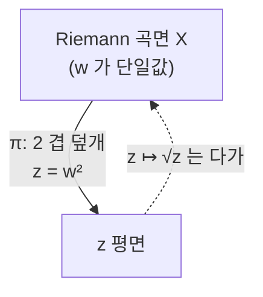

# Riemann 곡면과 균일화 정리

# 개요

[정칙함수](holomorphic-functions.md)는 복소평면의 열린집합 위에서 정의된다. 그런데 $\sqrt z$ 나 $\log z$ 는 평면 위에서 한 값으로 정의되지 않는다. 원점을 한 바퀴 돌면 다른 가지로 넘어가기 때문이다. 이 다가성을 없애는 방법은 함수를 바꾸는 것이 아니라 **정의역을 바꾸는 것**이다. 여러 장의 평면을 가지가 바뀌는 곳에서 이어 붙이면 그 위에서 함수가 한 값이 된다. 그렇게 얻은 대상이 Riemann 곡면이다.

정의는 짧다. 복소구조를 가진 1 차원 복소다양체다. 위상적으로는 [곡면](classification-of-surfaces.md)이고, 그 위에 복소좌표를 정칙 전이함수로 맞붙여 놓은 것이다. 위상은 종수 하나로 분류되지만 복소구조는 그렇지 않다. **같은 곡면 위에 서로 다른 복소구조가 연속적인 족으로 존재한다.** 이 여분의 자유도가 [Teichmüller 공간](teichmuller-space.md)과 모듈라이 문제를 낳는다.

이 문서의 중심은 **균일화 정리**다. 단순연결 Riemann 곡면은 동형을 빼고 셋뿐이다. 구, 평면, 원판. 그리고 임의의 Riemann 곡면은 이 셋 중 하나를 [보편덮개](covering-spaces.md)로 가지므로, 덮개변환군으로 몫을 취한 꼴로 전부 기술된다. 위상적 분류가 종수 하나로 끝났듯 복소해석적 분류도 세 모형으로 환원되고, 그 다음에 남는 것이 덮개변환군의 선택이다. 곡면 이론에서 복소해석이 왜 위상보다 섬세한 정보를 주는지가 여기서 드러난다.

# 직관

## 가지를 펴는 장치

$w^2=z$ 를 생각한다. $z\ne0$ 마다 $w$ 가 둘이다. 평면 하나로는 $w$ 를 함수로 쓸 수 없지만, 평면 두 장을 준비해 음의 실축을 따라 잘라 놓고 첫 장의 위쪽 가장자리를 둘째 장의 아래쪽 가장자리에 붙이면 문제가 사라진다. 원점을 한 바퀴 돌면 다른 장으로 넘어가고, 두 바퀴를 돌아야 제자리다.

이렇게 만든 공간 위에서 $w$ 는 단일값 정칙함수다. 실은 이 공간이 다시 구와 같아서, $w$ 를 좌표로 쓰면 $z=w^2$ 이 된다. **다가함수가 단일값이 되도록 정의역을 최소한으로 늘린 것**이 Riemann 곡면이고, 원래의 다가성은 그 곡면에서 평면으로 내려가는 사상의 겹수로 옮겨 간다.

## 세 모형과 그 이유

단순연결 곡면이 셋뿐이라는 것은 처음 보면 놀랍다. 이유를 거칠게 말하면 이렇다. 복소구조는 등각구조이고, 등각구조는 곡률을 하나로 정규화할 수 있게 해 준다. 곡률의 부호는 양, 영, 음 셋뿐이다. 각각에 대응하는 완비 단순연결 모형이 구, 평면, 원판이다.

| 모형 | 곡률 | 자기동형군 | 부피 |
| --- | --- | --- | --- |
| $\widehat{\mathbb C}=\mathbb P^1$ | $+1$ | $\mathrm{PSL}_2(\mathbb C)$ | 유한 |
| $\mathbb C$ | $0$ | $z\mapsto az+b$ | 무한 |
| $\mathbb H$ 또는 $\mathbb D$ | $-1$ | $\mathrm{PSL}_2(\mathbb R)$ | 무한 |

셋을 가르는 것은 자기동형군의 크기다. 구의 자기동형은 3 차원 복소군이고 평면은 그보다 작으며 원판도 3 차원 실군이다. 이 차이가 몫공간의 풍부함을 결정한다. 구로 덮이는 곡면은 구뿐이고, 평면으로 덮이는 것은 평면과 원기둥과 [토러스](classification-of-surfaces.md)뿐이며, **나머지 거의 전부가 원판으로 덮인다.**

## 왜 대부분이 쌍곡인가

종수 $g$ 의 콤팩트 곡면에서 Euler 지표는 $2-2g$ 다. Gauss–Bonnet 이 곡률 적분을 이 값에 묶으므로 $g\ge2$ 이면 평균 곡률이 음수여야 하고, 따라서 모형은 원판이다. $g=0$ 이면 구, $g=1$ 이면 평면이다. 즉 위상이 이미 세 모형 중 어느 것인지를 정해 버린다. 복소구조가 고를 수 있는 것은 그 다음, 곧 덮개변환군을 $\mathrm{PSL}_2(\mathbb R)$ 안에서 어떻게 잡느냐다.

이것이 곡면론의 두 층을 갈라 놓는다. 종수는 모형을 정하고, 모형 안에서의 군 선택이 모듈라이를 이룬다.

# 정의

## Riemann 곡면

연결된 Hausdorff 위상공간 $X$ 에 열린덮개 $\{U_i\}$ 와 위상동형 $\varphi_i:U_i\to V_i\subset\mathbb C$ 가 주어지고, 겹치는 곳에서 전이함수

$$
\varphi_j\circ\varphi_i^{-1}:\varphi_i(U_i\cap U_j)\to\varphi_j(U_i\cap U_j)
$$

가 모두 정칙이면 $X$ 를 **Riemann 곡면**이라 한다. 실차원이 2 이므로 곡면이고, 복소차원은 1 이다.

사상 $f:X\to Y$ 가 **정칙**이라는 것은 양쪽 좌표로 표현했을 때 정칙이라는 뜻이다. 상수가 아닌 정칙사상은 열린사상이고, 국소적으로는 적당한 좌표에서 $z\mapsto z^n$ 꼴이다. 이 $n$ 이 그 점의 **분기지수**다.

## 기본 예

- $\mathbb C$ 와 그 열린부분집합.
- **Riemann 구** $\widehat{\mathbb C}=\mathbb C\cup\{\infty\}$ 다. 좌표는 $z$ 와 $1/z$ 두 장이고 전이함수가 $z\mapsto1/z$ 다. 콤팩트 Riemann 곡면 가운데 종수 0 인 유일한 것이다.
- **복소 토러스** $\mathbb C/\Lambda$ 다. 여기서 $\Lambda=\mathbb Z+\tau\mathbb Z$ 는 격자이고 $\tau\in\mathbb H$ 다. 종수 1 이며, [타원곡선](elliptic-curves.md)의 복소해석적 모습이다.
- 평면곡선 $\{(z,w):P(z,w)=0\}$ 의 비특이점 집합. 콤팩트 Riemann 곡면은 전부 이런 대수곡선으로 실현된다.

## 균일화 정리

> **정리(Koebe, Poincaré, 1907).** 단순연결 Riemann 곡면은 $\widehat{\mathbb C}$ 와 $\mathbb C$ 와 $\mathbb D=\{|z|<1\}$ 가운데 정확히 하나와 정칙동형이다.

세 모형은 서로 동형이 아니다. $\widehat{\mathbb C}$ 만 콤팩트이고, $\mathbb C$ 와 $\mathbb D$ 는 Liouville 정리로 갈린다. $\mathbb D\to\mathbb C$ 는 정칙사상이 많지만 $\mathbb C\to\mathbb D$ 는 유계 정함수라 상수뿐이다.

일반 곡면에는 보편덮개를 거쳐 적용한다. $X$ 의 보편덮개 $\widetilde X$ 는 단순연결 Riemann 곡면이므로 셋 중 하나이고, 덮개변환군 $\Gamma\cong\pi_1(X)$ 는 그 모형의 자기동형군 안에서 자유롭고 진성불연속으로 작용한다. 따라서

$$
X\cong\widetilde X/\Gamma .
$$

$\widetilde X$ 가 무엇이냐에 따라 $X$ 를 **타원형**, **포물형**, **쌍곡형**이라 부른다.

## 세 유형의 목록

| 보편덮개 | 가능한 $X$ |
| --- | --- |
| $\widehat{\mathbb C}$ | $\widehat{\mathbb C}$ 뿐이다 |
| $\mathbb C$ | $\mathbb C$ 와 $\mathbb C^\times$ 와 복소 토러스 $\mathbb C/\Lambda$ |
| $\mathbb D$ | 나머지 전부 |

타원형이 하나뿐인 이유는 $\widehat{\mathbb C}$ 의 자기동형이 모두 고정점을 가져서 자유 작용이 자명한 것밖에 없기 때문이다. 포물형이 짧은 이유는 $\mathbb C$ 의 자유 작용 군이 평행이동으로 이루어진 이산군, 곧 계수 0, 1, 2 의 격자뿐이기 때문이다.

# 성질

## 콤팩트 곡면은 대수곡선이다

콤팩트 Riemann 곡면 위에는 유리형함수가 충분히 많아서 곡면을 사영공간에 매장할 수 있고, 그 상이 대수곡선이 된다. 거꾸로 비특이 사영곡선은 Riemann 곡면이다. 이 동치가 복소해석과 대수기하를 잇는 통로이고, 함수체를 통해 보면 다음 세 범주가 같다.

$$
\{\text{콤팩트 Riemann 곡면}\}\ \leftrightarrow\ \{\mathbb C\text{ 위 비특이 사영곡선}\}\ \leftrightarrow\ \{\mathbb C\text{ 의 초월차수 }1\text{ 확대체}\}
$$

유리형함수의 존재 자체가 간단하지 않다. 증명은 $\bar\partial$ 방정식의 해결이나 Hodge 이론을 거치고, 그 결과가 [Riemann–Roch](riemann-roch.md) 정리에 정리되어 있다.

## Riemann–Hurwitz 공식

정칙사상 $f:X\to Y$ 가 차수 $n$ 이고 분기지수가 $e_p$ 라 하면

$$
2g_X-2=n(2g_Y-2)+\sum_{p\in X}(e_p-1)
$$

이다. 분기가 없으면 Euler 지표가 곱셈적이라는 덮개공간의 사실이고, 분기는 그것을 보정한다. 이 공식이 곡면 사이의 사상 가능성을 강하게 제한한다. 예를 들어 종수 2 곡면에서 종수 3 곡면으로 가는 상수 아닌 정칙사상은 없다. 우변이 $n\cdot4$ 이상인데 좌변은 2 이기 때문이다.

## 자기동형군의 유한성

$g\ge2$ 인 콤팩트 곡면의 자기동형군은 유한하고 크기가 $84(g-1)$ 을 넘지 않는다(Hurwitz 한계). 쌍곡 모형에서 보면 이유가 분명하다. 자기동형은 쌍곡 등거리사상이고, 곡면의 쌍곡 면적이 Gauss–Bonnet 으로 $4\pi(g-1)$ 에 고정되므로, 몫의 면적이 가장 작을 때 군이 가장 크다. 그 최소 면적을 주는 것이 각이 $\pi/2,\pi/3,\pi/7$ 인 삼각형이고 거기서 $84(g-1)$ 이 나온다.

$g=0,1$ 에서는 자기동형군이 무한하다. 구는 $\mathrm{PSL}_2(\mathbb C)$ 전체이고 토러스는 평행이동만으로도 무한하다. **유한성은 쌍곡성의 직접적 결과다.**

## 복소구조는 종수보다 많은 정보를 담는다

종수 1 곡면은 전부 $\mathbb C/(\mathbb Z+\tau\mathbb Z)$ 꼴이고, 두 격자가 같은 곡면을 주는 것은 $\tau$ 가 $\mathrm{SL}_2(\mathbb Z)$ 작용으로 옮겨질 때다. 그래서 종수 1 복소구조의 모듈라이는 $\mathbb H/\mathrm{SL}_2(\mathbb Z)$ 이고, 이것이 [모듈러 곡선](modular-curves.md) 이야기의 출발점이다. 위상적으로는 단 하나인 토러스가 복소구조로는 1 차원 족을 이룬다.

$g\ge2$ 에서는 이 족이 복소차원 $3g-3$ 이다. 그 공간을 다루는 것이 Teichmüller 이론이다.

# 활용

## 어디로 이어지는가

- **모듈라이와 변형.** 종수 $g\ge2$ 곡면의 복소구조가 이루는 공간이 Teichmüller 공간이고, 사상류군으로 몫을 취하면 모듈라이 공간이 된다. 준등각 사상과 Beltrami 방정식이 그 공간에 좌표를 준다.
- **정수론.** 종수 1 의 모듈라이가 모듈러 곡선이고, 거기서 모듈러 형식과 Galois 표현이 나온다. 콤팩트 Riemann 곡면이 대수곡선이라는 사실이 이 통로를 연다.
- **3 차원으로.** 쌍곡 곡면의 등거리군이 $\mathrm{PSL}_2(\mathbb R)$ 의 이산부분군이듯, 쌍곡 3 다양체는 $\mathrm{PSL}_2(\mathbb C)$ 의 이산부분군으로 기술된다. [쌍곡 3 다양체](hyperbolic-3-manifolds.md)의 Mostow 강직성이 곡면의 모듈라이와 대비되는 자리다. 곡면에서는 구조가 움직이고 3 차원에서는 굳는다.
- **해석적 도구.** 균일화의 증명 자체가 Perron 방법이나 Dirichlet 원리, 곧 타원형 편미분방정식의 해결이다. 그 기법이 Hodge 이론과 지표 정리로 이어진다.

# 연관 문서

## 선수지식

- [정칙함수와 Cauchy 적분 정리](holomorphic-functions.md)
- [덮개공간](covering-spaces.md)
- [곡면의 분류](classification-of-surfaces.md)

## 더 알아보기

- [Teichmüller 공간과 곡면의 모듈라이](teichmuller-space.md)
- [모듈러 곡선 X_0(N)](modular-curves.md)

#complex_analysis #topology #theorem
